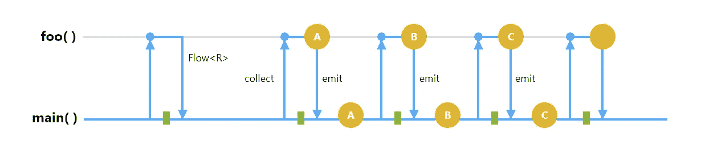
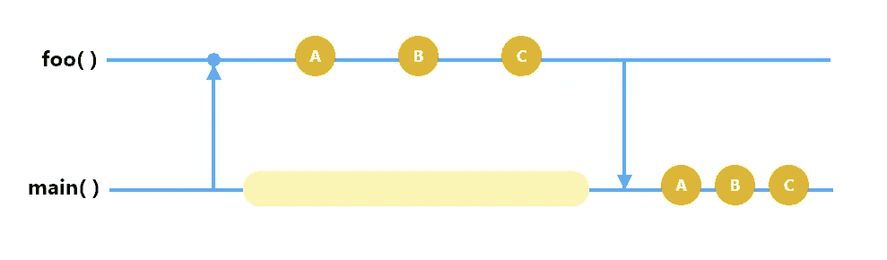
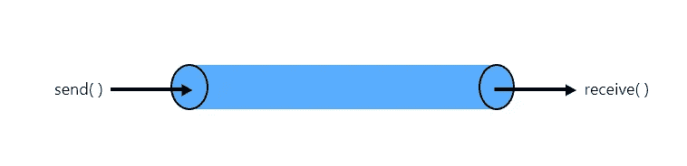
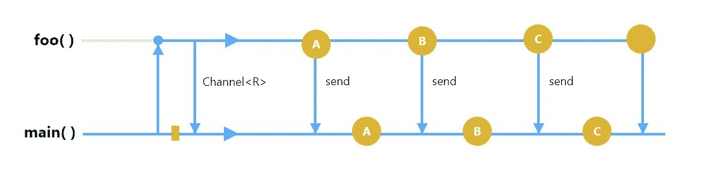

# 使用新的 Kotlin 流进行异步数据加载

> 原文：<https://betterprogramming.pub/asynchronous-data-loading-with-new-kotlin-flow-233f85ae1d8b>

## 然而另一个惊人的操作者，**流·福**罗·柯特林



# 协同程序

当我们调用一个异步函数时，比如服务调用、从数据库中检索数据、读取文件或其他任何东西，我们需要一个回调，这样我们就知道操作已经完成，我们可以继续实际的工作，比如手机在从服务器接收数据后更新用户界面。

是的，这很好，但在实时，它不会那么容易。

例如，从服务器接收到数据后，如果您需要根据一些指标过滤数据，您需要对这些指标执行一些本地数据库操作，并且您还需要另一个回调，因此对于复杂的项目，该列表会继续下去，这会导致回调的激增。

这就是协程真正强大的地方，有了协程，您不再需要为异步函数编写回调。

协程中有一个惊人的概念叫做 *suspend functions* ，它可以完成你需要的所有工作，并以预期的数据类型返回数据。

简单协程样本

这将把开发人员从回调地狱中解救出来，并以他们正在工作的正常格式专注于他们的业务逻辑。是不是很棒，这只是协程的概述。

使用协程，您可以异步执行，但也可以顺序执行。

在本文开始之前，请参考下面的链接来了解 [Kotlin](https://kotlinlang.org/) 中的协程。

[](https://medium.com/androiddevelopers/coroutines-on-android-part-i-getting-the-background-3e0e54d20bb) [## Android 上的协同程序(第一部分):了解背景

### 协程解决什么问题？

medium.com](https://medium.com/androiddevelopers/coroutines-on-android-part-i-getting-the-background-3e0e54d20bb) [](https://medium.com/mindorks/synchronous-and-asynchronous-execution-in-kotlin-coroutines-with-error-and-exception-handling-1dd03b87f732) [## 带错误和异常处理的 Kotlin 协同例程中的同步和异步执行

### 本文不是关于如何在 kotlin 中使用协程(尽管我将简要地涉及协程的概念，我们…

medium.com](https://medium.com/mindorks/synchronous-and-asynchronous-execution-in-kotlin-coroutines-with-error-and-exception-handling-1dd03b87f732) 

# 暂停功能

*暂停功能*只是一个可以暂停并在以后恢复的功能。他们可以执行长时间运行的操作，并等待它完成，而不会阻塞服务调用、数据库操作或读取长文件。

除了在开头添加了关键字`suspend`之外，暂停函数的语法与常规函数的语法相似。

暂停函数的奇妙之处在于它可以返回任意数量的响应。

```
**suspend** fun getItem() : **Response**
**suspend** fun getItems() : **List<Response>**
```

让我们看看这是如何工作的。

例如，我们有一个暂停函数`foo` ，它返回一组响应，如下所示。

```
**suspend** fun foo() : **List<Responses>** = buildlist{
      add(Execute("A"))
      add(Execute("B"))
      add(Execute("C"))
}
```

然后，您从您的流程中调用它，如下所示。

```
fun getData() {
    val list = withContext(Dispatchers.IO) **{ foo() }** for (x in list) println(x)
}
```

这里发生的是，当你调用暂停函数`foo`，时，它开始一个接一个地执行，在完成所有的执行后，它将返回响应列表。



使用挂起功能执行请求列表

因此，我们必须等到所有请求的执行都完成，这不是一个优化的解决方案。

我们可以做得更好，所以科特林团队找到的下一个解决方案是*频道*。

# 频道

通道是结构化的管道，您在一端发送数据，在另一端接收数据，如下所示。



频道工作方式概述

要使用 channels，需要修改一点代码，不用`List<Response>` 作为返回类型，我们用`ReceiveChannel<Response>`，不用`buildlist` ，用`produce` **、**代替`addTo`，用`send`代替。

看一看:

```
**suspend** fun foo() : **ReceiveChannel<Response>** = produce{
      send(execute("A"))
      send(xecute("B"))
      send(Execute("C"))
}
```

然后，当在我们的流中使用它时，我们将接收通道而不是响应列表。然后，你迭代打印，看看:

```
fun getData() {
    val chaannel = withContext(Dispatchers.IO) **{ foo() }** for (x in channel) println(x)
}
```

有什么区别吗？让我们看看。

当您调用`foo` 函数时，它将创建一个通道并立即返回，但不会开始执行。现在我们有两个正在运行的协程。一个发射数据，另一个观察数据。

当你在迭代过程中调用通道时，执行开始，它将执行第一个并返回响应，然后是第二个和其他类似的，看看有没有更好的主意:



渠道工作流程

因此，通过使用通道，您不再需要等待完成所有的执行。但是这里有个问题，渠道热。

还记得我之前说过有两个协程在运行，一个用来观察，另一个用来发出。如果没有观察者，无论是由于错误还是任何异常，该怎么办？

你知道，通道就像打开一个网络连接或读取一个文件，使用昂贵的资源，如果没有观察者，连接将保持打开，寻找观察者。

我们可以解决这种事情，但从长远来看，情况并不乐观。从长远来看，它会在调试和测试中引起严重的问题。

我们可以做得更好，对吧，这就是 Kotlin 概念流程的由来。

# 科特林流

几天前发布了 Flow 的稳定版本。Flow 不仅解决了渠道的痛点，还提供了许多新特性，您将在本文中看到。

要在上面的例子中使用 Flow，我们只需要将返回类型改为`Flow` 和用户`flow` 而不是`produce`。还有里面的流程，你得用`emit`，看看:

```
fun foo() : **Flow<Response>** = flow{
      emit(execute("A"))
      emit(execute("B"))
      emit(execute("C"))
}
```

另一方面，在你的通用函数中，你必须对`foo`的结果使用 collect。我们正在通过流收集`foo`发出的所有元素。

```
fun getData() {
    val flowData = **foo()** withContext(Dispatchers.IO) **{** flowdata**.collect**{ println(x) **}
}**
```

这里发生的是当你调用`foo`，时，它立即返回流对象，但不会开始执行。

当您开始收集流时，它开始执行，并执行一个请求。它返回结果，然后开始下一个，直到没有了。


流程执行

它类似于通道，发射数据，接收到没有为止，但很大的区别是流量是冷的。即使没有观察者，不管是错误的还是有意的，协程也不会抓住它不放，因为它没有启动任何东西。

与等待完成整个请求列表不同，Flow 通过在完成当前执行后发出结果，为您的功能提供了一种反应行为。

# 流程是声明性的

当我们调用`flow` 示例中的`foo`函数时，所发生的是它创建一个流并返回它，所以我们可以使用一些类似`map` 的操作符来使流更具声明性，如下所示。

```
fun foo() : **Flow<Response>** = 
    flowOf("A","B","C").map{ name->
      execute(name)
    }
}
```

在这里，如果你观察一下，函数`foo` 并不是一个暂停函数。为什么？

正如我前面说过的，它只定义流对象，然后立即发出它，并且只在它开始收集时才计算或运行。

# 流动是反应性的

通过阅读这个标题，许多开发人员会想到 [RxJava](https://github.com/ReactiveX/RxJava) 。是的，RxJava 是 JVM 中一种反应式程序的开端，Kotlin 主要在其中运行。

## 为什么流动？

我们仔细看看，比如你想在 RxJava 中把任何一个 A 类型的对象转换成 B 类型，我们有一个操作符叫做`map`。

是的，它工作得很好，但是如果转换应该异步完成，那么我们必须使用另一个叫做`flatmapSingle`的操作符。

但是在 Kotlin 中，我们有一个操作符叫做`map`，这个操作符的转换 lambda 是 suspend 修饰符，它使得`map`在同步和异步作业中都可用。

我们可以通过使用 Kotlin 来避免数百个这样的操作符，因为 Kotlin 有 RxJava 和其他人没有的 suspend 函数，因为它们不是在 Kotlin 中开发的。

在我们总结之前，本文中提到和解释的每个概念都来自于 2019 年 **KotlinConfig** 的 **Roman Elizarov** 的一次演讲。如果您感兴趣，请点击下面的链接观看。

感谢您的阅读。