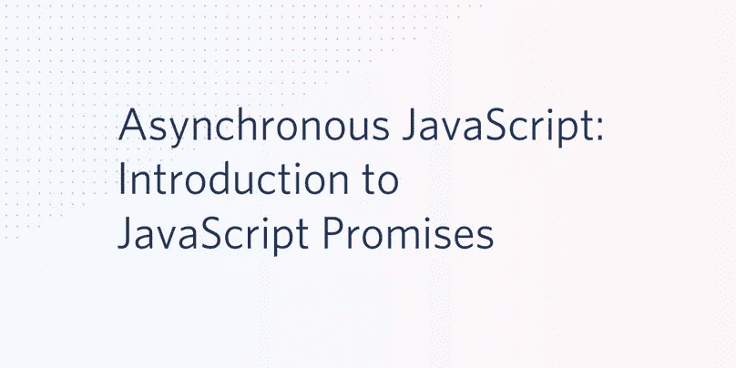
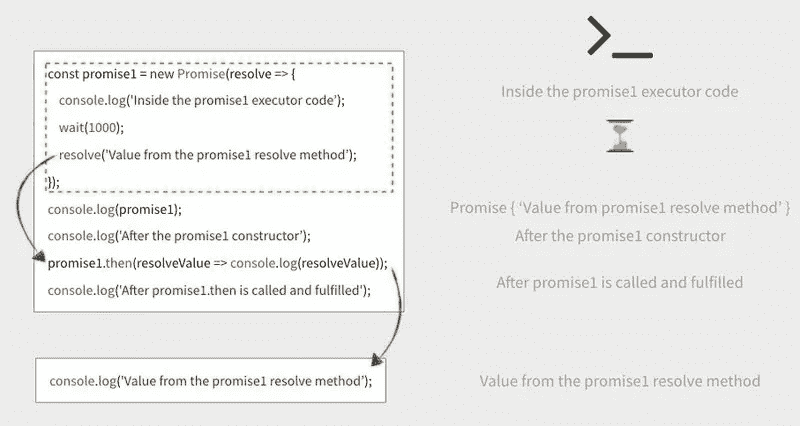
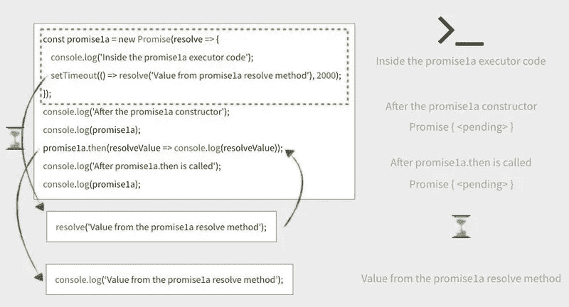

# 异步 JavaScript:JavaScript 承诺介绍

> 原文：<https://betterprogramming.pub/asynchronous-javascript-introduction-to-javascript-promises-3142eeea9b38>

## 漂亮清晰地处理异步代码



随着语言的成熟，异步处理是 JavaScript 获得的最重要的能力之一。

JavaScript 的异步功能支持更复杂、更灵敏的用户界面。它们还使得实现基于 SOAP 和 REST 等标准的分布式 web 应用程序架构成为可能。

JavaScript 承诺是目前内置于语言本身的最强大、最灵活的异步技术。这篇文章将解释它们是如何工作的，并通过一些实际例子让你写下自己的承诺。

承诺有很多好处:

*   一个承诺可以被多次调用。
*   承诺可以连在一起。
*   承诺可以包括错误拒绝事件。
*   承诺链中的错误只需处理一次(错误传播)。
*   承诺可以用来包装旧式的回调功能。
*   承诺总是在当前执行堆栈为空后执行。

如果您刚刚开始使用 JavaScript 的异步功能，前面的几点可能对您没有太大的意义。幸运的是，本系列的前两篇文章介绍了基础知识，为您理解承诺的工作原理打下了坚实的基础:

*   [异步 JavaScript:理解回调](https://medium.com/swlh/asynchronous-javascript-understanding-callbacks-8c288c555b23)
*   [异步 JavaScript:为了可读性和可重用性组织回调](https://medium.com/javascript-in-plain-english/asynchronous-javascript-organizing-callbacks-for-readability-and-reusability-32ad912f2faf)

这些帖子解释了 JavaScript 事件循环、回调队列和执行堆栈。它们还向您展示了如何创建实用的回调并将它们组织成可读的代码。

如果您已经对这些主题有了很好的理解，并且想要了解 JavaScript Promises，那么您可以深入研究。

# 先决条件

为了完成这篇文章中的任务，你需要:

*   [Node.js 和 npm](https://nodejs.org/)(node . js 安装也会安装 NPM。)

您还应该了解 JavaScript 的核心元素，包括对象构造函数和匿名函数。如果您不熟悉 JavaScript 事件模型，请阅读本系列的第一篇文章。

GitHub 上有这篇文章的配套资源库。

# 设置项目

如果您已经完成了来自[异步 Javascript:为可读性和可重用性组织回调](https://medium.com/javascript-in-plain-english/asynchronous-javascript-organizing-callbacks-for-readability-and-reusability-32ad912f2faf)帖子的项目，那么您可以继续为该帖子编写代码。如果你熟悉事件循环机制或者想从头开始，可以从 GitHub 获取代码。

通过在要创建项目根目录的目录中执行以下命令行指令来克隆项目:

```
git clone [https://github.com/maciejtreder/asynchronous-javascript.git](https://github.com/maciejtreder/asynchronous-javascript.git)
cd asynchronous-javascript
git checkout step3
npm install
mkdir promises
cd promises
```

# 理解 JavaScript 承诺

JavaScript `[Promise](http://www.ecma-international.org/ecma-262/6.0/#sec-promise-objects)`对象是在 2015 年第六版 JavaScript 中引入的，最初称为 ECMAScript 6 (ES6)，后来更名为 ECMAScript 2015 (ES2015)。你会看到这两个名字可以互换使用。

`Promise`对象是一个代理，代表延迟操作的最终完成或失败，它几乎总是(但不要求)异步的。这种典型的异步操作是对远程 API 的 REST 调用或从本地文件系统读取文件。

承诺可以处理异步活动的结果，并决定是*解决*还是*拒绝*承诺。然后相应地设置返回的承诺对象的状态。

# 承诺术语

承诺为*履行、拒绝、*或*待定。*承诺的状态设置为*履行*表示执行成功。承诺的状态被设置为*拒绝*以指示活动失败。否则承诺就是*待定*:等待一个活动的结果。

如果一个承诺被履行或者被拒绝，它就是确定的。

如果一个承诺被解决或锁定在以匹配另一个承诺的状态，则该承诺被*解决*。因为一个承诺可能被锁定到另一个承诺的状态，而另一个承诺本身可能是待定的，所以一个已解决的承诺可能是待定的、履行的或拒绝的。

如果一个承诺没有兑现，它就是没有兑现。

# Promise 构造函数语法

创建`Promise`对象的通用语法是:`new Promise(*executor*)`。

`executor`是一个带两个参数的函数，`resolve`和`reject`；两者都是可选的。它们是履行或拒绝承诺的函数。

executor 函数通常会启动一些异步工作，并根据异步活动的结果调用`resolve`或`reject`函数。

包括 executor 函数的结构，`Promise`的构造函数包括:

*   `const`关键字、名称、`new`关键字、`Promise`类型。
*   带有两个可选函数参数`resolve`和`reject`的 executor 匿名函数。
*   语句组成了 executor 函数的主体，其中包括两个方法:`resolve(value)`和`reject(reason)`。

一个简单的例子是这样的:

用`if … else`测试一个函数的返回值只是确定一个承诺是被履行还是被拒绝的众多方法之一。

有可能有一个刚刚解决的承诺，在这种情况下，声明可以像这样缩短:

用由`someFunction()`返回的值来完成`mySimplePromise`——假设`someFunction()`返回一个值，而不是爆炸或运行，直到宇宙热寂(或直到有人杀死该进程)。

# 调用承诺对象

要在代码中实现承诺，您需要知道如何使用它们以及声明它们。通过调用承诺[原型](https://developer.mozilla.org/en-US/docs/Learn/JavaScript/Objects/Object_prototypes)的`[then](https://developer.mozilla.org/en-US/docs/Web/JavaScript/Reference/Global_Objects/Promise/then)`方法来使用承诺。

被拒绝的承诺可以用两种方式处理:用`then`方法的参数或用`catch`方法。

附加的原型方法支持更高级的承诺使用，比如评估一组承诺。这些功能将在本系列的下一篇文章中讨论。

`.then`方法有两个参数，都是可选的。第一个指定了承诺实现时要调用的函数，第二个指定了承诺被拒绝时要做什么:

实际上，一个简单的例子如下:

在大多数情况下，您会看到省略第二个参数并将拒绝处理放在`.catch`方法中的实现，如下所示。(稍后将详细介绍这一点。)

在实现承诺的代码中，异步函数返回承诺也很常见，许多库函数都是这样做的。下面是一个简单的异步函数，它返回一个承诺和使用实现的承诺的代码:

注意，`reject`方法的返回值通常是一个“原因”，可以是字符串，也可以是更复杂的类型。

# 理解承诺中的异步行为

当一个承诺被实现或拒绝时，一个处理函数被放在事件循环中，供当前线程异步执行。这类似于本系列第二部分中描述的异步回调，[异步 JavaScript:理解回调](https://medium.com/swlh/asynchronous-javascript-understanding-callbacks-8c288c555b23)。

由`.then`方法返回的`Promise`对象要么被满足，要么被拒绝，这取决于`onFulfilled`或`onRejected`处理程序方法的返回值。返回值有一组特定的规则[可能是:](https://developer.mozilla.org/en-US/docs/Web/JavaScript/Reference/Global_Objects/Promise/then#Return_value)

*   用`onFulfilled`处理函数的值解决。
*   因`onRejected`处理函数抛出的错误或错误而被拒绝。
*   履行了与履行了的承诺相关的价值。
*   拒绝，原因与被拒绝的关联承诺相关联。
*   将使用关联承诺的值结算的待定承诺对象。
*   未定义。

为了更好地理解 promises 是如何实现异步处理的，看看它在代码中是如何实现的会很有帮助。

# 理解何时确定承诺状态

承诺的状态由 executor 函数的结果决定。它开始时是未决的，随着执行程序功能的进展，它变成已解决的或被拒绝的。当承诺状态被解析时，承诺也将有一个值，即`resolve`方法的返回值。

因为 Promise 的状态是由 executor 函数的结果决定的，所以它将保持`pending`状态，直到任何异步代码被执行。

根据当前调用堆栈中的代码在处理移动到回调队列中的`resolve`或`reject`方法代码之前执行的时间，或者根据异步函数返回结果的时间，可能需要一些时间来确定承诺的状态。承诺可能依赖于其他承诺，这也可能导致延迟。

您可以在代码中使用承诺的状态。这些技术将在本系列的下一篇文章中介绍，它将解释如何使用像`.all`和`.race`这样的承诺方法来评估一组承诺。

在这篇文章中，重要的是要知道你可以通过下面的代码看到一个承诺的当前状态，其中`promise`是一个特定承诺名称的通用占位符:

下面的例子将向您展示在 executor 函数只包含同步代码的承诺和 executor 函数调用异步代码的承诺之间，承诺状态的计时是如何不同的。

# 使用带有同步功能的承诺

在`asynchronous-javascript`项目的 *promises* 目录下，新建一个名为 *promises* 的目录，并在 promises 目录下新建一个名为`blocking.js`的文件。

在`blocking.js`中插入以下代码:

通过执行以下命令行指令来运行此代码:

```
node blocking.js
```

您应该会看到以下输出:

```
Inside the promise1 executor code
Promise { 'Value from the promise1 resolve method' }
After the promise1 constructor
After promise1.then is called and fulfilled
Value from the promise1 resolve method
```

如果仔细观察，您会发现只有文本的第一行立即显示，控制台输出的其余部分在两秒钟的延迟后才显示。这包括显示在“promise1 构造函数之后”的消息。

您还会看到来自`resolve`方法的消息出现在消息之后的*，表明承诺已经被“调用并履行”，与它们在代码中的顺序相反。*

为什么？

这里发生了三件事:

1.  Promise executor 函数与其他 JavaScript 代码**一样*同步*。**
2.  在设置承诺状态(已解决，已拒绝)之前，立即执行承诺构造函数。
3.  在当前调用堆栈为空之前，不会执行 promise 方法。

事情的顺序是这样的:

1.  `promise1`执行器被放入堆栈并开始执行。
2.  将带有参数“在 promise1 构造函数内部”的`console.log`函数放入堆栈并执行；将显示该消息。
3.  同步的`wait`调用导致`wait`函数被加载到堆栈上并执行，在处理中引入了一个可察觉的延迟。
4.  执行`promise1` `resolve`方法。
5.  `promise1`构造器执行器函数执行完毕，并从堆栈中移除。此时，`promise1`状态是`resolved`，而`promise1`值是来自`resolve`方法的返回值。
6.  将带有参数“在 promise1 构造函数之后”的`console.log`函数放入堆栈并执行；将显示该消息。
7.  带参数的`console.log`函数“promise1 被调用并履行后”消息被放入堆栈并被执行；将显示该消息。
8.  此时，当前执行堆栈是空的，因此处理移到事件队列。
9.  `resolve`方法的值，返回字符串“来自 promise1 resolve 方法的值”。
10.  `.then`方法使用`promise1`状态值来确定是否执行`onResolved`功能。(由于没有提供`onRejected`参数函数，如果承诺被解决，唯一的选择是调用`onResolved`函数。)
11.  `.then`方法使用`resolve`方法的返回值执行`onResolve`参数功能。在这种情况下，`onResolve`是一个匿名函数，它显示`promise1`构造函数的`resolve`方法的返回值，即字符串“来自 promise1 resolve 方法的值”。
12.  堆栈和回调队列为空，处理完成。

当与同步函数一起使用时，承诺可以阻止执行，直到函数完成执行，但承诺本身仍将异步实现。

请参见下图所示的事件顺序:



# 对异步函数使用承诺

用承诺包装的异步操作呢？尝试类似的构造，但是使用异步`setTimeout`函数，而不是同步`wait`函数调用。

在`non-blocking.js`文件中插入以下代码:

使用以下命令行指令运行程序:

```
node non-blocking.js
```

您应该会看到类似的输出，但是只有最后一行被延迟了。您还会看到两条线表示`promise1a`的当前状态是`pending`。

```
Inside the promise1a executor code
After the promise1a constructor
Promise { <pending> }
After promise1a is called
Promise { <pending> }
Value from promise1a resolve method
```

这种差异是由什么造成的？

您会记得`setTimeout()`是一个*异步*函数。(详见本系列[第一部分](https://www.twilio.com/blog/asynchronous-javascript-understanding-callbacks)。)

当`promise1a` executor 函数在堆栈上被处理时，异步的`setTimeout()`函数调用和`resolve`函数调用一起被放入回调队列，以便在堆栈为空时执行。

由于`setTimeout()`函数对处理中的延迟负责，所以延迟直到堆栈上剩余的可执行指令被执行后才被调用。程序中的其他语句可以毫不延迟地执行。

因为`promise1a`的`resolve`方法是`setTimeout()`函数的第一个参数，所以直到堆栈为空并且处理移动到回调队列时才会执行。

因为两秒钟的时间间隔被指定为`setTimeout()`的第二个参数，所以`resolve`方法的值不会返回给`.then`方法，直到时间间隔结束。

当处理移动到回调队列并且两秒钟的间隔已经过去时，`resolve`方法可以返回它的值；`promise1a`的状态变为`fulfilled`并且`.then`方法可以评估是否应该调用`onResolved`方法。此时，可以显示`resolve`方法的返回值。

您还可以看到，当`promise1a`的返回值变为`Value from promise1a resolve method`时，承诺状态如何从`<pending>`变为*已解决*状态。请随意试验这段代码，以了解更多关于承诺执行时间的信息。

下图说明了这种行为:



如果您还没有开始编写代码，并且希望使用 GitHub 上的配套资源库赶上这一步，请在您希望创建项目目录的目录中执行以下命令:

```
git clone [https://github.com/maciejtreder/asynchronous-javascript.git](https://github.com/maciejtreder/asynchronous-javascript.git)
cd asynchronous-javascript
git checkout step4
npm install
mkdir promises
cd promises
```

# JavaScript 入门承诺

对于第一次使用的人来说，前面所有关于如何创造和消费承诺的信息可能看起来有些吓人。

但是，与许多编程语言特性一样，您可以从基础开始，充分利用它们，随着经验的增长和代码变得更加复杂，进入更高级的场景。

你可以从用`resolve`和`reject`方法实现一个基本承诺开始，并在代码中使用它。

# 解决和拒绝承诺

在大多数实际应用程序中，您将使用调用一些异步代码的承诺，并根据函数调用的结果来解决或拒绝。你会想以某种方式利用承诺的结果，这取决于承诺是被解决还是被拒绝。

在下面的示例中，您将创建一个异步产生结果的函数。然后，您将创建另一个函数，该函数使用已履行(已解决或已拒绝)来根据承诺的状态采取行动。

在项目的*承诺*目录下创建新文件`practical.js`，并插入以下 JavaScript 代码:

使用以下命令行指令运行代码:

```
node practical.js
```

根据随机数生成器的结果，您应该会看到类似于下面的输出:

```
That's a bad pour. Glass 1 failed! Try again.
That's a good pour! Glass 2 is 97% full. Drink up.
That's a bad pour. Glass 3 failed! Try again.
That's a bad pour. Glass 4 failed! Try again.
That's a good pour! Glass 5 is 78% full. Drink up.
That's a good pour! Glass 6 is 76% full. Drink up.
That's a bad pour. Glass 7 failed! Try again.
That's a bad pour. Glass 8 failed! Try again.
That's a bad pour. Glass 9 failed! Try again.
That's a good pour! Glass 10 is 93% full. Drink up.
```

在`practical.js`中，您可以看到许多在真实世界代码中有用的技术。异步`fillGlass`函数返回一个承诺。(它是异步的，因为它包含了`setTimeout`函数，这是异步的。)

如您所见，向返回承诺的函数传递参数没有问题。

将参数传递给`.then`方法的`onResolved`和`onRejected`方法也没有问题。您还可以迭代调用返回承诺的函数，并使用承诺状态(已解决或已拒绝)对与承诺相关联的对象执行进一步的操作。

# 捕捉承诺拒绝和例外

在`pratical.js`中，被拒绝的承诺通过承诺对象的`.then`方法的`onRejected`参数处理:`fillGlass(pourtime).then`在承诺被拒绝时调用`returnGlass`。

当你只处理一个承诺时，这很好，但是在你想要处理一系列承诺的时候呢？

这时候 Promise `.catch`方法就有用了。和`.then`一样，它返回一个承诺。由`.then`方法产生的一组解析承诺和由`.catch`方法产生的承诺可以在程序逻辑中一起评估。

本系列的下一篇文章将讨论处理由`.catch`返回的承诺的技术，以及处理承诺集合的方法。

以下示例将向您展示如何使用`.catch`来代替`.then`的`onRejection`参数。他们还将展示`.catch`中需要特别注意的一些方面。

因为`.catch`方法更灵活，通常会产生更可读的代码，所以优先使用`.then`方法中的`onRejected`方法已经成为惯例。

然而，需要注意的是，它们并不等同，在某些情况下会产生不同的结果。

通过复制`practical.js`在*承诺*目录下创建一个新文件`catch.js`:

```
cp practical.js catch.js
```

修改`pour`函数，如下所示:

使用以下命令行指令运行修改后的程序:

```
node catch.js
```

考虑到随机数序列的变化，在运行几次代码后，您应该会看到类似下面的输出:

```
That's a good pour! Glass 2 is 74% full. Drink up.
That's a good pour! Glass 3 is 81% full. Drink up.
That's a good pour! Glass 4 is 86% full. Drink up.
That's a good pour! Glass 5 is 78% full. Drink up.
That's a good pour! Glass 7 is 84% full. Drink up.
That's a bad pour. Glass 1 failed! Try again.
That's a bad pour. Glass 6 failed! Try again.
That's a bad pour. Glass 8 failed! Try again.
That's a bad pour. Glass 9 failed! Try again.
That's a bad pour. Glass 10 failed! Try again.
```

所有成功的`pour`操作都出现在失败之前。那是怎么回事？

在使用`.then`方法的`onRejected`事件处理函数的原始代码中，返回的承诺中的错误由相同的方法处理。

在新代码中，返回一个状态为`rejected`的新承诺。该承诺由`.catch`方法的函数参数处理。被拒绝的操作需要一个额外的步骤，因此它们在回调队列中重新排队，并在成功的操作之后被处理。

如果您希望您的结果出现在调用的顺序中，而不必收集和排序它们，这是要记住的事情。

拒绝承诺时抛出一个错误也被认为是好的做法。您可以很容易地修改`fillGlass`函数，使它返回的承诺在被拒绝时传递错误。

用以下代码替换`catch.js`中的`fillGlass`功能:

再次运行`catch.js`。现在你应该看到对失败的倒酒操作的解释:“漏了杯子！”

注意 *:* 如果你的 promise 构造函数包含一个`reject`方法，你必须使用一个`.then`方法的`onRejected`函数参数或者使用一个`.catch`方法。未能处理您的承诺拒绝将导致如下错误:

```
(node:20932) UnhandledPromiseRejectionWarning: Unhandled promise rejection. This error originated either by throwinginside of an async function without a catch block, or by rejecting a promise which was not handled with .catch(). (rejection id: 8)
```

通过修改`practical.js`和`catch.js`可以看到 promise 构造函数中的`reject`方法与`.then`方法和`.catch`方法的`onRejected`参数是如何协同工作的。当您开始删除所需的错误处理时，这些程序将开始产生错误。

如果您还没有开始编写代码，并且希望使用 GitHub 上的配套资源库赶上这一步，请在您希望创建项目目录的目录中执行以下命令:

```
git clone [https://github.com/maciejtreder/asynchronous-javascript.git](https://github.com/maciejtreder/asynchronous-javascript.git)
cd asynchronous-javascript
git checkout step5
npm install
mkdir promises
cd promises
```

# 用。最终方法

`.then`和`.catch`方法使您能够处理通过决议或拒绝实现的承诺。

只要您想要执行的所有操作都符合其中一个类别，那就没问题，但是当您有无论承诺是被解决还是被拒绝都应该执行的代码时，您该怎么办呢？

ECMAScript 2018 向 Promise 原型添加了`.finally`方法，使您能够在承诺完成后对其执行操作，无论它是已解决还是被拒绝。在此之前，您必须在`.then`和`.catch`中包含相同的代码。

`.finally`方法不接受任何参数，因为它不可能知道承诺是被履行还是被拒绝。因此，无论承诺的状态如何，一旦确定下来，你用`.finally`方法做的任何事情都必须适用。

一个常见的用例是在从远程 API 检索数据时在网页上显示一个旋转图形。您还可以在控制台命令行上使用 [ora](https://www.npmjs.com/package/ora) 库实现一个微调器，以便在 Node.js 环境中执行远程操作时显示活动。

您可以使用类似于您刚才看到的代码来尝试一下。

通过在 promises 目录中执行以下命令行指令来安装 ora 包:

```
npm install ora
```

在项目的 promises 目录中创建一个新文件`finally.js`，并插入以下代码:

使用以下命令行指令运行程序:

```
node finally.js
```

对于在`promise2`构造函数的`setTimeout`函数中指定的时间长度，您应该看到 ora 微调器和“加载承诺”。

超时后，您应该会看到以下输出行:

```
This will be always executed.
```

其后应该是下面两行输出中的一行:

```
Promise resolved
Promise rejected
```

代码的重复执行应该在 50%的时间里产生每个结果(在足够多的重复次数之后),并且您应该在每次重复期间看到微调器。

如果您想使用 GitHub 上的配套存储库将代码赶上这一步，请在您想要创建项目目录的目录中执行以下命令:

```
git clone [https://github.com/maciejtreder/asynchronous-javascript.git](https://github.com/maciejtreder/asynchronous-javascript.git)
cd asynchronous-javascript
git checkout step6
npm install
```

# 摘要

这篇文章介绍了 JavaScript Promises，建立在回调的解释和 JavaScript 事件循环的基础上，这在本系列关于[异步 JavaScript](https://www.twilio.com/blog/search?q=asynchronous+javascript) 的前两篇文章中可以找到。

它解释了基本的 JavaScript 概念和术语，展示了如何编写 Promise 构造函数，并解释了在代码中使用 Promise 的基础知识。

这篇文章包括使用`.then`、`.catch`和`.finally`方法的示例代码，并附有 GitHub 上的配套库。

异步 JavaScript 系列的下一期将深入研究使用承诺的更高级的方法，并解释`.all`和`.race`方法。

下一步:[异步 JavaScript:node . js 的高级承诺](https://medium.com/@maciejtreder/asynchronous-javascript-advanced-promises-with-node-js-1d4c4b82e8ce)

# 额外资源

*   [Promise](https://developer.mozilla.org/en-US/docs/Web/JavaScript/Reference/Global_Objects/Promise)—Promise 对象构造器的 Mozilla Developer Network (MDN)文档。
*   [使用承诺](https://developer.mozilla.org/en-US/docs/Web/JavaScript/Guide/Using_promises) —关于在代码中使用承诺的 Mozilla Developer Network (MDN)文档，包括原型方法`.then`、`,catch`和`.finally`。
*   [Promises，async/await](https://javascript.info/promise-basics)—[javascript . info](https://javascript.info/)提供了 JavaScript 中异步技术的精彩部分，包括回调、Promises 和 async/await。它很吸引人地放在一起，包括执行良好的图表。

网上还有许多关于 JavaScript 承诺的博客文章和文章，其中很多都不准确、不完整或令人困惑。回调函数总是一个很难写的话题，承诺中的时间考虑使它们变得更加困难。

如果你对承诺的介绍有任何问题，请告诉作者，这样我们可以解决它。