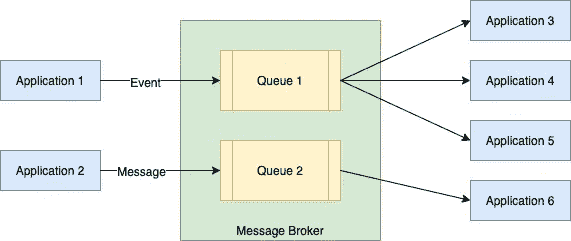

# 异步消息传递:定义

> 原文：<https://betterprogramming.pub/asynchronous-messaging-definitions-16a97ee21d7a>

## 像"*事件*、" "*消息*、"*通知"这样的词随着我们架构的发展会变得模糊不清*

照片由 [Jelleke Vanooteghem](https://unsplash.com/@ilumire?utm_source=medium&utm_medium=referral) 在 [Unsplash](https://unsplash.com?utm_source=medium&utm_medium=referral) 拍摄。

异步消息传递在软件系统中已经变得无处不在。“发布事件”或“发送信息”是所有设计讨论中经常听到的术语。然而，像*事件*、*消息*、*通知、*等词之间的区别就不那么清楚了。当我们开始使用消息传递模式来构建更大的架构模式(如工作流编排或事件源)时，这就形成了大规模的模糊性。

在本文中，我将列出一些常用术语，它们的确切含义，以及应该在哪里/如何使用它们。这些都不是新东西。比我更有名的人已经反复说过了，所以希望我的重复将有助于进一步巩固这个行业术语，并为讨论带来更深的理解和背景。

作者照片。

# 世界的另一边

让我们首先考虑消息传递世界的基础设施方面，它在物理上支持消息传递。

## 记录

记录基本上是我们放在消息代理上的任何东西。从代理的角度来看，它只是一个必须交付给一个或多个有一定交付保证的消费者的字节块。除此之外，记录没有任何语义意义。大多数代理除了定义代理应该如何处理消息的特定于代理的元数据(也称为标头)之外，从不打开记录。这通常包括 TTL、持久性属性、分布式代理的分片密钥(例如 Kafka 的分区密钥)等。

无声“记录”的想法很重要，因为它帮助我们记住，有些观点认为信息的意图毫无意义。这是 infra 平台对系统的中立观点。卡夫卡主题中的事物本质上不是事件、信息或命令。它们只是网络流量。

## 消息代理/消息总线/事件总线

通过这些或任何其他名称，消息代理是封装消息传递体系结构的“队列”部分的基础设施。它可能是一个内存系统(Java 中对`ArrayBlockingQueue`的包装),也可能是一个基于持久化分布式提交日志的系统，如 Kafka，或者介于两者之间的系统，如 RabbitMQ/ActiveMQ 等。经纪人可能会就如何订购记录提供一些保证。不管实现如何，消息代理保存由发布者发出的数据，并确保将数据传递给消费者。

经纪人还提供某些类型的“交付保证”,保证记录是如何从发布者传递给消费者的。有三个主要保证:尽力，至少一次，最多一次。每一个都是大量理论研究的主题，必须由代理的用户仔细评估，以适合他们的用例。

## 长队

队列代表异步数据的发布者和其使用者之间的单个记录逻辑“管道”。有时，代理中的单个物理管道可以代表多个逻辑队列。每个代理都有不同的定义队列的方式。RabbitMQ 将 exchange +路由关键字映射到物理队列，每个创建并映射到 exchange +路由关键字组合的队列都会获得每个记录的物理上不同的副本。

另一方面，Kafka 在一个“主题”中保存了一个单一的消息副本，多个消费者可以订阅该主题，并且独立于该组的其他消费者进行消费。

# 世界的应用方面

现在开始有趣的事情吧！让我们来谈谈应用程序开发人员在使用异步消息传递时使用的词语。

## 事件

正如我在之前[所写的，事件是一个系统在其业务领域中发生的事情想要告诉外界时触发的广播。广播的语言是发布者的业务领域语言。对了解这些事件感兴趣的其他系统必须订阅该广播，并解释发布者的域语言以对其进行操作。然而，即使发布者并不明确知道谁在消费他的事件，仅仅有一个外部可访问的事件流这一事实就使它成为发布者公共接口的一部分。对事件结构或意义的任何更改都应该遵循与同步 API 的更改相同的更改管理协议。](https://www.kislayverma.com/post/using-events-to-build-evolutionary-architectures)

## 消息/命令/通知

消息表示从一个系统到另一个系统的定向异步通信，通常表示为命令(“do-this”消息)，这就是为什么“消息”和“命令”经常互换使用的原因。由于通信是对等的，这实质上是请求-响应交互的异步版本，并且可以使用类似的故障处理语义(一段时间后通过重新发送消息重试、消费者中的幂等性等)。)

## 询问

这是一种在消息传递中很少使用的模式，在这种模式下，系统通过在队列上发送查询来请求(查询)远程系统的数据。我只在使用工作流编排工具如卡蒙达、JBPM 等的编排场景中遇到过这种模式。实现跨多个服务将数据和动作缝合在一起的工作流。

我们可能有这样一个用例，从一个服务中获取数据，然后针对检索到的数据的每个元素调用另一个服务。第二部分显然是消息/命令风格交互的候选，但是第一部分呢？通常，我们会在第一个服务上调用同步 API 来获取数据。然而，这遭受了众所周知的时间耦合的脆弱性。但是如果工作流系统是有状态的，我们可以向第一个服务发出一个异步查询(用惟一的 ID 标记)并暂停工作流。然后，服务将使用查询结果进行响应(也是异步的),并维护原始 ID。工作流系统现在可以将传入的响应与打开的请求进行映射。这是一个消息风格的系统(“do-search”请求/响应)，可以更好地扩展。

在构建基于角色模型的系统时会遇到另一种情况。在这里，这种模式甚至更加明确，因为参与者只能通过消息传递进行交互，而且他们必须是有状态的。因此，根据定义，由参与者组成的工作流是有状态和异步的。如果一个演员想让另一个演员给它一些数据呢？理想情况下，我们不会在独立的参与者之间有这种依赖性，但是假设它不能被消除。

在 Akka 中，我们将使用“ask”模式，这只是一个发送给第二个参与者的异步消息，第一个参与者在等待响应。第二个参与者用包含所需数据的直接消息来响应第一个参与者。

# 结论

这涵盖了消息传递体系结构的确切概念。这些词有特定的含义，以特定的方式工作，并导致非常不同的架构结果。在我们的头脑中有这种特异性有助于对发出的“记录”预期达到的目标做出更清晰的决定。我见过团队用稍微不同的语法发出通用业务事件五次，以装载五个不同的用例，而一个事件就足够了。我曾在拒绝构建 P2P 消息的团队中工作过，因为他们有一个事件流，所有事情都必须通过它来完成。

一件事情经常会变成你一直称呼它的东西，我相信对消息传递范例有一个清晰的理解有助于我们建立更好的具有更清晰职责的系统。

*如果你喜欢这篇文章，你可以订阅* [*我的邮件列表*](https://www.kislayverma.com/) *来获得最新消息。*