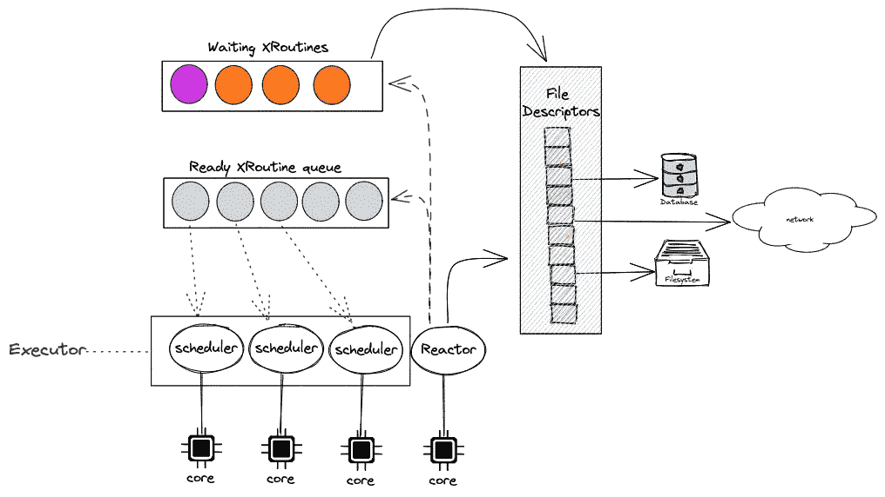
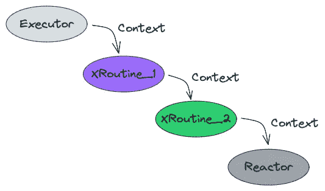

# 异步编程的内部原理

> 原文：<https://betterprogramming.pub/asynchronous-programming-8aaae83cd9f3>

## 使用 Kotlin 实现示例

照片由 [Howard Bouchevereau](https://unsplash.com/@howardbouchevereau?utm_source=medium&utm_medium=referral) 在 [Unsplash](https://unsplash.com?utm_source=medium&utm_medium=referral) 拍摄

像 Go、Rust、Kotlin 等大多数编程语言都提供了非常“轻量级”的线程抽象。

它允许您生成数千个这样的轻量级线程，而不会产生任何操作系统上下文切换开销！

虽然这些语言使用不同的语义来提供这种轻量级线程，但这种框架的底层构建块和实现模式非常相似。

我将尝试提供底层实现的高级概念概述，这样您就可以对这种编程模型有一种直觉，并且理解这些语言中的大多数在理论上可以提供相同级别的性能保证。

为了这篇博客，我将使用术语“`xroutine`”来标识一个单独的计算单元(也称为轻量级线程)——Golang 称之为“Go routine”，Kotlin 称之为“coroutine”，Rust 只是将这个单独的计算单元称为“Future”，但这些原语的目标和实现模式非常相似。

# 系统设计

高级设计

概括地说，主要组件是——执行器、反应器和 XRoutine。让我们来详细看看这些组件，以及它们如何协同工作来提供高性能的轻量级线程

## 反应堆

这个组件的主要职责是监控文件描述符！

值得注意的是，Rust、Go、Kotlin、Nodejs 等所有语言之所以能够提供轻量级线程，唯一的原因是操作系统提供了非常高效的系统调用来执行非阻塞 IO 操作。

在过去，每次您执行系统调用来读取或写入文件描述符时，您的调用线程可能会被阻塞。这是低效的，因为操作系统需要进行上下文切换(这是非常昂贵的)来调度其他线程。

但是由于现代操作系统提供了像 [select](https://man7.org/linux/man-pages/man2/select.2.html) 和 [epoll](https://man7.org/linux/man-pages/man7/epoll.7.html) 这样的系统调用，这些系统调用使我们能够在不阻塞调用线程的情况下执行 IO 操作！

您可以阅读 API 规范以了解更多有关 epoll 如何工作的信息，但本质上，它提供了一种请求 IO 操作的方式，并允许您**轮询**一堆文件描述符以检查活动，API 的设计方式使您可以在单个线程中轮询数百或数千个文件描述符——这正是 rector 所做的！

反应器的工作是轮询/监视文件描述符——当反应器注意到 IO 现在可以在特定的文件描述符上执行时，它会找到相应的正在等待该特定描述符的 XRoutine，并将它移动到就绪队列中执行！

您可能注意到没有操作系统线程在文件描述符上被阻塞，唯一处理 IO 的线程是 Reactor，它轮询描述符(没有阻塞),每当文件描述符准备好被使用时,**将 XRoutine 从等待队列移动到就绪队列**。

## 执行者

执行器的主要职责是运行/执行“就绪队列”中的`XRoutines`，它由多个调度器(通常每个 CPU 内核一个)组成，使用众所周知的 worker 模式处理负载。

为了让执行器执行 Xroutine，它使用了一个固定的 API 契约——运行 XRoutine 的执行器的简化伪代码如下所示:

契约的重要元素是“上下文”，当执行器调用 Xroutine 时，它还传递上下文以及 xroutine 需要的其他参数。

如果 xroutine 需要等待一个文件描述符，它会返回一个值(“Blocked”)，指示执行器`xroutine`被阻塞，这使得执行器能够将`xroutine`添加到一个单独的队列中，并继续执行就绪队列中的其他`xroutines`。

当一个`xroutine`调用另一个`xroutine`时，上下文会一直传播到负责监控 IO 文件描述符并将初始`xroutine`移动(唤醒)到就绪队列的反应器。

## x 例程

在上一节中，您可能已经注意到，每当 reactor 注意到文件描述符已经准备好使用时，它就会遵循上下文传播树，将第一个 xroutine 移动到就绪队列，以便执行器能够获得它。

这意味着每个 xroutine 都应该从先前停止的地方“恢复”!

这带来了一个新的挑战，Xroutines 不能只是一个简单的函数，它应该是一个智能的状态机，将它的状态保存到上下文中，并使用它从被阻塞的地方恢复执行。

让我们以下面的函数为例:

如果你想把函数`incrementTwice`当作一个 xroutine，它应该是智能的和有状态的，这样多次调用/执行它将会从它之前被阻塞的地方恢复它的执行。

这就是编译器帮助我们的地方，只需用特定于语言的关键字/注释来注释函数(如 golang 中的“go”、rust 中的“async”和 kotlin 中的“suspend”)，编译器就可以将函数转换成处理恢复逻辑的状态机。

生成的状态机的伪代码可能如下所示:

正如您在伪代码中看到的，编译器会将原始函数转换为有状态函数，当调用该函数时，它会根据上下文中出现的`suspensionPoint`的值跳转到代码中的特定块。

当它第一次被调用时，它运行`initial`块，将结果递增 1，然后当它调用 logger.log(..)它注意到底层记录器被阻塞，因此将`suspensionPoint`保存为“final ”,并返回`Blocked`响应供上游代码进行类似处理——还要注意，上下文被传播到记录器，记录器最终被传递到反应器，反应器使用它将初始 xroutine 移动到就绪队列。

当 xroutine 被 executor 从就绪队列中取出并第二次调用它时，xroutine 使用上下文值"`suspensionPoint`"并直接跳转到`final`块，从上一次执行中暂停的地方重新开始执行。

仅仅通过添加一些编译器关键字，我们现在得到了一个 xroutine，它是最小的执行单元，可以在没有任何操作系统上下文切换的情况下被执行、阻塞和恢复！

## 结论

总之，前面提到的所有语言都使用非常相似的设计来支持`XRoutine`(在 kotlin 中是 coroutine，在 golang 中是 goroutine，在 Rust 中是 Future)。

`XRoutine`只是一个编译器生成的状态机，它将上下文相互传播到反应器，反应器是运行时的核心，它监控文件描述符并确定要重新调度的特定 XRoutine，并将它从等待队列移动到就绪队列。

由于每个 XRoutine 只不过是内存中的一个对象，所以您可以在不增加任何操作系统上下文切换开销的情况下生成数千个 XRoutine！