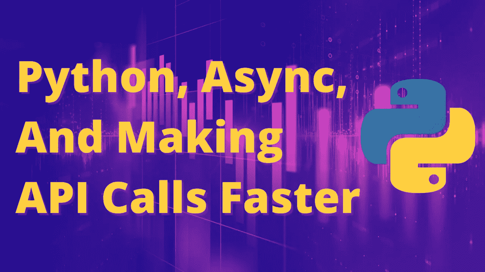
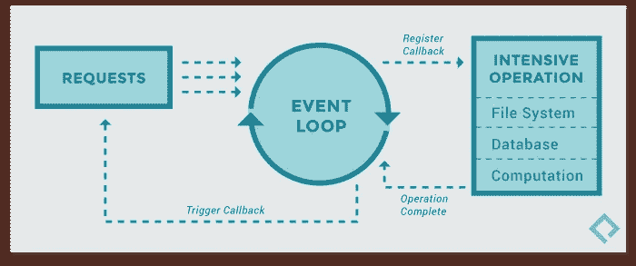

# Python 中的异步编程可以更快地调用更多 API

> 原文：<https://betterprogramming.pub/asynchronous-programming-in-python-for-making-more-api-calls-faster-419a1d2ee058>

## 使用 aiohttp、asyncio、event loops 和其他任何东西来更快地获取我们的金融科技数据



来自 Getty Images Pro 的 monsitj 的原始图像。

前几天，我试图从网上找到的一个 API 下载 1600 万种颜色。我最初的想法是“当然，我可以用请求库做到这一点。大概用不了*那么*长时间。”

八个小时后，我完成了大约 0.5%，所以我决定是时候重构代码以实现异步了。这也是帮助其他人的时候了。从 Python 3 开始，[异步编程](https://docs.python.org/3/library/asyncio.html)现在得到了支持，但是我遇到了一些问题，我相信其他人也会遇到，所以让我们从头到尾了解一下。

这个演示/教程的所有代码和例子都可以在 [my GitHub](https://github.com/PatrickAlphaC) 的 [async-python](https://github.com/PatrickAlphaC/async-python) repo 中找到。它有一个很好的小自述文件，所以你可以跟随！

# 请求库

通常，当 Pythoners 程序想要进行 API 调用时，它们会查看[请求](https://realpython.com/python-requests/)库。这个语法是我最喜欢的，因为如果我想进行 API 调用，我只需运行:

```
import requestsresponse = requests.get("[http://example.com/](http://example.com/)")
print(response)
```

仅此而已。我喜欢这样小而有效的例子。

如果我想经常这样做，我可以做一个`for`循环:

```
import requestsfor i in range(10):
    response = requests.get("[http://example.com/](http://example.com/)")
    print(response)
```

我不得不等待更长的时间。每次我对`example.com`进行 API 调用时，我必须:

1.  将请求发送给`example.com`。
2.  等待回应。
3.  得到回应。

如果我试图获取大量数据，这尤其令人沮丧(例如，如果我想从 [Alpha Vantage API](https://www.alphavantage.co/documentation/) 中提取 fintech 数据)。你需要一个可以用`api_key = your_key_here`设置的[自由键](https://www.alphavantage.co/support/#api-key)。

我必须等待 5 个 API 调用大约 1.5 秒，然后 50 个 API 调用需要 11 秒，135 个 API 调用需要 50 秒…

哎呀…如果我想获得 2，000 家公司或 1，600 万种颜色的数据，这就不太合适了。

所以我们需要做一些更聪明的事情。

# 异步代码与同步代码

当我们运行 Python 代码时，代码被我们的进程逐行读取，一次一行。当一行被执行时，没有其他代码可以运行。这就是所谓的同步代码——一切按顺序进行。

在[异步代码](https://developer.mozilla.org/en-US/docs/Learn/JavaScript/Asynchronous/Concepts)中，我们可以在一个任务完成之前转移到另一个任务。例如，如果我们考虑同步烹饪汉堡和蔬菜的晚餐，我们的“代码”应该是这样的:

```
cook_burger()
cook_vegetables()
```

在这种情况下，我们不能开始蔬菜，直到汉堡做好，因为它是同步的。然而，我们并不总是想等到汉堡做好了才开始煮蔬菜。我们可以同时煮它们。一旦做好了，我们可以停下手头的工作去处理完成的蔬菜或汉堡。在异步代码中，它看起来像这样:

```
async def cook_meal():
     await asyncio.gather(cook_burger(), cook_vegetables())asyncio.run(cook_meal())
```

我们“收集”我们要做的任务，并让他们两个完成。我们在一个事件循环中运行这些函数，该循环跟踪它们完成时如何处理它们。您可以将事件循环视为不断检查某个流程是否完成。

现在你可能听说过多线程，这些是不同的。多线程是为了拥有多个工作线程。Async 只有一个工作线程。想象一下，当一堆东西在烹饪时，一个工人在厨房里跑来跑去，而许多工人在厨房里。我在[之前的一篇文章](/which-should-you-use-asynchronous-programming-or-multi-threading-7435ec9adc8e)中分析了这些差异。

# 事件循环

回到我们的 Alpha Vantage API 调用示例。在我们现在的代码中，我们:

1.  提出第一个要求。
2.  等等。
3.  得到第一个回应。
4.  提出第二个要求。
5.  等等。
6.  得到第二次回应。

对于每个符号。如果我们有五个符号，我们就“等待”了五次。这是我们第五次无所事事！如果我们有 100 个 API 调用，我们就有 100 次什么都没做！与其这样做，不如开始一个 API 调用，而不是等待，开始其他 API 调用，然后稍后处理响应。

因此，我们可以不做上述工作，而是:

1.  提出第一个要求。
2.  提出第二个要求。
3.  等等。
4.  得到第一个回应。
5.  得到第二次回应。

在第二个例子中，我们只有一段等待时间！现在，当响应返回时，这可能发生在我们发出请求时，所以我们需要一些东西来处理返回的响应。这被称为[事件循环](https://docs.python.org/3/library/asyncio-eventloop.html)。

事件循环定期检查我们的异步操作是否已经返回，并相应地调度它们进行处理。当我们正常运行 Python 时，没有运行事件循环来处理这种情况，所以我们需要设置事件循环，以便可以按顺序处理响应。



图片来自 [Paxos](https://eng.paxos.com/python-3s-killer-feature-asyncio) 。

然后我们可以异步运行我们的代码。

# 输入 asyncio 和 aiohttp

所以我们现在知道，当我们异步运行代码时，我们不必总是马上等待它完成。我们可以使用 [asyncio](https://docs.python.org/3/library/asyncio.html) 和 [aiohttp](https://docs.aiohttp.org/en/stable/) 来实现这一点。

让我们看看如何编写与 Alpha Vantage 请求示例几乎完全相同的代码，但是使用了 asyncio 和 aiohttp:

## 分解它

我们用`asyncio.run(get_symbols())`启动底部的功能。这启动了我们的事件循环，并允许我们使用异步代码。您会注意到，在许多较早的示例中，它们更明确地说明了如何开始事件循环:

```
loop = asyncio.get_event_loop()
results = loop.run_until_complete(get_symbols())
loop.close()
```

这段代码做的事情和`asyncio.run(get_symbols())`完全一样。

这是我们的切入点。然后我们转到函数:

```
async def get_symbols():
    async with aiohttp.ClientSession() as session:
        for symbol in symbols:
            response = await session.get(url.format(symbol, api_key), ssl=False)
```

我们必须以关键字`async`开始。这让 Python 知道这个函数将是异步的，我们可以使用事件循环。

然后我们与`aiohttp`开启一个会话。`aiohttp`是`requests`的异步版本。然后我们遵循同样的模式，遍历每个符号并调用 aiohttp 版本的`request.get`，也就是`session.get`。我发现你经常需要为此添加`ssl=False`。

由于`session.get`是一个异步函数，也称为协程，我们必须用`await`来响应。有几种[可用对象](https://docs.python.org/3/library/asyncio-task.html#awaitables)可以/必须等待使用。否则，它们只返回协程本身。

太好了。我们基本上已经将请求代码复制到异步语法中了，但是等等…我们每次都还在等待！

关键字`await`意味着我们仍在循环，等待每个响应的返回。我们希望从一开始就启动所有的 API 调用，然后再等待。我们如何做到这一点？

# 收集任务

我们怎样才能像这样一次启动所有的 API 调用呢？

我们有一个全新的功能叫做`get_tasks`。这个函数将所有的协程合并到一个列表中，让我们立刻开始。请记住，这个列表中的所有函数都必须是异步函数或者是已经放在事件队列中的任务(现在不要担心第二部分)。

我们还可以通过以下方式完成所有任务:

```
tasks = [session.get(URL.format(symbol, API_KEY), ssl=False) for symbol in symbols]
```

但是我想包含`get_tasks`函数，以防混淆。

一旦我们有了想要开始的功能/任务的列表，我们就可以在我们的`get_symbols`函数中使用以下命令来开始它们:

```
responses = await asyncio.gather(*tasks)
```

这一行表示我们将等待所有任务完成，并将它们放入`responses`对象中。我们也可以这样写:

```
responses = await asyncio.gather(session.get(URL.format('IBM', API_KEY), ssl=False), session.get(URL.format('AAPL', API_KEY), ssl=False), session.get(URL.format('MSFT', API_KEY), ssl=False))
```

因为`*tasks`只是一种将列表[解引用到变量中的方法。](https://treyhunner.com/2018/10/asterisks-in-python-what-they-are-and-how-to-use-them/)

我们“收集”所有的任务，然后将它们发送出去。当它们响应时，事件循环会将它们捡起来，放入队列中，在我们发送完所有任务后进行处理。

## 协程与任务

现在，在上面的例子中，我们向`asyncio.gather`函数传递了一个异步协程列表，这样它们就可以被调度到事件循环中，但是我们实际上可以更快地将它们调度到事件循环中！

在我们的`get_tasks`函数中，我们调用:

```
tasks.append(session.get(url.format(symbol, api_key), ssl=False))
```

我们将`session.get`函数添加到任务列表中，并且只在调用`gather`时将它们添加到事件循环中。实际上，您可以使用`asyncio.create_task`更快地将其添加到事件循环中:

```
tasks.append(asyncio.create_task(session.get(url.format(symbol, api_key), ssl=False)))
```

这将把`session.get`函数添加到事件循环中，而`asyncio.gather`函数将等待该任务完成。

但是请记住，它们是不同的。协程是一个函数，而任务是在事件循环中被调度的东西。`asyncio.gather`将等待任务返回和/或将协程调度到事件循环上，并等待它们返回。

# 结论

希望我已经澄清了很多关于 Python 中异步编程的困惑。如果你想看到更多，有些事情没有意义，或者你现在在做的任何项目都没有被阻止，请留下评论让我知道！

我还制作了两个关于这个主题的视频。一个比另一个更古怪。一如既往，我期待这两方面的反馈！