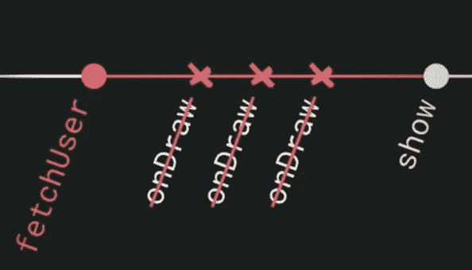
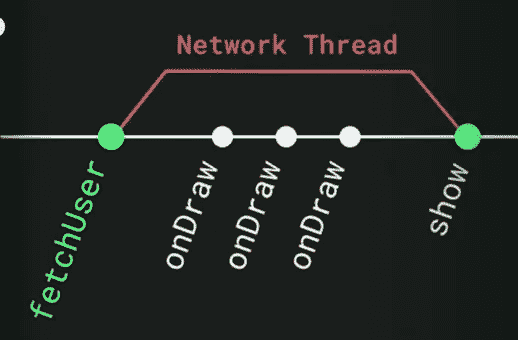
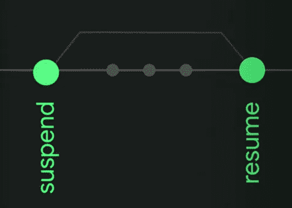
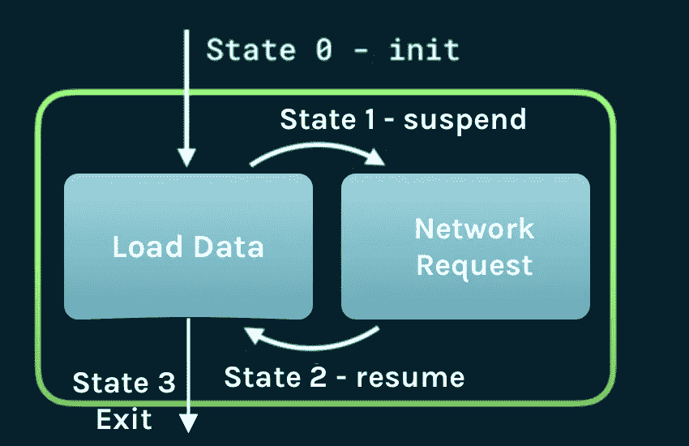
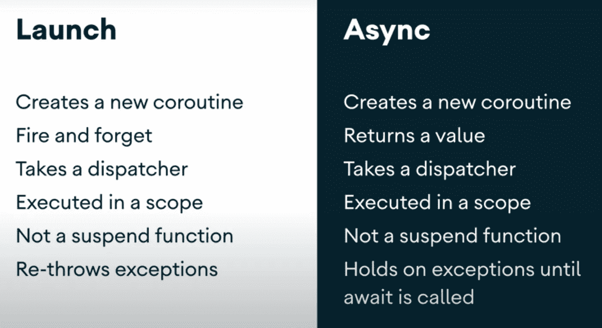

# 用 Kotlin 协程进行异步编程

> 原文：<https://betterprogramming.pub/asynchronous-programming-with-kotlin-coroutines-5b3417f53ac6>

## 用协程程序编写阻塞和非阻塞代码

作者照片。

Kotlin 的一个有趣特性是协程。在 Android 开发中，线程的管理总是有点挑战性，因为在处理与 UI 或主线程相关的事情上有一些限制。通常的做法是使用 UI 或主线程来执行与 UI 相关的操作，使用后台线程来阻止网络调用、数据库操作、繁重的计算任务等操作。

如果线程管理不当，会对应用程序的性能产生巨大影响，导致 ANRs、UI 冻结、崩溃等。因此，在正确的思路上做事至关重要。

线程管理或多线程可以通过多种方式实现。但是 Kotlin 协程为处理线程提供了最简单的解决方案。协程只不过是轻量级线程。它们为我们提供了一种简单的方法来进行同步和异步编程。协程允许我们在不阻塞主线程的情况下替换回调并构建主安全。

让我们看看如何做到这一点。

*注:* `*AsyncTask*` *类在 Android 11 中已被弃用。Kotlin 协同例程现在是异步代码的推荐解决方案。*

# 暂停功能的使用

让我们通过一个简单的例子来理解这一点，这个例子从一个 API 请求或本地数据库获取用户详细信息，并将它们显示给用户。如果我们试图通过主线程上的 API 调用获取细节，它会抛出一个`NetworkOnMainThreadException`。如果我们从数据库中获取详细信息，这个操作将阻止主线程执行它的操作，直到数据被获取，导致糟糕的用户体验。

作者照片。

我们可以通过在协程中使用`suspend`函数来简单地做到这一点。`suspend` 表示与该修饰符关联的方法是同步的，不会立即返回。与之关联的方法将暂停一段时间，然后在结果可用时返回结果。

让我们更清楚地想象一下:

作者照片。

当一个协程被挂起时，它不是在执行。暂停了。当它恢复时，它会从停止的地方继续。当我们在主线程上调用一个`suspend`函数时，该函数被挂起，并在任何其他工作线程上执行它的工作。一旦它完成了，它就带着结果继续运行，这样我们就可以在主线程上使用结果了。

作者照片。

但是使用`suspend`函数有一些限制。它们既可以在协程构建器内部调用，也可以从另一个`suspend`函数中调用。

调度程序用于指定协程应该在哪个线程上执行。它们类似于 Rx 中的调度程序。我们可以指定希望在哪个调度程序上执行`fetchUser` API 请求(在我们的例子中，是`Dispatchers.IO`)。我们用`withContext`方法来说明这一点:

一旦 API 请求完成，我们就可以使用`Dispatchers.Main`在主线程上使用结果。可用不同调度程序有:

*   `Dispatchers.Default` : 这是默认的协程调度程序，被所有协程构建器使用，如`launch`、`async`等。如果在其上下文中没有指定 dispatcher 或任何其他`ContinuationInterceptor`。它用于在主线程之外进行 CPU 密集型工作的场景。
*   `Dispatchers.IO` : 这个协程调度器是为处理阻塞磁盘 IO 操作和网络操作而设计的。该池中的其他线程会根据需要创建和关闭。
*   `Dispatchers.Main` : 一个协程调度器，被限制在主线程上操作 UI 对象。如果类路径中没有主线程调度程序，对该属性的访问可能会抛出`IllegalStateException`。它主要用于消费来自 API 操作、数据库操作等的响应结果。

根据您的需求使用合适的调度程序。

# 引擎盖下发生了什么

当计算可以暂停时，Kotlin 编译器编写回调。协程程序调用这些回调作为延续**。延续不过是一个普通的回调接口，里面有一些额外的信息。状态机应该是这样的:**

来源:[科特林协程 101 —安卓会议讲座](https://www.youtube.com/watch?v=ZTDXo0-SKuU)

# 结构化并发

结构化并发是协程中的一种设计模式系统，它试图解决内存泄漏问题。这有助于我们思考以下几点:

1.  谁可以取消协程的执行？
2.  协程有生命周期吗？
3.  当协程失败时，谁会得到异常？

结构化并发通过引入一个叫做范围的概念来管理这些事情。

## 协程范围

一个`CoroutineScope`是 [kotlinx.coroutines](https://kotlin.github.io/kotlinx.coroutines/) 包中的一个接口。

1.  它跟踪协程。
2.  它提供了取消协程的能力。
3.  无论何时发生故障，它都会得到通知。

协程作用域只不过是一个非常容易创建的变量。它不会包含任何重物的参照物。因此，每当我们想要控制协程生命周期时，我们都需要创建一个作用域。它可以很容易地创建如下:

现在，上面使用`launch` 协程生成器创建的协程将遵循作用域的生命周期。如果出现任何异常，将会传达给范围，以便我们可以处理它。在许多情况下，当用户在网络请求正在进行时退出屏幕，我们需要取消所有正在进行的请求。所以在`ViewModel`、`onCleared()`、**、**回调中，或者在`onDestroy()`回调活动中，我们可以取消作用域，让所有的协程停止执行。

取消范围意味着:

1.  它取消它启动的所有子协程。
2.  我们不能用这个范围启动更多的协程。

## 处理协程范围的异常

作用域还将作业作为参数。

作业可以用来定义作用域和协程的生命周期。如果我们将一个作业传递给作用域，它将以特定的方式处理异常。当有多个子范围与该范围相关联时:

*   如果任何一个孩子失败了，它会把异常传播给其他孩子。
*   当通知失败时，作用域将取消自身并向上传播异常。

在大多数失败的情况下，停止其他子进程并抛出异常并不理想，通常会导致崩溃。对于这些情况，我们需要使用一个`SupervisorJob` **。**

当我们使用一个`SupervisorJob`时，它不会停止相同作用域上其他子进程的执行。当通知失败时，作用域什么也不做。由于异常可能会向上传播，为了安全起见，我们可能必须在代码中使用`try/catch`块。

我将写一篇关于处理协程、作用域等异常的文章。

# 如何创建协程

我们可以使用现有的协程构建器来创建协程。我们通常使用两个:

1.  `launch`
2.  `async`

## 发动

`launch{}` 是一个协程生成器，用于创建一个新的一次性协程。`launch`函数创建一个协程并立即返回。但是，工作在后台线程池中继续进行。它启动并忘记了协程。它通常用在不需要返回值的时候。例如，如果我们想上传一些东西到服务器，我们不关心结果:

## **异步**

`async{}` 是一个协程构建器，它创建一个新的协程，用于预期返回值的情况。例如，让我们考虑上面从 API 调用获取用户数据的例子:

`async`将返回延期对象。我们在延迟对象上调用`await()`，所以`await`将等待，暂停协程的执行，直到`async`完成它的计算，并返回协程的值。

## 比较

来源:[参考:科特林协程 101 —安卓会议讲座](https://www.youtube.com/watch?v=ZTDXo0-SKuU)

`launch`和`async`不是`suspend`功能。它们是协程的入口点。我们可以将它们视为作用域之上的扩展函数。

# 外卖食品

*   除非需要，否则不要标记函数`suspend`。
*   检查读取文件等繁重计算操作中的`yield`或`ensureActive`方法，以便每当取消协程并调用该函数时，它将停止该协程的执行。
*   处理异常。否则可能会导致 app 崩溃。

# 摘要

您现在应该了解什么是协程及其基本用法。在我接下来的文章中，我们将了解更多关于这些协程、作用域和异常处理的内容。

还有，我从下面提到的参考资料中学到了很多东西。别忘了去看看。

# 参考

*   [科特林协同程序 101 —安卓会议讲座](https://www.youtube.com/watch?v=ZTDXo0-SKuU)
*   [了解 Android 上的 Kotlin 协同程序(Google I/O’19)](https://www.youtube.com/watch?v=BOHK_w09pVA)
*   [KotlinConf 2017—Roman Eliza ROV 的协程介绍](https://www.youtube.com/watch?v=_hfBv0a09Jc)
*   [协程基础知识](https://kotlinlang.org/docs/reference/coroutines/basics.html#extract-function-refactoring)