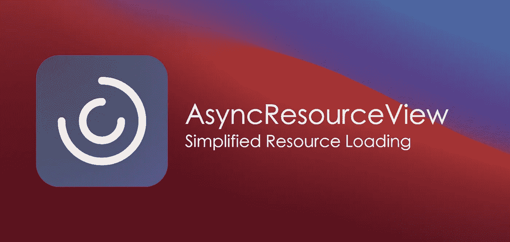
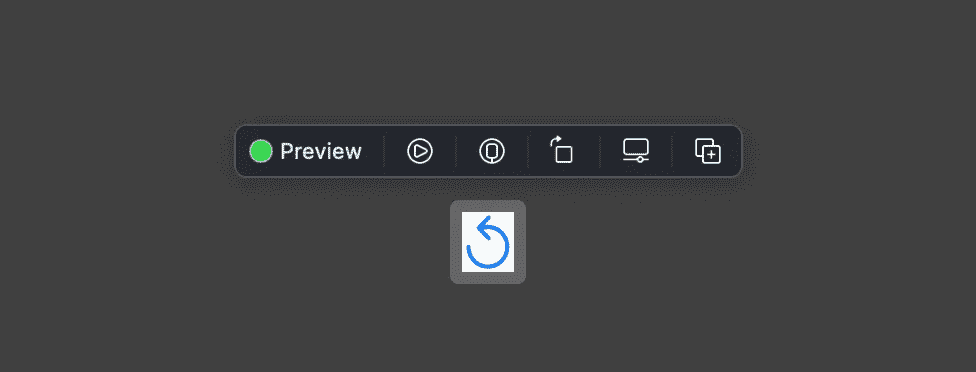
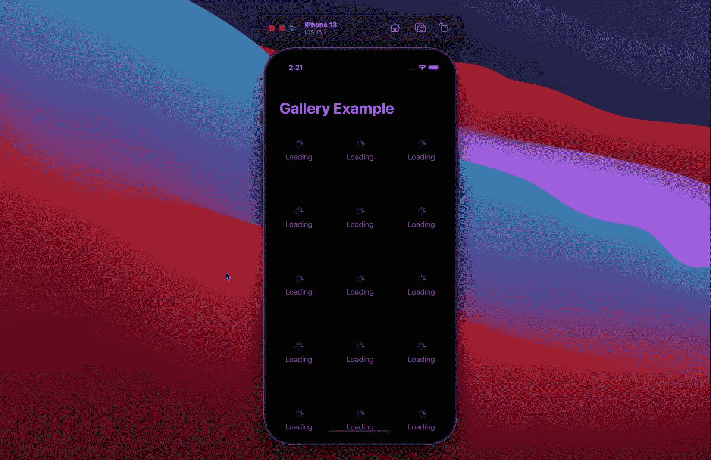

# AsyncResourceView —简化的资源加载

> 原文：<https://betterprogramming.pub/asyncresourceview-558ec1f49ea2>

## 构建异步 SwiftUI 应用程序

今天，我们将看看如何在 SwiftUI 应用程序中处理异步数据。现代应用严重依赖于通过网络接收的资源，因此可能会受到连接问题或数据丢失的影响。例如，如果你在德国境内乘火车旅行，你可能会惊讶地发现，由于手机信号接收微弱，你会经常遇到无线电信号中断的情况。

因此，作为开发人员，我们必须设计我们的应用程序，当一个动作花费的时间比预期的长时，要包括反馈，并在失败的情况下提供重试该动作的能力。这样，我们可以让我们的应用程序脱颖而出，因为它们可以应对远非最佳的条件。

本文介绍了可重用的组件`AsyncResourceView`,它抽象了获取异步数据时的加载和失败状态，这样我们就可以专注于特性，而不是编写重复的容易出错的代码。

你可以在 GitHub 上查看这个项目([链接](https://github.com/LinkAndreas/AsyncResourceView))。

# 查看商店

首先，让我们实现负责驱动 UI 的`AsyncResourceViewStore<Resource>`。给定加载程序，商店最初保持在`notRequested`状态，直到`loadResource`被调用并且进入`loading`状态。最后，根据操作结果，进入`success`或`failure`状态。

请注意，商店独立于 SwiftUI，将来可能会与替代的 UI 框架一起使用。此外，我们使用`@MainActor`注释来确保状态变化只发生在主线程上:

# 测试

尽管它的实现看起来很简单，但让我们包含单元测试，以确保我们将来可以自由地重构商店，而不会改变它的行为。

第一，店铺要处于`notRequested`状态。`makeSUT`助手用一个加载器存根实例化了`AsyncResourceViewStore`，这样我们就可以在断言预期行为时控制其结果。

第二，当资源加载成功时，我们期望商店进入`success`状态。类似地，如果资源加载失败，我们期望商店进入`failure`状态。

最后，我们还希望商店在资源加载最初失败但后来成功后进入`success`状态。这样，我们可以确保用户在失败的情况下可以选择重试操作。

# 视角

完成存储后，让我们继续使用特定于状态的闭包来呈现其子元素的`AsyncResourceView`。虽然`notRequested-`、`failure-`和`loading-`视图是可选的，但是我们需要指定给定资源的`success`视图。这样，我们就可以分解复杂性，并且只需要同时处理一个状态，而不是多个状态。

## asynccresourcedefaultnotrequestedview

例如，使用`notRequested`视图，我们可以指定在请求资源之前 UI 应该是什么样子。请注意，默认表示是不可见的，仅用于在出现时触发回调。取而代之的是，我们也可以想到一个可视化的表示，它有一个按钮，让用户决定何时运行操作。

## asynccresourcedefaultloadingview

相反，默认的`loading`视图是可见的，并且将指示进度，直到进入*成功*或*故障状态*为止。

## asynccresourcedefaultfailureview

最后，如果不存在`failure`闭合，则`AsyncResourceDefaultFailureView`会呈现一个逆时针箭头，以在失败时重试该动作。请注意，自定义视图也可能会考虑该错误，以提供有关操作未按预期工作的原因的附加信息。

# 试映

毫无疑问，SwiftUI 相对于 UI Kit 的一大优势就是我们可以获得渲染是如何构成的实时反馈。在处理交互式预览时，尤其如此，交互式预览提供了对组件的外观和感觉的深刻见解。随后，您可以找到静态和交互式预览的示例:

静态预览基于商店的预定义状态呈现自身，而交互式预览与加载器显式通信，并等待直到产生结果。因为加载器可能会失败，所以我们抛出一个骰子并返回资源(即“Hello World”)或一个错误。后者将导致失败状态，我们可以在不离开预览的情况下重试操作。

# 用例示例:“颜色库”

为了可视化组件的使用方式，让我们实现一个颜色库，其中的项目排列在一个三列网格中。每个项目都有一个`AsyncResourceView`来请求加载程序的颜色，加载程序要么返回一个随机的颜色，要么在[0.3，3.0]秒后失败。如上所述，如果操作失败，会显示一个重试按钮。

因为我们没有指定定制的`notRequested`视图，所以使用默认视图，它一出现就请求资源。通过将项目包装在 SwiftUI 的`LazyVGrid`中，它们仅在需要时被创建。

每一个项目都由它自己的存储驱动，即`AsyncResourceViewStore`根据动作花费的时间在状态之间转换。

最后，我们创建一个`GalleryStore`来驱动合成，并为每个单独的加载器提供一种颜色。

# 结论

在本文中，我介绍了`AsyncResourceView`，这是一种在 SwiftUI 应用程序中处理异步资源的一致方法。

使用该组件，我们可以避免重复的代码，并将更多的时间花在实现功能上，而不是在整个应用程序中编写相同的加载或错误处理代码。

快乐编码。