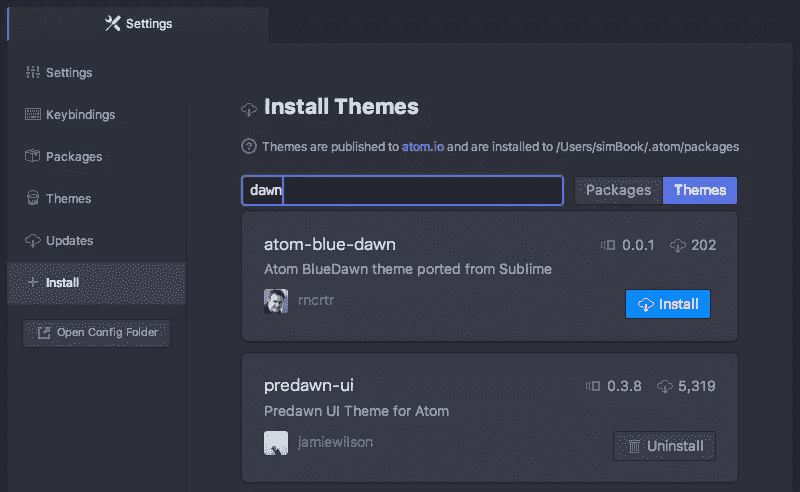
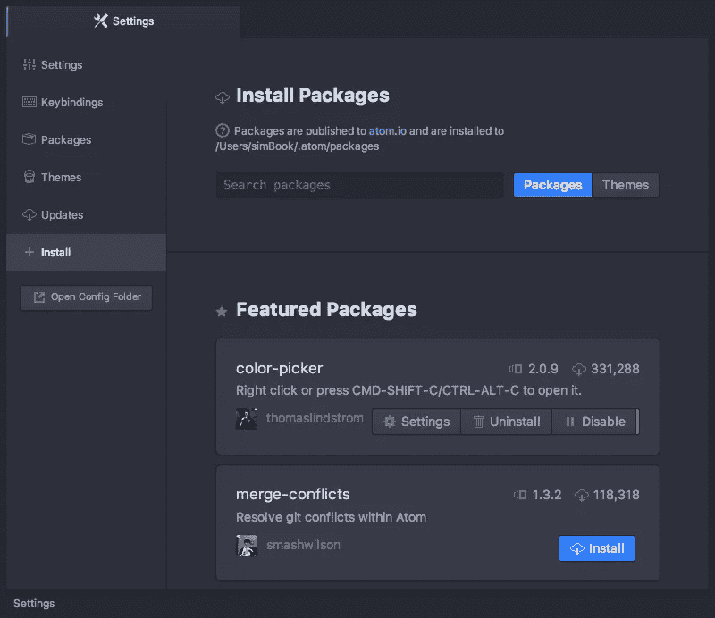
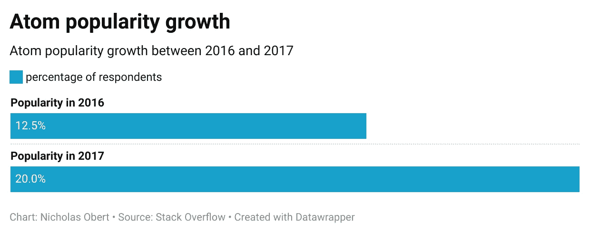
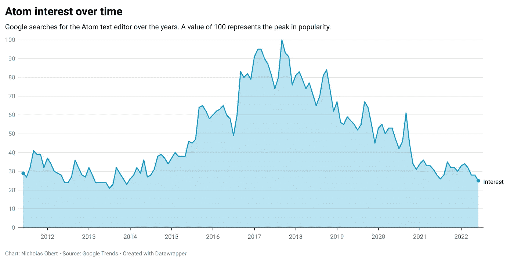

# Atom 文本编辑器正在消亡。IDEs 万岁

> 原文：<https://betterprogramming.pub/atom-text-editor-is-dying-long-live-ides-3d1d35ff4e7e>

## Atom 文本编辑器到此结束

图片由作者编辑。由[鲁本·奥尔特加](https://unsplash.com/es/@garigol?utm_source=unsplash&utm_medium=referral&utm_content=creditCopyText)在 [Unsplash](https://unsplash.com/s/photos/cemetery?utm_source=unsplash&utm_medium=referral&utm_content=creditCopyText) 上拍摄的原始照片。

就在昨天，2022 年 6 月 8 日，GitHub 在他们的[博客](https://github.blog/2022-06-08-sunsetting-atom/)上宣布 Atom 将于 12 月 15 日停产。Atom 组织的所有项目都将在计划于 2022 年 12 月 15 日正式“日落”时归档。

# 原子的诞生

Atom 于 2011 年推出，是一款免费、开源、可深度定制且易于使用的代码编辑器。正因为如此，它已经建立了“可破解的文本编辑器”的声誉，正如它的开发者所称。

Atom 自定义主题(图片来自 [atom.io](https://flight-manual.atom.io/using-atom/sections/atom-packages/) )

Atom 构建在 [Electron](https://github.com/electron/electron) 之上，这是一个允许你使用 JavaScript、HTML 和 CSS 编写跨平台桌面应用的框架。由于其内置的包管理器允许您直接从 Atom 编辑器安装或创建包，因此它旨在满足每个开发人员的需求。有数不清的开源包为你的编码体验添加了新的特性和令人敬畏的主题。此外，您可以使用 HTML、CSS 和 JavaScript 根据自己的喜好直接调整 UI 和特性。

Atom 包管理器(图片来自 [atom.io](https://flight-manual.atom.io/using-atom/sections/atom-packages/)

# 原子的兴衰

自从 Atom 第一次发布以来，它在软件开发社区获得了很大的人气。Atom 在 2016 年至 2017 年期间经历了最显著的增长。事实上，根据堆栈溢出调查，2016 年有 12.5%的受访者使用它，而 2017 年则达到了令人印象深刻的 20%。

2016 年至 2017 年间 Atom 受欢迎程度的增长

然而，2017 年后，Atom 的受欢迎程度令人遗憾地大幅下降，从 2011 年至今的谷歌搜索中可以看出:

原子兴趣随时间变化

此外，在 2021 年的堆栈溢出调查中，只有 12.94%的参与者使用 Atom。

# Atom 为什么会死？

尽管 Atom 在软件开发社区中很受欢迎，但在过去几年中，除了维护和安全补丁之外，它没有任何重大的功能更新。

Atom 衰落的主要原因是新技术已经取而代之，特别是基于云的工具和更受欢迎的代码编辑器，如 [Visual Studio Code](https://code.visualstudio.com/) 和 [IntelliJ IDEA](https://www.jetbrains.com/idea/) ，据[谷歌趋势](https://trends.google.com/trends/explore?date=all&q=%2Fm%2F0_x5x3g,%2Fm%2F03v0mn)报道。因此，GitHub 决定不再维护 Atom，而是专注于开发其他技术，如 [GitHub Codespaces](https://github.com/features/codespaces) 。

# 下一步是什么？

虽然 Atom 将于 2022 年 12 月正式寿终正寝，但它仍然可以下载，不会一夜之间停止工作。但是，它将被存档，因此不会收到任何新的更新。

即使将来您仍然可以使用 Atom，我还是建议您切换到另一个可维护的代码编辑器，比如 Visual Studio Code。使用无人维护的软件总是有风险的，因为它可能包含一些无法修复的危险的安全漏洞，更不用说您将无法使用其他产品可能提供的最新、可能更好的功能。

我们非常感谢通过提出请求、修复问题和创建扩展来参与 Atom 开发的每一位社区成员。然而，没有什么能免受时间的磨损，没有什么是永恒的。

> 凡事有始必有终。平静下来，一切都会好的。
> 
> 杰克·康菲尔德

尽管 Atom 很受欢迎，但不太可能有人会在添加新功能的同时放弃原来的存储库并使其保持最新，但是如果你真的相信它，那就去做吧。

感谢阅读！