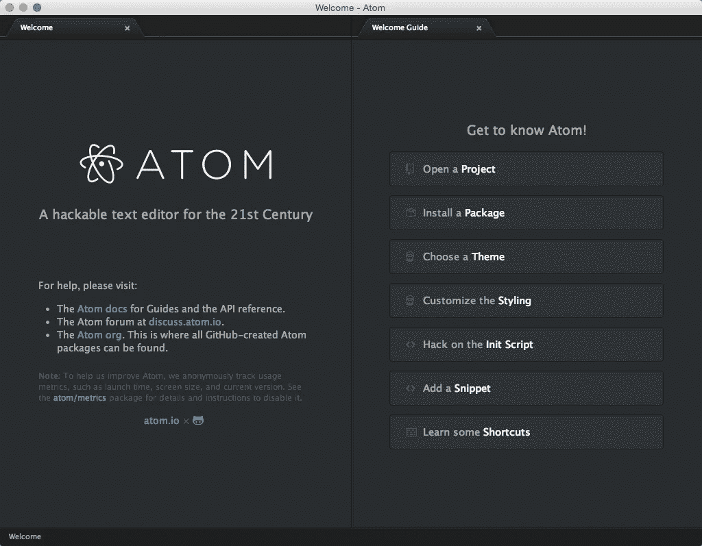
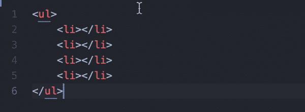
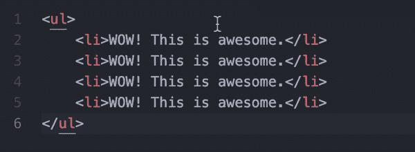
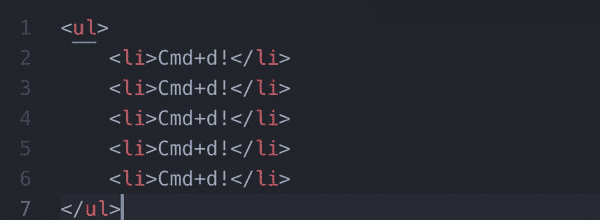
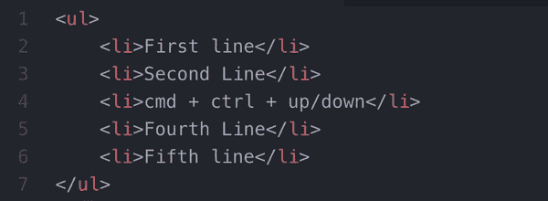
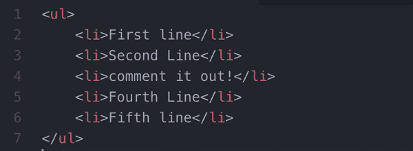
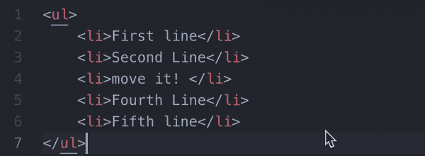
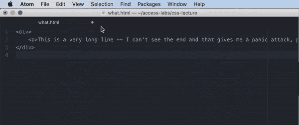
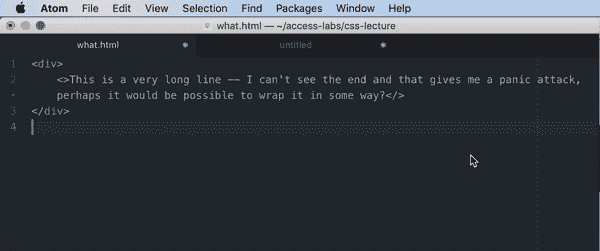

# 面向初学者的 Atom 技巧

> 原文：<https://betterprogramming.pub/atom-tricks-for-beginners-270001bcf55c>

## 面向 Atom 爱好者的最佳软件包、快捷方式和选项



这是我个人最喜欢的 Atom 包列表。

# Atom 包

## **1。终端加**

这个[包](https://atom.io/packages/terminal-plus)允许你将一个终端窗口集成到 Atom 中，这样你就不用在窗口之间切换了。又牛逼又省时间。

```
// installation bash command: apm install terminal-plus
```

## **2。括号着色**

软件工程都是关于括号的，所以帮你自己一个忙，让括号对可见。

```
// installation bash command:apm install bracket-colorizer
```

## **3。棉绒**

用[棉绒](https://atom.io/packages/linter)像专业人士一样缩进。

```
// installation bash command:apm install linter
```

## **4。自动关闭-HTML**

安装这个来确保你的 [HTML 标签自动关闭](https://atom.io/packages/autoclose-html)。

```
// installation bash command:apm install autoclose-html
```

# 有用的快捷方式

以下是我个人一直以来最喜欢的 Atom 快捷键列表:

## **引入多个光标**

CMD +单击



## **2。选择多项**

CMD + D



## **3。选择所有项目**

CMD + CTRL + G



## **4。重复行**

CMD + shift + D


## **5。移动线**

CMD + CTRL +向上或向下



## 6。(联合国)意见

CMD + /



## **7。缩进**

CMD + {或}



# 奖励:有用的选项

## **1。软包装**

(“视图”>“切换软换行”)在窗口宽度内换行。



## **2。分屏**

(拖动文件)允许您同时打开几个文件。

