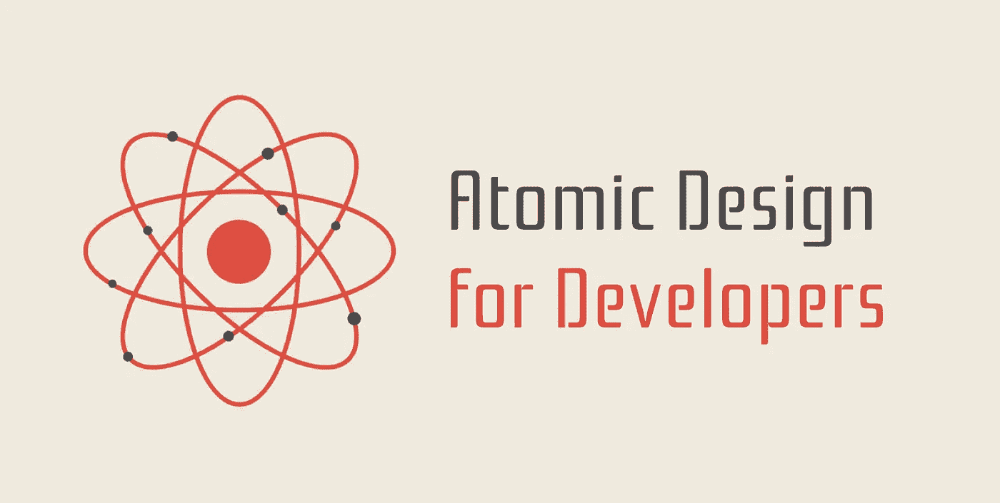
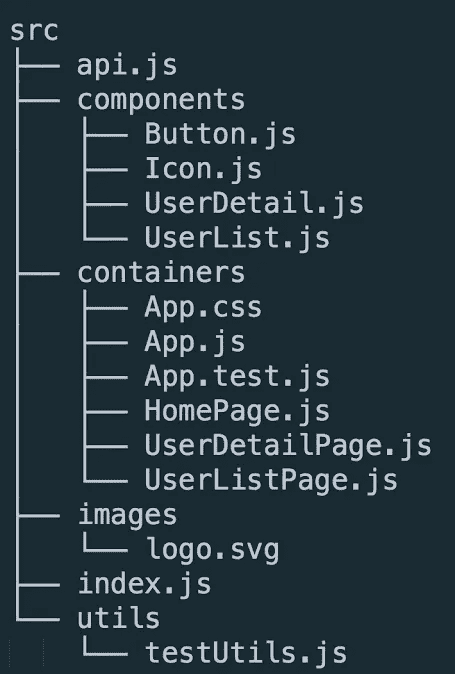
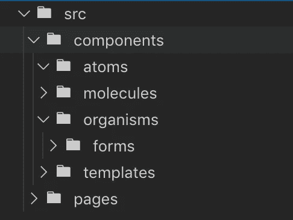

# 面向开发人员的原子设计:项目结构

> 原文：<https://betterprogramming.pub/atomic-design-for-developers-part-1-b41e547a555c>

## 了解如何使用原子设计来改进 UI 开发工作流

首先，如果你不知道什么是原子设计，我会在下面给你一个简单的介绍，但我建议你去布拉德·弗罗斯特的网站查看一下。

原子设计是 Brad Frost 的建筑设计系统方法论。这个想法是，我们可以采用生物的基本构件，并在此基础上给我们的 UI 一个层次结构。

Brad Frost 定义了 UI 组件的五个主要阶段:

1.  原子
2.  分子
3.  有机体
4.  模板
5.  页

*Atoms* 是 UI 最简单的形式，由标题、标签、输入框、按钮等组成。

*分子*是原子的组合，构成了我们用户界面中更复杂的部分，比如带有提交按钮的搜索栏。

生物体建立在分子之上，并协调 UI 的更大部分。这可以包括产品列表、标题、表格等。生物甚至可以包括其他生物。

模板是我们的页面开始汇集的地方，通过给我们所有的有机体和分子一个统一的目的来给它们上下文。例如，一个联系页面的模板将有用于标题和表单的有机体，以及用于文本字段和导航栏的分子。

*页面* **，**顾名思义，就是我们最后的页面及其所有内容。页面和模板的区别在于模板不提供任何内容。

# 本文的目标

我想介绍一种在您的开发工作流程中应用原子设计的方法，目的是使您的代码和项目结构更加可维护、可伸缩和直观。

此外，原子设计是一个框架，可以帮助弥合开发和设计之间的沟通鸿沟。开发者理解这一点很重要，这样他们就可以用统一的语言和设计师交流。

当组件被适当地分类后，团队会惊讶地发现他们的 UI 系统感觉更加直观和有组织。代码更容易维护，更新和重构更容易，新设计师和开发人员的入职成为一个更有效的过程。

# 通用项目结构

你们中的许多人可能熟悉下面的文件夹结构:

旧的容器/组件层次结构

这里的想法是，我们试图让组件尽可能地“哑”和无状态，而容器编排我们的组件并充当我们的页面。

我认为我们应该抛弃“容器”和“组件”的概念，原因如下:

1.  *不可扩展。我们只有两个桶来存放我们的 UI。当我们有 200 个组件和两个类别时会发生什么？没错。*
2.  *不直观。* 真的是什么容器？是一页吗？还是只是一个有状态的组件？两者在哪里相遇？
3.  *这是一个开发概念，而不是设计概念。如果我们说的是不同的语言，我们如何高效地与设计师合作？设计师不关心有状态和无状态，他们关心的是*应用和关系*。组件是如何使用的，它与 UI 的其余部分有什么关系？*

# 更好的项目结构

为什么我们不根据原子设计的阶段来构建我们的项目呢？

原子设计项目结构

请注意我们是如何将页面放到组件文件夹之外的。直观上，我们并没有把页面和其他四个阶段放在一个类别里。页面是最终的表现形式，而不是单个组件本身。

另外，我通常会在根 organisms 文件夹中创建一个`/forms`文件夹。表单非常常见，所以这是一个让你的文件夹结构更加精细的好方法。

那么，我们做这个小小的调整能得到什么呢？令人惊讶的是，很多！

1.  *统一设计和开发语言。* 既然大家都在使用相同的行话，那么与设计团队合作就容易多了。对于我的使用故事书的开发者来说，这甚至更有益。
2.  *可扩展的文件夹结构。* 我们现在已经为组件细化了类别。即使我们有 200 多个组件，保持我们的用户界面有组织也容易得多。
3.  *需要最少的项目背景。*通常，一个新的开发人员需要有大量的项目背景，以便找到他们需要的组件。有了原子设计，语言和结构更加通用，所以说:“嗯，一个头就是一个有机体，让我检查一下有机体文件夹。”
4.  *清洁剂代码。怎么，你问？嗯，原子设计迫使你更好地理解组件之间的关系。即使你从一个庞大、混乱、多功能的组件开始，当你开始思考:“好吧，我在哪里可以看到有机体、分子、原子等等”时，重构也是轻而易举的事情*

# 下一步是什么？

恭喜你，你的下一个 UI 项目有了一个坚如磐石的文件夹结构。就这些吗？

让我们快进几周。你有几个原子，几个分子，生活是美好的，你在想:“这真是太棒了！克里斯毕竟不是那么傻！”

但是你遇到了一个障碍…你正在构建一个复杂的组件，并且不确定它是一个有机体还是一个分子。分子可以有状态吗？分子什么时候变成有机体？就此而言，有机体和模板之间的界限在哪里？一个模板和一个页面？

在实践中，阶段之间的界限会变得模糊，所以在第 2 部分中，我们将看看如何在 React 项目中定义这些界限。

这部分到此为止，感谢阅读！