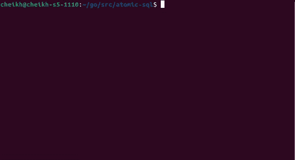

# Go 1.19 中的原子 MySQL 读写操作

> 原文：<https://betterprogramming.pub/atomic-mysql-read-write-operations-with-go-1-19-3bd04b11f888>

## 我保持事物同步的方法。


图片由 Mackenzie Marco 通过 unsplash 提供

你是否曾经在亚马逊上购买了一件商品，然后收到一封电子邮件，通知你由于没有存货，你的订单被取消了？

我试过几次。作为一个购买产品的消费者，这可能不是什么大事。阅读电子邮件并等待库存补充，然而，开发人员需要编写所有代码来支持该功能。

如果我告诉您，您可以通过同步读写来放弃实现这样的过程，那会怎么样？默认情况下，Go web 服务器是多线程的。每个请求都会产生一个 Go 例程。考虑到这一点，我们应该预测多线程环境中出现的错误。如本段开头所举的例子。

在这篇文章中，我将定义一个 HTTP 端点来执行特定商品的销售。销售过程将减少商品的数量，如果没有剩余的商品，它将返回一个错误。我将使用`github.com/go-sql-driver/mysql`作为我的数据库驱动程序。

# 设置 MYSQL

在编写任何 Go 代码之前，我将设置测试环境。请注意，本节显示的所有代码都是 MYSQL 命令。我将从定义一个名为`Stock`的 MYSQL 数据库开始:

```
CREATE DATABASE Stock;
```

接下来，我将添加一个包含两列的表格。一个用于产品 ID，另一个用于产品的库存数量:

```
CREATE TABLE `Inventory` (
 `ProductID` INT,
 `Count` INT COMMENT 'Will store product count'
) ENGINE=InnoDB;
```

该表将负责跟踪库存盘点。然后，我将向表中添加一个商品，库存数量为`1`:

```
INSERT INTO Inventory(ProductID, Count) VALUES (10, 1);
```

最后一件事，请确保您有 MySQL 凭证(用户名，密码)能够访问上面定义的表。

# Go 代码

首先，我将定义我的`app`类型，以及包含我将用来管理状态的字段。下面是`app`式:

```
type App struct {
  Db      *sql.DB
  mu      *sync.Mutex
  Timeout atomic.Bool
}
```

以下是每个字段的预期用途:

*   `Db`:存储 MySQL 数据库连接
*   `mu`:明星秀，将启用同步操作
*   `Timeout`:一个原子变量，稍后我将使用它来模拟较低的网络吞吐量。

一旦我定义了应用程序，就该初始化它并设置适当的字段了。我从 MySQL 驱动程序页面复制了示例代码来设置我的数据库连接。

之后，我将变量`db`赋给了我的结构字段`Db`。我将`mu`指定为一个指向互斥体的指针，这个变量在 main 函数中声明。这对于内存管理非常理想，因为当程序停止时，main 函数会返回。下面是主函数最初的样子:

```
func main() { db, err := sql.Open("mysql", "root:password@/**Stock**")
 if err != nil {
  log.Fatal(err)
 }
 var mu sync.Mutex db.SetConnMaxLifetime(time.Minute * 3)
 db.SetMaxOpenConns(10)
 db.SetMaxIdleConns(10) _ = App{Db: **db**, mu: &**mu**}
}
```

现在我有了一个基本的设置，是时候开始编写我的 HTTP 处理程序了。HTTP 处理程序将是一个类型为`App`的方法，因为这将允许我从处理程序中管理和访问状态。处理程序将调用另一个方法来执行销售操作。这个方法将被称为`PerformPurchase`。下面是处理程序的定义:

```
func (a *App) BuyItem(w http.ResponseWriter, r *http.Request) { id, amount, err := **GetQuery**(r) if err != nil {
    w.WriteHeader(http.StatusBadRequest)
    w.Write([]byte("Nope!"))
    return
  } ctx, _ := context.WithTimeout(r.Context(), 30*time.Second) err = a.**PerformPurchase**(ctx, id, amount) if err != nil {
    w.WriteHeader(http.StatusInternalServerError)
    w.Write([]byte("Nope!")) return
  } w.Write([]byte("Ok"))
}
```

处理程序调用的第一个函数是`GetQuery`。这是从请求中提取用户输入的函数。以下是`GetQuery`的代码:

```
func GetQuery(r *http.Request) (id int, amount int, err error) { amount, err = strconv.Atoi(r.FormValue("amount")) if err != nil {
   return
 } id, err = strconv.Atoi(r.FormValue("id")) if err != nil {
   return
 } return
}
```

如果传递了无效的整数，该函数将返回错误。这是防止 SQL 查询注入的理想方法。我选择使用命名变量来保持代码的整洁，想象一下每次我想做一个`return`时就写 3 个变量。最后，这里是`PerformPurchase`的定义:

```
const (
  **StockError** = "Stock is finished"
)func (a *App) **PerformPurchase**(ctx context.Context, id, amount int) error { if a.**Timeout**.Load() {
   time.Sleep(5 * time.Second)
 } rows, err := a.Db.QueryContext(
             ctx, 
             "SELECT Count FROM Inventory WHERE ProductID=**?**",    
            ** id**,
 ) if err != nil {
   return err
 }
 defer rows.Close() var **stock** int if rows.Next() {
   if err := rows.Scan(&**stock**); err != nil {
     // Check for a scan error...
     return err
   }
 } if **stock <= 0** {
   return errors.New(**StockError**)
 } _, err = a.Db.ExecContext(
       ctx, 
       "UPDATE Inventory SET Count = Count - ? WHERE ProductID = ?",
        amount, 
        id,
 )

 if err != nil {
   return err
 } return nil}
```

如您所见，前面声明的`Timeout`字段用于强制函数等待 5 秒钟。这是为了模拟执行第一个 MySQL 查询时可能出现的低网络吞吐量。我将在下一节回到这个领域。

该函数检索商品的记录并检查库存数量是否大于 0，如果不是，它将返回一个错误。如果 stock 高于 0，该函数将执行一个查询来更新库存数量，减少请求中指定的数量。现在我的应用程序组件已经定义好了，我将编写一个测试来执行两个同时的购买请求。

这是主函数的最终版本，带有`http`的附加功能:

```
func main() { db, err := sql.Open("mysql", "root:password@/Stock")
 if err != nil {
  log.Fatal(err)
 }
 var mu sync.Mutex db.SetConnMaxLifetime(time.Minute * 3)
 db.SetMaxOpenConns(10)
 db.SetMaxIdleConns(10) app := App{Db: db, mu: &mu} http.HandleFunc("/buy", app.BuyItem)
 log.Fatal(http.ListenAndServe(":8080", nil))
}
```

# 测试

测试将首先执行`PerformPurchase`作为 Goroutine。对于这个调用，`Timeout`将被设置为 true，这将使 Go 例程在执行前等待 5 秒钟。同样，这是为了模拟一个糟糕的网络。在这 5 秒钟内，我将调用主线程上的`PerformPurchase`并检查消息`Stock is finished`中的错误。如果没有错误或返回另一个错误，测试将失败。下面是我的测试代码:

```
func TestPerformPurchase(t *testing.T) { db, err := sql.Open("mysql", "root:password@/Stock")
 if err != nil {
   log.Fatal(err)
 } var mu sync.Mutex app := App{Db: db, mu: &mu} ctx := context.Background() // Launch buy
 app.**Timeout**.Store(**true**)
 **go app.PerformPurchase**(ctx, 10, 1) // Timeout would be false for first invocation without this
 time.Sleep(2 * time.Second) app.**Timeout**.Store(**false**)
 err = app.**PerformPurchase**(ctx, 10, 1)
 if err **==** nil || err.Error() **!=** StockError {
  t.Fatalf("expected error %v, but got %v", StockError, err)
 }}
```

现在进行测试:



正如您在第一个测试中看到的，第二次调用`PerformPurchase`返回了成功，尽管它是最后调用的。提示测试失败。测试在第二次运行时也通过了。魔法测试是一个可怕的迹象，在这种情况下，它通过了，因为`Count`列已经被设置为 0，并将返回期望的错误。为了解决这个问题，我将返回到函数`PerformPurchase`并在函数的开头添加一个锁。我将用下面的代码来实现这一点:

```
func (a *App) PerformPurchase(ctx context.Context, id, amount int) error { a.mu.Lock()
 **defer** a.mu.Unlock()
 ...
}
```

通过推迟解锁互斥体的调用，我可以避免由于代码崩溃或提前返回而导致的任何死锁。在重新测试之前，我将更新`Inventory`表，将项目计数设置回 1。这将防止假阳性的发生，正如第一次测试所观察到的那样。下面是运行中的新代码:


如果你注意到了，测试花了大约 5 秒，和我的超时时间一样。

# 结论

解决这个问题还有其他方法。一种方法是让 SQL 查询为您执行所有这些检查，或者更新数据库设置以适应您的用例。然而，并不是每个人都在使用 SQL，所以我提供了一个应用程序级的解决方案。

可以与其他数据库提供商互换的解决方案。我知道这种解决方案在 Kubernetes 这样的环境中是无效的，因为那里有多个独立的应用程序实例在运行。在这种情况下，分布式锁将是解决方案，这也将是我下一篇文章的主题。你可以在这里找到这篇文章[使用的代码。](https://github.com/cheikhshift/medium_examples/tree/main/atomic-sql)

# 参考链接

[](https://wtools.io/generate-sql-create-table) [## 创建表格-在线 MySQL 生成器

### 该表单允许您为创建表生成 sql:生成您生成的 sql 可以在下面看到。贝塔-它的意思是…

wtools.io](https://wtools.io/generate-sql-create-table) [](https://github.com/go-sql-driver/mysql) [## GitHub-Go-SQL-Driver/mysql:Go MySQL Driver 是一个用于 Go(golang)数据库/sql 的 MySQL 驱动程序…

### 一个 MySQL-Driver for Go 的数据库/sql 包轻量级和快速的原生 Go 实现。没有 C 绑定，只是纯粹的 Go…

github.com](https://github.com/go-sql-driver/mysql)