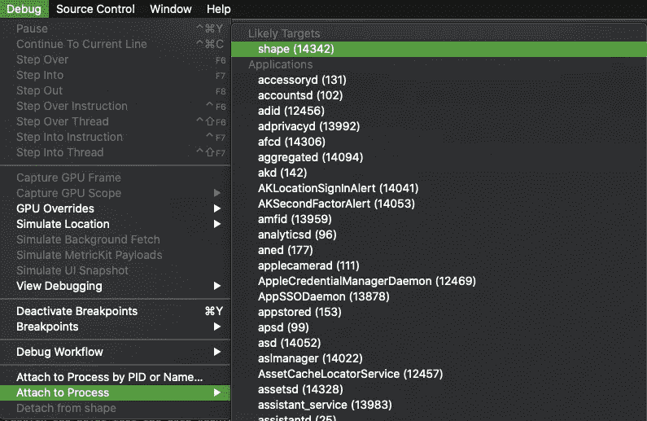
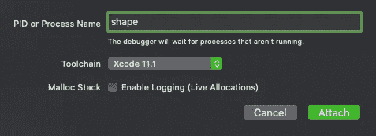
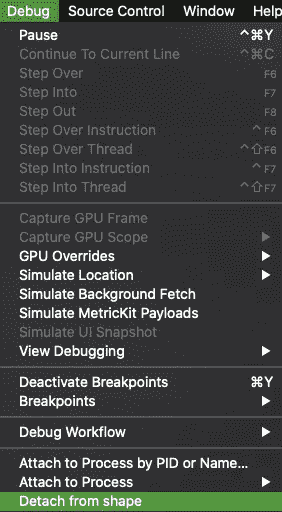

# 随时为你的 iOS 应用添加一个调试器

> 原文：<https://betterprogramming.pub/attach-a-debugger-to-your-ios-app-whenever-you-want-feca0c4f336b>

## 使用调试器，不管你的应用程序是否在模拟器中运行

Alexandre Debiève 在 [Unsplash](https://unsplash.com/s/photos/electronics?utm_source=unsplash&utm_medium=referral&utm_content=creditCopyText) 上的照片

我一直想知道如何附加调试器，即使它不是直接从 XCode 运行。事实上，有一种方法可以做到这一点，而且很容易做到——就像在 Android Studio 的 XCode 中一样。

## 连接到运行应用程序的**的步骤**

1.  应用程序应该处于运行模式，无论是在模拟器上还是在设备上。
2.  从 XCode 菜单中选择调试选项。
3.  选择附加到进程。
4.  它将在可能的目标部分显示正在运行的进程 ID 和应用程序的名称。
5.  附加到上面，就像正常的调试一样，它应该可以工作。

在这里，我的应用程序名称是形状，所以在可能的目标部分，我得到的选项。如果有多个应用程序正在运行，那么要附加到特定应用程序，可以在 XCode 中获得该特定项目窗口的进程 id。

## 应用程序已安装但未处于运行模式时的连接步骤

1.  应用程序安装在模拟器或设备上。
2.  从 XCode 菜单中选择调试选项。
3.  选择按 PID 或名称附加到进程。
4.  您将看到一个弹出窗口，通过输入 PID 或名称，您可以连接到调试器。

一旦你开始写应用程序名称，你会得到下拉菜单，以方便选择该选项

5.连接后，您将能够在 XCode 窗口的导航栏中看到等待模式的状态。在调试区域中，调试选项将被设置为启用:

6.打开应用程序后，它将显示为正在运行:

**要分离到调试模式，您会在附加过程的正下方看到一个选项:**

XCode 中有许多调试额外好处和许多有趣的选项。您可以在调试过程中四处玩耍，做一些有趣的事情。