# 解决 AWS Lambda 上的 AttributeError

> 原文：<https://betterprogramming.pub/attributeerror-on-aws-lambda-dca8a62dcca6>

## 无缝迁移到云

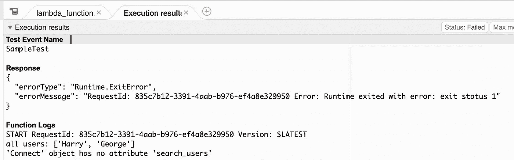

客户端对象—属性不存在

你是否曾经在本地处理过一个脚本，并且发现当它迁移到 AWS Lambda 时，你得到的结果与预期的不同？在下面的博文中，我将介绍一个例子，Boto3 客户端 API 可以在本地工作，但不能在 AWS Lambda 上工作，具体来说，我将介绍如何调试客户端对象 AttributeError。

# 先决条件

*   AWS 帐户
*   Python3/Pip
*   Boto3

# **代码演练**

在本演练中，我将对 Amazon Connect 实例进行 API 调用。错误本身并不特定于这个 AWS 资源。如果您想了解 Amazon Connect 实例，那么它所需要的只是几个用户(在我的例子中，我创建了两个)和实例本身的创建。

```
#example.py - vscode local script

import boto3

#initialize env var
connect_instance_id = "c1febbea-7409-4221-b374-333def95aacc"

#initialize client
connect = boto3.client("connect")

def filter_users_by_value(value_to_filter, comparison_type):
 response = connect.search_users(
  InstanceId=connect_instance_id,
  SearchCriteria={
   "StringCondition": {"FieldName": "Username","Value": value_to_filter,"ComparisonType": comparison_type}
  }
  )["Users"]

 usernames_arr = list(map(lambda x: x["Username"], response))
 return usernames_arr
```

在上面的代码片段中，我们导入了 boto3 库，并初始化了一个 connect 客户端对象来访问 Amazon Connect 的资源。我将在这个演示中使用的 API 是 connect 中的`list_users`和`search_users`。

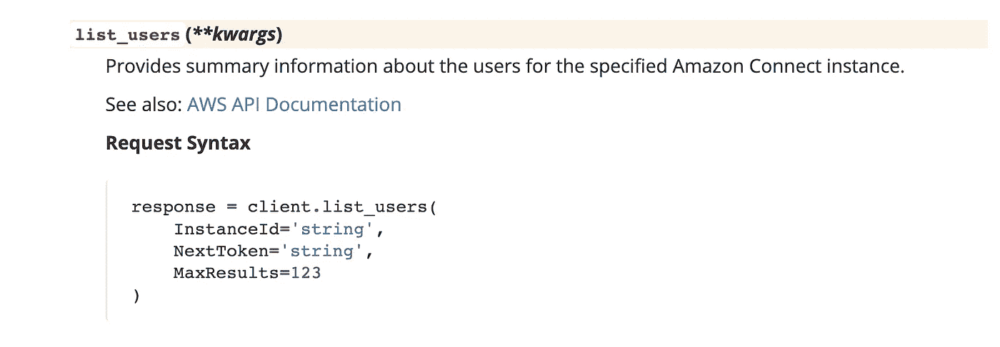

connect client list _ users()API boto 3 文档

```
def get_all_users():
 try:
  response = connect.list_users(
   InstanceId=connect_instance_id,
   MaxResults=100
  )["UserSummaryList"]

  all_usernames_arr = list(map(lambda x: x["Username"], response))
  return all_usernames_arr
 except Exception as err:
  print(err)
  exit(1)
```

上面定义的函数将使用`list_users()` API 检索多达 100 个用户的列表，并过滤响应以返回该列表中每个用户的用户名列表。

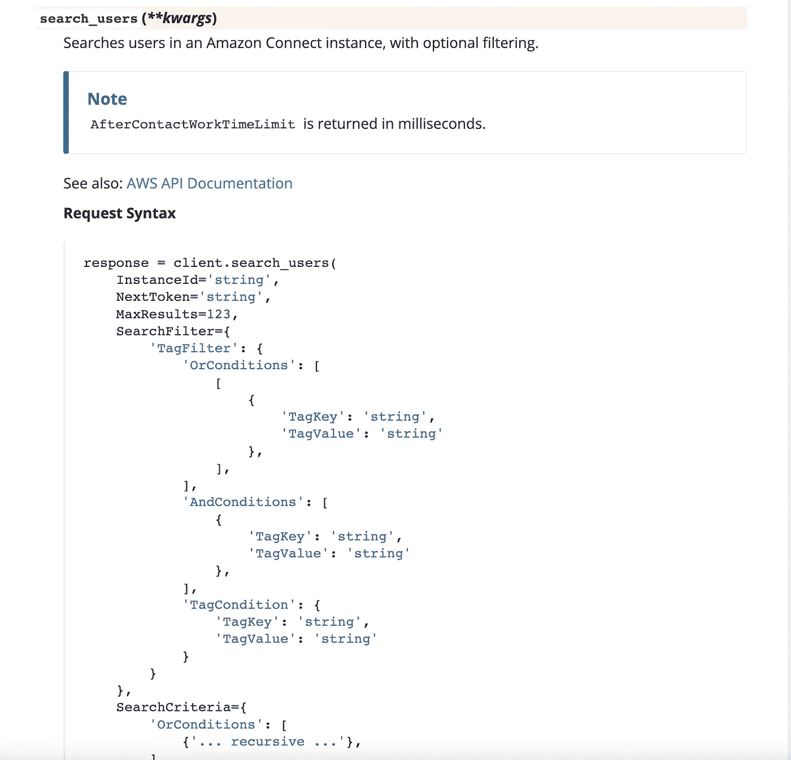

连接客户端 search_users() api boto3 文档

```
def filter_users_by_value(value_to_filter, comparison_type):
 try:
  response = connect.search_users(
   InstanceId=connect_instance_id,
   SearchCriteria={
    "StringCondition": {"FieldName": "Username","Value": value_to_filter,"ComparisonType": comparison_type}
   }
   )["Users"]

  usernames_arr = list(map(lambda x: x["Username"], response))
  return usernames_arr
 except Exception as err:
  print(err)
  exit(1)
```

`filter_users_by_value`函数将使用`search_users()` api 检索满足应用于搜索的过滤条件的用户列表。然后，我们使用该映射过滤该响应，以返回从 API 调用返回的每个用户的用户名列表。

```
def main():
 all_users = get_all_users()
 print(f"all users: {all_users}")
 print("")

 filtered_value, filter_condition = "G", "STARTS_WITH"
 filtered_usernames_arr = filter_users_by_value(filtered_value, filter_condition)
 print(f"Usernames that {filter_condition} {filtered_value}: {filtered_usernames_arr}")
 print("")

 filtered_value = "H"
 filtered_usernames_arr = filter_users_by_value(filtered_value, filter_condition)
 print(f"Usernames that {filter_condition} {filtered_value}: {filtered_usernames_arr}")

if __name__ == "__main__":
 main()
```

主程序将首先执行`list_users()` API，然后针对两种不同的过滤条件分别执行`search_users()` API。这段代码是同步运行的。

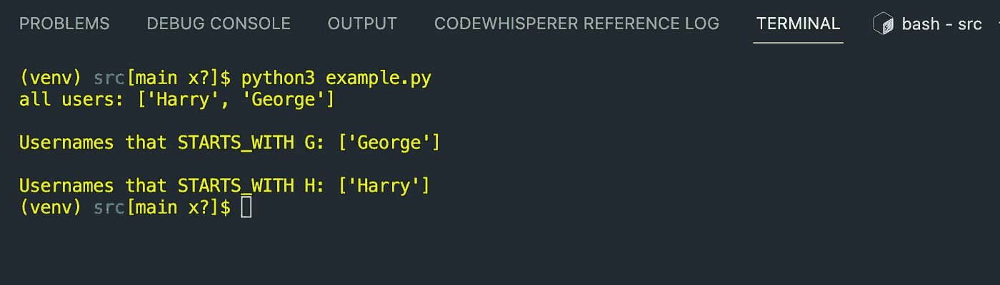

vscode 脚本执行

我们看到在这个例子中总共有 2 个用户，我们成功地获得了所有以 G 开头的用户和以 h 开头的用户。

# AWS Lambda 代码演练

在本地运行这段代码时，我们看到三次执行都成功返回了预期的结果，太棒了！现在将这段代码导入 AWS Lambda。(这里我用 python3.9 运行时、arm64 架构、128 MB 内存和基本 lambda 执行创建了一个通用 Lambda)。

```
import os

import boto3

#initialize env var
connect_instance_id = os.environ["connect_instance_id"]

#initialize client
connect = boto3.client("connect")

def get_all_users():
 try:
  response = connect.list_users(
   InstanceId=connect_instance_id,
   MaxResults=100
  )["UserSummaryList"]

  all_usernames_arr = list(map(lambda x: x["Username"], response))
  return all_usernames_arr
 except Exception as err:
  print(err)
  exit(1)

def filter_users_by_value(value_to_filter, comparison_type):
 try:
  response = connect.search_users(
   InstanceId=connect_instance_id,
   SearchCriteria={
    "StringCondition": {"FieldName": "Username","Value": value_to_filter,"ComparisonType": comparison_type}
   }
   )["Users"]

  usernames_arr = list(map(lambda x: x["Username"], response))
  return usernames_arr
 except Exception as err:
  print(err)
  exit(1)

def lambda_handler(event, _):
 all_users = get_all_users()
 print(f"all users: {all_users}")
 print("")

 filtered_value, filter_condition = "G", "STARTS_WITH"
 filtered_usernames_arr = filter_users_by_value(filtered_value, filter_condition)
 print(f"Usernames that {filter_condition} {filtered_value}: {filtered_usernames_arr}")
 print("")

 filtered_value = "H"
 filtered_usernames_arr = filter_users_by_value(filtered_value, filter_condition)
 print(f"Usernames that {filter_condition} {filtered_value}: {filtered_usernames_arr}")
```

与本地脚本的不同之处在于`main()`已被重命名为`lambda_handler()`，并且末尾的 if-check 已被移除(因为这是一个单文件脚本)。我还将 connect_instance_id 移动到环境变量中，并使用`os.environ`来访问它的值。其他一切都保持不变。

# AWS Lambda 权限

为了让 lambda 服务正确地执行上述代码，我们需要确保我们为 lambda 执行角色(或附属于该 Lambda 的 IAM 角色)提供了正确的权限。

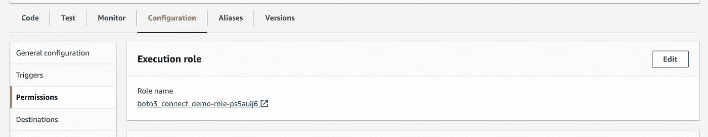

λ权限

为了找到附加到 lambda 的角色，在 Lambda 控制台上，单击所选功能的 Configuration 选项卡并导航到 Permissions。然后点击角色名称。

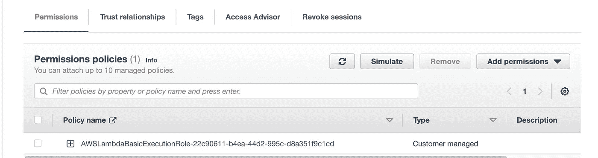

IAM 角色权限策略

这将导航到 IAM 中的角色。在权限策略下，我们现在可以添加一个新的权限策略，或者通过单击链接并点击 *edit* 来编辑现有的权限策略。

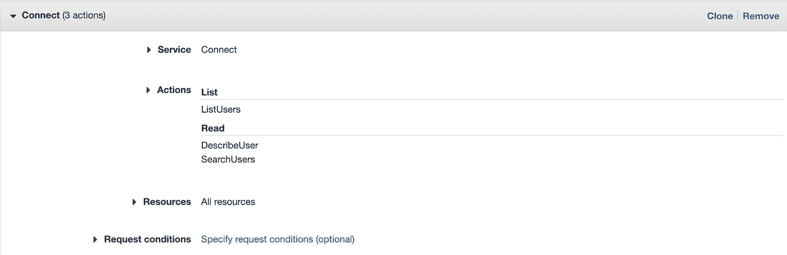

连接服务权限

我们需要提供的权限如上所示。它们对应于

*   `connect:ListUsers`
*   `connect:DescribeUser`
*   `connect:SearchUsers`

如果愿意，我们可以将资源限制为仅指向这一个特定的实例，但是出于演示的目的，我将它设置为所有资源。

# Boto3 属性错误

现在，当执行这个脚本时，我们会看到不同的结果。

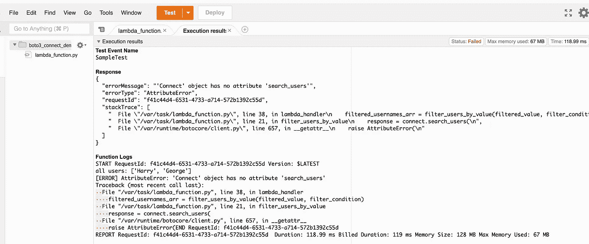

属性错误

如函数日志所示，`list_users()` API 已经成功执行，并获得了我们期望的结果。尽管`search_users` API 返回了一个有点模糊的`AttributeError` …当我们在 boto3 文档中清楚地看到它时，我们的 connect client 对象怎么会没有 search_users 属性呢？

需要注意的一点是，文档页面将指向该库的最新版本，或者有时只是落后几个补丁版本(因此，尽管版本 1.26.8 可以下载，但文档可能暂时仍指向 1.26.78)。

文档的当前版本明确显示在页面的左上角。

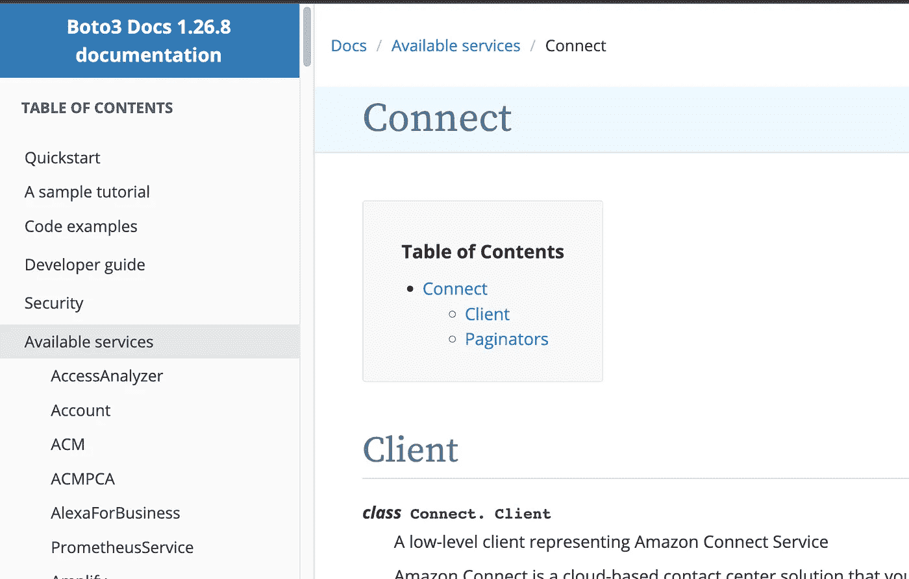

在撰写本文时，boto3 文档指向版本 1.26.8。

现在让我们看看我们的本地环境指向什么版本的 boto3。

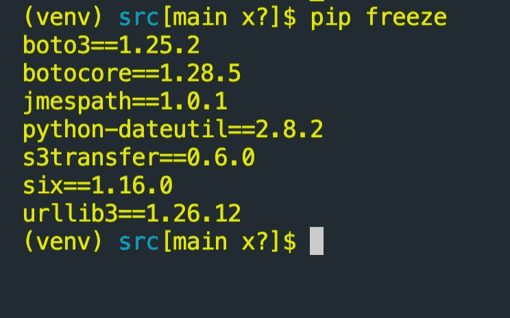

vscode: boto3 ==版本 1.25.2

运行 pip freeze 命令，我们可以看到 boto3 指向我的本地机器上的版本 1.25.2。

虽然我的本地 boto3 包没有指向当前可用的 boto3 库的最新版本，但它仍然指向一个可以访问脚本中使用的特性/API 的版本。

**注意:**要在本地升级 boto3，请运行以下命令

```
pip install boto3 --upgrade
```

这将使 boto3 指向最新版本，在本例中是 1.26.8

现在来看看 boto3 AWS Lambda 指向什么版本。


Lambda 运行时(AWS 文档):[https://docs . AWS . Amazon . com/lambda/latest/DG/lambda-Runtimes . html](https://docs.aws.amazon.com/lambda/latest/dg/lambda-runtimes.html)

参考 AWS 文档，我们看到对于所有三个可用的 python 运行时，SDK、boto3 指向版本 1.20.32！与我们的 1.25.xx 和当前版本 1.26.xx 相比，这是一个很大的差异，因为从 1.20.xx 到 1.26.xx 的变化表明发生了 6 个较小的版本变化。这意味着从 boto3 版本 1.20.xx 开始，公共 API 功能已经被废弃、添加或改进

确认 boto3 在 lambda 上指向 1.20.32 版本的一种方法是在 boto3 库上使用 version dunder 方法并打印它。

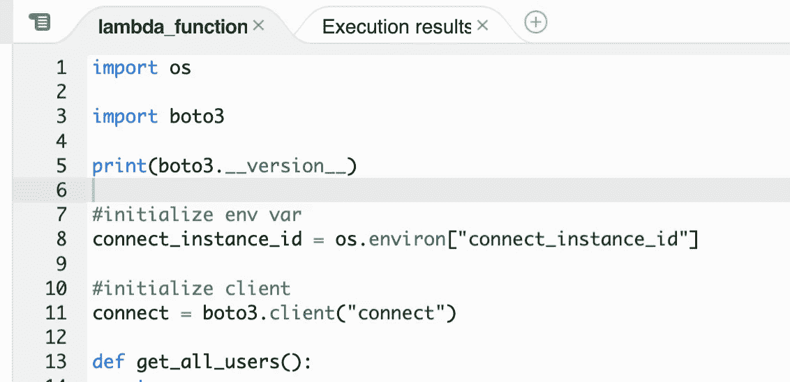

第 5 行—调用 boto3 导入的 dunder version 方法

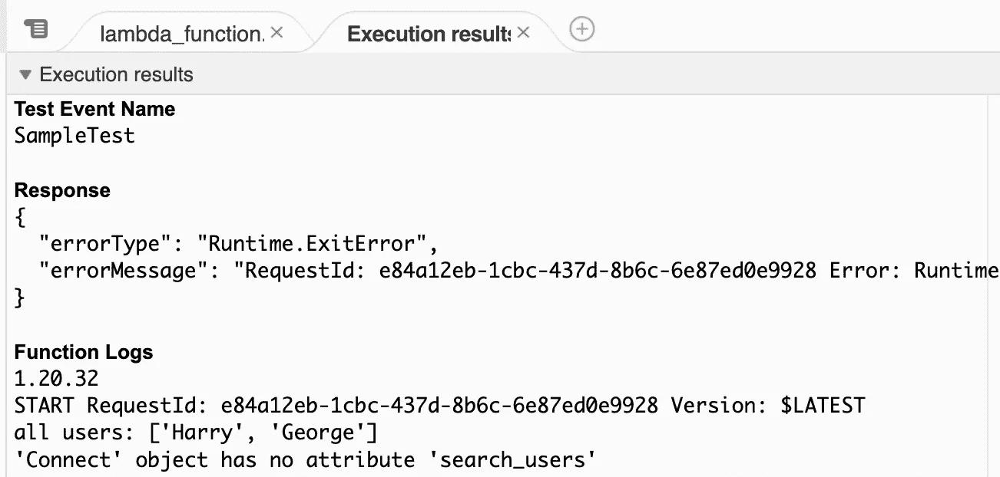

“Function Logs”下面的第一个日志对应于我们的第一个 print 语句，它在第 5 行，因此`print(boto3.__version__)`输出 1.20.32，并确认了我们在文档中已经看到的内容。

因此，boto3 库的新版本必须考虑这个属性错误。由于 boto3 的 1.20.32 版本(AWS Lambda 当前支持的版本)中不存在`search_users`属性，为了更新 boto3 以指向最新版本，我们需要创建一个层。

# AWS 层

Lambda 层是一个. zip 文件，它遵循特定的文件结构，并提供了一种打包库和其他可用于 Lambda 函数的外部依赖项的方法。

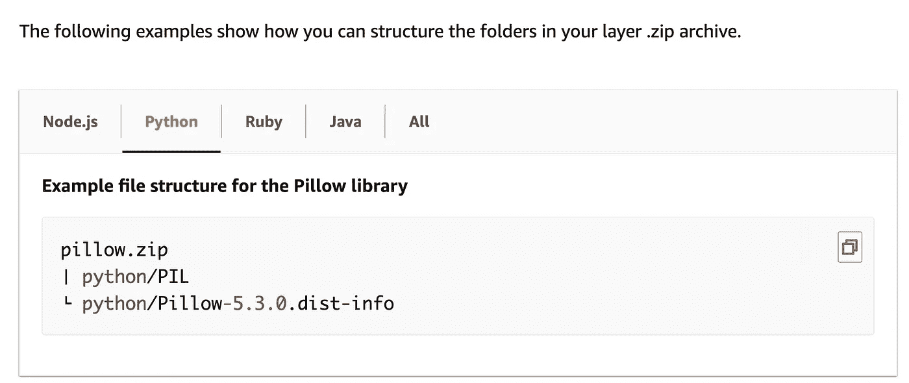

创建图层(Python)——[https://docs . AWS . Amazon . com/lambda/latest/DG/configuration-Layers . html](https://docs.aws.amazon.com/lambda/latest/dg/configuration-layers.html)

要为 python 创建一个图层，我们首先需要创建一个 python 目录。嵌套在里面的是我们想导入 Lambda 服务的包。这个 python 目录需要压缩，然后上传到 AWS Lambda。

下面的代码展示了使用 bash 在当前目录中创建 boto3 层的执行步骤。

```
#!/bin/bash
mkdir python
pip install boto3 -t ./python
zip -r boto3-pkg.zip python
```


创建 boto3 层

要在 AWS 上添加层，首先转到 AWS Lambda 控制台。然后导航到侧面菜单的图层，点击*创建图层*。

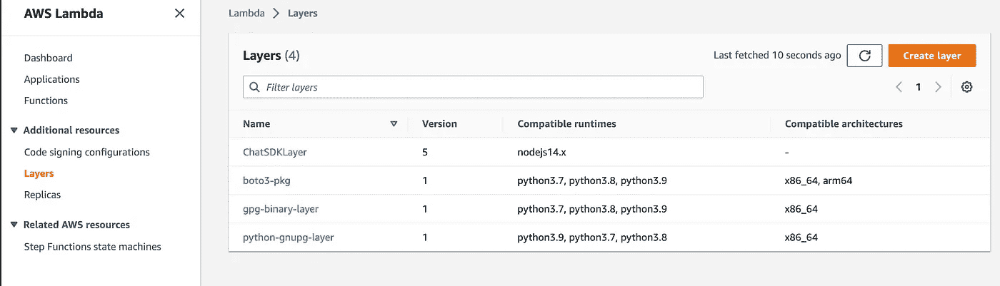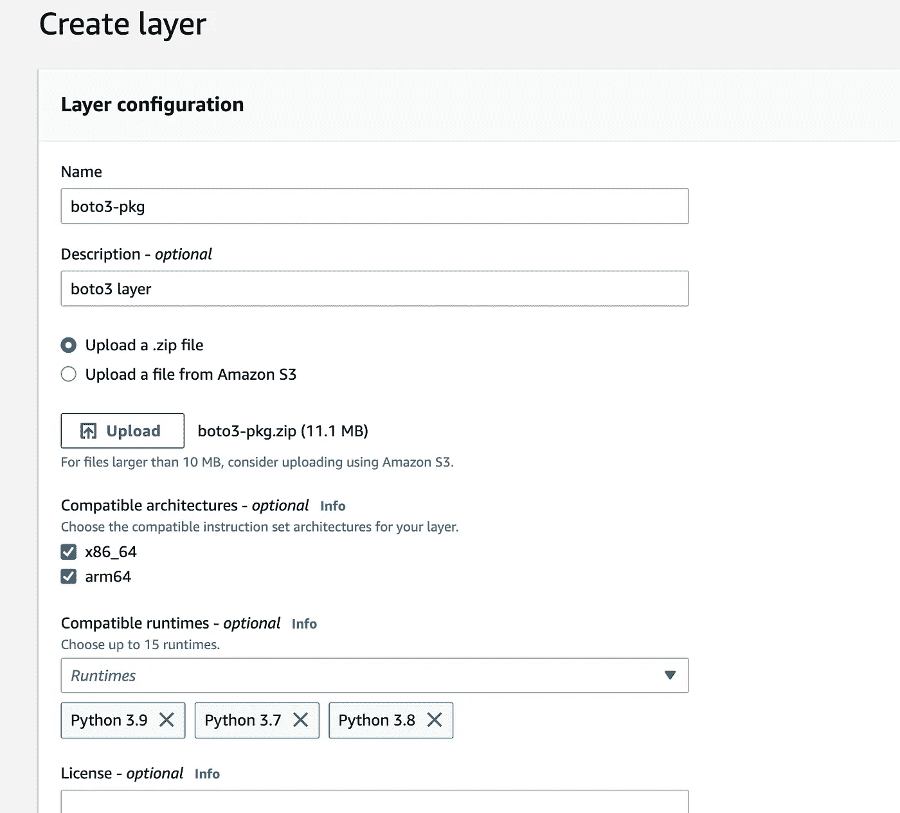

**注意:**对于大于 10 MB 的 zip 文件，AWS 建议首先将 zip 文件上传到 S3 桶，然后使用*从亚马逊 S3* 上传文件，并向该压缩的 S3 对象提供 S3 URI，以便创建层。

该层实际上最终为我创建了手动上传，尽管大于 10 MB。为了完整起见，一旦 S3 URI 上传到 S3 桶，我将显示在哪里可以得到它。

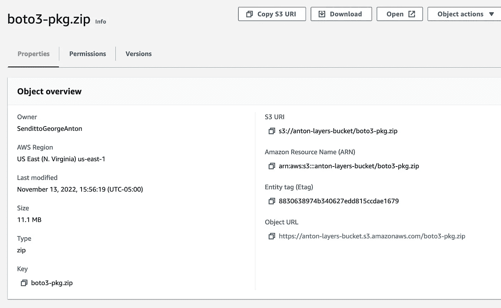

点击 S3 上的对象可以找到 S3 Uri—S3://<bucket-name>/<zip-file-name></zip-file-name></bucket-name>

现在我们的层已经创建好了，是时候把它添加到我们的 Lambda 中了。

回到 Lambda 控制台，在 functions 下，选择感兴趣的函数后，向下滚动并点击 *Add a layer* 。

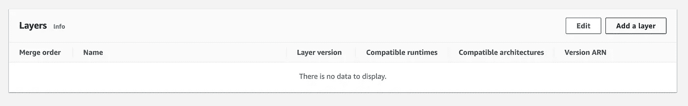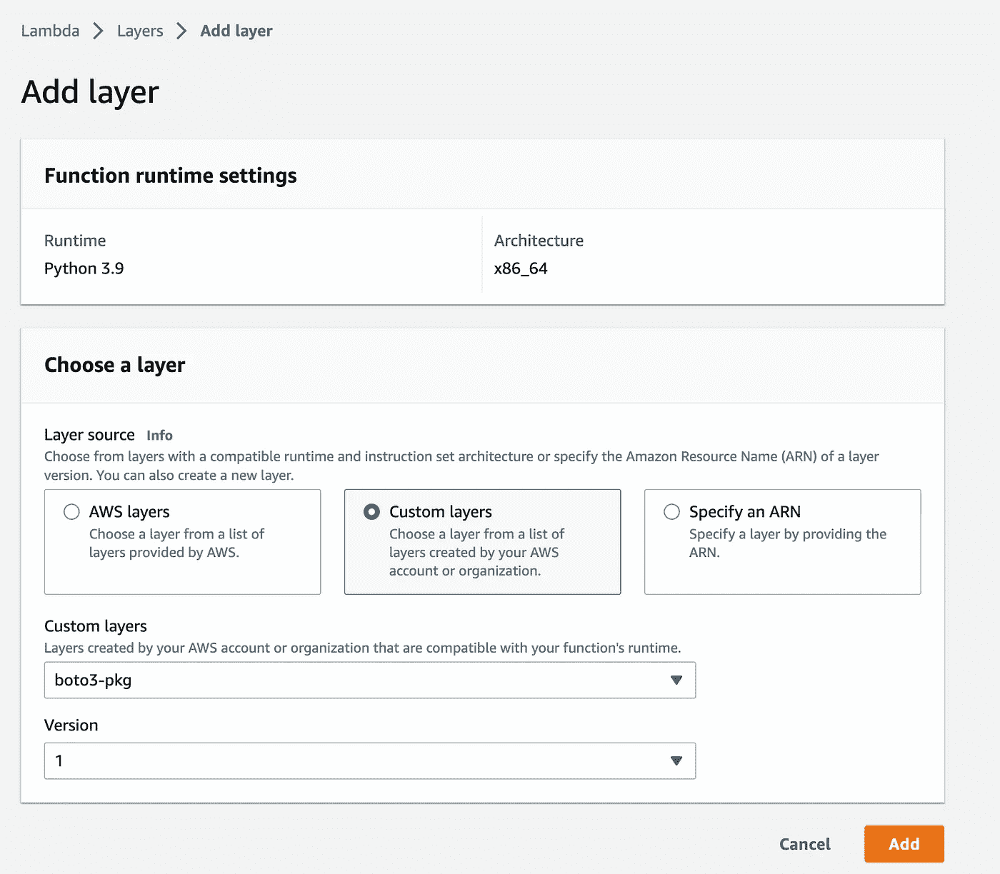

现在选择*自定义图层*，会出现两个下拉菜单。首先，选择给 boto3 层的 zip 文件的名称。其次，如果这是第一次创建这个层，它将自动填充下拉列表中的版本 1。否则，选择最新版本将指向对该层所做的最新更改。剩下的就是点击*添加*

现在这个层已经关联到这个 lambda，当 Lambda 启动容器加载库并运行代码时，层中提供的库将优先于 AWS Lambda 的内置库。

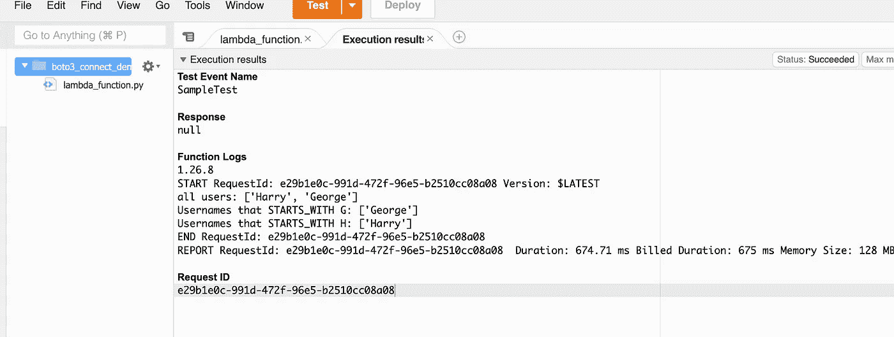

再次执行 lambda，我们看到 boto3 现在指向最新版本(在编写本文时对应于版本 1.26.8)！此外，我们的`AttributeError`已经解决，我们的结果现在也与我们在当地环境中看到的结果相匹配。

# 外卖食品

重要的是要确保在本地开发和迁移到云中时，所使用的依赖项在两个环境中都指向相同的版本。

感谢您的阅读！

也可以随时在 LinkedIn 上与我联系！

# 资源

*   [https://docs . AWS . Amazon . com/lambda/latest/DG/lambda-runtimes . html](https://docs.aws.amazon.com/lambda/latest/dg/lambda-runtimes.html)
*   [https://boto 3 . Amazon AWS . com/v1/documentation/API/latest/index . html](https://boto3.amazonaws.com/v1/documentation/api/latest/index.html)