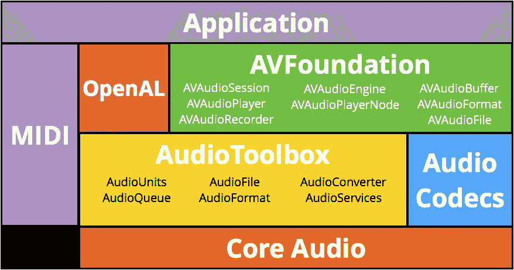
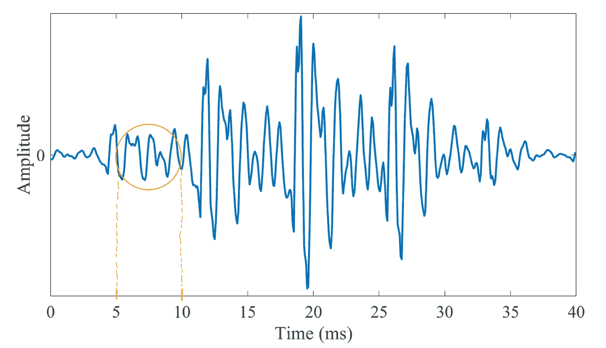
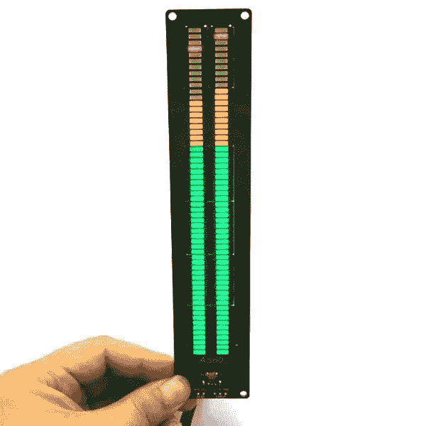
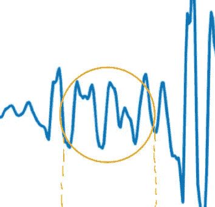
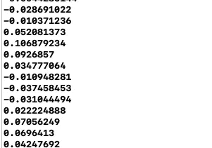
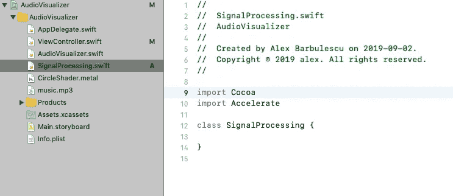
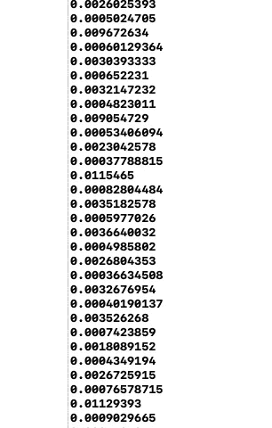
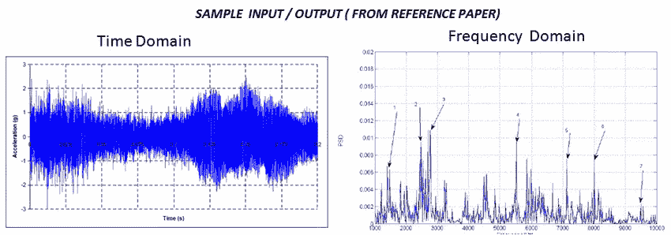
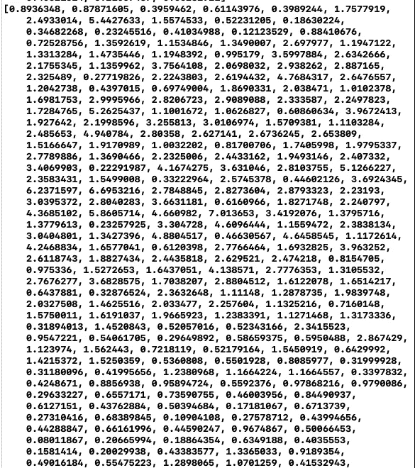

# 使用 Metal 和 Accelerate 在 Swift 中实现音频可视化(第 1 部分)

> 原文：<https://betterprogramming.pub/audio-visualization-in-swift-using-metal-accelerate-part-1-390965c095d7>

## 信号处理


我们都见过各种形式的音频可视化，但是我们如何在 Cocoa 应用程序中实现呢？如果你对数字格式的信号处理或音频没有什么了解，本教程非常适合你。本教程将帮助您导航和理解苹果的加速框架，以及如何将图形渲染到屏幕上。


这个项目直接建立在我之前的教程之上:

[](https://medium.com/@barbulescualex/making-your-first-circle-using-metal-shaders-1e5049ec8505) [## 使用金属着色器创建第一个圆

### 一般来说，一开始使用金属框架和着色语言会让人不知所措，但是它并没有…

medium.com](https://medium.com/@barbulescualex/making-your-first-circle-using-metal-shaders-1e5049ec8505) 

不幸的是，该教程已经是 19 分钟的读物了，因为对于本教程的实际可视化部分来说，有许多基础知识是必不可少的，所以这次我不会深入讨论这些概念。如果你想继续学习，请阅读前面的教程。

本教程分为两部分——输入(信号处理)和输出(可视化)。

本教程的目的是:

a)建立对音频处理如何工作的直觉

b)提高我们使用金属的技能

老实说，一旦我们到了可视化部分(教程的第二部分)，我们会看到我们方法的一些缺点。这将在第二部分进一步阐述。但是希望，在这些教程结束时，你将能够识别缺点，并提出你自己的变通办法和解决方案。不幸的是，在这篇“初学者”教程中，我无法深入涵盖围绕音频可视化的所有错综复杂的内容。

所以留下来，准备学习一些新的东西，希望你可以带走所有必要的技能，做任何你想做的事情，包括音频可视化。

# 项目要求

嗯，什么是音频可视化？从技术角度来说，它是指您使用音频信号中的标记(如音量和频谱)来产生特定的视觉效果(实时)。

我们今天将制作的音频可视化工具类型将由一个圆形缩放(弹跳)到当前音量和频率线组成，描述不同频率仓的平均幅度。如果你不知道我刚才说了什么，不要担心，后面会讲到。

这个问题可以分成两部分:输入和输出。

## **输入**

对于输入，我们需要以离散的间隔对音频信号进行采样，并执行一些数学运算来提取我们想要使用的标记。

现在，我们应该有两个问题:

*   我们如何对音频信号进行采样？
*   我们如何快速地对数据执行操作？

为了对音频信号进行采样，我们将使用 AVFoundation 的 AVAudioEngine 类，该类允许我们设置一个回调，在该回调中，我们将以离散的时间间隔从音频信号接收缓冲数据。为了处理音频信号，我们将使用 Accelerate 框架，该框架用于基于高性能 CPU 的计算。

## **输出**

我们有我们的投入；现在怎么办？我们必须把它呈现在屏幕上！从技术上来说，你可以使用任何你想要的视觉效果(CALayer/Shape 或者甚至是一个普通的 UIView)，但是它在性能上会很糟糕。因此，我们将把输入传递到图形管道并在我们的着色器函数中处理显示就不足为奇了！

因此，在高层次上，我们需要:

1.  设置音频引擎
2.  在主混音器节点上设置一个抽头以获取缓冲区数据
3.  在 CPU 上处理音频缓冲数据
4.  沿着图形管道把它送到 GPU

是时候开始了😄

## 建立

项目启动代码在我的 Github [这里](https://github.com/barbulescualex/MetalAudioVisualizer)。

这里和[之前的](https://medium.com/@barbulescualex/making-your-first-circle-using-metal-shaders-1e5049ec8505)教程的成品没有太大区别。我已经将 MetalCircleView 类重命名为 AudioVisualizer，以便更好地与本教程保持一致。我还包含了一个 music.mp3 文件，它将包含我们将要可视化的音频。你想换什么都可以。

我选择了一首 EDM 歌曲，因为它更好地展示了我们正在做的事情背后的力量。我们将在 signal processing 类中进行所有的信号处理，在 AudioVisualizer 类中使用 ViewController 类作为两者之间的媒介进行所有的金属处理。

花些时间查看一下启动代码。如果你运行这个程序，你应该会得到上次在蓝色背景上的美丽的白色圆圈！

# 第 1 部分:获取输入(信号处理)

我们将在 ViewController 类中完成这一部分的前半部分。在这里，我们希望实例化我们的 AVAudioEngine，从中获取必要的信息，并将其传递给我们的 SignalProcessing 类——这是我们将在这一部分的后半部分工作的地方。

## 第 1 部分:音频引擎和音频数据的工作原理



来源:[https://www . raywenderlich . com/5154-avaudioengine-tutorial-for-IOs-getting-started](https://www.raywenderlich.com/5154-avaudioengine-tutorial-for-ios-getting-started)

那么我们如何在 Cocoa 应用程序中播放音乐呢？我们使用 AVFoundation 框架。我们对玩家职业的类型只有一个要求。我们需要取回当前的音频数据，以便进行处理。AVPlayer 和 AVAudioPlayer 貌似不错；它们很容易使用，在堆栈溢出的一分钟内，你可以复制粘贴你的应用程序中的音频！

不幸的是，这些类不支持音频数据点击。接下来我们有 AVAudioEngine，一个更加通用的基于节点的类。它支持音频数据抽头吗？没错。我们也可以直接使用 CoreAudio，它也支持音频 taps。虽然这并不可取…但对我们的目的来说，复杂程度太高了。

[AVAudioEngine](https://developer.apple.com/documentation/avfoundation/avaudioengine)

*一组相连的音频节点对象，用于生成和处理音频信号，并执行音频输入和输出。*

它是如何工作的？这个类可以被认为是一个图。默认情况下，我们有一个连接到输出节点(设备的默认音频输出播放器)的 mainMixerNode。要播放音乐，我们需要将一个播放器节点连接到 mainMixerNode，并告诉该节点播放一种声音。但不止于此！

[**AVAudioNode**](https://developer.apple.com/documentation/avfoundation/avaudionode)

*音频生成、处理或 I/O 块的抽象类。*

AVAudioNode 类型是我们可以附加到音频引擎的类型。AVAudioNode 是不同类型节点的父类，您可以以任何方式附加这些节点来产生、处理(添加效果)和输出。对于我们的例子，我们只需要一个`[AVAudioPlayerNode](https://developer.apple.com/documentation/avfoundation/avaudioplayernode)`来播放我们的音乐。节点有输入总线和输出总线，总线在节点之间传输数据，所以它们可以被认为是连接点。

让我们看看一旦将它添加到我们的项目中，它会是什么样子。我们将进入 ViewController 类，首先设置引擎本身。

在 ViewController 类内部

如您所见，我们首先导入了 AVFoundation 库，添加了引擎作为 ViewController 类的实例属性，然后启动了它。现在`_ = engine.mainMixerNode`似乎是一条奇怪的线，但是我们知道 AVAudioEngine 有一个默认的 mainMixerNode 连接到默认的输出节点。可能不太明显的是，因为它是单例的，所以只有当我们第一次访问它时，它才会被初始化。

接下来，让我们添加我们的播放器，看看我们是否可以播放一些音乐！

在视图控制器类内部

如果您运行该程序，您应该会看到我们上一个教程中的美丽圆圈，并听到您的 music.mp3 文件。

现在让我们获取正在播放的音频数据。这是使用 AVAudioNode 的实例方法`[installTapOnBus](https://developer.apple.com/documentation/avfoundation/avaudionode/1387122-installtap)`来完成的。

```
**func** installTap(onBus bus: AVAudioNodeBus, bufferSize: AVAudioFrameCount, format: AVAudioFormat?, block tapBlock: **@escaping** AVAudioNodeTapBlock)
```

*这在总线上安装了一个音频抽头来记录、监控和观察节点的输出。*

onBus——描述您想要从哪个*输出*总线获取数据(因为节点有时可能有多条总线)。0 总是一个安全的赌注，因为通常只有一个输出总线。在节点之间建立连接时，还有各种函数重载，您可以在这些重载中指定要建立连接的总线。

bufferSize —描述您想要从音频数据中取回的字节数。

format —对我们来说是 nil，它会自己找出答案

block —这是回调中传递的数据，由 AVAudioPCMBuffer 和 AVAudioTime(音轨所在的时间)组成

让我们在 player 节点上调用 play 之前安装 tap(这一步非常容易)。

```
engine.mainMixerNode.installTap(onBus: 0, bufferSize: 1024, format: nil) { (buffer, time) in}
```

我们窃听了引擎的 mainMixerNode——为什么？嗯，没关系。抽头在输出总线上工作，由于我们的音乐在整个回放管道中都是相同的(AVAudioPlayerNode-> AVAudioMixerNode-> AVAudioOutputNode)，所以我们抽头到哪个部分并不重要。

**AVAudioPCMBuffer**

这是我们的缓冲区，但是*这到底是什么意思呢？首先，让我们从这门课的特殊之处开始:*

*`[*AVAudioBuffer*](https://developer.apple.com/documentation/avfoundation/avaudiobuffer)`*的一个子类，用于 PCM 音频格式。**

*嗯，那不是很有帮助。什么是 AVAudioBuffer？*

**音频数据的缓冲区及其格式。**

*因此，我们可以推断该类以 PCM 格式保存音频数据。一、什么是 PCM？来自维基百科:*

> ***脉码调制** ( **PCM** )是一种用[数字](https://en.wikipedia.org/wiki/Digital_signal_(signal_processing))表示采样[模拟信号](https://en.wikipedia.org/wiki/Analog_signal)的方法。它是计算机、[光盘、](https://en.wikipedia.org/wiki/Compact_disc)、[数字电话和其他数字音频应用中](https://en.wikipedia.org/wiki/Digital_telephony)[数字音频](https://en.wikipedia.org/wiki/Digital_audio)的标准形式。*

*这只是一种标准格式，任何音频都可以解码成这种格式，以便在硬件上运行。例如，mp3 格式是压缩和有损的。这意味着当它从 PCM 编码为 mp3 时，它被压缩(这不会改变数据的质量)，但是编码也丢弃了“不太重要”的数据以节省空间(这确实改变了数据的质量)。*

*无论你提供给框架的数字音频格式是什么，都将被解码成 PCM 格式，无论是通过硬件还是软件。*

*现在我们已经解决了一些语义问题，让我们从类中取出实际的数据，并弄清楚它的含义。当我们在 tap 上指定 bufferSize 时，我们指定了我们想要的音频帧的数量。音频帧包含关于离散时间点的信号幅度的信息。*

**

*音频帧是上图中的一个小点，而音频缓冲区包含样本大小内的所有帧，由图上的圆圈表示。*

*如果我们查看 AVAudioPCMBuffer 文档中的“访问 PCM 缓冲器数据”部分，我们可以看到有三个不同的选项:*

*`1\. [var floatChannelData: UnsafePointer<UnsafeMutablePointer<Float>>?](https://developer.apple.com/documentation/avfoundation/avaudiopcmbuffer/1386212-floatchanneldata)`*

*`2\. [var int16ChannelData: UnsafePointer<UnsafeMutablePointer<Int16>>?](https://developer.apple.com/documentation/avfoundation/avaudiopcmbuffer/1388925-int16channeldata)`*

*`3\. [var int32ChannelData: UnsafePointer<UnsafeMutablePointer<Int32>>?](https://developer.apple.com/documentation/avfoundation/avaudiopcmbuffer/1389756-int32channeldata)`*

*这是一种奇怪的类型，如果你不使用“低级”的 Cocoa 框架，就不会经常看到。我们有一个指向不同通道的外部不可变指针，每个通道都有指向音频帧的可变指针。我们有几个音频频道？这取决于我们的音频格式。*

*现在是后退一步，打印出我们从或 AVAudioFile 获得的 AVAudioFormat 的最佳时机。*

*`print(format)`*

*`**<AVAudioFormat 0x6000021201e0: 2 ch, 44100 Hz, Float32, non-inter>**`*

*我们有两个通道，音频采样频率为 44100 Hz，音频帧的幅度由 32 位浮点表示。最后一个属性指定格式是非交错的。你可以在这里了解更多。*

*音频通道是来自或去往单个点的声音的表示。例如，您可能听说过 5.1 环绕声家庭系统或耳机。只有当您的音频格式包含五个全宽通道和一个低频通道(用于低音炮)时，这些功能才有效。*

**

*我离题了——就我们的意图而言，我们可以只使用其中一个通道(最简单的方法是只使用第一个通道，因为总会有至少一个通道)。但是出于兴趣，您可以使用不同的通道来制作更高级的音频可视化工具。想到的一个简单的方法是双通道音频可视化。*

## ***采样率、抽头的样本大小以及抽头的采样率***

**

*首先，我们建立了音频格式的*采样率*。当我们从 AVAudioFile 中获取处理格式时，我们无意中做到了这一点。采样速率表示(以 Hz 为单位)从模拟信号中获取数字值的频率。这很重要，因为我们知道播放每个音频帧的速度，这样听起来就一样了。例如，大多数音频的采样率为 22050 或 44100Hz；如果我们在回放时将采样率提高一倍，声音会快一倍，如果我们在回放时将采样率减半，回放会慢一倍。*

*接下来，我们通过 bufferSize 参数指定抽头的*样本大小。不幸的是，框架通常不关心我们告诉它的样本大小。使用`buffer.frameLength`可以找到真实的样本大小。这并不奇怪，因为它实际上是在 [installTap:](https://developer.apple.com/documentation/avfoundation/avaudionode/1387122-installtaponbus?language=swift) 的文档中指定的**

> ***缓冲器尺寸***
> 
> *请求的传入缓冲区大小。**实施可以选择另一个尺寸。***

*现在一个重要的问题是:抽头的*采样率是多少？或者，我们多久得到一次样本量的回调？如果回调速率和采样大小不匹配，我们可能会丢失很多音频帧！经过一些实验测试后，该框架似乎每 0.1 秒触发一次回调，而不会丢失一个音频帧。这意味着如果音频格式的采样率是 44100Hz，我们将每 0.1 秒得到 4410 个音频帧。(注意:自从我差不多一年前开始写这篇文章以来，这些数字似乎已经改变了。不要惊慌，这对本教程的目的来说没有什么区别)。**

*总结第一部分，我们的 ViewController 应该如下所示:*

*我们现在准备好下一部分:信号处理！*

## *第 2 部分:信号处理*

*首先，让我们回顾一下性能要求。因为我们想让这很快，我们需要两样东西。*

1.  *快点算吧。*
2.  *不要在主(UI)线程上这样做。*

*首先，我们已经知道可以使用 Accelerate 框架。对于第二点，我们很幸运。从 installTap 文档中:*

> *可以在主线程之外的线程上调用`tapBlock`。*

*我们*最有可能*(这可能不是决定性的行为，为了生产目的相应地计划)不会在主线程中，所以我们不必担心使用 GCD 或 NSThreads 来运行这些计算。*

*现在让我们言归正传。我们知道我们正在使用第一个通道，并且我们知道框架可能不太关心我们所请求的 bufferSize，所以让我们获得这个信息。*

*在 ViewController 类内部*

*我们现在有了一个浮点数组(channelData)和数组大小(frames)。帧数采用 AVAudioFrameCount 的形式，它只是 UInt32 的别名。*

***引入加速***

> *通过利用其矢量处理能力，加速器在 CPU 上提供高性能、高能效的计算。以下加速库抽象了这种能力，以便为它们编写的代码在运行时执行处理器可用的适当指令:*

*如果我们看一下[文档](https://developer.apple.com/documentation/accelerate)，我们可以看到框架为我们提供了多个库。*

*我们感兴趣的是 [vDSP](https://developer.apple.com/documentation/accelerate/vdsp) :*

> *vDSP 框架包含一组高度优化的函数，用于大型阵列上的数字信号处理和通用运算。*

*这是信号处理的核心。在这里，我们会找到我们所需要的一切。*

***第 2.1 节:信号响度测量***

**

*这是用来画圆的。让我们把注意力集中在前面看到的图表和来自缓冲区数据的音频帧样本的快照上(如果您要打印出这些值的话)。*

****

*我们注意到这些值可以是正的，也可以是负的；这是怎么回事？声音是一种压力波，相对于一些基线，压力可以更高或更低。更多信息[此处](https://stackoverflow.com/questions/1380692/meaning-of-negative-values-in-audio-waveforms)。*

*让我们来看看矢量缩减>矢量平均计算下的 vDSP 文档。因为毕竟，我们处理的是一个信息向量，我们试图找到当前音频缓冲区的某种平均响度来显示给用户。*

*那我们选哪一个？*

*这有点复杂。我们在 vDSP 框架中的最佳选择是均方根计算。这是有意义的，因为均方根用于计算 x 轴上下的函数的平均值。事实证明，在实践中，这是一种非常好的、广泛使用的响度测量技术。*

*为了完整起见，我将提到有更高级的方法来进行响度测量，但现在我希望你能欣赏和理解为什么我们不过度关注细节。如果你正在寻找最精确的方法来测量这个，你可以看看 A-Weighting，它会把重点放在我们的耳朵可以更好地听到的频率上。*

*让我们做吧，看看我们会得到什么！*

*我们现在要上信号处理课了。*

**

*我们希望导入 Accelerate 来利用 vDSP 库。接下来，我们来看看 RMS 函数，`[vDSP_rmsqv](https://developer.apple.com/documentation/accelerate/1450655-vdsp_rmsqv)`。*

```
***func** vDSP_rmsqv(**_** __A: UnsafePointer<Float>, **_** __IA: vDSP_Stride, **_** __C: UnsafeMutablePointer<Float>, **_** __N: vDSP_Length)*
```

*答:(很有描述性，我知道)指向我们数据的指针，定义为单精度实输入向量。单精度意味着它是一个浮点数；真实输入意味着值是真实的并且不复杂。*

*IA:我们的缓冲数据的跨度。跨距是内存(在某种容器中，如数组、向量等)中数据的离散值之间的距离，以某种单位度量。在我们的例子中，vDSP_Stride 是一个单位步幅，这意味着它将在内存中移动 x 个字节，其中 x 表示容器中值类型的大小。vDSP_Stride 只是 Int 的类型别名。*

*c:指向一个浮点型的指针，我们想在这里写操作的结果。*

*n:我们想要进行运算的数据的长度。这只是 UInt 的类型别名。*

*现在，我们可以在 SignaProcessing 类中创建一个函数，在给定一个浮点容器和我们想要计算的值的数量的情况下，返回 RMS 值。*

*如果我们回到 ViewController 的 processAudioData 函数，我们可以获得当前音频样本的有效响度。*

**

*好了，我们有了样本的值——现在呢？这些值相当小。如果您还记得点在金属中的工作方式，X 轴和 Y 轴的范围是从-1 到 1。我们首先需要建立一个基线，或者更确切地说，响度为 0 时的圆圈有多大，最大值是多少？如果我们从 UI 角度考虑这个问题，我们不希望圆圈填满整个 MetalView 需要为频率线留有空间。我们将采用最低 0.3，最高 0.6。*

*我们需要对这些值进行归一化，使其介于 0.3 和 0.6 之间。如果我们对我们的圆使用 0.3 半径的基线，那么一个简单的方法是 0.3+rms value；但是正如我们所看到的，这些值太小了，不足以产生显著的差异，所以我们需要将它们放大。*

*首先，让我们将结果转换成分贝(`10*log10f(val)`)，这是一个更容易使用和理解的单位。*

*我们现在将得到范围从-160dB(无声)到 0dB(最大声)的值。要将其调整到+0.3 范围而不是-160 范围，需要一些简单的算法。*

*但现在我们注意到另一个问题:我们的价值观似乎都在 5.27-5.28 左右徘徊。这似乎不太令人印象深刻。我们能做些什么来强调这些小变化呢？嗯，我们可以选择放大我们的响度似乎受到限制的某个范围。*

*添加一个打印语句并查看输出！*

*下一个要解决的问题是采样率。我们每 0.1 秒得到一次回调。10fps 的响度计看起来并不令人印象深刻，尤其是如果你考虑到我们只是渲染了十次不同大小的圆圈这一事实。它将看起来起伏不定，一点也不平稳。那么我们能做些什么来填补空白呢？好问题。我们可以在点之间做一些插值来平滑它！在这种情况下，线性插值非常好。*

*我将放大它，然后粘贴代码。本质上，我们需要做的就是将 previous 值存储在控制器类中，并使用以前和当前的 rms 调用信号处理类中的插值函数。*

*在 ViewController 类内部。*

*在 SignalProcessing 类内部。*

*现在，这些结果将不会被使用，因为它们在下一部分之前都不重要。*

***第 2.2 节:信号的频率计量***

*首先，我们需要了解频率的含义，以及如何获得离散频率仓的幅度来表示我们的线的大小。频率仓的大小是多少？它是这个频率附近的能量总量。我们将很快讨论这个概念。首先，我们来看一下音频信号，然后是傅立叶变换的工作原理，最后是如何实现快速傅立叶变换(FFT)，从字面上看，这是一种从算法上快速计算傅立叶变换的方法。*

*声音以波的形式传播。增加波的振幅会通过增加波的能量来增加声音的响度，这就是为什么使用我们的音频样本的振幅来计算响度是可行的。下面的视频很好地总结了我们听到的频率(声音)以及它与振幅的关系。*

*现在，我们如何得到每个频率的能量？*

**

*来源:[https://www . research gate . net/post/how _ to _ convert _ time _ domain _ data _ into _ frequency _ domain _ data](https://www.researchgate.net/post/how_to_convert_time_domain_data_into_frequency_domain_data)*

*我们需要将缓冲数据(音频样本)从左侧(时域中)的表示形式转移到右侧(频域中)。通过分析信号在频域中的表现，我们发现我们处理的是相同类型的值。每个频率范围的线条高度决定了能量(以及我们将为音频可视化工具生成的线条长度)。*

*现在让我们得到这些值！*

*回到 vDSP 框架，看看矢量和矩阵傅立叶变换，我们看到了一个选择 [FFT](https://developer.apple.com/documentation/accelerate/fast_fourier_transforms) ！我们有很多选择。*

*FFT 页面上函数的直接子部分分组如下:*

*   *1D 还是 2D？*
*   *原地还是原地？*
*   *真实的还是复杂的？*

*看一下我们的音频样本，应该很清楚我们是在一维上工作，也就是说，我们只关心 y 轴上的值(振幅)。在位还是不在位，指的是算法本身。第三个问题，真实的还是复杂的，比较有意思。当我们从时域转到频域时，我们会得到虚轴和实轴上的值，即一个复数。我们关心这个数的能量或大小。如果我们选择*实数*，我们得到代表能级的值。如果我们选择*虚*，我们需要自己计算复杂结果的大小(一个简单的函数调用)。是否忽略复杂部分的问题是一个精度问题。在我们的例子中，这无关紧要，但我们将继续使用复数。*

*接下来，我们会在每个小节中看到更多选项。单精度还是双精度？出于我们的目的，双精度不会给我们带来额外的价值，只会让函数执行得更久，所以我们将使用单精度。有缓冲还是没有缓冲？提供一个缓冲区会给我们带来更好的性能，所以我们会使用它。多重信号？对我们来说不是。*

*我们最终缩小到我们想要的功能:*

```
*func vDSP_fft_zipt(_ __Setup: FFTSetup, _ __C: UnsafePointer<DSPSplitComplex>, _ __IC: vDSP_Stride, _ __Buffer: UnsafePointer<DSPSplitComplex>, _ __Log2N: vDSP_Length, _ __Direction: FFTDirection)*
```

*但是等等！文件告诉我们:*

> *尽可能使用 DFT 程序代替这些程序。(例如，不是用`vDSP_create_fftsetup`创建的设置调用`vDSP_fft_zip`，而是用`[vDSP_DFT_zop_CreateSetup(_:_:_:)](https://developer.apple.com/documentation/accelerate/1450061-vdsp_dft_zop_createsetup)`创建的设置调用`[vDSP_DFT_Execute(_:_:_:_:_:)](https://developer.apple.com/documentation/accelerate/1450538-vdsp_dft_execute)`。)*

*实际上我过去忽略了这些，但是 FFT 执行函数使用起来要简单得多，所以我们将继续使用`[*vDSP_DFT_Execute(_:_:_:_:_:)*](https://developer.apple.com/documentation/accelerate/1450538-vdsp_dft_execute)` 而不是更冗长的函数。*

```
*func vDSP_DFT_Execute(_ __Setup: OpaquePointer, _ __Ir: UnsafePointer<Float>, _ __Ii: UnsafePointer<Float>,                      _ __Or: UnsafeMutablePointer<Float>, _ __Oi: UnsafeMutablePointer<Float>)*
```

*这些输入需要一些解释。*

*首先，我们有`OpaquePointer`，也就是函数的设置对象`[vDSP_DFT_zop_CreateSetup(_:_:_:)](https://developer.apple.com/documentation/accelerate/1450061-vdsp_dft_zop_createsetup)`*

> *创建与`[vDSP_DFT_Execute(_:_:_:_:_:)](https://developer.apple.com/documentation/accelerate/1450538-vdsp_dft_execute)`或`[vDSP_DCT_Execute(_:_:_:)](https://developer.apple.com/documentation/accelerate/1450016-vdsp_dct_execute)`一起使用的数据结构，以执行复数到复数的离散傅立叶变换，正向或反向。*

```
*func vDSP_DFT_zop_CreateSetup(_ __Previous: vDSP_DFT_Setup?, _ __Length: vDSP_Length, _ __Direction: vDSP_DFT_Direction
                              ) -> vDSP_DFT_Setup?*
```

*对于前一个，我们没有，所以它是零。*

*`vDSP_length`是 unsigned long 的类型别名，表示我们将要转换的元素的数量。我们可以使用 2 (4096)个值，但这对于画线来说是太多的结果箱了，所以看起来不太好(会太拥挤)。用 1024(2 ⁰)个元素进行变换给出了更合理的结果。现在，正如我们之前从我们收到的特定 mp3 的样本大小中看到的，这只是缓冲数据的四分之一！如果你想要更高的精确度(这对我们来说并不重要)，你可以增加更多的值。*

*在初始化 setup 对象之后，我们还应该在完成后销毁它。这是不需要的，因为我们在这个项目中没有真正的应用程序生命周期，所以它将被省略。*

*在我们的视图控制器类中，我们将导入 accelerate 并初始化一个存储为类变量的 fftSetup 对象:*

```
*import Accelerate....//fft setup object for 1024 values going forward (time-> frequency)let fftSetup = vDSP_DFT_zop_CreateSetup(nil, 1024, vDSP_DFT_Direction.FORWARD)*
```

*接下来，FFT 接受两个输入指针(不可变的)和两个输出指针(可变的),用于表示数字的实部和虚部的浮点向量。所以我们需要做的就是创建它，然后运行函数！这将在 SignalProcessing 类(在一个新函数中)中完成，并从 ViewController 类中调用。*

*在 SignalProcessing.swift 中添加了函数*

*在 ViewController.swift 中添加了函数*

*好吧，我们停一下。我之前说过，FFT 会在频率仓中吐出幅度，但有多少频率仓，我们没有具体说明。根据[奈奎斯特-香农采样定理](https://en.wikipedia.org/wiki/Nyquist–Shannon_sampling_theorem)，频率仓的数量实际上与数据点的数量(n/2)成线性关系。*

*那么这些箱子里装的是什么频率呢？其工作方式是:如果我们使用 1024 个数据点，则采样时间约为 0.025 秒或 1/40 ~ 40Hz，这意味着我们可以检测的最低频率是 1*40Hz = 40Hz(第一个频段)，最高频率是(n/2)*40Hz = 512*40Hz = 20.48Khz(最后一个频段)。*

*接下来，我们需要得到震级。记住，幅度将表示频率仓中的能量。在 vDSP 框架中有没有一种计算复数幅度的方法？当然有。我们有两个选项:compute sqrt(a + b)或 compute (a +b)来节省一些计算时间。但是，对于我们的归一化方法，我们需要前一种方法。*

*我们将使用的函数称为`[vDSP_zvabs](https://developer.apple.com/documentation/accelerate/1449881-vdsp_zvabs)`，可以在 vDSP 框架的绝对和求反函数下找到。(另一个选项叫做`[vDSP_zvmags](https://developer.apple.com/documentation/accelerate/1450557-vdsp_zvmags)`)。从现在开始，我将省略加速函数的参数解释。*

*内部信号处理*

**

*从价值观来看，我们看到的范围很广。就像我们之前处理信号幅度一样，我们需要将其归一化。这一次，我们不只是缩放一个值；我们正在缩放 1024 个值。因此，我们希望确保能够以最佳方式实现这一点，这也是矢量标量运算在 DSP 框架中发挥作用的地方。如何选择比例因子？对此，T4 没有简单的答案。*

*网上常用的方法是除以样本数。在以一种我们可以使用的方式调整这些值之后，我们的缩放因子将是 25.0/512。注意:我们不是要保证不出界，我们只是要保证好看(这当然是偏向我的口味。)*

*看看你是否能使用`[vDSP_vsmul](https://developer.apple.com/documentation/accelerate/1450020-vdsp_vsmul?language=occ)`独立完成这一部分。*

*现在，在返回我们的结果后，我们完成了第 1 部分:)*

*完整的信号处理类*

*已完成的 ViewController 类*

*如果你真的理解了我这篇冗长的文章，那就休息一下吧！你应得的！*

*完整的第一部分代码在我的 Github [这里](https://github.com/barbulescualex/MetalAudioVisualizer):*

*别忘了第二部分！*

*[](https://medium.com/@barbulescualex/audio-visualization-in-swift-using-metal-accelerate-part-2-7ec8df4def91) [## 使用 Metal & Accelerate 在 Swift 中实现音频可视化(第二部分)

### 我们都见过各种形式的音频可视化，但是我们如何在 Cocoa 应用程序中实现呢？

medium.com](https://medium.com/@barbulescualex/audio-visualization-in-swift-using-metal-accelerate-part-2-7ec8df4def91) 

如果你有任何问题或建议，请在下面的评论中留下。*