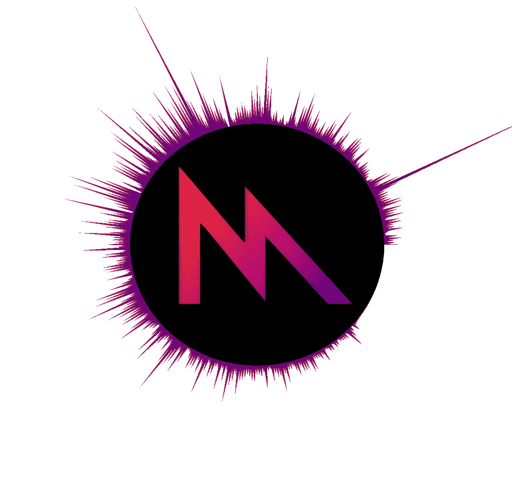
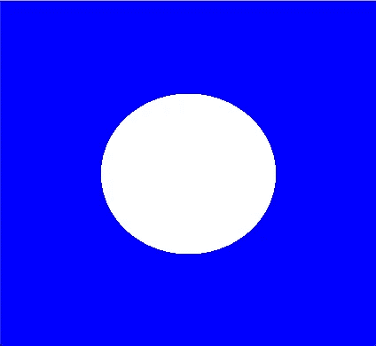
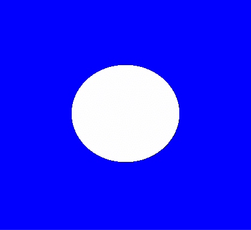
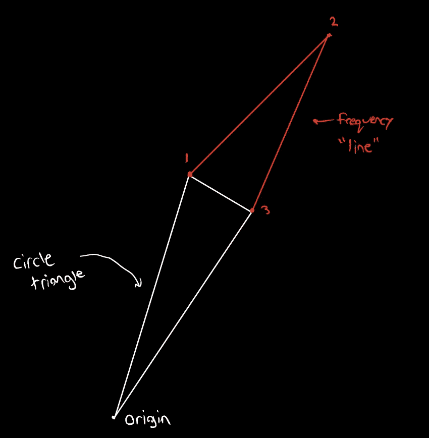
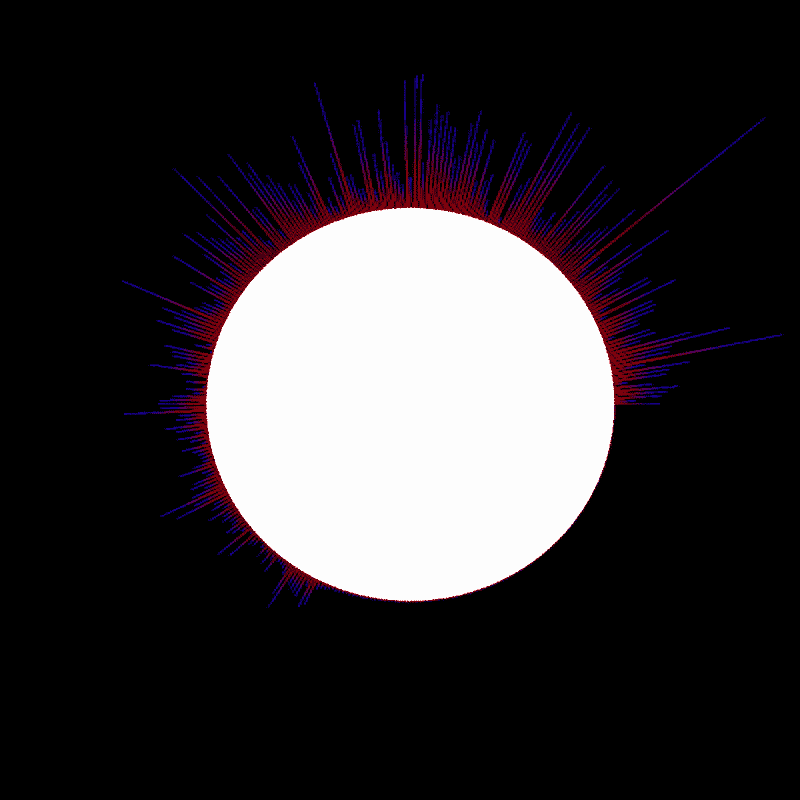
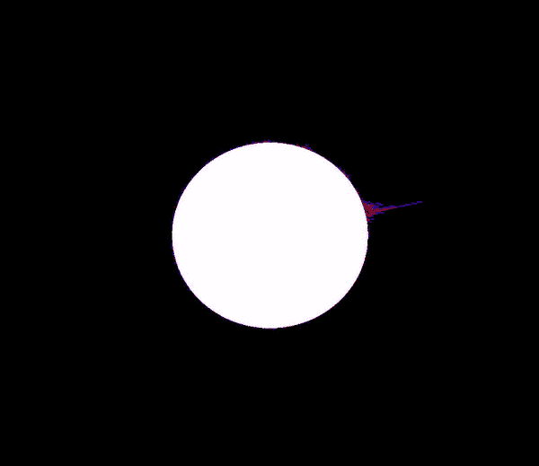
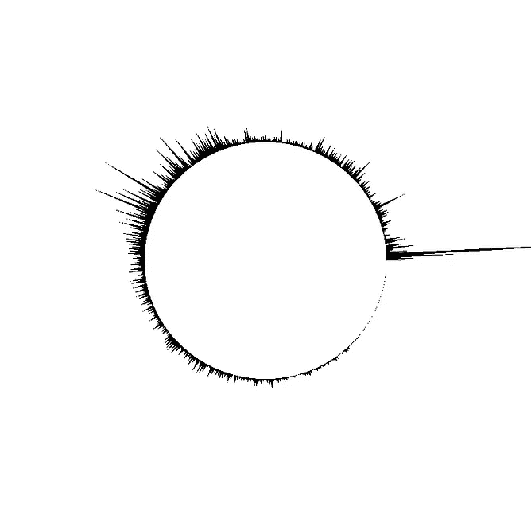
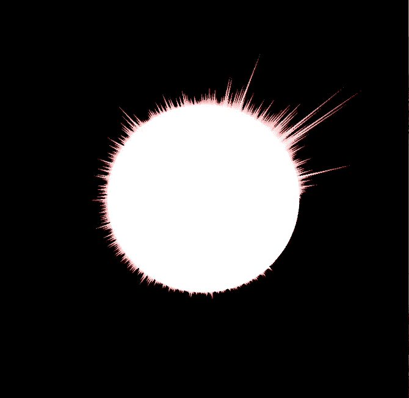
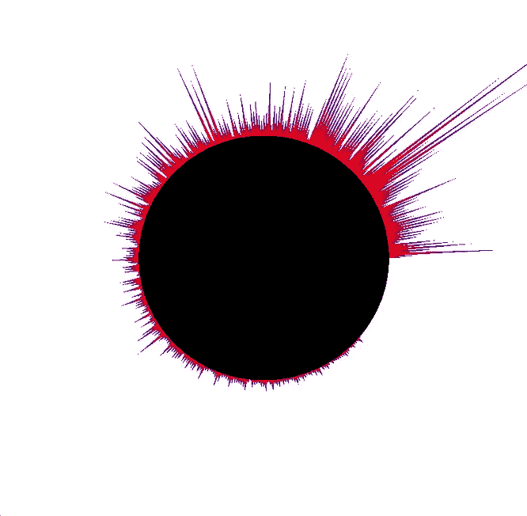

# 使用 Metal 和 Accelerate 在 Swift 中实现音频可视化(第 2 部分)

> 原文：<https://betterprogramming.pub/audio-visualization-in-swift-using-metal-accelerate-part-2-7ec8df4def91>

## 音频可视化



欢迎回到第二部分。如果你还没有完成第一部分，去做第一部分😉

[](https://medium.com/@barbulescualex/audio-visualization-in-swift-using-metal-accelerate-part-1-390965c095d7) [## 使用 Metal & Accelerate 在 Swift 中实现音频可视化(第 1 部分)

### 我们都见过各种形式的音频可视化，但是我们如何在 Cocoa 应用程序中实现呢？

medium.com](https://medium.com/@barbulescualex/audio-visualization-in-swift-using-metal-accelerate-part-1-390965c095d7) 

总结一下我们在上一部分所做的事情:

我们定义了项目需求、输入和输出。要求是使用来自音频信号的数据标记，以快速有效的方式将视觉效果呈现到屏幕上。输入被定义为获取音频样本的标量值以表示平均响度(电平计量)，并获取频率能量以进行频率计量。输出被定义为根据平均响度绘制一个弹跳的圆圈，并在圆圈周围绘制代表不同频率能量的线条。

第一部分讲述了如何获取输入，即从音频信号中获取数据。至此，我们已经获得了开始可视化部分所需的所有数据！

到目前为止，在这个系列教程中(回到*使用金属着色器制作第一个圆圈*)，我们已经讲述了如何使用金属着色器和加速框架。在这一部分，我将只对金属中的一些概念做一个快速的回顾，并且只解释一个新概念(制服)。

这部分从我们上次停止的地方开始(开始代码[这里](https://github.com/barbulescualex/MetalAudioVisualizer))。

# 第 2 部分:创建输出(图形)

对于这一部分，我们将不再在 SignalProcessing.swift 类中工作，只在 ViewController.swift、AudioVisualizer.swift 和 CircleShader.metal 文件中工作。

## **第一部分:扩大圈子和使用制服**

好的，让我们从我们需要做的事情开始。我们知道我们有一个介于 0.3 和 0.6 之间的标量值，我们想用它来缩放一个圆。如果你还记得这个系列的第一个教程(*使用金属着色器*制作你的第一个圆)，我们也已经有了这个圆。我们现在要做的就是用我们的标量量值来缩放。

让我们快速刷新一下我们目前是如何渲染这个圆的。

在 CPU 方面:

我们有一个向量数组(SIMD 库向量),保存连续三角形的 x 和 y 坐标。

`private var circleVertices = [simd_float2]()`

使用 SIMD 库的目的是确保数据在 CPU 和 GPU 的内存中得到一致的表示，因为 Swift 和 Metal 都有该库。

我们将 circleVertices 存储到一个 MTLBuffer 中:

```
vertexBuffer = metalDevice.makeBuffer(bytes: circleVertices, length: circleVertices.count * MemoryLayout<simd_float2>.stride, options: [])!
```

让我们的 GPU 了解资源:

`renderEncoder.setVertexBuffer(vertexBuffer, offset: 0, index: 0)`

并触发它运行:

```
renderEncoder.drawPrimitives(type: .triangleStrip, vertexStart: 0, vertexCount: 1081)
```

现在，在 GPU 方面…

使用 1081 的 vertexCount 调用 drawPrimitives，这将触发我们的着色器中的 vertex 函数以 0 到 1080 的 vertex_id(vid)运行 1081 次。使用 vid，我们从(存储在第 0 个缓冲区中)访问顶点数组，在那里我们从 CPU 端复制了顶点。在我们的顶点函数中，我们创建了一个保存 4D 输入的输出，其中我们只关心前两个坐标和一个颜色，该颜色将沿着管道进一步传递。

在食物链更下游的片段着色器中，我们接收顶点函数的输出，并简单地返回输出中指定的颜色。

好了，现在我们已经复习了如何画圆。那么，我们应该如何进行扩展呢？

a)将我们用来画圆的 1081 个点按每个音频帧在 CPU 端的响度大小进行缩放(也称为为每个帧传入 1081 个新点)。

b)什么都不做。

c)始终保持 1081 个点和这些点的缓冲区固定，并简单地传入作为标量(统一变量)的量值，并在顶点着色器本身内应用变换(也称为为每帧传入 1 个新点)。

这里的正确答案是 c。

那么，什么是**均匀变量**？

这个想法很简单，真的——一个常量值被均匀地应用到所有的顶点，就是我们所知道的统一变量/输入/常量，等等……就是这样。

让我们开始吧。

我们需要做的第一件事是打开一条从 ViewController 到 AudioVisualizer 的通信路径，view controller 具有我们插值的响度值。这将把值作为一个统一的值传递到管道中。当我们设置一个响度值时，我们希望将其转换成一个 MTLBuffer，可以通过管道向下传送。

Inside AudioVisualizer.swift

我们给它默认的最小刻度值来开始；你很快就会明白其中的原因。接下来，我们可以从 ViewController 类中设置这些值:

现在，我们需要把缓冲液送到管道里。如果我们把这当成制服，我们该怎么做呢？为了将数据传递给我们的着色器函数，我们在 renderEncoder 上使用 setVertexBuffer。

目前，我们为圆形顶点设置了一个 vertexBuffer，并告诉渲染编码器从这些顶点中绘制出三角形条带。要传入制服，我们只需传入一个单独的缓冲区。drawPrimitives 指令，正如我们从使用金属着色器在 Swift 中制作第一个圆的*中了解到的，将运行我们的顶点函数 1081 次，增加每个顶点传递到函数中的 vid。由于我们希望将统一缓冲区内的值应用于所有顶点，因此我们不会触发更多对着色器函数的调用。*

在 AudioVisualizer.swift 的 draw 函数中

现在，在我们的顶点着色器中，我们有了另一个来自缓冲索引 1 的缓冲区。接下来，我们只需要进入顶点着色器，并适当地缩放我们的值。

内圈.金属

现在我们可以看到这是多么容易:对于每个顶点，圆标量是相同的值，只是简单地应用于 x 和 y 坐标。我们将 loudnessUniform 数组索引为零，因为其中只有一个元素！

让我们点击运行，看看我们会得到什么😍

```
**validateFunctionArguments:3476: failed assertion `Vertex Function(vertexShader): missing buffer binding at index 1 for levelUniform[0].’**
```

嗯，那不好吗？那是怎么回事？当第一次调用 metalView 时，我们的缓冲区实际上并不存在，这就是为什么我们会遇到运行时错误。如果我们查看`AudioVisualizer.swift`类中的`setupMetal()`，我们可以看到我们在第一个绘制周期之前设置了圆的顶点。我们需要为 loudnessBuffer 做同样的事情。幸运的是，我们已经有了一个默认值 0.3 来初始化这个圆。

Inside AudioVisualizer.swift

再次运行它，我们仍然感到失望。实际上什么也没发生；该圆的比例为 0.3。



这是由于我们在第一个教程中如何绘制循环(*使用金属着色器*在 Swift 中制作第一个圆)。我们将 metalView 设置为暂停，等待被告知开始绘制。现在，由于我们想要显式的绘制行为，我们需要将 metalView 设置为 paused，禁用 enableSetNeedsDisplay，并告诉它使用 draw()直接绘制。如果你需要温习这是什么意思，文档中有一个快速复习[这里](https://developer.apple.com/documentation/metalkit/mtkview)。我们希望它在设置完成后绘制，并且每次我们都希望更新 loudnessUniform！



完成第一部分后，我们的 ViewController.swift 和更新的 draw 生命周期如下所示:

## **第 2 节:添加频率线**

我们如何在圆圈周围画这些线？第一个问题是，我们把这些当作制服还是顶点？如果我们把它们当作制服，那么我们要把制服也用来做什么呢？目前，顶点着色器只被调用 1081 次，这是画圆所需要的。所以我们需要把这些当作顶点而不是制服。

我们将使用这些顶点绘制什么类型的图元？它们被称为频率线，但不一定是线。我们可以使用任何基本类型，它仍然看起来很好(除了点——点看起来很差，因为它们太小了)。

让我们回到我们如何渲染圆。我们创建 720 个三角形来构成圆，也就是说，周长上有两个点，原点上有一个点。我们总共有 720 个周界点。我们想在周长点上开始我们的线(显然)，我喜欢做的是让线从圆三角形的第一个周长点开始，然后向外延伸到圆三角形到原点的地方，然后将线带回来与下一个圆三角形顶点相遇。这里有一个小图形来说明我的意思:



上述方法意味着只使用了 360 个频率幅度。这是个问题吗？不完全是。如果你愿意，你可以在中间插入“空”点:[假点，真点，假点，真点…]。因此，通过检查，我们可以知道我们需要运行顶点着色器大约 1080 次，这个方法才能工作。

对于 512 个频率仓和 1/40 的采样速率(对于 FFT 中使用的 1024 个数据点)，我们有从 40Hz 到 20.48Khz 的幅度仓(松散近似)。人耳平均能听到 20Hz-20k Hz 的声音。假设在前面的部分中，我们使用了 2048 个数据点来呈现 1024 个频率仓。这些值中有一半以上是无用的，因为这些频率我们听不到，可能在母带制作过程中被从音乐中删除了。

好的，所以我们需要 720 个频率线点在圆周上，360 个向外(显示幅度)。简而言之，这意味着我们实际上可以为外向点使用 360/512 的值，以及 720 个“空”值。我们应该从 512 中选择中心 360，这样我们就有了索引范围 76 中的值..<437\. Now we don’t necessarily need to waste any CPU time shoving in “empty” values into the line vertex buffer; instead, we can do some simple arithmetic so that the vertex shader for the line drawing gets called 1080 but still only uses a 360 element buffer.

We’ll start off this section the way we started off the first section: by communicating the frequency data from the ViewController class to the AudioVisualizer class and initializing the buffer appropriately.

We declare a public var that can take in frequencies from the ViewController class and turn them into a buffer.

Inside AudioVisualizer.swift

Now, you may notice we’re using 361 data points instead of 360\. What gives? If you remember way back (*使用金属着色器在 Swift 中创建第一个圆，*是的，我将继续命名它，我不希望任何人混淆并认为这是来自第一部分 *)* 我们必须使用一个额外的数据点来完成圆(回到 0*)，否则圆将在 x 轴下方缺少一个长条。同样的逻辑也适用于此——如果我们只使用 360 个数据点来计算频率，我们将会错过 x 轴下方的一小部分。

接下来，就像我们对响度测量所做的那样，我们希望确保在第一个 draw 命令之前初始化缓冲区，并且我们在每次计算频率幅度时都从 ViewController 中设置它们。

Inside AudioVisualizer.swift

ViewController.swift 内部

现在是时候渲染我们的数据了。在我们讨论如何使用任何类型的带点的原语之前。在代码中，我将使用 lineStrips，但是您可以随意使用任何您想要的东西。

我们需要顶点着色器来显示 361 个数据点，只有 1/3 的点是真实的数据点(其余的在圆上)。我们希望运行尽可能多的圆顶点，这将允许我们在没有额外内存开销的情况下重用这些周界点(它们已经在缓冲区中)。

Inside AudioVisualizer.swift

现在等一下——只有一个顶点着色器，但是有两种不同类型的图元。我们如何为每个原语改变我们的逻辑，我们如何知道一个何时停止，另一个何时开始？答案很简单:不要想太多。我们的 VID 会从 0->2161。为了对我们正在绘制的不同对象执行不同的逻辑，我们只需要一个 if 语句。还值得注意的是，您设置的所有顶点缓冲区在所有顶点着色器过程中都可用。还要注意，我们已经将 metalView 的背景颜色从蓝色改为黑色(相信我，这样会更好看)。

现在回到我们关于如何处理绘制频率线的讨论，我们需要利用 vertex array[vid-1081]+loudness uniform 处可用的圆形顶点，以便我们知道频率线从哪里开始。同样的逻辑也适用于频率线的结尾。

这实际上完成了频率线的绘制。如果您运行您的程序，您应该会看到最终的产品:)



这基本上结束了所有的编码。为自己一路走来感到自豪！🎉

完整的第二部分可以在我的 Github [这里](https://github.com/barbulescualex/MetalAudioVisualizer)找到。

# 后续步骤和缺点

所以现在你已经学会了基本的构建模块，这将使你能够做任何你想做的事情。但是，如果我们不对我们所学的内容做一些反思，看看我们如何在它的基础上扩展，以及它的缺点是什么，它就不是一个好的教程。

## 让它成为你自己的



右上方的音频可视化工具使用 1080 条频率线环绕圆圈两次，没有范围选择。它还采用了低音强调水平计量。我选择在本教程中不使用它——我想让本教程更通用，而是允许您开发这些事情背后的一些直觉，以便您可以使用任何您想要的可视化。

如何自定义音频可视化工具来满足您的需求？嗯，最简单的方法是改变频率线的颜色和基本类型。



接下来，您可以摆弄数据点本身。如果你还记得本教程的第一部分，有不同的电平计量公式，比如 A 加权，它更强调我们能听到的频率。由于这是一个非常 EDM 类型的音频可视化，一个伟大的替代水平计量将是低频计量；也就是说，用圆圈代表低音能量(这比我们对这种音乐类型采用的方法更常见)。

在频率方面，当进行音频可视化时，我们有一些范围选择。如果我们想更进一步地关注一个范围，或者让频率线不止一次地环绕这个圆，会怎么样呢？(又名，如果我们想要更多的频率仓呢？)如第一部分所讨论的，你可以从 n 个音频帧中得到 n/2 个频率仓。因此，通过增加用于 FFT 的样本大小，可以获得更多可用的数据点。你也可以研究 hann-windowing 来获得更精确的频谱。

当我们谈到频率的话题时，值得注意的是我们没有对频率线进行插值，所以它们的变化比圆圈慢十倍。

最后，还有正常化。我试图给出非常通用的规范化方法，但是您可以进一步使用它们来获得更好的结果。

## 缺点

好吧，那么我们用过的方法有什么缺点？我认为最大的一个问题是延迟。不幸的是，虽然我们很快，但我们没有*那么*快，所以这肯定是显而易见的。可以注意到，我们在同一个线程上顺序地进行所有的信号处理。这不是必需的，您可以在不同的分支上分别完成这项工作，而不用担心任何竞争条件或死锁。

接下来，我们错过了数据。我们不会从我们的回拨率中遗漏数据；相反，我们会丢失数据，因为我们在信号处理中实际上并没有使用所有的数据。可以这样想:如果我们有来自 x.1s -> x.2s 的样本数据，歌曲在窗口的前半段是安静的，在窗口的后半段是响亮的，我们不会得到最准确的表示。在我们的例子中，我们只使用前四分之一的音频样本。我们将完全错过整个采样周期的较大部分。现在，这个问题很容易解决，因为增加液位计量的数据点不会增加输出数量(仍然是一个)。

相反，在频率方面，如果我们增加使用的数据点数量，输出就会线性增加。这对我们如何绘制频率线有直接的影响，使得处理相应的可视化更具挑战性。

这就结束了*使用金属&加速在 Swift 中制作音频可视化器。*我希望你学到了新的有用的东西！🎉

如果这对你有帮助，请随意去 share️.一如既往，如果你有任何问题或建议，请在下面的评论区留下。