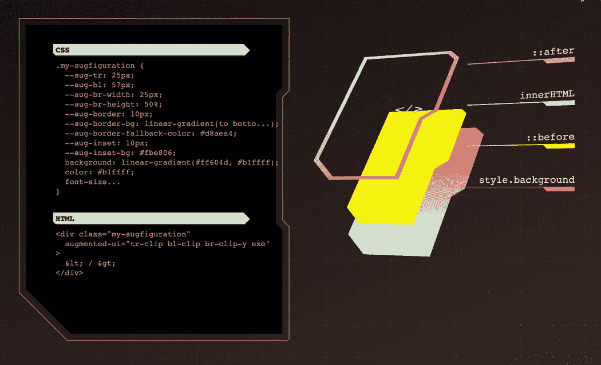
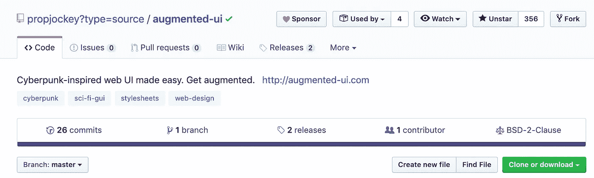
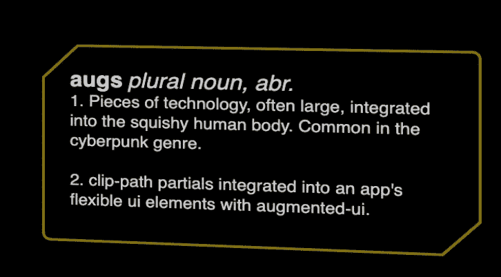
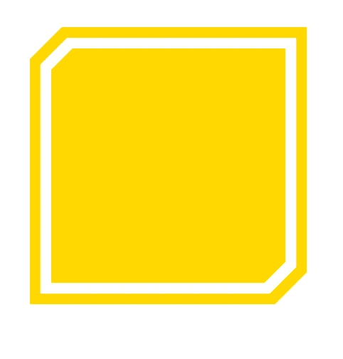
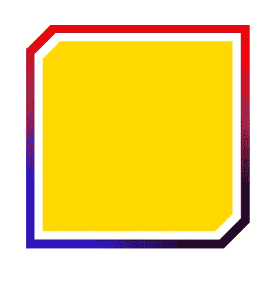
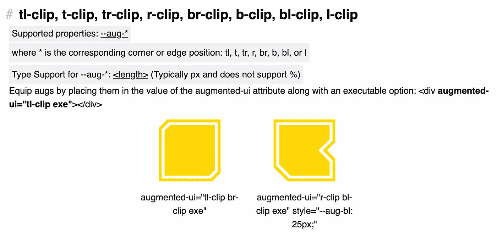
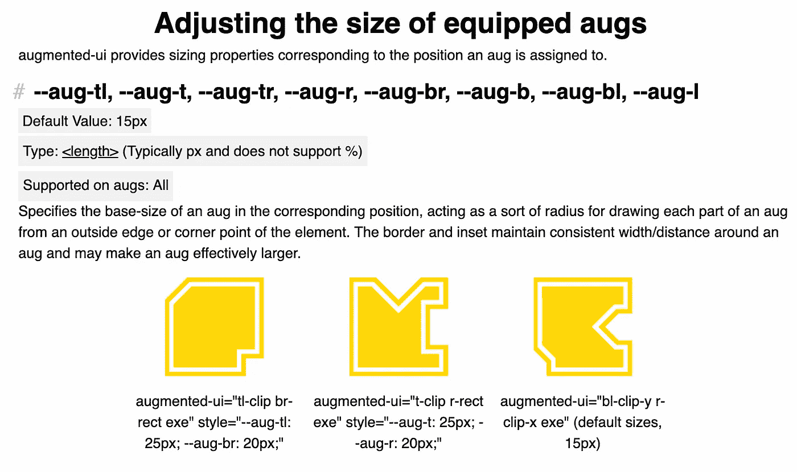
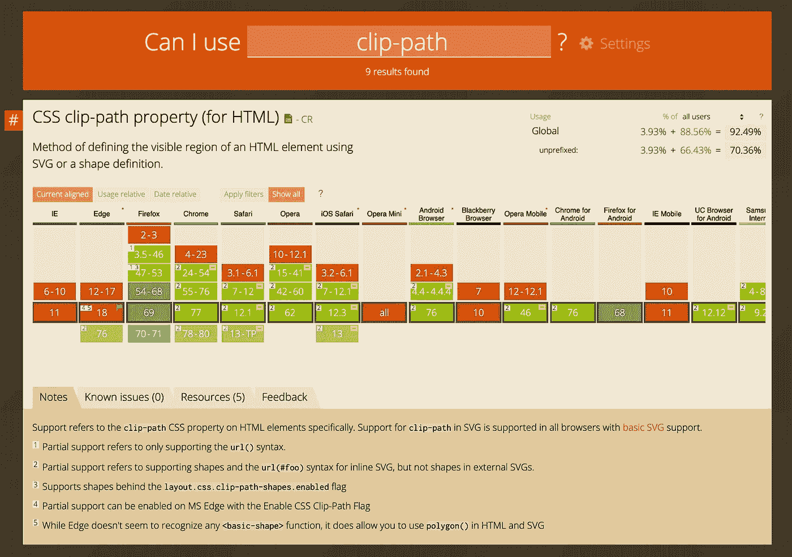

# 增强用户界面——受赛博朋克启发的网络用户界面变得简单

> 原文：<https://betterprogramming.pub/augmented-ui-cyberpunk-inspired-web-ui-made-easy-d463c0371144>

## 增强您的 web 应用程序



[增强用户界面](http://augmented-ui.com/)库

augmented-ui 使你能够在任何网页或应用程序上为任何大小的元素创建一个受赛博朋克启发的 ui，而且不费吹灰之力。augmented-ui 可以在任何项目中免费使用。



增强用户界面源代码可在 [Github](https://github.com/propjockey/augmented-ui) 上获得

# 增强用户界面入门

NPM: `$ npm install augmented-ui`

一旦安装了增强的 ui 库，在任何现有的样式表之前包含一次`/node_modules/augmented-ui/augmented.css`文件。

CDN:把它放在你的页面上，放在小项目的其他样式表之前。
`<link rel="stylesheet" type="text/css" href="https://unpkg.com/augmented-ui/augmented.css">`

瞧啊。这就是你需要做的。augmented-ui 是一个纯粹的 CSS 库——没有包含任何功能，只是包含了纯粹的样式。

# augmented-ui 全部是 CSS

根据他们的网站，augmented-ui 包括以下内容:

> 任何元素的未来派、受赛博朋克启发的用户界面造型
> 
> 添加“augmented-ui”属性来装备 augs，并为每个 augs 添加一些 CSS 设置，使其感觉恰到好处



奥格定义

# 例子

要使用 augmented-ui，让我们创建一个 div 元素。注意附加到元素上的`augmented-ui` 属性。这意味着定义元素的样式。

`<div class=”demo” augmented-ui=”tl-clip br-clip exe”></div>`

让我们给出 div 的高度并添加一些填充。

注意我们在这里使用的 CSS 变量。这些变量由 augmented-ui 库提供，是设计元素样式的核心方式。

我们应该会在屏幕上看到以下内容:



相当整洁。让我们添加一个渐变边框。将以下样式添加到元素中。

```
--aug-border-bg: linear-gradient(red, transparent), linear-gradient(to right, blue, transparent), black;
```

下面是我们应该看到的:



如您所见，使用该库构建增强的样式组件非常简单。我是赛博朋克的超级粉丝，所以我自然很兴奋地想看看你可以用这个库来构建什么。

# 增强用户界面的基础

*   augmented-ui 对所有默认和样式使用属性选择器，它与类选择器具有相同的权重。更多信息请参见 MDN 上的 [CSS 选择器特异性](https://developer.mozilla.org/en-US/docs/Web/CSS/Specificity#Selector_Types)。
    TL；dr: `div { --aug-t: 50px; }`使用一个类型选择器，不会覆盖默认设置——但是`.divclass { --aug-t: 50px; }`会。
*   aug 是分配给特定角或边的单个特征/形状。例如`br-clip`(右下方剪辑)
*   每个职位的简称将出现在每个八月和每个八月的酒店。有八个位置:

1.  tl =左上角
2.  t =顶部边缘
3.  tr =右上角
4.  r =右边缘
5.  br =右下角
6.  b =底部边缘
7.  bl =左下角
8.  l =左边缘



Augs 在增强用户界面中可用

*   通过将 aug 放入 augmented-ui 属性的值()中，为元素配备 aug
*   在 augmented-ui 属性的值中需要一个可执行选项，这是创建实际裁剪路径多边形的选项(对于基础，只使用`exe`)

`exe`可执行选项:

1.  元素本身的剪辑
2.  在`::after`伪元素上创建和裁剪边框
3.  创建并剪切`::before`伪元素上的插图

如果没有`exe`属性，augmented-ui 可能什么也做不了。



调整配备的螺旋钻的尺寸

## 命名空间 CSS 变量

根据他们的[网站](http://augmented-ui.com/):

> 所有自定义属性都以`— aug-`开头
> 
> 选择器仅使用`augmented-ui`属性

## 自动后退

根据他们的[网站](http://augmented-ui.com/)，augmented-ui 拥有以下特性:

> 1.1.0+版的全面支持拥有约 91%的全球用户
> 
> 为旧浏览器提供强大的自动回退功能(约 3.5%的全球覆盖率)

## 免费使用

augmented-ui 受 BSD 2 条款许可，可以在任何项目中免费使用。

## 浏览器支持

根据他们[网站](http://augmented-ui.com/)上的统计:

> 根据 caniuse.com 的数据，截至 9 月 9 日，在 v1.1.0 中， **~** 91%的全球用户体验到了完全支持的版本
> 
> 自动`-webkit-clip-path`回退带来了对 Chrome 49–54、Safari 9.1+、iOS Safari 11+、Opera 36–41、Opera mobile 46+、UC 浏览器 12+和三星互联网 5+的全面支持



[https://caniuse.com/#search=clip-path](https://caniuse.com/#search=clip-path)

## 自动创建椭圆形边框半径

根据他们的[网站](http://augmented-ui.com/):

> 在没有 clip-path 选项的浏览器上，以及在仅部分支持自定义属性的旧 iOS 版本上，augmented-ui 会自动为元素构建一个椭圆形边框半径。
> 
> 每个角 aug 的有效宽度和高度用于确定边界形状，产生一个更柔软、几乎融化的版本

这里有一个完整的例子列表——继续探索它们。这些示例让您大致了解了如何为每种风格应用类。

[](http://augmented-ui.com/test.html) [## 增强-用户界面-将您的应用与技术相结合

### 非继承:-aug-边框-不透明，-aug-插入-不透明

augmented-ui.com](http://augmented-ui.com/test.html) 

如果你是 JavaScript 新手，想学习这门语言，我建议你从阅读书籍和构建东西开始。从《 [*学习 JavaScript 的更聪明的方法*](https://amzn.to/2LOkzjj) 》和[这本书开始吧，这里有一个要构建的有趣应用的列表](https://medium.com/better-programming/the-secret-to-being-a-top-developer-is-building-things-heres-a-list-of-fun-apps-to-build-aac61ac0736c)。