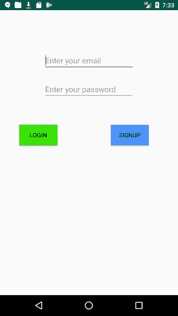
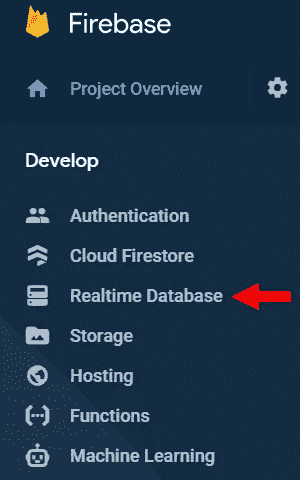
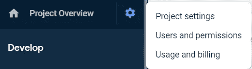
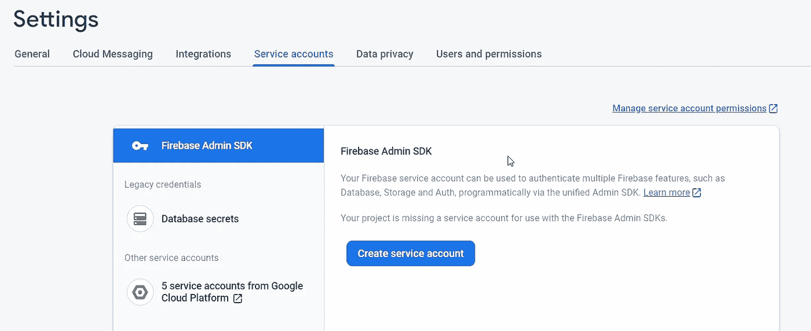

# 使用 Firebase 验证用户身份并在数据库中保存数据

> 原文：<https://betterprogramming.pub/authenticate-users-and-save-data-in-a-database-using-firebase-5a7e8828a5f8>

## Android 版 Firebase 入门


照片由 [Unsplash](https://unsplash.com?utm_source=medium&utm_medium=referral) 上的 [Tim Patch](https://unsplash.com/@tdpatch?utm_source=medium&utm_medium=referral) 拍摄

当您着手构建一个应用程序时，有大量的事项需要考虑。这些都主要与客户端有关。当您开始考虑应用程序的服务器时，事情会变得非常复杂。减轻压力的一个选择是使用 [Firebase](https://firebase.google.com/docs) ，特别是 Firebase 的两个特性:

1.  使用 Firebase Auth 验证用户
2.  使用实时数据库存储数据

我们将在本文中展示:

*   如何在 [Kotlin](https://kotlinlang.org/docs/reference/) 中构建一个使用 Firebase Auth 认证用户的 Android 应用程序
*   使用 [Retrofit2](https://square.github.io/retrofit/) 向我们的服务器发出请求
*   如何使用 Express 在 [Node.js](https://nodejs.org/en/docs/) 中构建一个服务器，该服务器将接收来自我们的应用程序的请求，并从 Firebase 中的实时数据库获取数据

如果所有这些看起来像是一个简单的任务，它不是。很明显，需要做大量的设置和处理各种配置，但这里也有一些陷阱，人们可以从中受益，这将有助于节省时间和减少挫折。

从我的错误中吸取教训。

如果你想跳过所有的解释，你可以到文章的底部，通过链接查看完整的源代码。

# 设置

我们的应用程序将由前端和后端组成。从前端的角度来看，将有一个登录/注册页面和另一个页面，将获取/发送随机数据到我们的数据库。我们将在这里使用 Firebase 身份验证来验证注册用户。有几种方法可以验证用户:

*   电子邮件和密码
*   谷歌/脸书/Twitter/GitHub 账户(所谓的联合身份提供商身份认证)
*   电话号码
*   自定义授权
*   匿名授权

在我们的应用程序中，我们将使用电子邮件和密码选项，因为这是更简单的方法，在大多数情况下，也是更常见的解决方案。

这种认证将发生在我们的客户端，不需要任何通信到我们的后端为这项任务。

为了向服务器发出请求，我们将通过发出 GET 请求来使用 Retrofit2。在这些 GET 请求中，我们将发送需要更新的数据和一个令牌(关于令牌的更多信息在服务器部分)。

从后端来看，我们的服务器负责接受用户使用我们的应用程序获取/保存/删除数据的请求(或 [CRUD](https://en.wikipedia.org/wiki/Create,_read,_update_and_delete) )。为了能够让认证用户访问数据库，我们需要使用 [Firebase 的管理 SDK](https://firebase.google.com/docs/admin/setup) 。这个框架将使我们能够访问一个 API 来验证经过身份验证的用户，并将请求传递给我们的数据库。我们将使用 Firebase 的[实时数据库](https://firebase.google.com/docs/database)保存用户数据。在后端完成所有工作后，我们将通过 [Heroku](https://www.heroku.com/) 部署它。

# 客户端用户界面

打开一个新的 Kotlin 项目后，我们需要导入一些依赖项。首先，您需要将 Firebase 添加到您的项目中。

[遵循此处概述的步骤](https://firebase.google.com/docs/android/setup#console)

完成后，将以下依赖项添加到您的应用程序级`build.gradle`文件中:

当用户打开应用程序时，他们可以登录或注册(如果是第一次)。因为我们已经同意基于用户的电子邮件和密码的组合来验证用户，所以我们将创建一个简单的活动，它有两个`EditTexts`来完成这个任务。我们还将有两个按钮来表示注册或登录的选择。

我们的登录屏幕布局

我们的 LoginActivity.kt 文件

1.  我们将监听器附加到我们的编辑文本，以识别它们何时失去焦点或者用户何时按下了完成按钮。
2.  `loginUser`方法负责根据用户先前的凭证对用户进行身份验证(使用 signInWithEmailAndPassword API)。
3.  `signupUser`方法使用 createUserWithEmailAndPassword API。
4.  您可以看到，我们已经覆盖了`onStart`生命周期方法，以识别用户何时返回应用程序，并在用户已经登录的情况下适当地更新 UI。

运行我们的应用程序时，我们会看到:



不要太花哨

那是容易的部分。在我们继续编写与后端通信的逻辑之前，让我们首先构建后端。

# 服务器

我们将在构建服务器时使用 Express。下面是这样一个服务器的模板，它还添加了标头以绕过我们可能遇到的任何 CORS 问题:

类似于我们在客户端所做的，我们也需要将 Firebase 添加到我们的节点服务器。如果您回想一下在 Firebase 中创建项目的步骤，并选择了一个 Android 项目，那么您需要向该项目添加另一个代表我们的服务器的应用程序。通过点击 Firebase 控制台主屏幕上的添加应用程序，


您将看到可供选择的平台:


您需要选择 web 选项(带有>图标的选项)

在 Firebase 控制台中完成初始配置后，您需要将配置对象添加到项目中:

firebaseConfig 示例(填写您项目的详细信息)

我们将把这些配置放在我们的主文件(`app.js`)中。

你们中有些人可能会想，“我把所有这些秘密信息都保存在客户端。大家都会看得见的！”这是完全正确的，但在 Firebase 的情况下，这是可以的。

# 数据库

然而，唉，我们仍然有一些更多的配置要做。这次它与我们的实时数据库有关。转到 Firebase 控制台，选择您在本文前面创建的项目。在左侧菜单中，您会看到一个实时数据库选项。点击它。



接下来，在右侧会出现一个窗口，其中包含以下选项卡:


在“数据”选项卡下，会有您的数据库的 URL。记住它，因为我们以后会用到它。另一个要查看的重要选项卡是规则。这些规则指定谁可以访问您的数据库以及他们可以在那里做什么。最初(出于测试目的)，那里的规则相当宽松，任何人都可以读写你的数据库。**在你让你的应用程序上线之前，确保用更严格的东西更新这些规则**。别担心，你会看到一个例子。

# Firebase 管理

接下来，我们需要设置 [Firebase Admin SDK](https://firebase.google.com/docs/admin/setup) 。因为我们已经在 firebase 控制台中设置了必要的东西，所以我们需要安装 Firebase 管理包。

```
npm install firebase-admin --save
```

接下来，我们需要生成一个私钥，因为我们的项目是一个服务帐户。内部 Firebase 控制台:

1.  项目概述旁边有一个齿轮图标。点按它并选取“项目设置”。



2.点击服务账户选项卡。

3.单击创建服务帐户按钮。



4.选择节点作为配置片段。

5.单击生成新的私钥。

将这个文件放在您的项目中，并在 Firebase 提供的代码片段中更改它的路径。

**注意:请确保将该文件排除在您的** `**.gitignore**` **文件之外，并且不要将其上传到任何公共存储库中。**

将所有这些放在一起，我们的`app.js file`将如下所示:

还记得我之前提到的数据库 URL 吗？你需要将它插入到传递给 Firebase 的 admin `initializeApp`方法的对象中。

# 创建端点和部署

唷，这是一个很大的设置。现在，我们的服务器能够运行，但它不会做任何事情，因为没有配置端点。为了解决这种情况，让我们定义一个端点:

我们的端点称为`getData`，您可以看到，在执行任何其他逻辑之前，我们正在提取发送的 auth 令牌，并使用 Firebase Admin 对其进行验证。如果一切正常，我们继续获取用户的 UID，并使用它从数据库中获取用户的数据。

# 在客户端发出请求

正如我们前面提到的，我们将使用 Retrofit2 向服务器发出请求。这里我不会详细介绍如何使用 Retrofit2(有很多文章都是这么做的)，所以下面您可以找到使用 Retrofit2 进行网络请求的标准实现。

注意，在获得 FirebaseUser 对象后，我们使用`getIdToken`方法提取令牌，该令牌将被发送到服务器。同样，我们可以创建另一个 GET 请求来设置数据库中的数据。

最后但并非最不重要的一点是，下面是一组数据库规则的示例:

在这里，我们确保任何想要读取或写入数据的用户都得到授权。

本文基于我在构建自己的应用程序时所经历的事情。可以在下面查看一下(源代码也有):

[](https://play.google.com/store/apps/details?id=com.tomerpacific.todo) [## Google Play 上的待办事项应用

### 你是否曾经很难记住你一天中需要完成的所有事情？曾经需要一个地方写下你的…

play.google.com](https://play.google.com/store/apps/details?id=com.tomerpacific.todo) [](https://github.com/TomerPacific/Todo) [## TomerPacific/Todo

### Todo List 应用程序，它使用 Firebase 来验证用户并在数据库中保存数据。还有一个选项是…

github.com](https://github.com/TomerPacific/Todo)