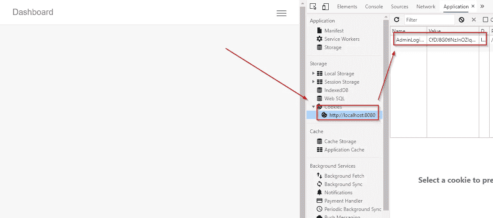
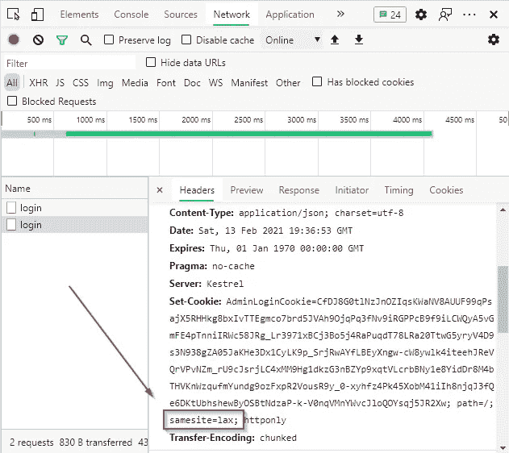
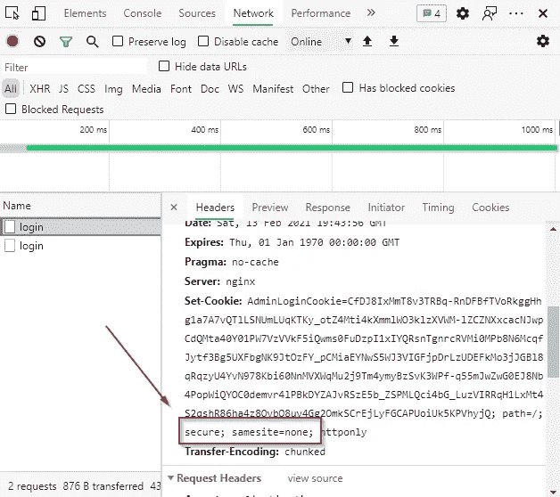
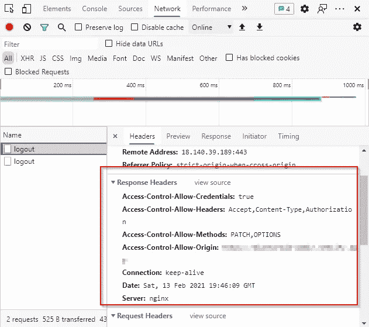

# 在中使用 Cookies 验证前端应用程序。NET Core Web API

> 原文：<https://betterprogramming.pub/authenticating-frontend-apps-using-cookies-in-net-core-web-api-2df311e735bb>

## 为您的前端设置一个. NET 核心后端，并使用 cookies 构建安全的应用程序


在 [Unsplash](https://unsplash.com?utm_source=medium&utm_medium=referral) 上由 [Olia Gozha](https://unsplash.com/@olia?utm_source=medium&utm_medium=referral) 拍摄的照片。

在过去，web 应用程序被视为一体。前端和后端应用程序之间没有分离，至少不像今天这样。原因是在那时，计算机没有今天这样强大。浏览器过去依赖服务器来呈现前端，并将其作为简单的 HTML 返回。这种技术被称为服务器端呈现。这种心态催生了像 ASP.NET 网络表单这样的框架。

但是随着计算机领域的创新迅速增加，现代计算机变得比以前更加强大。这使得他们能够呈现更多的客户端代码。

因此，现代应用程序往往通过实现客户端渲染而从中受益。我相信你听说过像 React 和 Vue 这样的 JavaScript 框架。这些应用的复杂性通常会使前端和后端应用的分离更加合理。

关注点的分离使得应用程序之间的同步更加困难。由于 JavaScript 框架的本质——它们运行在客户端的机器上，安全性问题也随之而来。

在这篇文章中，我将提供一个演示，演示我们如何使用 cookies 为带有. NET 核心后端的前端应用程序实现身份验证。

# 配置前端

在我们配置后端之前，我们需要配置前端。为什么？独立的前端和后端应用程序将拥有某种跨源资源共享(CORS)策略。

## HTTP 请求

因此，通过首先配置我们的前端，我们只允许我们需要的参数。

获取请求的示例。

让我们以这个代码片段为例。如果我们使用这个请求，我们将需要允许所有三个`Accept`、`Content-Type`和`Authorization`头。同样，如果我们使用像`GET`、`POST`、`PATCH`和`DELETE`这样的 HTTP 方法，我们也需要允许这些方法。另外，如果我们想使用前面提到的 HTTP 方法之一，[我们也需要允许](https://stackoverflow.com/questions/40758013/response-to-preflight-request-doesnt-pass-access-control-check-in-nodejs/40758058#40758058) `[OPTIONS](https://stackoverflow.com/questions/40758013/response-to-preflight-request-doesnt-pass-access-control-check-in-nodejs/40758058#40758058)` [。在每个请求之前，浏览器发送一个`OPTIONS`请求。](https://stackoverflow.com/questions/40758013/response-to-preflight-request-doesnt-pass-access-control-check-in-nodejs/40758058#40758058)

## 在前端接收 cookies

请注意代码片段中的这一行:

```
credentials: 'true'
```

当我们想要在我们的前端应用中允许`set-cookies`时，这一行是至关重要的。对于使用新 fetch API 的应用程序，在请求中添加`credentials: 'include'`以启用 cookies。对于 Axios 用户，在启动新的 Axios 客户端之前，请使用`axios.defaults.withCredentials = true;`。

对于前端 CORS 的更深入的解释，[你可以查看这篇文章](https://web.dev/cross-origin-resource-sharing/)。

# 配置后端

后端是奇迹发生的地方。嗯，算是吧。

你看，当处理 CORS 时，你总是需要从后端允许它。来自前端的请求只定义了我们需要从后端得到什么，而安全性由我们的后端策略决定。

您可以从后端应用程序配置 CORS 策略，也可以在您的服务器配置中配置它们。似乎两边的[配置都会导致问题](https://stackoverflow.com/questions/62015085/net-3-1-api-angular-9-cors-with-nginx-proxy)。

## 定义 CORS 政策

如前一节所述，您需要定义允许的方法、头和来源。

CORS 政策的例子。

策略生成器允许我们流畅地添加将通过 CORS 允许的方法。在上面的例子中，我们允许 HTTP 请求使用`GET`、`POST`、`PATCH`、`DELETE`和`OPTIONS`方法。此外，我们允许所有三个`Accept`、`Content-Type`和`Authorization`标题。

为了成功地通过 API 传递 cookies，我们需要允许带有`AllowCredentials`的凭证。如果我们允许凭证，我们还需要在后端定义允许的来源。因此，我们可以使用`[WithOrigin](https://docs.microsoft.com/en-us/dotnet/api/microsoft.aspnetcore.cors.infrastructure.corspolicybuilder.withorigins?view=aspnetcore-5.0)`或`[SetIsOriginAllowed](https://docs.microsoft.com/en-us/dotnet/api/microsoft.aspnetcore.cors.infrastructure.corspolicybuilder.setisoriginallowed?view=aspnetcore-5.0)`。这两种方法都行得通，因为它们似乎有着相同的目标。

大多数 CORS 实现会使用`withOrigin`，并最终设置一个通配符(即`*`)作为原点。这对于一些不实现凭证的情况是可行的，但是最佳实践是定义允许哪些来源。为了实现这一点，我选择使用`SetIsOriginAllowed`方法。

*注:一个实现允许来自任何原籍的 CORS 凭国书可以参见*[](https://jasonwatmore.com/post/2020/05/20/aspnet-core-api-allow-cors-requests-from-any-origin-and-with-credentials)**。将这种配置用于开发目的是可以的，但是我不建议在生产中使用这种配置。**

*在实现了依赖注入之后，您可以通过从`IApplicationBuilder`调用策略名来实现 CORS 策略。*

*CORS 实施的例子。*

## *通过依赖注入添加 cookie 身份验证*

*首先，您需要在`Startup.cs`文件中确定您的 cookie 配置。*

*cookie 实现的示例。*

*`AddAuthentication`扩展了`IServiceCollection`配置。这就是我们注入 cookie 认证方案的方式。在我们使用 cookie 添加身份验证方案之后，我们将需要定义 cookie。`AddCookie`方法就是这样做的。*

*我们通过使用`Cookie.Name`参数来定义我们的 cookie 名称，并通过定义`ExpireTimeSpan`来定义我们的 cookie 何时到期(在我们的例子中，cookie 将在一小时后到期)。`SlidingExpiration`将通过在到期时间接近时刷新到期时间，使您的 cookies 持续更长时间[。](https://docs.microsoft.com/en-us/dotnet/api/microsoft.aspnetcore.authentication.cookies.cookieauthenticationoptions.slidingexpiration?view=aspnetcore-5.0)*

## *保护 cookie 配置*

*要使用安全 cookie，使用`HttpOnly` cookie 选项是关键。本质上，[它保护我们的 cookies 不被恶意的 XSS 脚本检索](https://owasp.org/www-community/HttpOnly)。你一定要实现它。*

*你应该实现的下一件事是`SameSite`选项。如果你的应用程序有相同的来源，[你很可能将](https://owasp.org/www-community/SameSite) `[SameSite](https://owasp.org/www-community/SameSite)` [设置为严格选项](https://owasp.org/www-community/SameSite)。否则，如果您使用跨站点 cookie，您可能希望将`SameSite`选项设置为 None。你可能会想，“这如何让我的应用安全？”嗯，没有。它只会让你的。NET Core app [认证来自其他域的 cookie](https://docs.microsoft.com/en-us/aspnet/core/security/samesite?view=aspnetcore-5.0)。*

*但是为了防止你的 cookie 被恶意使用，现代浏览器会要求你在 cookie 上添加一个`Secure`策略。您可以通过扩展`IApplicationBuilder`来实现:*

*如何使用“安全”cookies*

*但是`Secure`是什么意思呢？我将检查 cookie 是否通过 HTTPS 传输，并且只接受来自 HTTPS 的 cookie。只有当您想要将`SameSite`设置为“无”时，这才是强制的。这就是为什么在本地环境中，我通常注释掉`SameSite`和`Secure`策略。*

## *使用 cookie 认证中间件*

*为了使开发过程更加无缝，在`IApplicationBuilder`中实现`UseAuthentication`和`UseAuthorization`中间件。*

**注意:* [*记得在*](https://manojchoudhari.wordpress.com/2020/01/25/securing-net-core-3-api-with-cookie-authentication/) `[*UseEndpoints*](https://manojchoudhari.wordpress.com/2020/01/25/securing-net-core-3-api-with-cookie-authentication/)` [*方法之前实现这个！*](https://manojchoudhari.wordpress.com/2020/01/25/securing-net-core-3-api-with-cookie-authentication/)*

*如何实现认证和授权？*

# *在方法上实现 Cookie 身份验证*

*我将举例说明我是如何编写登录和注销方法的实现的。*

*AuthController 代码片段。*

*您可以通过在`HttpContext`上调用`SignInAsync`来获得认证 cookie。这将在 HTTP 请求返回时设置 cookie。要在 cookies 上使用认证方法，我们需要在方法上使用`Authorize`属性。这将激活`UseAuthentication`和`UseAuthorization`中间件。*

*要销毁 cookie，只需调用`HttpContext`上的`SignOutAsync`。该 cookie 将过期，并且不再可用于所有会话。*

# *现实生活中的例子*

*我已经实现了我的解决方案，为了向您展示它是如何工作的，我附上了一些截图。我希望这可以帮助您理解当所有都正确实现时会发生什么。*

**

*使用 cookies 的本地主机。*

*下面是 cookie 设置工作时会发生什么的一个例子。cookie 将被保存，可以在 Chrome Dev Tools 的“应用程序”标签中查看。*

**

*HTTP 请求的示例。*

*注意 cookie 中的`SameSite`属性是松散的。这是因为我是在本地主机环境中测试的。因此，我不能将`SameSite`设置为 None，因为它必须通过 HTTPS 运输。*

*相反，如果我实现 HTTPS，预期结果将如下:*

**

*使用 HTTPS 请求登录的示例。*

*这是我的生产环境 cookies 的一个例子。请注意`Secure`属性以及`SameSite`属性是如何被设置为 None 的。注销请求应该有以下响应:*

**

*注销请求示例。*

*期望`set-cookie`头是空的，只返回一个简单的响应。*

# *结论*

*这就是你在前端应用程序中使用 cookies 的方式。请记住，会话不是分布式的，如果您有多台服务器，您需要实现分布式会话。最常见的是 Redis 会话。中 Redis 会话的实现。网芯可以在 GitHub 上看到[。](https://mikerussellnz.github.io/.NET-Core-Auth-Ticket-Redis/)*

*CORS 的实现很复杂，但是从中可以学到很多东西。我希望这篇文章能帮助你建立你的 CORS。NET Core app。*