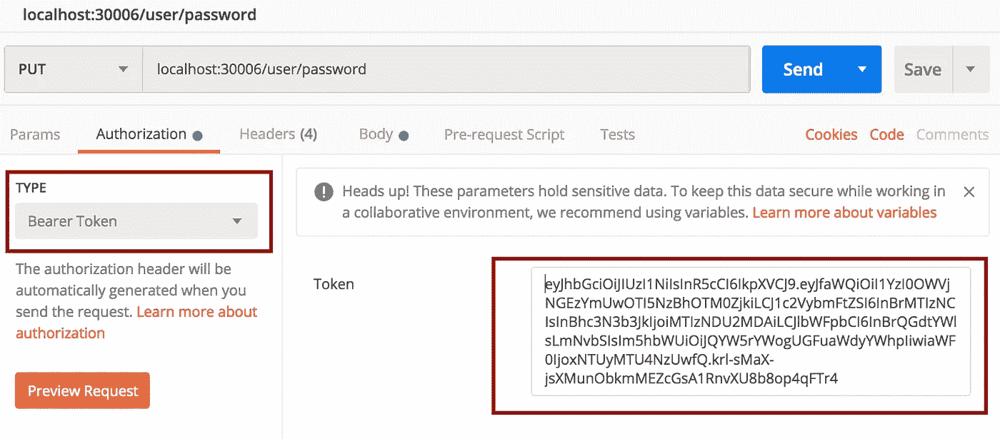
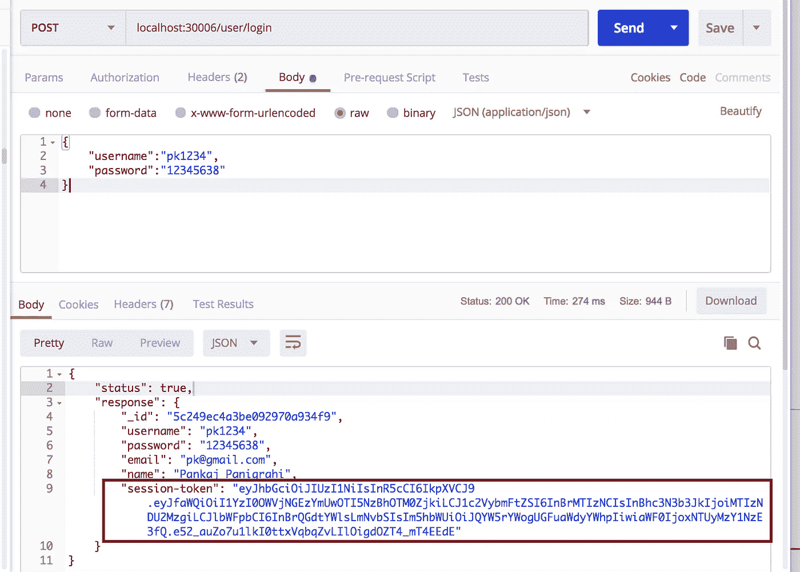
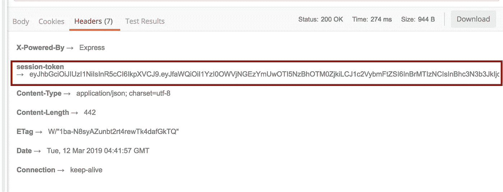
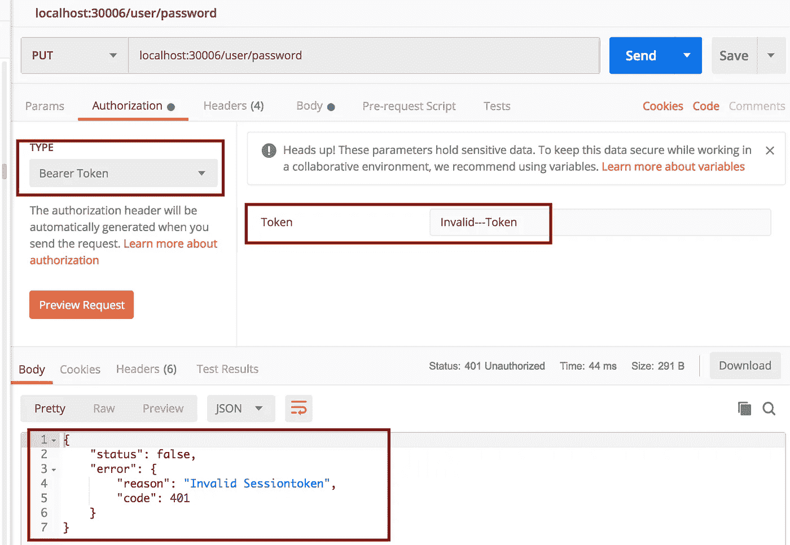
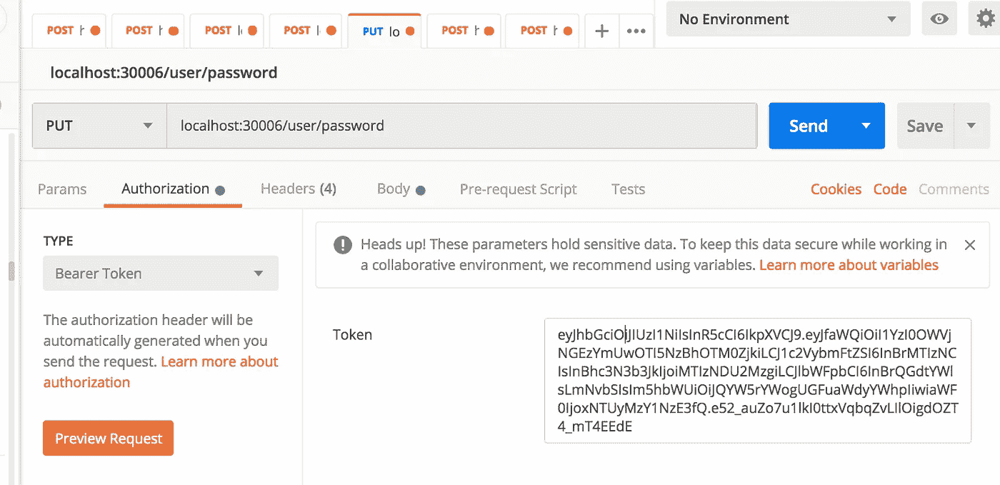
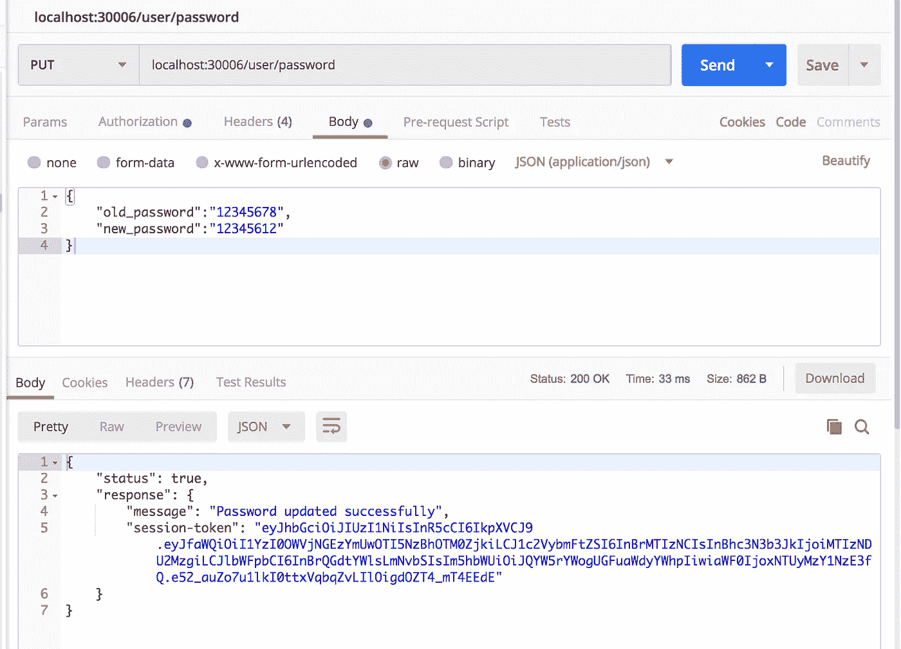

# 通过 Node.js 使用 JWT 进行身份验证和授权

> 原文：<https://betterprogramming.pub/authentication-and-authorization-using-jwt-with-node-js-4099b2e6ca1f>


这篇文章将帮助你理解 [Node.js](https://nodejs.org/) 背后的不同概念，并使你能够创建生产就绪的应用程序。这篇文章期望读者了解巴别塔以及如何设置它。如果需要学习巴别塔设置，请阅读这篇[文章](https://medium.com/@pankaj.panigrahi/using-babel-and-other-dependencies-in-node-js-18f74973c1f0)。

本文将只关注使用 [JWT](https://jwt.io/) 为我们的 REST APIs 提供认证。如果我们想阅读更多关于认证方法的内容，并了解如何使用 [Redis](https://redis.io/) 来执行相同的操作，请阅读本系列的第[6 篇文章](https://medium.com/@pankaj.panigrahi/authentication-and-authorization-using-redis-49c5f0e6b311)。

JSON Web Token (JWT)是一个开放标准，它定义了一种紧凑的自包含方式，以 JSON 对象的形式在各方之间安全地传输信息。该信息可以被验证和信任，因为它是数字签名的。

授权是使用 JWT 最常见的场景。用户登录后，每个后续请求都将包含 JWT，允许用户访问该令牌允许的路由、服务和资源。单点登录是目前广泛使用 JWT 的一个特性，因为它的开销很小，并且能够很容易地跨不同的域使用。

使用 JWT 进行授权有一些优点:

1.  纯粹的无国籍。不需要额外的服务器或基础设施来存储会话信息。
2.  它可以很容易地在服务之间共享。

在其紧凑的形式中，JSON Web 令牌由点(`.`)分隔的三个部分组成，它们是:

*   页眉
*   有效载荷
*   签名

因此，JWT 通常如下所示。

`xxxxx.yyyyy.zzzzz`

TK 让我们从我做的一个[锅炉板](https://github.com/pankaj805/medium-00_boiler_with_db)开始，它将在以后的文章中使用。如果你一开始就跟着系列走，锅炉板块应该很清楚了。

我们将使用 npm 模块来实施 JWT:

[](https://www.npmjs.com/package/jsonwebtoken) [## jsonwebtoken

### JSON Web 令牌实现(对称和非对称)

www.npmjs.com](https://www.npmjs.com/package/jsonwebtoken) 

在项目中安装上述模块:

```
npm install jsonwebtoken --save
```

我们将构建两个 API。第一个 API 是“登录”API，它应该返回新的会话令牌，另一个 API 将更新密码，这将需要登录用户的有效会话令牌。

让我们首先添加一个服务方法来更新用户的密码。

所以最后`services/UserService.js`应该是这样的:

现在让我们编辑我们的`common/authUtils.js`文件来处理期望的场景。

```
import jwt from 'jsonwebtoken';const newSessionRoutes = [{ path: '/user/login', method: 'POST' }];
const authRoutes = [{ path: '/user/password', method: 'PUT' }];const SECRET_KEY = "JWT_SECRET";
```

导入`jsonwebtoken`模块并定义三个`constants`，第一个包含需要新会话的 API 方法数组，第二个包含需要有效会话的 API 方法数组。第三方应该保存用于数据加密的密钥。

添加上面的方法来检查传递的 API 需要新的会话还是旧的会话。

`generateJWTToken()`方法应该获取用户数据，用预定义的密钥加密，然后生成`jwtToken`字符串。

`verifyToken()`方法应该接受`jwtToken`字符串并返回解密后的数据。在无效令牌字符串的情况下，它将转到 catch 块和`return null`。

所以我们的`authUtils`文件应该是这样的:

现在让我们编辑`app.js`文件。

```
import {clientApiKeyValidation} from './common/authUtils';
```

将上面的行更新如下:

```
import { clientApiKeyValidation, isNewSessionRequired, isAuthRequired, generateJWTToken, verifyToken } from './common/authUtils';
```

现在，在我们注入了`clientApiKeyValidation` **的那一行之后添加下面的代码。**

通过上面的代码，我们注入了另一个请求处理器，它将为所有 API 处理与会话相关的东西。首先，我们检查被调用的 API 是否需要一个新的会话。在这种情况下，我们只是设置了一个`boolean`字段，稍后我们将在响应处理程序中使用它。

现在来看第二种情况:

这里我们假设请求将带有一个承载令牌报头，如下所示:



我们已经将 JWT 令牌传递给了我们之前定义的`verifyToken`方法。如果我们获得了解密的用户数据，我们将相同的数据设置到请求对象中的一个字段。

否则，我们会发送一条带有`Invalid session-token`消息的错误。

现在，在我们所有的路由注入之后，让我们也为我们所有的 API 修改响应处理程序。

在需要新会话的情况下，我们生成 JWT 令牌并在 API 响应中发送它。

在另一种情况下，会话令牌被传递给 API，我们在响应中发送相同的会话令牌。

所以我们的`app.js`代码看起来像这样:

现在让我们转到我们的`routes/user.js`文件。

更新导入语句，使其也包含`updateUserPassword`方法。

```
import { getUserDetails, updateUserPassword } from '../services/UserService';
```

登录 API 的代码如下:

在这里，我们还可以添加另一个条件来检查请求数据中是否缺少用户名或密码。首先，我们尝试通过传递用户名来获取用户的详细信息。在数据丢失的情况下，我们会发送一条错误消息，声明“用户名无效”。否则我们尝试比较密码。

如果密码不匹配，我们会发送一个错误。否则，我们更新响应数据对象和请求会话对象中的用户数据。我们的响应处理程序将使用相同的数据来创建 JWT 令牌。

现在让我们为更新后的密码 API 添加代码。

这是代码中有趣的部分。在这里，我们将看到如何从会话令牌中获取所有用户的详细信息。请求中没有提到用户详细信息或用户名。但是我们作为请求处理程序注入的会话处理程序必须在请求会话对象中注入用户数据。

```
let uname = req.session.userData.username;
```

我们从请求会话对象中获取用户名，然后执行更新用户密码所需的所有操作。

现在让我们测试我们的代码。使用节点`index.js`命令运行项目。

现在点击登录 API:



我们在响应头和响应体中发送会话令牌。

现在，尝试使用无效的令牌点击更新密码 API:



复制我们之前在登录 API 响应中获得的会话令牌，并将其传递到更新密码 API 的头中。



在上一篇文章中，我们使用 Redis 获得了相同的结果。这两种方法都可以用来实现无状态身份验证。

我更喜欢使用 Redis，因为使用 JWT 有以下缺点:

1.  **对客户端的控制更少:**假设出于某种原因，我们希望使您系统中的所有会话无效。在 Redis 中，您可以通过删除所有键轻松做到这一点。在某个时间点，人们不知道登录的客户端的数量。假设您想要将一些消息推送到登录的设备。在 JWT 实施中不可能做到这一点。
2.  **有效负载开销:**在 Redis 中，令牌大小是固定的。但是在 JWT，令牌大小与您想要添加到会话中的数据量成正比。如果您有大量数据要存储，这肯定会影响 API 的性能。
3.  **更改会话:**在某些情况下，您可能希望修改正在运行的会话中的会话数据。使用 Redis 方法可以很容易地做到这一点，因为令牌不会改变。但是在 JWT，当数据改变时，令牌也会改变。因此，客户端必须跟踪这一点，这使得集成很麻烦。

尽管如此，JWT 仍然解决了许多用例，并且非常容易实现。

如果你喜欢这篇文章，你可以👏并与他人分享。