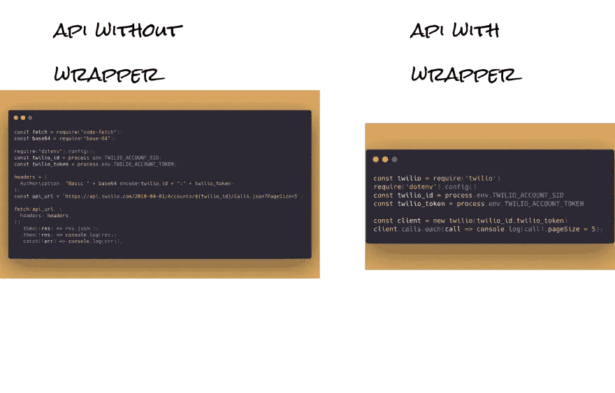
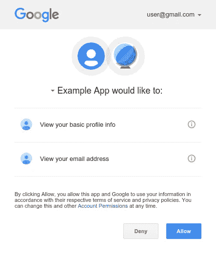
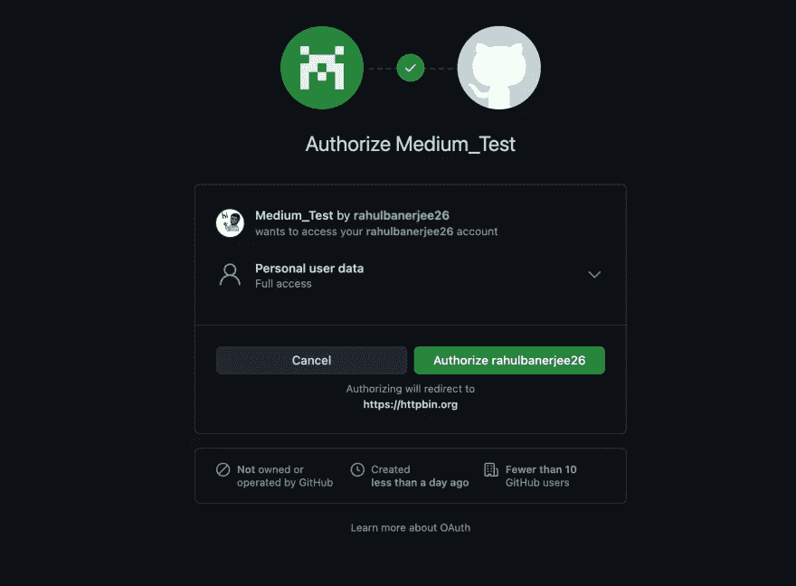

# JavaScript 中的身份验证:使用密钥、BasicAuth 和 OAuth2

> 原文：<https://betterprogramming.pub/authentication-in-javascript-using-keys-basicauth-and-oauth2-8360ce624d3a>

## 并不是所有的 API 都像 Twilio 一样有完整的文档。本指南帮助您使用通过密钥、BasicAuth 或 OAuth 保护的 API


玛利亚·齐格勒在 [Unsplash](https://unsplash.com?utm_source=medium&utm_medium=referral) 上拍摄的照片

我们将使用以下 API:

*   [狗的事实](https://dukengn.github.io/Dog-facts-API/)
*   [卡特彼勒 API —卡特彼勒服务](https://thecatapi.com/)
*   [Twilio API](https://www.twilio.com/docs/usage/api)
*   [GitHub API](https://docs.github.com/en/rest)
*   [Genius API](https://docs.genius.com/)

如果您对类似的 Python 指南感兴趣，请查看我以前的文章[。](https://www.realpythonproject.com/how-to-authenticate-using-keys-basicauth-oauth-in-python/)

希望对 JavaScript 中的承诺有所了解。查看 Eric Elliott[Insecure APIs](https://medium.com/u/c359511de780#6c6c) [Reading values from .env files](#3d69)
[APIs with keys](#bc2e)
[APIs with basic auth](#8bb3)
[API wrappers](#ad0d)
[APIs secured via OAuth2](#fee4)
[Using the GitHub API (OAuth2)](#7ab6)
[Using the Genius API (OAuth2)](#2ae3)

希望对承诺和异步/等待有所了解。我将在一个 [NodeJS](https://nodejs.org/en/) 环境中运行代码。

你可以在 [GitHub](https://github.com/rahulbanerjee26/javascript_apis) 中找到源代码。

# 不安全的 API

[Dog Facts API](https://dukengn.github.io/Dog-facts-API/) 不需要任何认证，并且是公开可用的。使用它相当简单。

我们将向以下端点发出请求:

```
[https://dog-facts-api.herokuapp.com/api/v1/resources/dogs/all](https://dog-facts-api.herokuapp.com/api/v1/resources/dogs/all)
```

首先，我们需要安装节点获取库:

```
npm install node-fetch
```

现在，让我们用 JavaScript 向上述端点发出 GET 请求:

```
const fetch = require("node-fetch");const apiURL = "https://dog-facts-api.herokuapp.com/api/v1/resources/dogs/all";
console.log(`Making Request to ${apiURL}`);
fetch(apiURL)
  .then((result) => result.json())
  .then((res) => {
    res.map((element, idx) => console.log(`${idx}. ${element.fact}`));
  })
  .catch((err) => console.log(err));
```

我们导入节点获取库并向端点发出请求。我们添加一个`.then`来解析承诺，添加一个`.catch`来处理错误。

# 阅读来自。环境文件

在进入下一节之前，让我们看看如何从一个`.env`文件中读取变量。强烈建议将您的凭证存储在一个`.env`文件中，以避免它们暴露给其他人。

我们需要安装 dotenv 库:

```
npm install dotenv
```

假设我们有一个带有随机 API 令牌的`.env`文件:

```
API_TOKEN = "SOME API TOKEN"
```

让我们尝试用 JavaScript 读取 API 令牌:

```
require('dotenv').config()const API_KEY=  process.env.API_KEY
```

# 带键的 API

这是使用 API 时最常见的身份验证形式。在发出请求时，API 密钥/令牌作为标头传入。我们将使用[卡特彼勒 API —卡特彼勒服务](https://thecatapi.com/)。你可以在这里得到一把钥匙。

```
const fetch = require("node-fetch");
require("dotenv").config();const CAT_API_KEY = process.env.API_KEY;
const headers = {
  "x-api-key": CAT_API_KEY,
};
const api_url = "https://api.thecatapi.com/v1/breeds";fetch(api_url, {
  headers: headers,
})
  .then((result) => result.json())
  .then((res) => {
    res.map((element, idx) =>
      console.log(`${idx}. ${element.name} : ${element.description}`)
    );
  })
  .catch((err) => console.log(err));
```

我们创建了一个名为`headers`的对象来存储 API 密钥。对象中的关键是`x-api-key`。但是，这可能会因您使用的 API 而异。有些 API 要求将键命名为`Authorization`、`authorization`、`token`等。最好参考您的 API 文档的认证部分。

载体认证很常见，它要求单词`Bearer` (注意后面的空格)在 API token/ey 的开头。

```
headers = {
    "authorization": f"Bearer {access_token}"
}
```

我们将在后面的示例中使用载体认证。

# 具有基本身份验证的 API

使用基本身份验证保护的 API 需要用户名和密码。通常，用户名是客户端 ID，密码是 API 的客户端机密。在某些情况下，用户名可以留空。这应该在 API 文档中提及。

使用基本认证来保护 [Twilio API](https://www.twilio.com/docs/usage/api) 。你可以在 Twilio 网站上注册并获得 API 证书。

我们将使用 base-64 库，您可以使用 npm 安装该库:

```
npm install base-64
```

唯一的区别是在发出 GET 请求时我们将传递的`headers`对象。我们将使用如下所示的标题对象:

```
headers = {
    'Authorization' : 'Basic ' + base64.encode(twilio_id + ":" + twilio_token)
}
```

注意`Basic` 后面有一个空格。

对于 Twilio，用户名是您的帐户 ID，密码是您的帐户令牌。如前所述，对于不同的 API，它可以是不同的。如果您使用的 API 使用基本身份验证来保护其端点，请参考文档以获取用户名和密码。

现在让我们向 Twilio API 发出一个请求:

```
const fetch = require("node-fetch");
const base64 = require("base-64");require("dotenv").config();
const twilio_id = process.env.TWILIO_ACCOUNT_SID;
const twilio_token = process.env.TWILIO_ACCOUNT_TOKEN;headers = {
  Authorization: "Basic " + base64.encode(twilio_id + ":" + twilio_token),
};
const api_url = `https://api.twilio.com/2010-04-01/Accounts/${twilio_id}/Calls.json?PageSize=5`;fetch(api_url, {
  headers: headers,
})
  .then((res) => res.json())
  .then((res) => console.log(res))
  .catch((err) => console.log(err));
```

如您所见，该代码与我们向 Cat API 发出请求时编写的代码非常相似，唯一的区别在于`headers`对象。

# API 包装

API 包装器本质上是可以使用 npm 安装的包。它们使与 API 的交互更加容易，并使您的代码看起来更加整洁。在幕后，这个包将使用 fetch 和 headers 来验证您的请求。然而，包装器使代码看起来更干净。

Twilio 有一个可以使用 npm 安装的包装器:

```
npm install twilio
```

让我们使用 Twilio 包装器与 Twilio API 进行交互:

```
const twilio = require('twilio')
require('dotenv').config()
const twilio_id = process.env.TWILIO_ACCOUNT_SID
const twilio_token = process.env.TWILIO_ACCOUNT_TOKENconst client = new twilio(twilio_id,twilio_token)
client.calls.each(call => console.log(call),pageSize = 5);
```



作者截图

为了处理错误，我们可以将代码放在 try 中..接住滑轮。

不幸的是，不是所有的 API 都有包装器。然而，他们中的许多人确实如此。在直接使用 API 之前，尝试为它搜索一个包装器。这将大大简化 API 的使用。

# 通过 OAuth2 保护的 API

[OAuth2](https://oauth.net/2/) 当你需要“使用谷歌注册”或“使用脸书注册”选项时，web flow 通常用于在 Express 应用程序中进行身份验证。然而，一些 API 需要 OAuth2 用于它们的所有端点。GitHub API 支持 OAuth2 认证以及基于密钥的认证。在本文中，我们将使用 OAuth web 流来处理 GitHub API 和 Genius API。

关于 OAuth2 是如何工作的，我不会说得太详细，因为这超出了本文的范围。下面是一个高层次的概述。如果没有意义，跳到 GitHub 或者 Genius API 部分，应该会更有意义。

*   我们将不得不在 API 的网站上创建一个客户端应用程序。
*   客户端应用程序将有一个客户端 ID 和客户端密码。
*   我们必须向 API 的认证端点发出请求。客户端 ID 和客户端密码将作为查询参数传递。
*   身份验证端点将请求许可，并且必须被授权。



作者截图

*   一旦授权，它将返回一个代码。
*   该代码将必须被提供给另一个端点，该端点将把它交换为访问令牌。
*   这个访问令牌现在可以用作密钥，并在向端点发出请求时作为 header 对象传递。

让我们来看几个例子。

# 使用 GitHub API (OAuth2)

如上所述，OAuth2 主要用于 Express 应用程序。使用 OAuth2 时，您将需要一个 web 应用程序 URL 和一个 URL，以便在用户授权/授予权限后将用户重定向到该 URL。由于我们没有网络应用程序，我们没有任何网址。但是，我们可以使用 [HTTPBin](https://httpbin.org/) 。每当我们需要一个 URL 时，我们可以使用下面的 URL:

```
[https://httpbin.org/anything](https://httpbin.org/anything)
```

首先，你必须[创建一个 GitHub 应用](https://docs.github.com/en/developers/apps/building-github-apps/creating-a-github-app)。当询问 web 应用程序 URL 或重定向 URL 时，使用上面讨论的 URL。创建应用程序后，将客户端 ID 和客户端密码存储在`.env`文件中。

我们将使用 async/await 编写我们的代码，使其更具可读性。

```
const client_id = process.env.GITHUB_API_CLIENT_ID;
  const client_secret = process.env.GITHUB_API_CLIENT_SECRET;
  const redirect_uri = "https://httpbin.org/anything"; let params = {
    client_id: client_id,
    redirect_uri: redirect_uri,
    scope: "user",
  }; let endpoint = "https://github.com/login/oauth/authorize?";
  endpoint = endpoint + new URLSearchParams(params); const open = require("open");
  open(endpoint);
```

前几行只是从我们的`.env`文件中读取凭证。params 对象包含客户机 ID、重定向 URL(我们前面讨论过的 HTTPBin URL)和作用域。范围的值决定了可以访问的端点和可以执行的 HTTP 谓词操作。

为了给我们的 URL 添加参数，我们可以使用`URLSearchParams`。要打开 URL，我们将使用`open()`功能。可以使用 npm 安装它:

```
npm install open
```

单击 Authorize 后，您应该被重定向到 HTTPBin URL，并且应该显示一个 JSON 对象。查看键“代码”的值这个值将被交换成一个 API 令牌。



作者截图

我们可以使用 readline-sync 来获取输入。

```
npm install readline-sync
```

我们将等待用户输入他们的访问代码:

```
const readlineSync = require("readline-sync");
  const access_code = readlineSync.question("Please enter the access code ");
  console.log("CODE IS ", access_code);
```

一旦我们获得了代码，我们向一个端点发出另一个请求来获得一个访问令牌。这一次，我们将代码和客户机秘密作为参数传递。在 GitHub 验证了凭证和代码之后，它将返回一个访问令牌。这个访问令牌可以用作 API 密钥。

```
params["client_secret"] = client_secret;
  params["code"] = access_code;
  const access_token_url = "https://github.com/login/oauth/access_token?";
  let response = await fetch(access_token_url + new URLSearchParams(params), {
    headers: { Accept: "application/json", method: "POST" },
  });
  let data = await response.json();
  const access_token = data["access_token"];
  console.log(access_token);
```

这个访问令牌可以用来验证我们自己并向 API 端点发出请求。

```
const headers = {
    Authorization: `token ${access_token}`,
  }; const base_api_endpoint = "https://api.github.com/user";
  response = await fetch(base_api_endpoint + "/repos", {
    headers: headers,
  });
  data = await response.json();
  console.log(data);
```

# 使用 Genius API (OAuth2)

让我们看另一个例子。我将跳过导入包和阅读凭证的部分。

```
let params = {
    client_id: genius_client_id,
    redirect_uri: redirect_uri,
    response_type: "code",
    scope: "me",
  }; let endpoint = "https://api.genius.com/oauth/authorize?";
  endpoint = endpoint + new URLSearchParams(params); const open = require("open");
  open(endpoint);
```

对于某些 API 来说，`response_type`是强制的，其值应该总是`“code”`。


作者截图

在我们授权之后，我们将看到一个 JSON 对象，类似于我们在使用 GitHub API 时看到的对象。输入代码。

```
const readlineSync = require("readline-sync");
  const access_code = readlineSync.question("Please enter the access code ");
  console.log("CODE IS ", access_code); params["client_secret"] = genius_client_secret;
  params["code"] = access_code;
  params["grant_type"] = "authorization_code"; const access_token_url = "https://api.genius.com/oauth/token?";
  let response = await fetch(access_token_url + new URLSearchParams(params), {
    headers: { Accept: "application/json" },
    method: "POST",
  });
  let data = await response.json();
  const access_token = data["access_token"];
  console.log(access_token);
```

`grant_type`也是一些 API 所要求的。值总是`“authorization_code”`。在我们的代码被验证之后，我们得到一个访问令牌。这个令牌可以用作 API 密钥。

```
const headers = {
    authorization: `Bearer ${access_token}`,
  }; const base_api_endpoint = "https://api.genius.com/account";
  response = await fetch(base_api_endpoint, {
    headers: headers,
  });
  data = await response.json();
  console.log(data);
```

Genius API 使用不记名身份验证。

# 结论

我希望这篇文章能成为在 JavaScript 中使用 API 的好指南。在直接使用 API 之前，总是要寻找一个包装器。你花五分钟找一个包装纸可能会让你省去几个小时的头痛。

*原贴于*[*【realpythonproject.com】*](https://www.realpythonproject.com/how-to-authenticate-using-keys-basicauth-oauth2-in-javascript/)

*在*[*LinkedIn*](https://www.linkedin.com/in/rahulbanerjee2699/)*，* [*Twitter*](https://twitter.com/rahulbanerjee99) 上与我联系