# 使用 Sphinx 自动记录 Python 项目

> 原文：<https://betterprogramming.pub/auto-documenting-a-python-project-using-sphinx-8878f9ddc6e9>

## 自动记录 Python 代码的分步指南

Jason Blackeye 在 [Unsplash](https://unsplash.com/photos/nyL-rzwP-Mk) 上拍摄的照片

虽然完整的文档是必要的，但它经常被搁置，被看作是一件琐事和低优先级的任务。作为一名开发人员，很容易回到“当你，作者，确切地知道它在做什么的时候，为什么要记录代码？”当代码快速变化时，保持文档最新成为一个更大的负担。

幸运的是，由于 [Sphinx](https://www.sphinx-doc.org/en/master/) 的功能，不需要手动写出文档，这是一个从代码中的文档字符串自动生成文档的工具。

下面是使用 Sphinx 从 Python 代码中轻松自动生成整洁有序的文档的分步指南。

# 1.安装 Sphinx

Sphinx 可以使用 pip 安装，方法是打开终端并运行`pip install -U Sphinx`，或者下载官方的 [Python 包](https://pypi.org/project/Sphinx/#files)。

[这里的](https://www.sphinx-doc.org/en/master/usage/installation.html)是概述安装 Sphinx 的其他方式的官方页面，取决于您的平台。

# 2.初始化 Sphinx 配置

在项目的根目录中，运行`sphinx-quickstart`来初始化 sphinx 源目录以创建默认配置。运行该命令将提示您填写一些基本的配置属性，例如是否创建单独的源和构建目录、项目名称、作者姓名和项目版本。

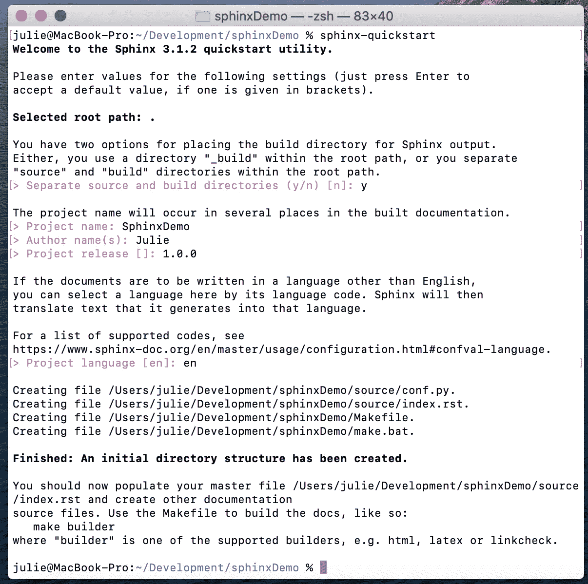

使用 **sphinx-quickstart** 初始化 sphinx 配置

如上图所示，运行`sphinx-build`命令会创建一个`Makefile`、`make.bat`文件以及`build`和`source`目录。

# 3.更新 conf.py 文件

`source`文件夹中的`conf.py`文件描述了 Sphinx 配置，它控制 Sphinx 如何构建文档。如果您希望覆盖主题、版本或模块目录，您需要在这里覆盖这些更改。以下是一些推荐的覆盖:

## **更新主题**

斯芬克斯的默认主题是[雪花石膏](https://alabaster.readthedocs.io/en/latest/)。有许多现有的[主题](https://www.sphinx-doc.org/en/1.8/theming.html)可供选择，甚至可以创建自己的主题。一个推荐的主题是`sphinx_rtd_theme`，这是一个好看的，现代的，移动友好的主题。

要使用`sphinx_rtd_theme`，你需要安装 sphinx-rtd-theme Python 包，方法是在终端运行`pip install sphinx-rtd-theme`，或者在这里下载主题。

更新`conf.py`文件中的`html_theme`变量，指向所需的主题名称:

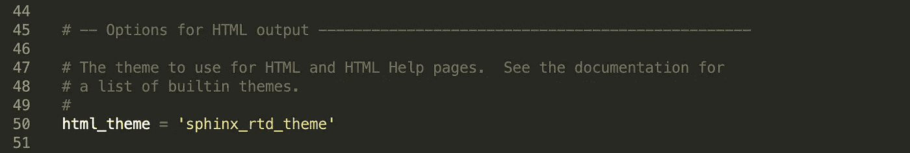

## **更新版本**

在每个发布过程中，您会想要更新文档版本以指向项目发布版本，无论是手动的还是使用自动化的过程。

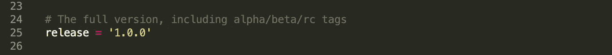

## **指定 Python 模块的位置**

更新系统路径指向项目的模块目录，这样 sphinx 就可以找到源文件。第 13–15 行将模块目录附加到系统路径，默认情况下被注释掉。取消对这些行的注释，并更新显示`sys.path.insert(0, os.path.abspath(‘.’))`的行，以附加包含 Python 模块的目录。

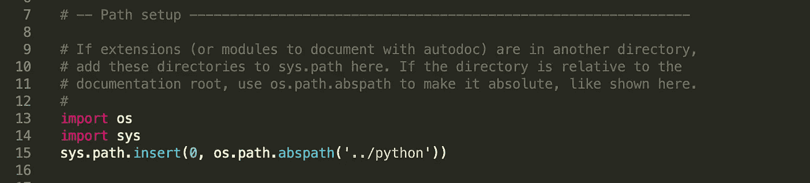

## **增加对 autodoc 的扩展支持**

`extensions`变量被分配给构建文档所需的扩展列表。例如，如果您计划使用 [autodoc 指令](https://www.sphinx-doc.org/en/master/usage/extensions/autodoc.html)包含文档，您需要通过将`sphinx.ext.autodoc` 添加到扩展列表来激活它。

## **增加对 NumPy 和 Google Doc 风格文档字符串的扩展支持**

当然，这是可选的，取决于首选的 docstring 格式。如果你的代码中的文档遵循 [Google Python 风格指南](https://google.github.io/styleguide/pyguide.html)，你需要将`sphinx.ext.napoleon`添加到扩展列表中。

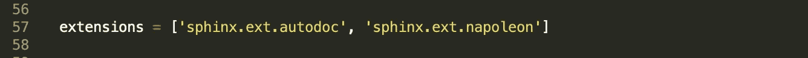

# 4.自动生成 rst 文件

Sphinx 从 reStructuredText (rst)文件生成 HTML 文档。这些 rst 文件描述了每个网页，并且可能包含 autodoc 指令，这些指令最终将以自动方式从文档字符串生成文档。有一种自动生成这些文件的方法，所以没有必要为每个类和模块手工写出 autodoc 指令。

`sphinx-autodoc`命令将从您的代码中自动生成带有 [autodoc 指令](https://www.sphinx-doc.org/en/master/usage/extensions/autodoc.html)的 rst 文件。只有在项目中添加了新模块时，才需要运行该命令。

首先，确保`sphinx.ext.autodoc`扩展包含在`conf.py`的扩展列表中，如上一节所述。

要自动生成 rst 文件，使用以下语法运行`sphinx-apidoc`命令:

`sphinx-apidoc -o <OUTPUT_PATH> <MODULE_PATH>`

在我们的例子中，输出目录是`source`，模块目录是`python`。

`sphinx-apidoc -f -o source python`

运行`sphinx-apidoc -o source python` 命令将生成 rst 文件`test.rst`和`modules.rst`。`test.rst`包含写出`test.py`中的类和函数的文档的指令，而`modules.rst`包含在模块页面上包含的模块文件的列表(即测试)。

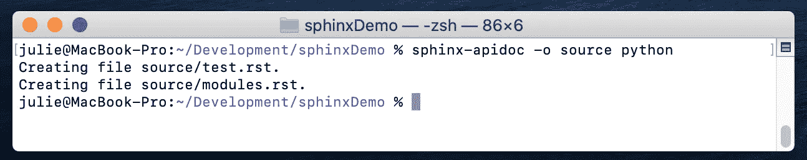

使用 **sphinx-apidoc** 生成 rst 文件

test.rst

# 5.构建 HTML

现在您已经设置了配置和 rst 文件，我们现在可以从主目录中的终端运行`make html`命令来生成 HTML 文件。HTML 文件将在 build/HTML 文件夹中创建。

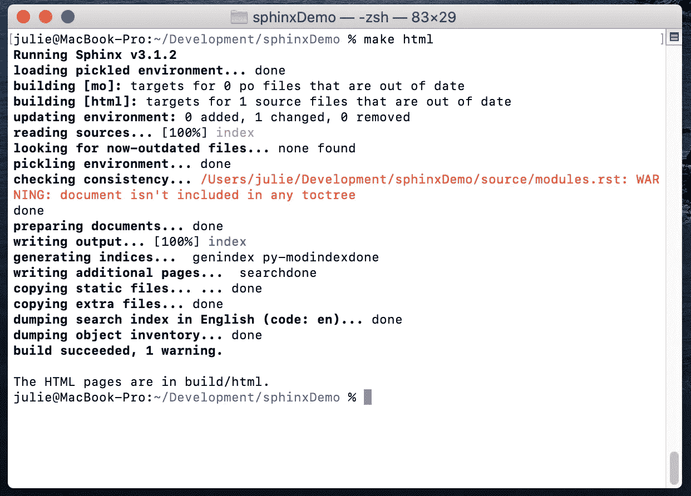

使用**创建 HTML** 构建 HTML

正如您在这个特殊的例子中看到的，发出警告`Warning: "Document isn't included in any toctree`是因为我们没有将 modules.rst 文件包含在任何 toctree 中。要解决这个问题，在`index.rst`中的 toctree 指令下添加`modules`，如下所示:

index.rst

再次运行构建:

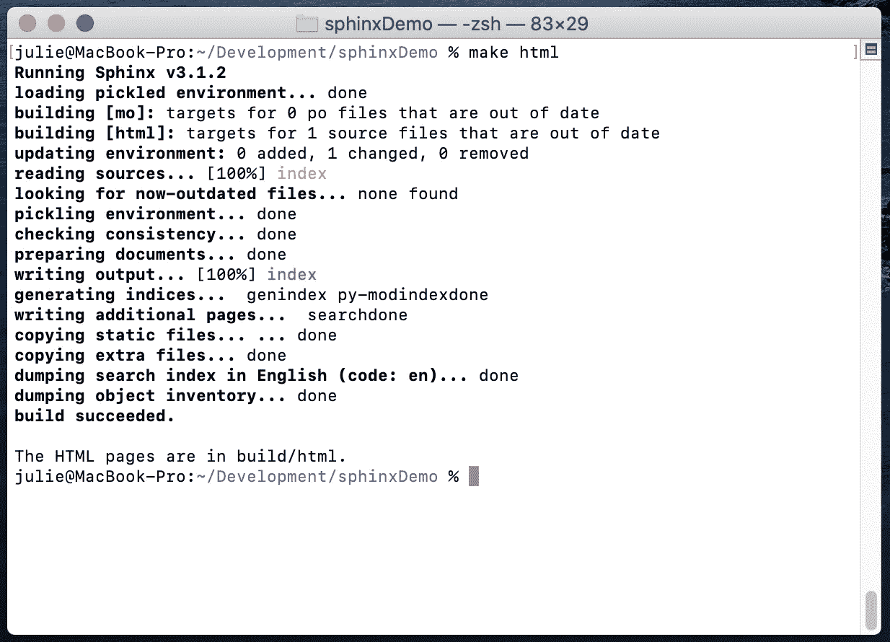

HTML 文件是在 build/HTML 文件夹中生成的。在浏览器中打开 index.html，查看生成的文档:

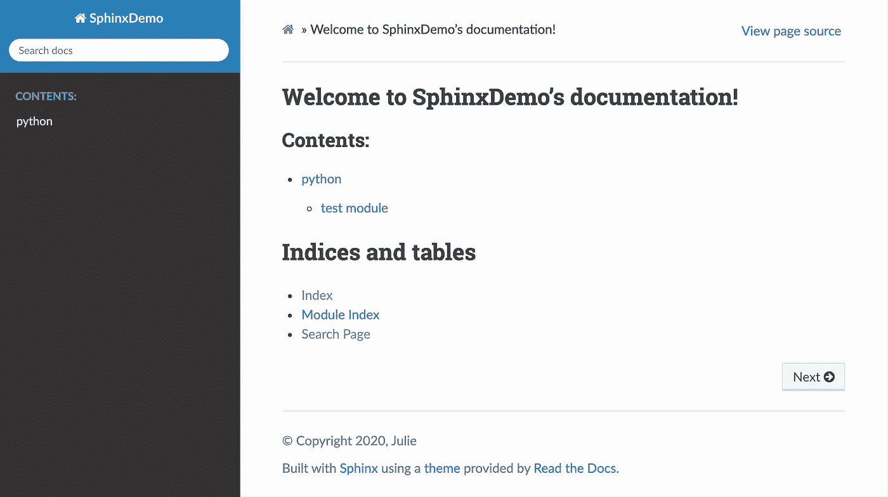

index.html

# 6.高级 Sphinx 标记

还有额外的 Sphinx [指令](https://www.sphinx-doc.org/en/master/usage/restructuredtext/directives.html)，这将帮助您的文档看起来更现代、更有条理。下面是一些最有用的特性，可以帮助您进一步定制文档。所有示例都是用`sphinx_rtd_theme`生成的:

## **目录**

Sphinx 使用一个定制的指令，称为**to tree**指令，以树或目录的形式描述不同文件之间的关系。

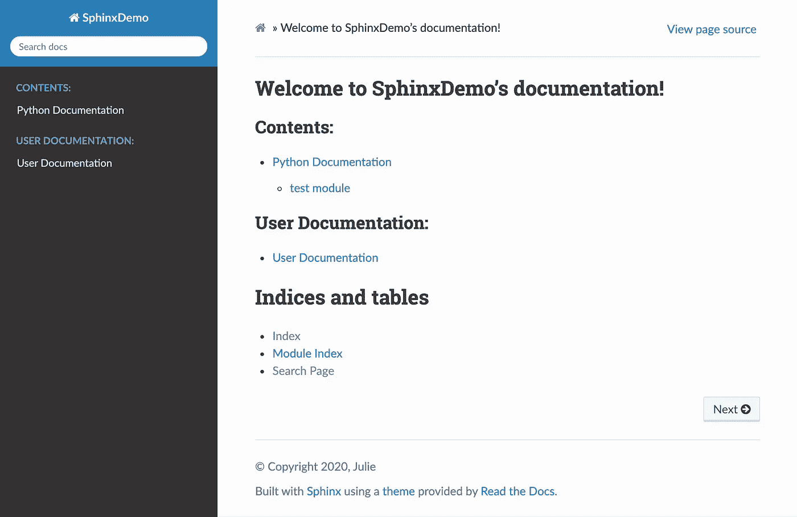

渲染到树示例

## 便笺盒

可以使用**注释**指令创建注释框。

`.. note:: This is a **note** box.`

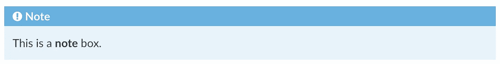

渲染注释示例

## 警告框

可以使用**警告**指令创建一个警告框。

`.. warning:: This is a **warning** box.`

渲染警告示例

## 图像

可以使用**图像**指令添加图像。

## 桌子

可以使用**表**指令添加一个表。

带有嵌入图像的渲染表格示例

# 资源

*   [斯芬克斯文档](https://www.sphinx-doc.org/en/master/usage/index.html)
*   [重组文本指南](https://docutils.sourceforge.io/rst.html)
*   [谷歌 Python 风格指南](https://google.github.io/styleguide/pyguide.html)
*   [使用 Sphinx、Breath 和 Doxygen 自动生成 C++文档](https://devblogs.microsoft.com/cppblog/clear-functional-c-documentation-with-sphinx-breathe-doxygen-cmake/)

# 结论

在本文中，我们介绍了为任何 Python 项目配置和构建 Sphinx 文档所需的基础知识。Sphinx 依赖于 rst 文件，因此 reStructuredText 可以处理的任何定制都是可能的。在生成文档方面，熟悉 Sphinx 和自动化工具的功能有望鼓励您编写和维护最新的文档。