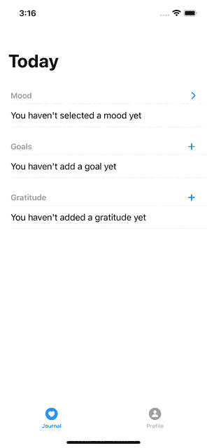
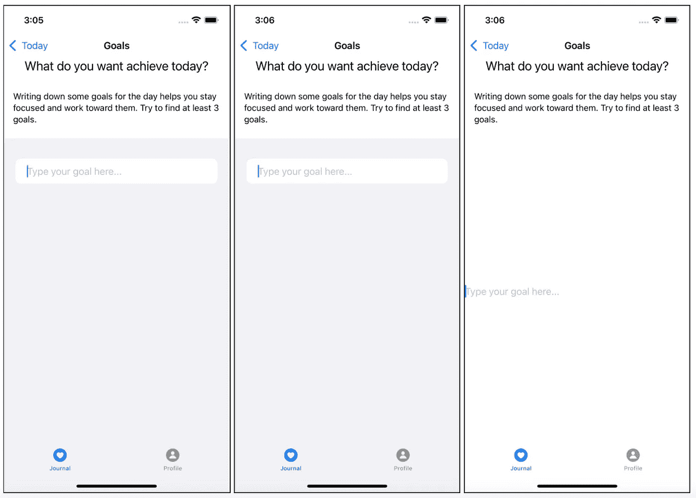

# 在 iOS 15 中使用 SwiftUI 自动扩展列表

> 原文：<https://betterprogramming.pub/auto-expanding-lists-with-swiftui-in-ios-15-c525c7c80e5e>

## 在 SwiftUI 中创建一个自动扩展列表可能比预期的要困难

雅各布·基索在 [Unsplash](https://unsplash.com?utm_source=medium&utm_medium=referral) 上拍摄的照片

SwiftUI 是苹果在 2019 年 9 月发布的声明式框架。它有望彻底改变我们编写应用的方式，不仅在 iOS 上，而且在 macOS、watchOS 和 tvOS 上。

该框架的第一个版本是有限的，并且有一些性能问题。苹果故意带着这些问题[发布了它](https://www.swiftbysundell.com/podcast/59):目标是收集来自社区的反馈，并与社区合作开发框架。

两年过去了，框架改进了很多。它有新的功能，可以用来实现更复杂的 ui 和 uxe。这可能是实现比基本东西更复杂的东西的好时机。

# 目标

在今天的文章中，我想实现一个项目列表，用户只需使用键盘就可以无缝地修改它。

这个列表可以用于许多用例:待办事项列表、目标列表、任务、杂货等等。目标是当用户按下键盘上的`return`时添加条目，当用户点击`delete`按钮时删除一个空条目。下面的视频展示了我们想要达到的目标。

总结一下我们想要的:

1.  列表以空元素开始。
2.  用户可以输入一些文本。
3.  按下键盘上的`return`，一个新的空白字段被添加到列表中，它应该被聚焦。作为一种可能的改进，只有当`TextField`不为空时，我们才能添加新项目。
4.  如果用户删除了`TextField`中的所有文本并再次按下`delete`，我们想要删除当前的`TextField`。
5.  至少应该有一个空的`TextField`供用户添加新元素。

# 最初的看法

让我们从视图的脚手架开始。视图的标题由标题和副标题组成。然后，一个`[Form](https://developer.apple.com/documentation/swiftui/form)`组件包含了`TextField`的列表。

一个`Form`是一个很好的"*容器，用于分组用于数据输入的控件，比如在设置或检查器中"-*引用文档。它为其内容提供了依赖于平台的样式，就像`List`一样。

下图显示了如果我们把一个`TextField`变成一个`Form`，变成一个`List`，变成一个简单的`VStack`，会发生什么。

表单(第一张图)、列表(第二张图)和 VStack(第三张图)中的文本字段。

可以看到，`Form` s 和`List` s 自动为我们应用了一些样式，节省了很多时间。

让我们从创建 SwiftUI `View`的基本结构开始。

在这个代码片段中，我们正在创建`View`的基本结构。我们在一些计算属性中提取了`body`属性的内容，以保持其可读性。我们有一个标题属性、一个说明属性和一个表单属性。

该表单目前为空，但我们很快就会填充它。

## 国家及其约束力

对于这个例子，我们想要跟踪用户可以为一天设置的一些目标。我们事先不知道用户将添加多少个目标，所以我们需要将它们存储在一个数组中。

让我们添加`goals`属性并用`@State`属性包装器标记它，这样`View`就可以更新它。

假设我们总是希望至少有一个`TextField`，数组以一个空目标开始。

为了让`View`更新数组，我们需要将它与`View`绑定。主要方法是使用`[ForEach](https://developer.apple.com/documentation/swiftui/foreach)`组件。有两种不同的`init` s:一种取常数范围；另一个获取我们可以在运行时更新的对象列表。

目标列表的大小会随着用户的更新而增长，所以让我们使用第二个初始化器。

在代码中，我们添加了`ForEach`组件。`ForEach`要求所有项目都有唯一的`id`。作为第一次尝试，我们可以使用目标本身:我们不想要一个重复的目标。但是，如果我们运行应用程序并尝试，我们会发现在每次输入之后，当前文本字段会失去焦点。

发生这种情况是因为我们正在修改也是标识符的目标。当状态改变时，SwiftUI 更新屏幕并呈现其内容。该表单是一个新表单，它不再包含与具有焦点的表单具有相同标识符的项目。因此，`TextField`失去焦点。

我们可以通过给我们的目标分配一个稳定的标识符来解决这个问题。我们可以创建一个符合`Identifiable`协议并包含目标的`struct`。

使用一个`struct`作为视图的状态，促使我们更新`ForEach`。`Goal`模型符合`Identifiable`协议，并使用`UUID`来跟踪`Goal`的身份。因此，我们可以删除`id:`参数，因为`ForEach`能够自动推断出`id`字段。然后，我们需要更新`TextField`的绑定来绑定一个`String`。

如果我们现在运行应用程序，我们能够编辑文本字段而不会失去焦点，正如我们所预期的那样。

## 返回时添加新行

对于下一个需求，我们想在用户按下`return`时添加一个新的`TextField`和一个新的`Goal`。有两种方法可以实现这一点:

1.  使用`TextField` `init(_:text:onEditingChanged:onCommit:)`。每当用户按下`return`时，就会调用`onCommit`回调。这在 iOS 15 中已被弃用。
2.  使用`[onSubmit(of:_:)](https://developer.apple.com/documentation/swiftui/view/onsubmit(of:_:))`视图修改器。iOS 15 已经引入了这一功能。

为了提高兼容性，为了支持更多的 iOS 版本，让我们坚持第一个选项。

在第 10 行，我们添加了`onCommit`闭包。当用户在列表的最后一个元素上提交操作时，会添加新元素。

如果我们运行应用程序，它就能工作。然而，有一些奇怪的事情正在发生:一个新的项目被添加，但它没有焦点。我们需要手动点击元素来再次召唤键盘。

## 将焦点转移到新领域

在 iOS 15 之前，没有什么让我们处理焦点的事情。苹果只在新版 iOS 中引入了`@FocusState`属性包装器和`.focused`视图修改器。

让我们试着遵循文档，看看我们是否能让它工作。

首先，我们需要一个标识我们的`TextField`的 hashable。每个`TextField`都与一个`Goal`相关联，该【】具有一个`UUID`，即`Hashable`。

然后，我们声明一个变量来保存`@FocusState`。变量是`private`并且是可选的，因为我们不允许任何组件获得焦点。

最后一步，我们需要首先添加`.focused(_:equals:)`视图修改器到我们的组件中。然后，我们需要在创建新的`TextField`时更新`@FocusState`。最终的代码如下所示:

我用这三个部分注释了代码。

1.  `@FocusState`的创造。
2.  `focusedGoal`的更新。
3.  `.focused`视图修改器的应用。

如果我们运行这个例子，它仍然不起作用:我们正在创建新聚焦的字段，同时我们在它上面设置焦点。SwiftUI 无法在尚不存在的元素上设置焦点。

为了解决这个问题，我们要求在设置焦点状态之前执行 run 循环。代码如下所示:

这个技巧是在第 29 行用`RunLoop.current.run(until: Date())`完成的。这是可行的，因为主线程中发生的所有事情都在 iOS 调用的事件循环中执行`RunLoop`。一般情况下，我们不应该关心这样的底层细节:系统为我们管理它。

在我们的例子中，我们必须确保组件已经被渲染。为此，我们要求 run 循环勾选一次来呈现列表。

> 注意:这种问题的另一个解决方法是插入一个小延迟。如果系统呈现表单的时间比我们预期的长，延迟方法就不起作用。

我们设法实现了当用户按下`return`时添加一个`TextField`的需求，将焦点移到它上面。然而，我们添加了一个强大的**约束**:我们现在只支持 iOS 15。

## 实现后退以删除行

对于下一个特性，我们希望在`TextField`为空的情况下，当用户点击 backspace 时删除一行。如果这是唯一呈现的行，我们不会移除该行。

SwiftUI 没有提供任何实现这一点的方法。我们仍然可以做到这一点，但如果我们想留在苹果提供给我们的 SwiftUI 世界中，我们必须修补 Objective-C 运行时。

这个解决方案背后的理论是，每个 SwiftUI `TextField`都是从一个 UIKit `UITextField`开始实现的。`UITextField`包含一个名为`deleteBackward`的方法，每次用户点击退格键时都会调用这个方法。在 UIKit 应用程序中，我们可以子类化`UITextField`来覆盖这个方法并实现自定义行为。

然而，这在 SwiftUI 中是不可能的，因为视图是结构化的，我们无法访问实现细节。但是，我们可以利用 Objective-C 运行时来用我们自己的实现替换默认的`deleteBackward`实现。这种技术叫做 [**搅打**](https://pspdfkit.com/blog/2019/swizzling-in-swift/) 。

因此，该解决方案由以下步骤组成:

1.  我们用一个方法创建一个扩展来模仿`deleteBackward`。
2.  我们将**用原来的方法痛饮**这个方法。
3.  每当调用 **swizzled** 方法时，我们会为按下的删除按钮发布一个值。
4.  我们订阅了视图中发布者。
5.  当视图出现时，当它消失时，我们就开始调整方法。

让我们试着用代码把所有的东西放在一起。首先，我们创建`UITextField+Extensions.swift`:

*   在第 1 行，我们定义了`UITextField`的扩展
*   在第 7 行，我们定义了`swizzled_deleteBackward`方法。我们获取删除前后的`TextField`内容，在中间调用原始的`deleteBackward`。为了调用原来的`deleteBackward`，我们实际上调用了`swizzled_deleteBackward`。这不是递归:在重组之后，`swizzle_deleteBackward`主体是最初的`deleteBackward`实现。
*   在第 13 行，我们调用一个静态发布者来通知所有订阅者我们检测到一个删除。
*   在第 17 行，我们定义了要发布的数据结构和实际的发布者。

让我们将扩展连接到`GoalView`:

*   在第 5 行，我们实现了`swizzle`方法。我们首先尝试检索`deleteBackward`和`swizzled_deleteBackward`方法的实现。然后，我们交换它们的实现。
*   在第 27 行，我们注册了`UITextField.deletePublisher`来拦截任何删除。
*   在第 36 行，我们实现了检测到删除时的逻辑。在删除行之前，需要检查一些先决条件:
    ——文本`before`和`after`必须为空。
    -目标数大于 1(我们总是至少需要一个`TextField`)。
    ——有重点的`TextField`。
    如果满足所有这些前提条件，我们删除所需索引处的行，并将焦点移到列表中的前一行。
*   在第 59 行和第 60 行，我们实际上混合了方法体。当视图出现时，我们需要这样做，以支持这种行为，当视图消失时，我们需要将方法体重置为它们的原始实现。

如果我们现在运行该应用程序，它的行为就像我们实际想要的那样。

## 支持 iOS 14，避免 Swizzling

我们设法实现了我们想要的一切，但是代价是什么呢？

首先，我们放弃了对 iOS 14 和更低版本系统的支持，因为我们需要使用仅适用于 iOS 15 的`@FocusState`属性包装器和`.focused`修饰符。

其次，我们正在修补 Objective-C 运行时。这种解决方案将在苹果保持由`UITextField`支持的`TextField`实现时起作用。如果苹果改变了`TextField`的内部工作方式，这个解决方案可能会停止工作。

这些问题的另一个解决方案是使用`[UIViewRepresentable](https://developer.apple.com/documentation/swiftui/uiviewrepresentable)`协议创建一个定制的 SwiftUI 组件。使用这个协议，我们可以创建一个 UIKit 组件，并将其包装在一个容器中，以便在 SwiftUI 中使用。

这种方法的好处是我们可以完全控制新的组件。我们可以定义它的接口、行为和钩子。

缺点是我们必须重新实现我们需要的每一个视图修改器:

*   我们需要手动实现如何处理焦点。
*   我们需要手动拦截所有我们感兴趣的事件。
*   我们还需要拦截和处理默认的 SwiftUI 修饰符:前景色、字体和所有其他属性。

要在这两种方法之间做出选择，您需要权衡利弊。正如工程中经常发生的那样，这是一个权衡取舍的问题。

# 结论

在今天的文章中，我们探讨了如何仅使用 SwiftUI 实现复杂的用户体验(UX)。

我们实现了一个自动扩展的列表`TextView`,让用户只使用键盘就可以在列表中插入和删除条目。完整的代码可以在这里找到[。](https://gist.github.com/cipolleschi/2cc9acea222cd3e8e7afb93d2aa7ffdd)

为了达成可行的解决方案，我们不得不做出很多妥协:

1.  我们必须只支持 iOS 15。
2.  我们必须修补一下`RunLoop`。
3.  我们得痛饮一法`UITextView`。

这种探索的收获是，当我们实现标准 UX 时，SwiftUI 是伟大和直观的，但对于高级体验，我们可能不得不与框架斗争。

我们必须从实现细节中提取，并且我们必须操纵它们。如果你有一些复杂的用例，我的建议是用 UIKit 实现它，或者用一种更快捷的 UI 友好的方式重新思考 UX。