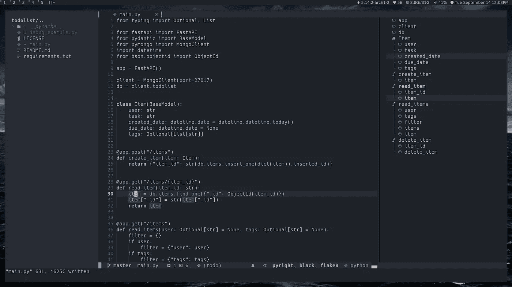
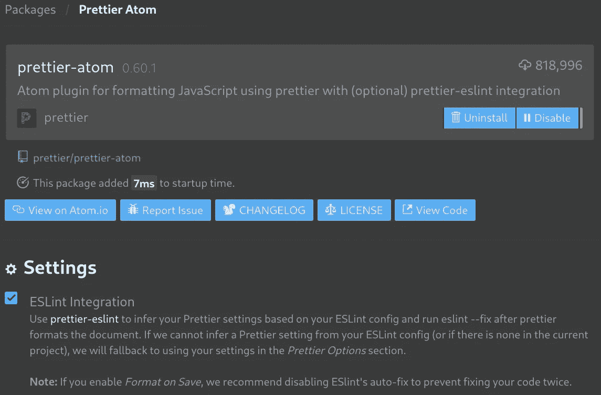

# 需要 Atom 编辑器的替代品吗？用 appellister 和 ESLint 自动格式化 Neovim 上的 JavaScript 代码

> 原文：<https://betterprogramming.pub/auto-formatting-javascript-source-code-on-neovim-with-prettier-and-elint-4795457c71e8>

## 在 Neovim 上自动格式化和 lint JavaScript 代码

杰里米·贝赞格在 [Unsplash](https://unsplash.com?utm_source=medium&utm_medium=referral) 上的照片

我不得不承认，我太懒了，没有换掉我的 [Atom 编辑器](https://atom.io/)，而是推迟到几周前。我主要使用 JavaScript(外加用于类型检查的 Typescript ), Atom 是一个很好的编辑器，可以满足我的需求。

但是现在它是一个[存档的项目](https://github.blog/2022-06-08-sunsetting-atom/):

> 我们正在为 2022 年 12 月 15 日的正式日落归档 Atom 和 Atom 组织下的所有项目。

我知道 [VS Code](https://code.visualstudio.com/) 是移植的自然编辑器，但是我想借此机会更好地学习 VI editor，并将其作为我的主要 IDE。

> Vim 占用空间小，延迟低，启动速度快，允许更多的屏幕空间，可定制，最重要的是，一旦肌肉记忆根深蒂固，几乎不可能切换到其他东西。
> [**约翰·比格斯和瑞安·多诺万**](https://stackoverflow.blog/2020/11/09/modern-ide-vs-vim-emacs/#:~:text=Vim%20has%20a%20small%20footprint,to%20switch%20to%20something%20else.)

在试用了几个 VI 发行版和预配置的插件集合后，我选择了 [LunarVim](https://www.lunarvim.org/#opinionated) (基于 [Neovim](https://neovim.io/) )并且我对它非常满意。

[LunarVim 截图](https://github.com/LunarVim/LunarVim)

唯一缺少的是用[更漂亮的](https://prettier.io/)加上 [ESLint](https://eslint.org/) 修复来格式化我的 JS 代码的直接方法。就像我在 Atom 上做的一样。

> `[eslint](http://eslint.org/)`的`[fix](http://eslint.org/docs/user-guide/command-line-interface#fix)`特性非常棒，可以根据 ESLint 配置自动格式化/修复大部分代码。`[prettier](https://github.com/jlongster/prettier)`是一个更强大的自动格式化程序。漂亮的好处之一是它很固执己见。不幸的是，它不够固执己见和/或有些观点与我的不同。所以在更漂亮地格式化代码后，我开始得到林挺错误。
> [肯特·c·多兹](https://github.com/prettier/prettier-eslint/commit/6548bce967eb20aa3122ae71bbbc321493b2dfab)

有很多方法可以集成 prettle 和 ESLint ( [参见 prettle 的介绍](https://prettier.io/docs/en/integrating-with-linters.html))，我更喜欢用 prettle 格式化，然后应用 ESLint-fix 进行进一步格式化。

在 Atom 上，我有一个更漂亮的 Atom 插件，支持 ESlint 集成来实现它。所以每次我格式化代码时，都会应用 Prettier，然后“eslint -fix”来进一步重构代码，以遵循我想要的规则。

更漂亮的 Atom 与 ELint 集成

为了在 Neovim 上有相同的行为，我使用了" [null-ls](https://github.com/jose-elias-alvarez/null-ls.nvim) " Lua 插件(实际上已经包含在 LunarVim 中，但您可以在 vanilla Neovim 中单独使用它，请阅读 [null-ls 安装说明](https://github.com/nanotee/nvim-lua-guide))并为 JavaScript 配置了一个新的“自定义格式化程序”，如下所示。

# 1.漂亮的埃斯林特 cli

作为第一步，安装[beautiful-eslint-CLI](https://github.com/prettier/prettier-eslint-cli)并确保它可从您的路径调用:

这是 Neovim 将调用来格式化代码的可执行文件(这只是一个将[beautiful-eslint](https://github.com/prettier/prettier-eslint)应用到输入文件的 CLI。CLI 选项与标准漂亮 CLI 兼容)。

# 2.LUA 配置

[迈克尔](https://unsplash.com/@michael75?utm_source=medium&utm_medium=referral)在 [Unsplash](https://unsplash.com?utm_source=medium&utm_medium=referral) 上的照片

> " [Lua](https://www.lua.org/about.html) (读作 **LOO-ah** )在葡萄牙语中是“月亮”的意思。

然后在`.config/lvim/config.lua`中配置 null-ls(如果你使用的是 vanilla Neovim，如果你不熟悉 Lua ，你可以在这里阅读[)。](https://github.com/nanotee/nvim-lua-guide)

# 3.项目开发包

下一步(对 Atom 来说也是必要的)是向项目中添加一些 ESLint 插件(全局添加它们是不可能的):

添加所需的配置/插件

# 4.规则

最后一步，不要忘记在项目中添加你想要的更漂亮和 ESlint 规则(来触发自动格式化和 lint 阶段)。

请记住，如果漂亮和优雅的规则自相矛盾，那就不好了。

一个很好的起点是扩展 ESLint "[standard](https://github.com/standard/eslint-config-standard)" config，然后是"[prettle](https://github.com/prettier/eslint-config-prettier)" config(最后一个删除了与 prettle 不兼容的规则)。

[标准 JS 标志](https://standardjs.com/)

您可以使用. eslintrc.json 和. prettierrc.json 将定义添加到 package.json 中。

Sample .prettierrc.json

Sample .eslintrc.json

# 结论

有了这个配置，我就可以在 Neovim 上自动格式化和 lint 我的 JS 代码，就像我在 Atom 上使用带有 ESLint 集成的漂亮插件所做的那样。

该解决方案运行良好，但如果实现一个守护进程，而不是为每种格式运行一个独立的进程，可能会快得多。

为了实现这一点，分叉和定制[修饰](https://github.com/fsouza/prettierd)以使用`prettier-eslint`可能是解决方案，也许是下一次。