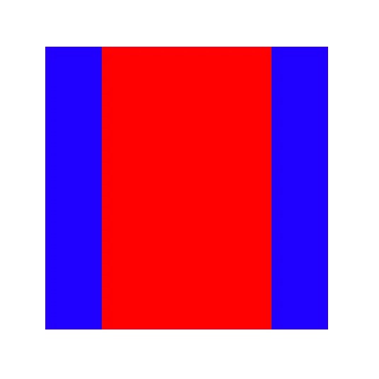

# Swift 中的自动布局

> 原文：<https://betterprogramming.pub/auto-layout-in-swift-ffd918d4ec06>

## 以编程方式编写约束


照片由[哈尔·盖特伍德](https://unsplash.com/@halgatewood?utm_source=unsplash&utm_medium=referral&utm_content=creditCopyText)在 [Unsplash](https://unsplash.com/s/photos/layout?utm_source=unsplash&utm_medium=referral&utm_content=creditCopyText) 拍摄

自动布局约束允许我们创建动态调整到不同大小类别和位置的视图。这些约束将确保您的视图适应任何大小的变化，而不必手动更新框架或位置。

你能想象一个没有自动布局的世界吗？我们过去常常自己计算帧或者使用自动调整大小的遮罩(是的，这与`translatesAutoresizingMaskIntoConstraints`属性有关)。只是从 iOS 6 开始，我们才可以依赖那些动态调整的约束。

通过使用这些扩展，您可以避免编写大量样板代码。

有很多内容需要介绍，但是在我开始之前，我想简单地讨论一下在代码中编写约束和使用接口构建器之间的区别。

# 界面生成器与以编程方式编写自动布局约束

以编程方式编写自动布局约束与使用界面生成器(IB)相比一直是一个热门话题。我决定在 Twitter 上向我的粉丝发起一项民意调查，结果得到了 851 张投票和许多强烈意见的回复。

虽然有赢家，但结果非常接近，我对价差感到相当惊讶。它证实了一个事实，即这是一个热门话题，因为开发者显然不同意一个解决方案。你可能认为我们会对 SwiftUI 将最终解决这个问题的想法感到高兴。

不管怎样，我们还没有到完全依赖 SwiftUI 的地步。你仍然需要决定是用代码写布局，还是用故事板或 xib。

根据个人经验和 Twitter 上的评论，用代码编写布局有一些优点和缺点。

# 在代码中编写自动布局约束的利弊

## **优点**

*   在 Git 中更容易合并。
*   代码更容易调试。
*   约束可能更容易概述。

## **缺点**

*   没有视觉表现。IB 允许你在不同的大小级别中查看你的视图。
*   您可能会在视图控制器中留下大量布局代码。

这两种解决方案都有一个相当长的学习曲线，尽管如果你有在界面构建器中设置约束的经验，用代码编写约束可能更容易。因此，我个人建议，如果你刚刚开始构建应用程序，就从故事板开始。

将界面构建器与代码中的约束结合起来也是一种解决方案。然而，请记住，这是不一致的，可能会使人们更难理解发生了什么。在使用界面构建器的同时编写约束也可以看作是编写自动布局的副作用。

如果您在团队中工作，您可能希望通过以编程方式编写约束来避免解决大量合并冲突。最后多半还是个人口味。就像民意测验结果显示的那样，没有金科玉律。

# 在代码中编写自动布局约束

一旦你决定用代码编写约束，你就进入了一个充满各种可能性的世界。幸运的是，不再需要这些类型的约束:

```
NSLayoutConstraint.constraints(withVisualFormat: "H:|-[icon(==postDate)]-20-[titleLabel(120@250)]-20@750-[postDate(>=50)]-|", metrics: nil, views: views)
```

这是一个用自动布局可视化格式语言编写的示例约束。它仍然受到支持，并且可能是你在打开一个旧项目时遇到的问题，但这不是我在这篇博文中要讨论的内容。

相反，我们将专注于使用 iOS 9 中引入的布局锚。这是一个很棒的 API，现在，它允许你很容易地在代码中编写约束。

# 使用布局锚点编写约束

首先，我们需要将`translatesAutoresizingMaskIntoConstraints`设置为 false。这是为了防止视图的自动调整大小遮罩被转换为自动布局约束并影响您的约束。

之后，开始创建一组约束。在这个数组中，您定义了一组约束:

```
let constraints = [
    view.centerXAnchor.constraint(equalTo: superview.centerXAnchor),
    view.centerYAnchor.constraint(equalTo: superview.centerYAnchor),
    view.widthAnchor.constraint(equalToConstant: 100),
    view.heightAnchor.constraint(equalTo: view.widthAnchor)
]
NSLayoutConstraint.activate(constraints)
```

这个例子展示了编写约束的基础，应该是可读和可理解的。

它创建了一个正方形，并将其置于其超级视图的中心。最后一行是实际激活约束所需要的，这样它们会使你的布局如预期的那样出现。

每个`UIView`都有一个锚属性集合，允许您设置视图之间的关系:

```
extension UIView {

    /* Constraint creation conveniences. See NSLayoutAnchor.h for details.
     */
    open var leadingAnchor: NSLayoutXAxisAnchor { get }

    open var trailingAnchor: NSLayoutXAxisAnchor { get }

    open var leftAnchor: NSLayoutXAxisAnchor { get }

    open var rightAnchor: NSLayoutXAxisAnchor { get }

    open var topAnchor: NSLayoutYAxisAnchor { get }

    open var bottomAnchor: NSLayoutYAxisAnchor { get }

    open var widthAnchor: NSLayoutDimension { get }

    open var heightAnchor: NSLayoutDimension { get }

    open var centerXAnchor: NSLayoutXAxisAnchor { get }

    open var centerYAnchor: NSLayoutYAxisAnchor { get }

    open var firstBaselineAnchor: NSLayoutYAxisAnchor { get }

    open var lastBaselineAnchor: NSLayoutYAxisAnchor { get }
}
```

每个锚点从`NSLayoutAnchor`返回子类，这些子类带有一些设置关系的常用方法。

这些关系包括等于、大于和小于或等于关系。最好研究一下[的文档](https://developer.apple.com/documentation/uikit/nslayoutanchor)，熟悉一下可用的 API。

# 约束的顺序

一旦你开始写约束，如果你开始处理常量，记住约束的顺序是很重要的。

采用以下一组约束:

```
let constraints = [
    innerSquare.topAnchor.constraint(equalTo: outerSquare.topAnchor),
    innerSquare.leftAnchor.constraint(equalTo: outerSquare.leftAnchor, constant: 40),
    outerSquare.bottomAnchor.constraint(equalTo: innerSquare.bottomAnchor),
    outerSquare.rightAnchor.constraint(equalTo: innerSquare.rightAnchor, constant: 40)
]

NSLayoutConstraint.activate(constraints)
```

这将产生以下图像，其中外部正方形为蓝色，内部正方形为红色:



代码示例中的简单自动布局

如果我们要改变外方块和内方块的顺序，常数需要设置为负值:

```
let constraints = [
    innerSquare.topAnchor.constraint(equalTo: outerSquare.topAnchor),
    outerSquare.leftAnchor.constraint(equalTo: innerSquare.leftAnchor, constant: -40),
    outerSquare.bottomAnchor.constraint(equalTo: innerSquare.bottomAnchor),
    innerSquare.rightAnchor.constraint(equalTo: outerSquare.rightAnchor, constant: -40)
]

NSLayoutConstraint.activate(constraints)
```

顶部和底部约束的数量相同。因此，在设置约束并切换最后两个锚点的视图和超级视图时，请记住以下顺序:

*   顶端
*   左边的
*   底部
*   对吧

这基本上归结为逆时针方向。

# 可用的布局参考线

每个`UIView`都有一些布局指南，也可以用作锚点。

*   `layoutMarginsGuide`:设置约束，保持布局边距为间距。
*   `readableContentGuide`:将宽度限制为便于用户阅读的大小。
*   `safeAreaLayoutGuide`:表示视图中未被条形和其他内容遮挡的部分。

您可以使用以下指南:

```
let constraints = [
    outerSquare.topAnchor.constraint(equalTo: viewController.view.safeAreaLayoutGuide.topAnchor),
    outerSquare.leftAnchor.constraint(equalTo: viewController.view.safeAreaLayoutGuide.leftAnchor),
    viewController.view.safeAreaLayoutGuide.bottomAnchor.constraint(equalTo: outerSquare.bottomAnchor),
    viewController.view.safeAreaLayoutGuide.rightAnchor.constraint(equalTo: outerSquare.rightAnchor)
]
```

# 支持从右向左的语言

虽然仅仅使用`leftAnchor`和`rightAnchor`看起来很明显，但是你可能想考虑使用`leadingAnchor`和`trailingAnchor`来代替。

这样做可以在视图中增加对从右向左语言的支持。这对于像标签这样的视图非常重要，在这些视图中，您希望确保它们能够从右向左语言翻转。

# 动态启用和禁用约束的性能

性能和自动布局约束本身就是一个话题。因此，我想向您介绍一下 [WWDC 2018:高性能汽车布局](https://developer.apple.com/videos/play/wwdc2018/220)的精彩演讲。

# 有价值的扩展，让您的生活更轻松

您可以做很多事情来简化代码中的约束。通过使用这些扩展，您可以避免编写大量样板代码。

## 将视图约束到它的超级视图

一个常见的扩展是创建一个方法来轻松地将视图约束在其超级视图中:

```
extension UIView {

    /// Returns a collection of constraints to anchor the bounds of the current view to the given view.
    ///
    /// - Parameter view: The view to anchor to.
    /// - Returns: The layout constraints needed for this constraint.
    func constraintsForAnchoringTo(boundsOf view: UIView) -> [NSLayoutConstraint] {
        return [
            topAnchor.constraint(equalTo: view.topAnchor),
            leadingAnchor.constraint(equalTo: view.leadingAnchor),
            view.bottomAnchor.constraint(equalTo: bottomAnchor),
            view.trailingAnchor.constraint(equalTo: trailingAnchor)
        ]
    }
}
```

## 处理优先级

一旦必须为约束设置优先级以防止违反约束，您可能会对以下扩展感到满意:

```
extension NSLayoutConstraint {

    /// Returns the constraint sender with the passed priority.
    ///
    /// - Parameter priority: The priority to be set.
    /// - Returns: The sended constraint adjusted with the new priority.
    func usingPriority(_ priority: UILayoutPriority) -> NSLayoutConstraint {
        self.priority = priority
        return self
    }

}

extension UILayoutPriority {

    /// Creates a priority which is almost required, but not 100%.
    static var almostRequired: UILayoutPriority {
        return UILayoutPriority(rawValue: 999)
    }

    /// Creates a priority which is not required at all.
    static var notRequired: UILayoutPriority {
        return UILayoutPriority(rawValue: 0)
    }
}
```

## 自动布局属性包装

防止自己不停地写:

```
translatesAutoresizingMaskIntoConstraints = false
```

通过使用以下属性包装:

```
@propertyWrapper
public struct UsesAutoLayout<T: UIView> {
    public var wrappedValue: T {
        didSet {
            wrappedValue.translatesAutoresizingMaskIntoConstraints = false
        }
    }

    public init(wrappedValue: T) {
        self.wrappedValue = wrappedValue
        wrappedValue.translatesAutoresizingMaskIntoConstraints = false
    }
}

final class MyViewController {
    @UsesAutoLayout
    var label = UILabel()
}
```

## 调试自动布局约束

```
[LayoutConstraints] Unable to simultaneously satisfy constraints.
```

如果您已经使用约束有一段时间了，这可能是一个常见的消息。

我写过一篇关于用户界面调试工具的博文，可以帮助你解决自动布局问题:[利用第三方应用程序进行 UI 调试](https://www.avanderlee.com/debugging/ui-debugging-by-making-use-of-third-party-apps/)。

# 在代码中编写约束时需要外部依赖

有很多外部依赖说它们使编写约束变得更容易。

我希望上面的例子表明，利用默认的 API 在代码中编写约束已经很容易了。外部框架引入了当前和未来的同事可能不熟悉的定制代码模式。

因此，我建议你使用布局锚，坚持使用苹果的默认 API。

# 结论

读完这篇文章后，用代码编写自动布局约束应该会容易一些。这是在界面构建器中设置约束的一个很好的替代方法。

谢谢！