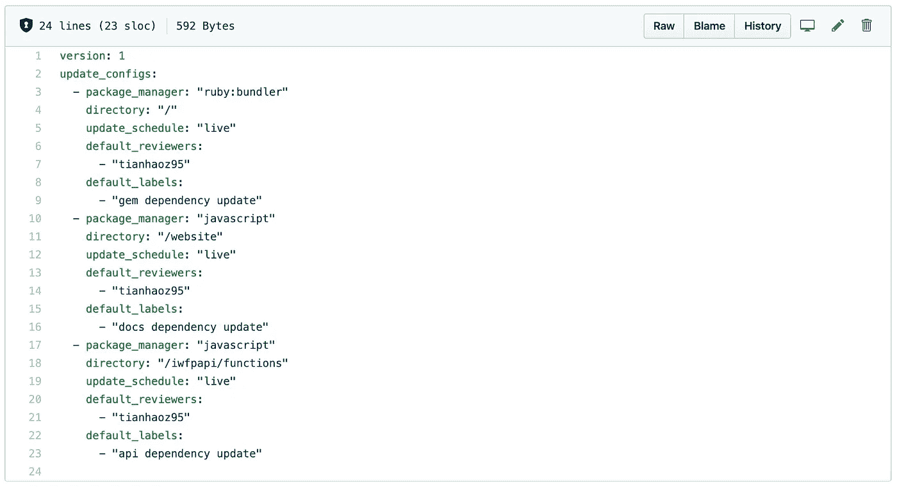
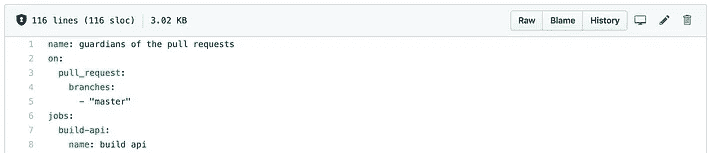
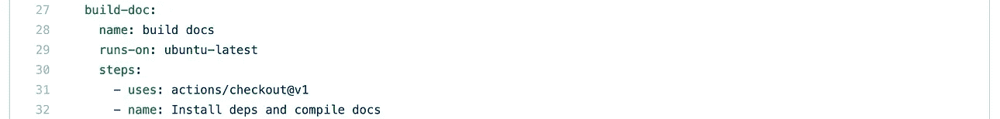
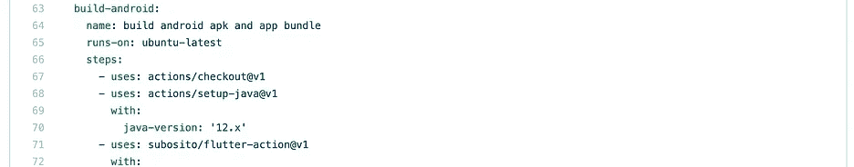
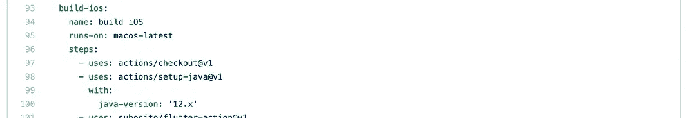
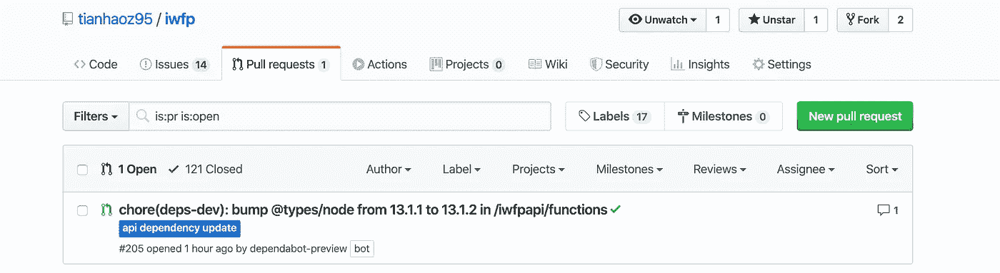

# 使用 Dependabot 对 Monorepo 项目进行自动魔法依赖管理

> 原文：<https://betterprogramming.pub/auto-magic-dependency-management-for-monorepo-projects-using-dependabot-f5796f4d6c28>

## 忘掉过时的套餐，晚上睡得更香

照片由[布鲁斯·马斯](https://www.pexels.com/@olly?utm_content=attributionCopyText&utm_medium=referral&utm_source=pexels)从[派克斯](https://www.pexels.com/photo/woman-in-grey-jacket-sits-on-bed-uses-grey-laptop-935743/?utm_content=attributionCopyText&utm_medium=referral&utm_source=pexels)拍摄

随着[dependent bot](https://dependabot.com/)加入 GitHub，自动化依赖升级将成为惯例。

切断依赖管理可以为开发人员节省大量时间。

然而，为一个[单库](https://en.wikipedia.org/wiki/Monorepo)项目设置 Dependabot 是一个不小的问题。

在这篇文章中，我将使用一个用 [Flutter](https://flutter.dev/) 、Express 和 [React](https://reactjs.org/) 构建的跨平台应用程序作为例子，来演示如何为一个 [monorepo](https://en.wikipedia.org/wiki/Monorepo) 项目设置 auto-magic dependency 升级。

这篇文章中使用的代码来自:

 [## 天昊 95/iwfp

### 愿百分之五的原力与你同在。iwfp(我要百分之五)是一个帮助每个使用信用卡的人的工具…

github.com](https://github.com/tianhaoz95/iwfp) 

# 第一步。编写一个依赖机器人配置文件

默认情况下，Dependabot 只会扫描项目的根目录。

为了通知它要扫描多个工作区，我们需要将一个[配置文件](https://dependabot.com/docs/config-file/)放在我们项目的根目录下。

配置文件描述了:

*   工作区及其相对目录和注册表类型的列表。
*   您希望如何升级它们，包括升级频率、批准者和标签等。

我的 monorepo 项目的示例配置文件，包含三个子项目(一个 [Flutter](https://flutter.dev/) 应用程序、一个 [React](https://reactjs.org/) 文档站点和一个 Express 后端服务器):

[依赖机器人配置文件](https://github.com/tianhaoz95/iwfp/blob/master/.dependabot/config.yml)来自[天昊 95/iwfp](https://github.com/tianhaoz95/iwfp)

# 第二步。用构建测试保护升级(可选)

由于包会在版本之间引入破坏性的变化，我建议在合并之前建立一个构建测试来确保兼容性。

以下是针对包兼容性问题的拉请求检查示例:

[示例工作流程](https://github.com/tianhaoz95/iwfp/blob/master/.github/workflows/merge.yml)保护来自[天昊 95/iwfp](https://github.com/tianhaoz95/iwfp) 的拉动请求

# 第三步。审查和批准自动升级请求

有了上面的设置，现在 Dependabot 可以识别所有的子项目，它会在每次一个包发布一个新版本时打开一个 pull 请求。

下面是快速查看(绿色勾号是我们的兼容性检查):

来自[天昊 95/iwfp](https://github.com/tianhaoz95/iwfp) 的自动化依赖更新拉取请求示例

# 第四步。给自己冲杯咖啡(或任何你喜欢喝的东西)

感谢阅读！