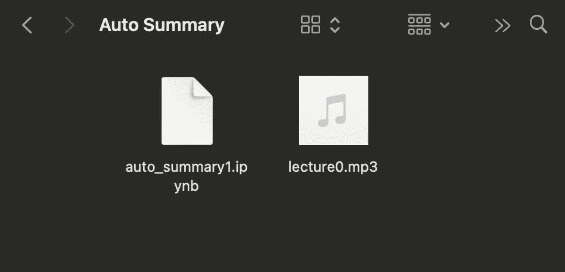
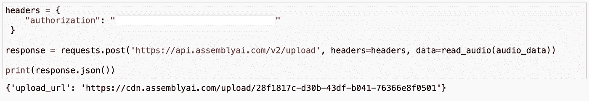
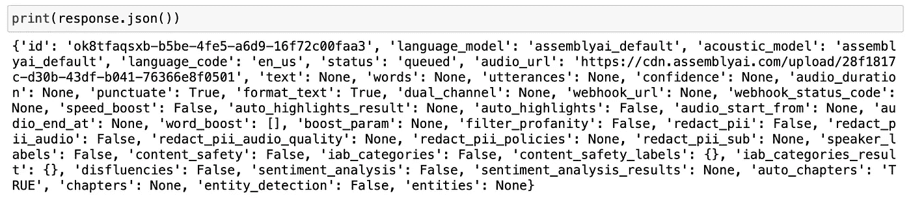
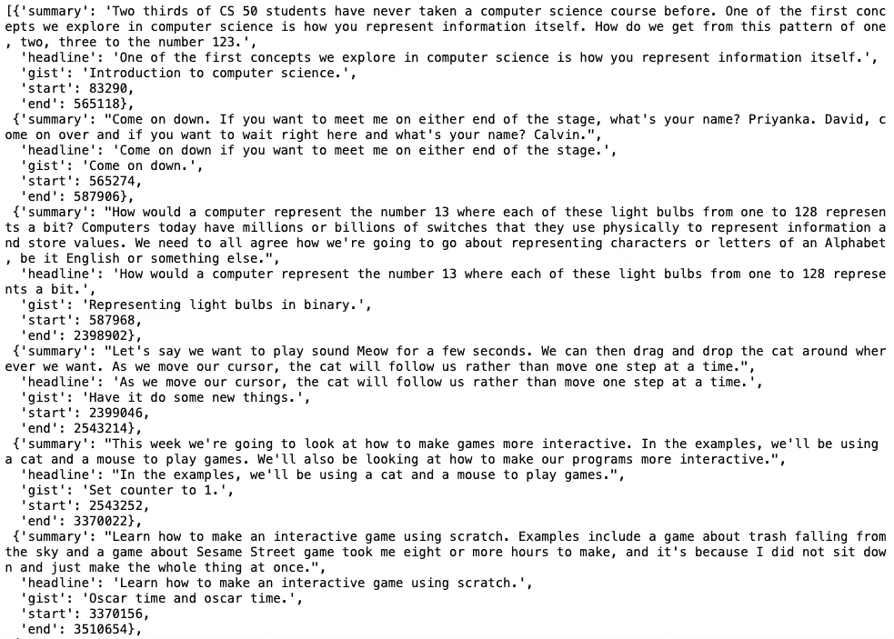

# 使用 Python 自动总结讲座

> 原文：<https://betterprogramming.pub/auto-summarize-lectures-using-python-dc3a497e0841>

## 使用人工智能提升你的笔记游戏


瓦迪姆·博日科在 [Unsplash](https://unsplash.com/?utm_source=unsplash&utm_medium=referral&utm_content=creditCopyText) 上拍摄的照片

在这篇文章中，我将向你展示如何将讲座视频/音频记录转换成总结的书面转录。我们将编写一个程序，在录音上运行语音识别模型，然后将转录分成章节。嗯，这还没完。它从那些章节中理解要点并为我们总结。

我希望我在大学的时候就知道该怎么做。:)

如果您是语音识别学科的新手，请查看以下文章:[如何构建简单的语音识别器](https://towardsdatascience.com/building-a-speech-recognizer-in-python-2dad733949b4)和[如何构建实时语音识别器](https://towardsdatascience.com/speech-recognition-in-real-time-using-python-fbbd62e6ff9d)。今天，我们将做一些稍微复杂但更有趣和令人兴奋的事情。

我们开始吧！

## 目录

*   *入门*
*   *步骤 1 —库*
*   *步骤 2 —讲座音频数据*
*   *步骤 3 —语音转文本，自动摘要*
*   *最后一步——检查结果*

# 入门指南

因为我们的主题是语音识别，所以让我们来谈谈我们将在这个项目中使用的语音识别 API。有许多不同的云服务和 API 可用，每种都有特定的好处。

在今天的教程中，我们将使用 AssemblyAI 的[语音转文本](https://www.assemblyai.com/) API。它是一个训练有素的人工智能 API。免费使用。创建帐户后，您将获得一个唯一的 API 密钥。我们将使用该 API 密钥来使用服务和功能。

在决定了 API 之后，是时候选择我们的编码环境了。最佳路线通常是你最熟悉的路线——所以我会用 [Jupyter](https://jupyter.org/) 笔记本；这是我最喜欢的数据科学项目。

# 步骤 1 —库

首先，python 包，换句话说，python 库。Python 有优秀的库；有些是在编程语言内部构建的，有些是第三方库。

对于我们的项目，我们将需要三个基本库。它们是内置的依赖项，所以我们不需要安装任何额外的东西。我们需要做的就是将它们导入到我们的笔记本中。

```
import sys
import time
import requests
```

# 步骤 2 —讲座音频数据

在这一步，我们将找到一个讲座录音，并使用其音频数据。如果你想保持简单，可以随意使用你谈论一个随机话题或阅读一本书等的简短录音。

我的音频数据将来自我最喜欢的一个讲座:哈佛的 CS50。

[这里](https://cs50.harvard.edu/x/2020/weeks/0/)是讲座视频的链接。在讲座视频下面，你会看到可供下载的音频版本。是不是很神奇？

这是一个长达一小时的录音。我会在开始的 10 分钟内完成。

现在，让我们继续将录音导入程序。在代码下面，还可以看到我的项目文件夹截图。

```
audio_data = lecture0.mp3
```



作者截图。

现在，让我们写一个函数来读取这段录音。顺便说一下，文件格式应该是音频格式，以便我们的阅读功能正常工作。CS50 的讲座音频版本是 mp3 格式，效果非常好。

下面是朗读音频功能:

```
def read_audio(audio_data, chunk_size=5242880):
    with open(audio_data, 'rb') as _file:
        while True:
            data = _file.read(chunk_size)
            if not data:
                break
            yield data
```

现在，让我们使用 API 键将音频数据请求发送到云中。

```
headers = {
    "authorization": "Your API key goes here"
 }response = requests.post('[https://api.assemblyai.com/v2/upload'](https://api.assemblyai.com/v2/upload'), headers=headers, data=read_audio(audio_data))print(response.json())
```

完美！运行这个代码块后，我们将收到来自 API 的响应。且响应消息将包括上传音频数据的 URL 地址。



# 步骤 3 —语音转文本，带自动摘要

这一步就是奇迹发生的地方。这将比其他步骤稍长，但没有什么复杂的事情发生。我们将看到使用 API 而不是重新发明轮子的好处。我们的音频文件已经在 AssemblyAI 的云存储里了；现在，是时候运行训练有素的机器学习模型了。

[这里的](https://docs.assemblyai.com/audio-intelligence#auto-chapters-summarization)是自动汇总功能的官方文档。

我会分享下面的代码块，然后解释每个变量。

```
speech_to_text_api = "[https://api.assemblyai.com/v2/transcript](https://api.assemblyai.com/v2/transcript)"data = {
    "audio_url": "the upload url address goes here",
    "auto_chapters": "TRUE",
}headers = {
    "authorization": "Your API key goes here",
    "content-type": "application/json"
}response = requests.post(speech_to_text_api, json=data, headers=headers)
```

*   第一个变量定义了我们计划使用的 API 模型。
*   第二个变量是字典。它包含两个键值:audio_url 和 auto_chapters。要在获取语音转文本结果时打开自动摘要功能，我们必须添加值为 TRUE 的 auto_chaptersboolean 键。
*   第三个变量也是一个字典。它包含我们的 API 键和内容类型。
*   最后，我们有一个 post 请求，将所有变量合并到其中，并发送给 API。响应将保留在响应变量中。

让我们继续打印出答案。

```
print(response.json())
```



在进入最后一步之前，让我们从这个响应中复制 ID 值。这个 id 值是我们刚刚提交的请求的请求 ID。我们需要检查请求的状态并提取结果。

# 最后一步—检查结果

快到了！

在最后一步中，我们将回调我们的请求，然后分析结果。我将分享下面的代码块，并解释每一行。

```
request_url = "[https://api.assemblyai.com/v2/transcript/ok8tfaqsxb-b5be-4fe5-a6d9-16f72c00faa3](https://api.assemblyai.com/v2/transcript/ok8tfaqsxb-b5be-4fe5-a6d9-16f72c00faa3)"headers = {
    "authorization": "Your API key goes here"
}response = requests.get(request_url, headers=headers)auto_summary_report = response.json()['chapters']auto_summary_report
```

*   首先，我们定义请求 URL 变量。它是 API URL，后跟请求 id。
*   其次，我们只是定义 API 键。
*   第三，我们调用 get 函数将结果接收到本地机器中。
*   响应变量包含许多属性；这就是我们过滤掉章节部分的原因。
*   最后，我们调用变量来查看自动汇总报告。

**以下是报告截图:**



作者截图。

恭喜你。如你所见，我们得到了不同章节的自动生成摘要。没有预定义任何东西，人工智能模型听了讲座，然后猜测章节。我们也可以将开始和结束时间视为毫秒。这样我们就能知道讲的是哪一部分了。你对此有什么想法？

我喜欢在这个项目上工作；很高兴看到机器学习和人工智能在现实世界中的应用——希望你喜欢阅读它，并在今天学到一些新东西。