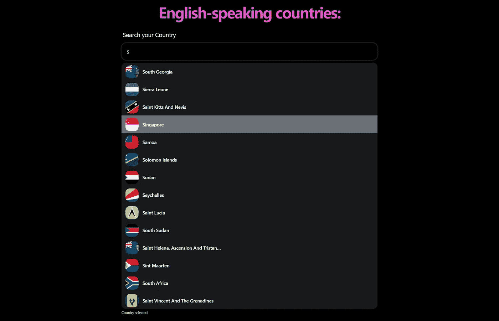

# 在 React 和 TypeScript 中构建自动完成搜索组件

> 原文：<https://betterprogramming.pub/autocomplete-search-component-with-react-and-typescript-94fa0e21fa04>

## 如何显示来自 API Rest 的数据建议


照片由[马腾纽霍尔](https://unsplash.com/@laughayette?utm_source=medium&utm_medium=referral)在 [Unsplash](https://unsplash.com?utm_source=medium&utm_medium=referral) 拍摄

如今，网站中使用最广泛的组件之一是带有自动完成或建议功能的搜索引擎。

它通常是用户交互的第一个组件，因为执行搜索并直接找到我们需要的东西更实际。这些组件在电子商务等网站中对于良好的用户体验是必不可少的。

在本教程中，我们将构建一个简单的搜索组件，在没有第三方库的情况下，为用户提供关于他们正在键入的内容的建议。

# 什么是自动完成搜索？

*Autocomplete 是一种用于显示查询建议的模式。*

自动完成搜索，也称为“预测搜索”或“自动建议”，是用户在输入字段中键入的组件，它将建议如何完成搜索的各种预测或可能的结果。

Autocomplete 与搜索引擎一起工作，当用户执行搜索时，搜索引擎学习并改进建议的结果。

在这种情况下，我们不会看到更多关于搜索引擎的内容，因为这超出了本教程的范围。如果你想进一步了解这个话题，可以看看这个[站点](https://www.addsearch.com/blog/autocomplete-search/)。事不宜迟，让我们开始编程吧。

# 设置自动完成搜索

我们用下面的命令创建带有 [vite](https://vitejs.dev/guide/#scaffolding-your-first-vite-project) 的应用程序:

```
yarn create vite autocomplete-search --template react-ts
```

我们安装项目中需要的依赖项:

```
yarn add @nextui-org/react
```

在这种情况下，我将只使用第三方库的样式，您可以随意使用:

*   一个 Javascript/CSS 框架

之后，我们为项目创建以下文件夹结构:

```
src/
├── components/
│   └── ui/
│       ├── Autocomplete.tsx
│       ├── Autocomplete.tsx
│       ├── index.ts
│       └── ui.module.css
├── hooks/
│   └── useAutocomplete.ts
├── ts/
│   └──interfaces/
│      └── Country.interface.ts
├── App.tsx
└── main.tsx
```

# 成分

`AutocompleteWrapper.tsx`该组件仅用作`Autocomplete.tsx`的容器或包装器，是我们请求所需数据的地方。

我们在教程中使用了 [restcountries](https://restcountries.com/) API，并且只使用说英语的国家，因此查询如下:

```
[https://restcountries.com/v3.1/lang/eng](https://restcountries.com/v3.1/lang/eng)
```

`Autocomplete.tsx`这是主要组成部分，它有两个部分。第一部分是输入元素，第二部分是建议列表。

通常，使用一个`<ul>`或`<ol>`元素，但是在本教程中，我们将在下一个 UI 卡组件中使用 Rows 组件。

Autocomplete.tsx

首先，我们创建我们需要的类型。API 返回大量我们不会使用的数据，因此简化信息和类型如下所示:

```
export type Country = {
  name: Name
  flags: Flags
}type Name = {
  common: string
}type Flags = {
  png: string
  svg: string
}
```

之后，我们将创建以下状态:

`searchedValue` —这里，我们将存储用户正在键入的文本。

`suggestions`—在这里，我们将存储与用户所写内容相匹配的建议。

`selectedSuggestion` —这里，我们将存储用户选择的选项。

`activeSuggestion` —在这里，我们将存储所示建议的索引。我们将使用它来了解键盘选择了哪个建议。

现在，我们需要创建对输入元素和结果列表的事件做出反应的函数。

`handleChange()`每次用户在 input 元素中输入内容时，都会执行这个函数。我们将验证输入的内容是否不是空值。否则，我们将把状态设置为初始值。

如果 input 元素中接收的值不为空，将执行该函数并显示与输入值匹配的建议。

`handleClick()`该功能将在用户选择建议时执行；我们保存选定的值，并将剩余的状态设置为初始值。

`handleKeyDown()`该功能将在检测到键盘上的事件时执行，因此您可以浏览建议并选择一个。

最后，我们添加一个`useEffect`来关注安装组件时的输入元素。

仅此而已！我们已经有了一个可以在任何项目中使用的自动完成搜索，通过传递输入引用和数据来过滤。

作为一个额外的步骤和良好的实践，我们将把功能带到一个定制的钩子上，我们的组件将会更干净，可读性更好。

useAutocomplete.ts

Autocomplete.tsx

该应用程序如下所示:



自动完成搜索

[看这里的演示](https://autocomplete-search-react-ts.vercel.app/)。

# 被卖方收回的汽车

[](https://github.com/ljaviertovar/autocomplete-search-react-ts) [## GitHub—ljaviertovar/autocomplete-search-react-ts:一个自动完成搜索组件

### 此时您不能执行该操作。您已使用另一个标签页或窗口登录。您已在另一个选项卡中注销，或者…

github.com](https://github.com/ljaviertovar/autocomplete-search-react-ts) 

# 结论

我们已经创建了一个简单的搜索组件，对收到的数据进行过滤。根据具体情况，搜索可能会变得越来越复杂。在捕获选定的值之后，您可以添加更多的功能，比如显示所选国家的详细信息。

我希望这篇教程对你有用，并且你在开发这个应用程序的过程中学到了新的东西。

## 阅读更多

[](/developing-reusable-and-customizable-modals-with-react-and-typescript-9f6217c76f07) [## 用 React 和 TypeScript 开发可重用和可定制的模型

### 如何使用 React 门户和样式化组件创建完整的模型

better 编程. pub](/developing-reusable-and-customizable-modals-with-react-and-typescript-9f6217c76f07) [](https://javascript.plainenglish.io/why-should-you-use-cleanup-functions-in-reacts-useeffect-hook-bdff48bd9b3) [## 为什么要在 React 的 useEffect 钩子中使用清理函数？

### React 的 useEffect 钩子中的清理函数——用例子解释。

javascript.plainenglish.io](https://javascript.plainenglish.io/why-should-you-use-cleanup-functions-in-reacts-useeffect-hook-bdff48bd9b3) 

```
**Want to Connect?**Love connecting with friends all around the world on [Twitter](https://twitter.com/ljaviertovar).
```