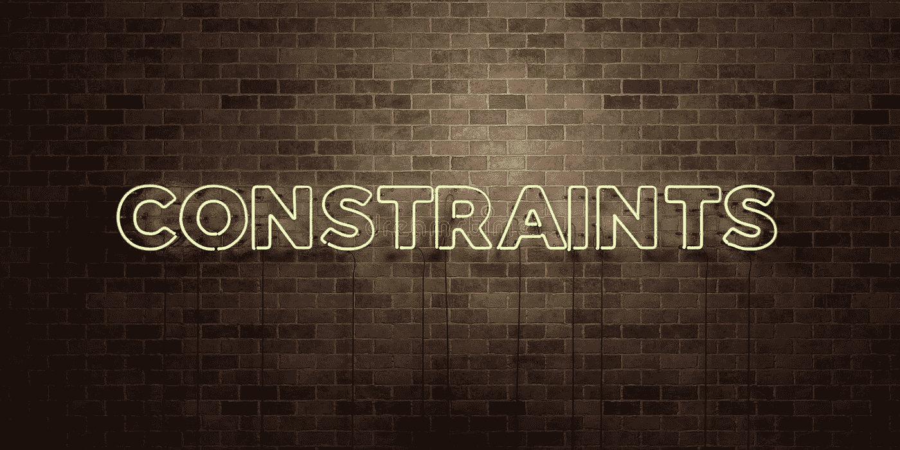

# AutoLayoutBuilder——我用来减少样板代码的 Swift 包

> 原文：<https://betterprogramming.pub/autolayoutbuilder-294badac5015>

## 利用@resultBuilder 为 UIView 约束创建 DSL

我们将解决这个 DSL 的几个问题:

1.  将`[translatesAutoresizingMaskToConstrants](https://developer.apple.com/documentation/uikit/uiview/1622572-translatesautoresizingmaskintoco)`设置为`false`
2.  重复同样的`anchor`两次
3.  多次重复相同的`constant`
4.  代码结构:布局代码可以随处可见，这个 DSL 旨在通过使用嵌套来解决这个问题

通常，当使用自动布局时，我们有许多代码块，如:

这已经开始变得难以阅读，我们只添加了一个视图，当我们有 10 个视图时会发生什么？

难怪开发人员讨厌它，当他们需要追捕一个自动布局的错误，有这么多的阅读涉及！

大多数开发者都很懒。记住这一点，让我们去掉所有的缺点，使它更简洁:

让我们看看如何实现这一点…

首先，我们需要一种方法来引用同一个块中的单数和数组`NSLayoutConstraints`，我们可以用一个`protocol`来做到这一点。

第二，`addSubview`使用了一个`@resultBuilder`，它允许我们收集所有我们想要应用的`NSLayoutConstraints`。

在这一点上，我们实际上已经拥有了这样做所需要的一切:

与开始时相比，这已经是一个巨大的进步，但让我们继续…

为了使我们的约束更具可读性，我们需要存储一些关于它们的信息，为了这个例子，我将引用我们将要使用的四个边约束。

这提供了一些我们现在可以在`ConstraintBuilder`中引用/组合的锚，让我们先实现`ConstraintBuilding`协议…

在这里你可以看到我们的锚被用在这 4 个函数中，通过把它放在一个协议中，我们可以用`build`扩展其他类型，这允许我们链接约束(即`.leading().trailing()`)。

现在让我们在我们的`ConstraintBuilder`结构中实现这个协议。出于本文的考虑，我将对此进行简化，只创建`equalToSuperview()`函数。

在上面的例子中，你可以看到我们可以在我们的`build`函数中使用另一个约束`combine`，这允许我们链接我们的约束。我们现在可以这样布置我们的`redView`:

由于所有这些值都是`20`，我们可以将其合并成一个函数:

现在我们可以做我们计划要做的事情了:

我们实际上也可以嵌套这些调用:

感谢阅读！

如果您有兴趣将它包含在您自己的项目中，下面有关于 Swift 包的信息，它允许您编写更简洁的代码，具有如下相对约束:

# Swift 包裹

Swift 软件包包含的功能远不止上述功能，例如:

*   `@AutoLayoutBuilder`块内的配置块
*   调用`equalTo`函数前的约束链接
*   允许我们链接到`UILayoutGuide`或其他视图的各种`equalTo`功能。
*   `[NSLayoutConstraint]`通过`store(in:)`功能存储
*   运算符(`==`、`<=`、`>=`)来清理布局代码
*   为`NSLayoutDimensions`设置乘数
*   在约束创建期间设置`UILayoutPriority`
*   使用`NSLayoutConstraint.Attribute`识别的`[NSLayoutConstraint]`数组内约束的目标管理(设置常数、优先级)
*   …还有更多！

包:[https://github.com/cjnevin/AutoLayoutBuilder](https://github.com/cjnevin/AutoLayoutBuilder)