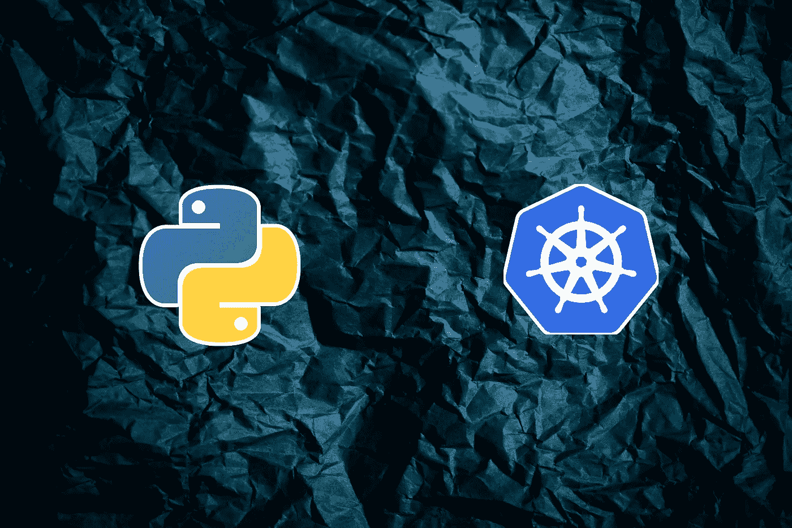

# 用 Python 自动化所有枯燥的 Kubernetes 操作

> 原文：<https://betterprogramming.pub/automate-all-the-boring-kubernetes-operations-with-python-7a31bbf7a387>

## 了解如何使用 Python 的 Kubernetes 客户端库来自动化所有枯燥的 Kubernetes 任务和操作



[莎伦·麦卡琴](https://unsplash.com/@sharonmccutcheon?utm_source=unsplash&utm_medium=referral&utm_content=creditCopyText)在 [Unsplash](http://localhost:3000/?utm_source=unsplash&utm_medium=referral&utm_content=creditCopyText) 上拍摄的背景照片

Kubernetes 在最近几年成为了事实上的标准，我们中的许多人——包括 DevOps 工程师和开发人员——每天都在使用它。然而，我们执行的许多任务都是相同的、乏味的，并且易于自动化。

通常，用一堆`kubectl`命令快速编写一个 shell 脚本是足够简单的，但是对于更复杂的自动化任务，bash 还不够好，您需要适当语言的能力，比如 Python。

因此，在本文中，我们将探讨如何利用 Kubernetes Python 客户端库来自动化您可能正在处理的任何烦人的 Kubernetes 任务！

# 操场

在我们开始使用 Kubernetes 客户端之前，我们首先需要创建一个游乐场集群，在那里我们可以安全地进行测试。我们将使用 KinD(Docker 中的 Kubernetes)，你可以从[这里](https://kind.sigs.k8s.io/#installation-and-usage)安装。

我们将使用以下集群配置:

要根据上述配置创建集群，您可以运行:

随着集群的启动和运行，我们还需要安装客户端库(可选地，在虚拟环境中):

# 证明

要在我们的 Kubernetes 集群中执行任何操作，我们首先需要进行身份验证。

我们将使用长期令牌，这样我们就不需要重复进行身份验证。可以通过创建一个`ServiceAccount`来创建长期令牌:

使用服务帐户还有一个好处，那就是它不依赖于任何一个人，这对于自动化来说总是更可取的。

然后，可以在请求中使用上面输出中的令牌:

我们现在通过了身份验证，但没有权限做任何事情。因此，接下来，我们需要创建一个`Role`，并将其绑定到`ServiceAccount` ，这样我们就可以对资源执行操作。代码如下:

上面给出了我们的服务帐户在 pods 上执行任何操作的权限，仅限于`default`名称空间。

您应该始终保持您的角色非常狭窄和具体，但实际上，应用集群范围的管理员角色是有意义的，如下所示:

# 原始请求

为了更好地理解什么是`kubectl`以及客户端在幕后做什么，我们将从使用`curl`的原始 HTTP 请求开始。

找出幕后请求的最简单方法是用`-v 10`运行所需的`kubectl`命令。这将输出完整的`curl`命令，如下所示:

使用`loglevel 10`的输出会非常冗长，但是在那里的某个地方，您会发现上面的`curl`命令。

使用您的长期令牌在上面的`curl`命令中添加一个`Bearer`令牌头，您应该能够执行与`kubectl`相同的操作，例如:

如果需要一个请求体，就要查找请求中需要包含哪些字段。例如，当创建一个 Pod 时，我们可以使用这里描述的 API。当我们这样做时，我们得到以下请求:

关于对象属性，请参考 [Kubernetes API 参考](https://kubernetes.io/docs/reference/generated/kubernetes-api/v1.23)。此外，您还可以使用以下命令查看 OpenAPI 定义:

直接使用 REST API 与 Kubernetes 交互可能有点笨拙，但在某些情况下使用它可能是有意义的。一些情况包括当您使用 Kubernetes 的不同发行版时，与没有等效的`kubectl`命令的 API 进行交互——例如 open shift——这暴露了`kubectl`或客户端 SDK 没有覆盖的额外 API。

# Python 客户端

现在转到 Python 客户机本身。我们需要经历与`kubectl`或`curl`相同的步骤。第一步是身份验证，如下所示:

首先，我们定义一个配置对象，它告诉客户端我们将使用`Bearer` 令牌进行身份验证。考虑到我们的同类集群不使用 SSL，我们在真实集群中禁用它。然而，你不应该这样做。

为了测试配置，我们使用 API 客户端的`list_namespaced_pod`方法获取`default`名称空间中的所有 pod，然后打印出它们的`name`、`namespace` 和`IP`。

现在，对于一个更现实的任务，让我们创建一个下面的`Deployment`:

除了创建`Deployment`，我们还等待它的 pod 变得可用。我们通过查询`Deployment` 状态并检查大量可用副本来做到这一点。

另外，注意函数名中的模式，比如`create_namespaced_deployment`。为了让它更明显，让我们再看几个例子:

*   `replace_namespaced_cron_job`
*   `patch_namespaced_stateful_set`
*   `list_namespaced_horizontal_pod_autoscaler`
*   `read_namespaced_daemon_set`
*   `read_custom_resource_definition`

所有这些都是全局资源的格式`operation_namespaced_resource`或者仅仅是`operation_resource`。对于对资源状态执行操作的方法，如`read_namespaced_deployment_status`或对资源规模执行操作的方法，如`patch_namespaced_stateful_set_scale`，它们可以附加`_status`或`_scale`后缀。

另一个需要强调的是，在上面的例子中，我们使用`client.AppsV1Api`来执行动作，这允许我们使用属于`apiVersion: apps/v1`的所有资源。如果我们想使用 CronJob，我们会选择`BatchV1Api`(在 YAML 格式中是`apiVersion: batch/v1`)，或者对于 PVC，我们会因为`apiVersion: v1`而选择`CoreV1Api`。你知道要点了。

可以想象，有很多功能可供选择。幸运的是，所有这些都列在[文档](https://github.com/kubernetes-client/python/blob/master/kubernetes/README.md)中，你可以点击其中任何一个来获得它的用法示例。

除了基本的 CRUD 操作，还可以持续观察对象的变化。显而易见的选择是观看`Events`:

这里我们选择在`default`名称空间中观察事件。我们取前 10 个事件，然后关闭流。如果我们想持续监控资源，我们只需移除`timeout_seconds`和`w.stop()`调用。

在第一个例子中，您看到我们使用普通 Python `dict`来定义部署对象，并将其传递给客户端。或者，我们可以通过使用由库提供的 API 模型(类)来使用更面向对象的风格，如下所示:

试图找出你应该为每个论点使用哪个模型是一场失败的战斗，而且很艰难。当创建如上所示的资源时，您应该总是使用模型的[文档，并在创建单个子对象时遍历链接，以确定每个字段中需要什么值/类型。](https://github.com/kubernetes-client/python/blob/master/kubernetes/README.md#documentation-for-models)

# 方便的例子

现在，您应该对客户端的工作原理有了基本的了解，所以让我们来看看一些方便的例子和片段，它们可能会帮助您自动化日常的 Kubernetes 操作。

你可能想要执行的一个非常常见的事情是`Deployment` 展示——通常用`kubectl rollout restart`来完成。然而，没有 API 可以做到这一点。[方式](https://github.com/kubernetes/kubectl/blob/release-1.23/pkg/polymorphichelpers/objectrestarter.go#L32)`[kubectl](https://github.com/kubernetes/kubectl/blob/release-1.23/pkg/polymorphichelpers/objectrestarter.go#L32)`是通过更新部署标注。更具体地说，将`kubectl.kubernetes.io/restartedAt`设置为当前时间。这是因为对 Pod 规格的任何更改都会导致重启。

如果我们想要使用 Python 客户端执行重启，我们需要执行以下操作:

另一个常见的操作是缩放一个`Deployment`。幸运的是，这个有一个我们可以使用的 API 函数，您可以在下面看到:

出于故障排除的目的，通常有必要将`exec`放入一个 Pod 中，环顾四周，并可能抓取`environment` 变量来验证正确的配置。下面是代码:

如果需要，上面的代码片段还允许您运行整个 shell 脚本。

因此，假设您想要将`Taint`应用到一个有问题的节点上。我们可以专注于面向集群管理的任务。由于没有针对节点污染的直接 API，我们可以找到一种方法。下面是帮助我们的代码:

您可能还希望监控集群资源利用率，以自动进行集群扩展。通常，您会使用`kubectl top`来交互地获取信息，但是使用客户端库，您可以做以下事情:

上面的例子假设您已经在集群中安装了`metrics-server`。你可以运行`kubectl top`来验证这一点。如果您使用 KinD，请使用代码片段中的注释来安装它。

最后但同样重要的是，如果您有一堆 YAML 或 JSON 文件想要用来部署或修改集群中的对象，或者想要导出和备份您用客户端创建的内容，有一种简单的方法。下面是如何将 YAML/JSON 文件转换成 Kubernetes 对象，然后再转换回文件的方法:

将现有对象转换成 Python 字典(JSON)的第一种方法是使用`sanitize_for_serialization`，它产生包含所有生成/默认字段的原始输出。更好的选择是使用`kopf`库的实用方法，这将删除所有不必要的字段。从这里开始，将字典转换成合适的 YAML 或 JSON 文件就足够简单了。

如果您想逆转这个过程——从字典到客户机对象模型——我们可以使用 API 客户机的`deserialize`方法。然而，这个方法期望它的参数有一个`data`属性，所以我们传递给它一个具有这样一个属性的容器类实例。

如果您已经有了想要在 Python 客户端使用的 YAML 文件，您可以使用实用函数`kubernetes.utils.create_from_yaml`。

为了获得所有库特性的完整概述，我建议您查看一下资源库中的[示例目录](https://github.com/kubernetes-client/python/tree/master/examples)。

我也鼓励你浏览一下库存储库中的问题，因为它有很多很好的客户端使用的例子，比如[并行处理事件](https://github.com/kubernetes-client/python/issues/803)或者[查看配置图更新](https://github.com/kubernetes-client/python/issues/1387)。

# 结论

Python 客户端库包含数百个函数，因此很难涵盖所有的小特性或用例。它们中的大多数遵循一个共同的模式，这应该使库的使用在几分钟后变得相当自然。

如果除了上面展示和引用的例子之外，您还想寻找更多的例子，我建议您探索使用 Python Kubernetes 客户端的其他流行工具，比如用于创建 Kubernetes 操作符的库。我还发现查看库本身的测试非常有用，因为它展示了它的预期用途。这里有一个优秀的[客户端测试套件](https://github.com/kubernetes-client/python/blob/master/kubernetes/e2e_test/test_client.py)要学习。

# 你可能也喜欢

[](/building-github-apps-with-golang-43b27f3e9621) [## 用 Golang 构建 GitHub 应用

### 在几分钟内启动并运行您的第一个 GitHub 应用程序，并使用它来自动化您在 GitHub 上做的所有事情

better 编程. pub](/building-github-apps-with-golang-43b27f3e9621) [](https://towardsdatascience.com/keeping-kubernetes-clusters-clean-and-tidy-fad52a37f910) [## 保持 Kubernetes 集群干净整洁

### 清除所有未使用的资源，这些资源会使您的 Kubernetes 集群变得杂乱并浪费其计算资源

towardsdatascience.com](https://towardsdatascience.com/keeping-kubernetes-clusters-clean-and-tidy-fad52a37f910) 

```
**Want to Connect?**This article was originally posted at [martinheinz.dev](https://martinheinz.dev/blog/73?utm_source=medium&utm_medium=referral&utm_campaign=blog_post_73)
```