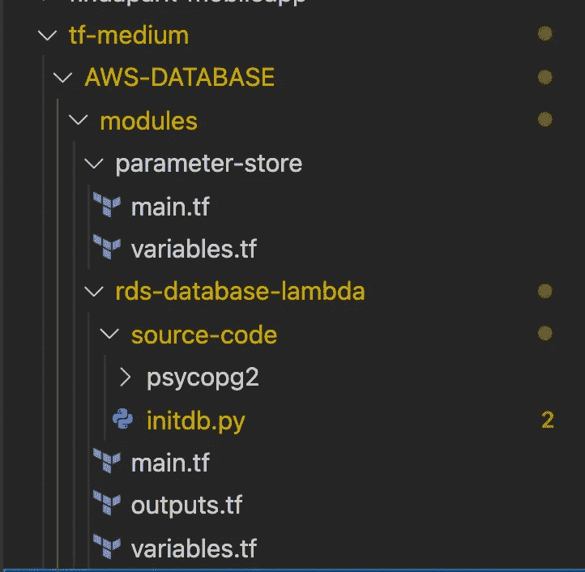
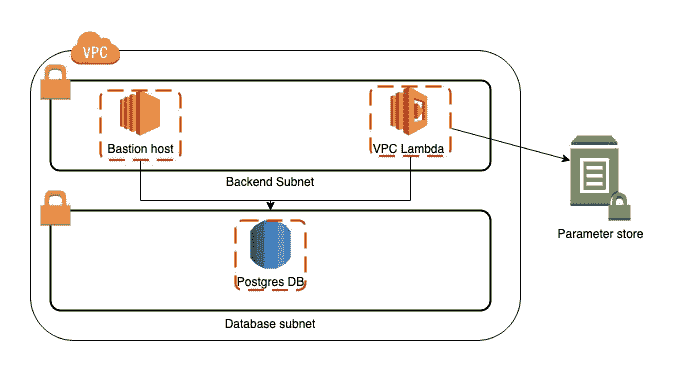

# 使用 Terraform 自动化和配置您的 RDS 数据库

> 原文：<https://betterprogramming.pub/automate-and-configure-your-rds-database-with-terraform-898fd4b8990d>

## 根据您的需求执行部署后脚本


由 [Unsplash](https://unsplash.com?utm_source=medium&utm_medium=referral) 上 [Ruchindra Gunasekara](https://unsplash.com/@ruchindra?utm_source=medium&utm_medium=referral) 拍摄的照片

到目前为止，我已经使用了很多云信息，并且很享受这个旅程。但是大家都知道，Terraform 很流行，所以我认为尝试一下该工具和不同的可用选项来自动化部署可能是值得的。

在本文中，我将解释如何部署 RDS 数据库，并运行部署后脚本，如创建数据库、表…我将假设您已经配置了您的 aws 凭证，并且安装了 terraform，并且您还熟悉将 S3 存储桶配置为 Terraform 后端—因此我将主要关注模块部分，并在最后简要介绍部署部分。

> 该项目将部署很少的项目

1.  一个位于公共子网中的堡垒主机组，允许您通过 ssh 隧道连接到您的数据库+相关的安全组
2.  一个 RDS PostGres 数据库和相关的安全组，仅允许您的 VPC 子网访问该数据库
3.  一个 lambda 部署在您的 VPC 中，因为您希望 Lambda 能够以安全的方式连接到数据库
4.  一些 SSM 参数，如用户名/密码，用于你的数据库和你将来的应用
5.  在部署了所有前面的项目之后的 Lambda 调用触发器



项目树概述——整个项目可以在 GitHub 上找到

## 资源创造

这个代码块片段(`main.tf` —文件夹`**module/rds-database-lambda**`)将为您创建我之前提到的一些项目:

*   你的堡垒安全小组。请注意，您将需要允许您的 IP 线路 17，而不是虚拟线路 *— l5*
*   ec2 实例需要一个 keypair 作为输入(此处不是自动的，因为我们希望它永久保存在我们的 AWS 帐户上—将在第 39 行更新，与 AMI-ID 第 37 行相同) *— l34*
*   RDS 资源本身(注意 t2.micro 类型(*自由层*)不允许最新的 postgres 版本) *— l52*
*   您的数据库安全组，允许您的堡垒访问 PG 数据库 *— l72*
*   Lambda 安全组 *— l97* 和允许函数访问 DB *— l115* 的安全组规则
*   Lambda 函数本身使用非常好 terraform 数据，它基于路径创建一个档案(这允许您将外部依赖项包含到您的代码中，如我们的例子中的 psycopg 2)*—l124*

参数存储条目位于不同的模块(即子文件夹)中，只是为了更好地理解所应用的内容(注意，我们也可以将我们的安全组、db 和 lambda 拆分到不同的子文件夹中)。*我只留下下面的一段代码作为例子:*

```
resource “aws_ssm_parameter” “db_master_pwd” { name = “/${var.project}/${var.env}/database/master-password” description = “Db master password” type = “SecureString” value = “${var.database_master_password}”}
```



部署的解决方案概述

既然我们已经了解了 TF 将部署哪个元素，那么重要的是了解当我们部署基础设施时如何触发 Lambda 函数，以及何时节省一点钱，这意味着销毁。

以下是完整的 Lambda 代码:

在创建这样的 Lambda 时，记住一些规范是非常重要的:

1.  lambda 必须返回一些东西。如果没有，您的 terraform 将等待输出(例如，见第 33 行，我们检查数据库是否已经存在。我们用这个当我们摧毁红外线作为回报)
2.  不要忘记记录。由于您可能有一个 SQL 语法错误，或者其他什么问题，您需要能够使用 cloudwatch 日志快速诊断 Lambda 出现故障的地方(例如第 45 行，如果我们无法创建数据库，我们会在那里捕获异常)。
3.  将任务分解到不同的 SQL 语句中，以获得更清晰的代码(创建/填充/扩展，如果有的话……)
4.  不要忘记您的 IAM 角色(cloudwatch permissions，ssm……)—注意，作为示例，我给出了两种不同的检索凭证的方法:使用环境变量或使用 SSM。总是喜欢使用 SSM，因为你可以加密你的秘密

现在，您已经准备好部署一个新的 RDS 实例，并对其进行定制，这样您就不必担心为了降低成本而破坏基础架构。当在开发环境中工作时，这种工作方式非常方便，在这种环境中，您可以创建快速的 POC，而不会花费太多！

我在下面分享完整的存储库，我们可以在那里使用代码，并根据您的需要定制它——不要忘记在使用它之前设置您的 AWS 帐户。

[](https://github.com/gmariette/db-medium-tf) [## GitHub - gmariette/db-medium-tf

### 此时您不能执行该操作。您已使用另一个标签页或窗口登录。您已在另一个选项卡中注销，或者…

github.com](https://github.com/gmariette/db-medium-tf) 

感谢您的阅读。