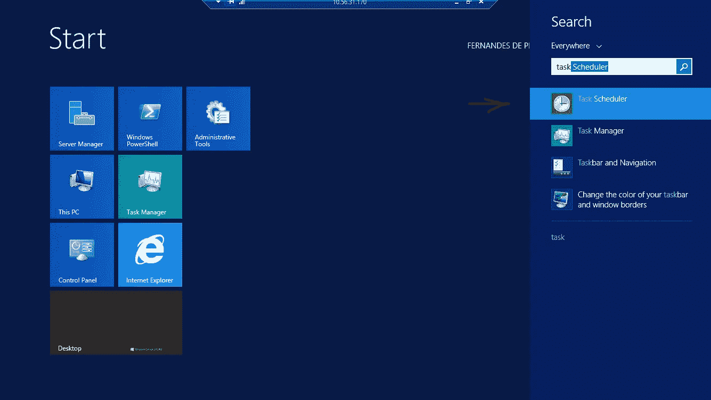
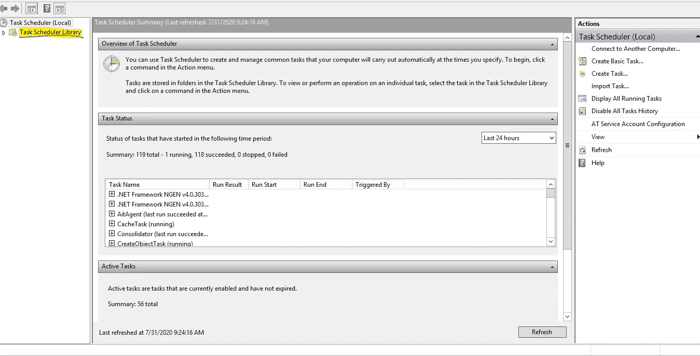
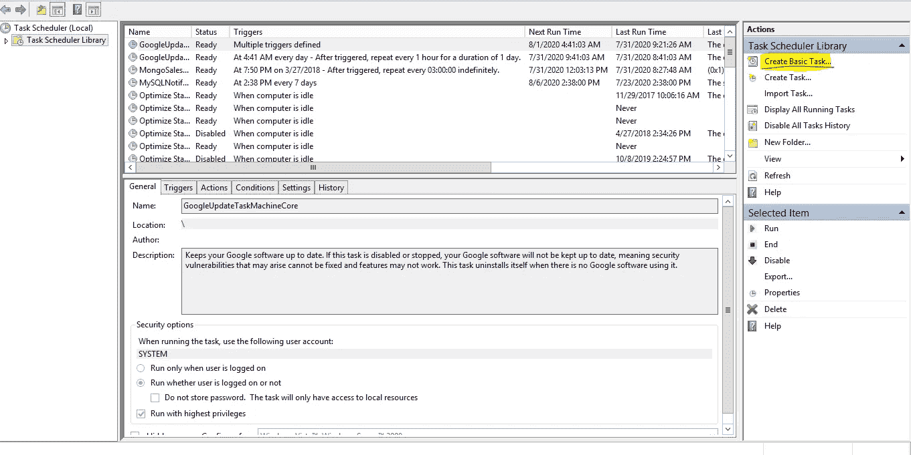
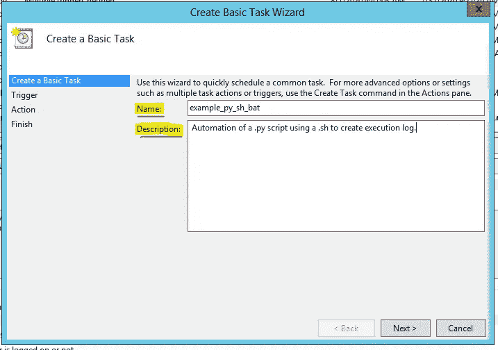
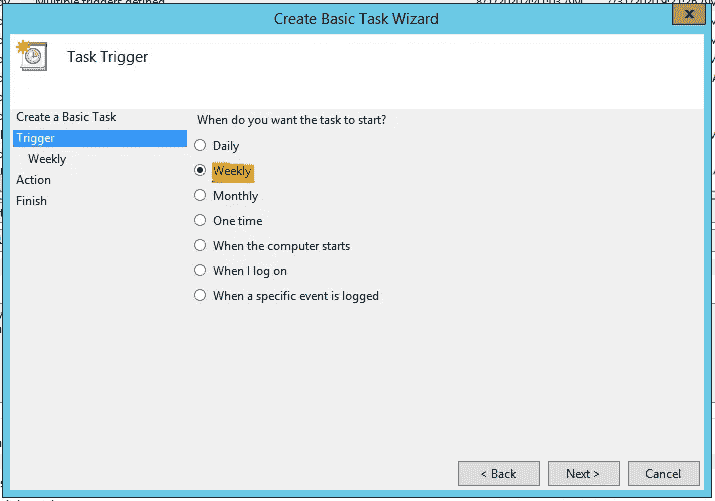
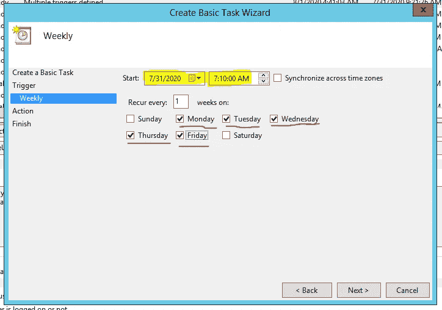
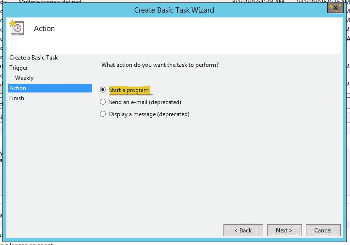
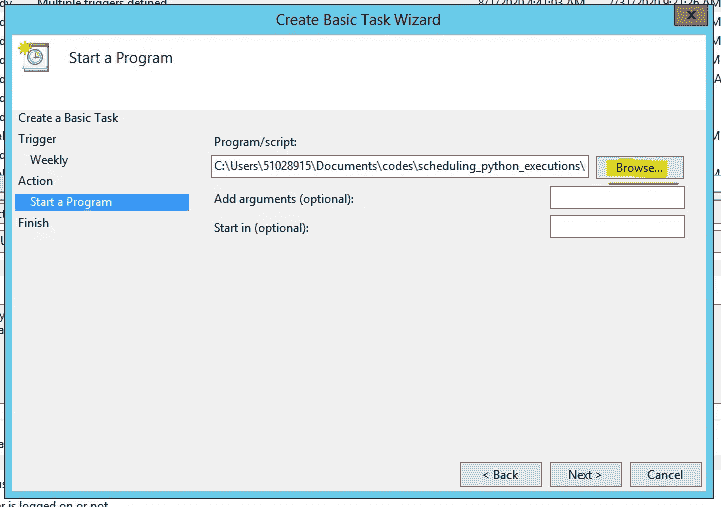
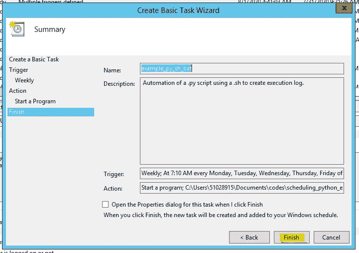

# 自动化并安排 Python 代码的执行

> 原文：<https://betterprogramming.pub/automate-and-schedule-your-python-code-executions-22c3ed27794e>

## 让您的代码按照您的计划工作


由[马库斯·斯皮斯克](https://unsplash.com/@markusspiske?utm_source=medium&utm_medium=referral)在 [Unsplash](https://unsplash.com?utm_source=medium&utm_medium=referral) 上拍摄的照片。

此时，你已经写了许多行代码，重写了它们，删除了其中的一些(或全部)，最后，经过一些眼泪和压力，你完成了！

它运行得很好，但是你需要每天早上 5 点运行它，或者每周周日运行一次。起床后只需点击五个按钮就可以开始执行，或者需要在会议或任务进行到一半时停下来初始化，这些都不是你一天中最快乐的时刻。

那么，如何轻松实现自动化呢？

您只需要三个文件(如下)和任务调度程序:

*   你的。py 文件。
*   答。嘘，那会叫 Python 给你。
*   答。蝙蝠，这样我们就可以安排它。

# 一个简单的例子

## 第一个文件:test_PY_sh_bat.py

这段代码只是打开一个对话框。没什么重要的，但是你看到`execute()`了吗？你只需要用你想执行的函数替换它。

注意:不要忘记你需要在这个文件中有你的主函数或者从另一个文件中导入它。

## 第二个文件:test_py_SH_bat.sh

```
export PATH="$PATH:/c/ProgramData/Anaconda3"
python test_PY_sh_bat.py |& tee ./logfiles/`date '+%Y_%m_%d'`_test_py_sh_bat.txt
```

这个将会说，“嘿，我想使用这个文件夹中的`python.exe`来运行这个脚本，并以这个名称在另一个文件夹中保存一个执行日志。”这样，你可以知道你的执行是否一切正常。

## 第三个文件:test_py_sh_BAT.bat

```
[@echo](http://twitter.com/echo) on
cd "C:\Users\51028915\Documents\codes\scheduling_python_execution"
start test_py_SH_bat.sh
exit
```

的。bat 将被用作调用方，所以只需说出它在哪里以及它要做什么(在这种情况下，启动流程)。

# 计划执行

打开任务计划程序:



单击“任务计划程序库”:



选择“创建基本任务”:



输入任务的名称和描述:



在“触发”部分选择执行频率:



选择执行任务的时间和日期:



在“操作”部分，选择“启动程序”选项:



浏览。bat 文件:



点击“完成”:



就是这样！从现在开始，您不需要手动运行您的代码！

希望这篇文章对你有所帮助。你可以在 [GitHub](https://github.com/rfpcordeiro/scheduling_python_executions) 上下载示例文件。