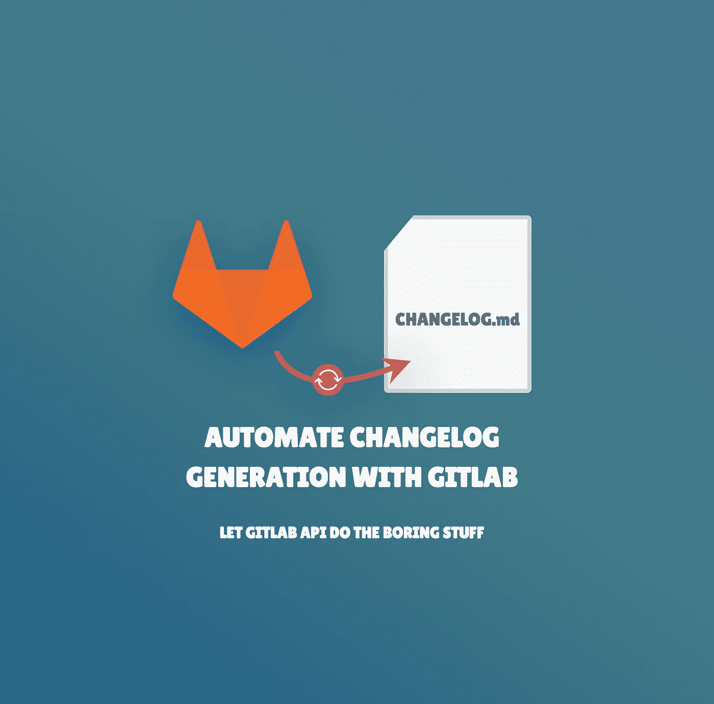
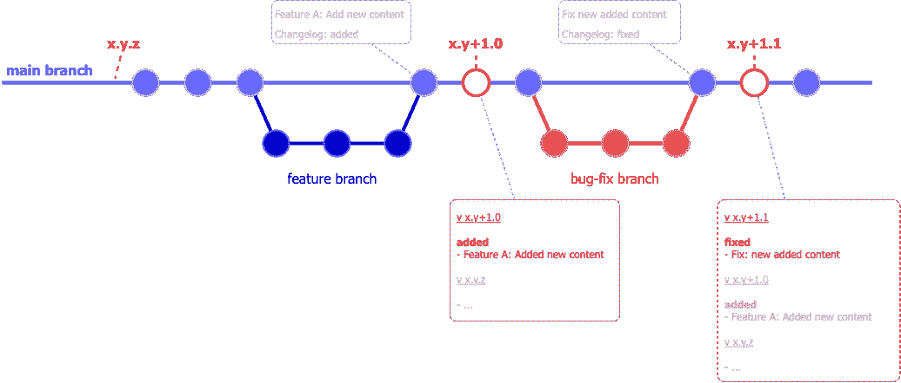
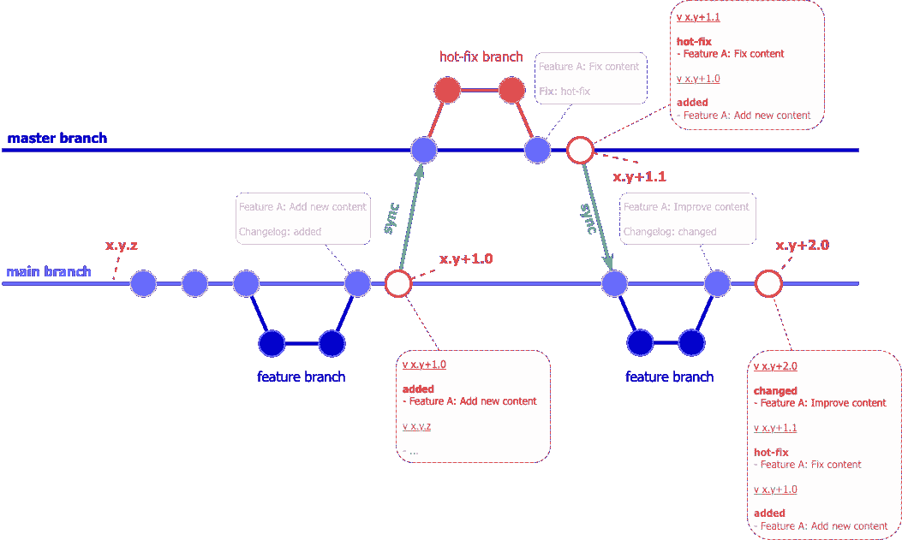

# 使用 GitLab 自动生成变更日志

> 原文：<https://betterprogramming.pub/automate-changelog-generation-with-gitlab-dbd4e4c41d99>

## 让 GitLab API 去做那些无聊的事情



我是 GitLab 的超级粉丝，如果你跳到这篇文章，我相信你也是。不久前，我浏览了他们的 [API](https://docs.gitlab.com/ee/api/api_resources.html) 来了解它提供的功能。到目前为止，我发现了一些节省了我很多时间的东西:

 [## 仓库 API | GitLab

### 将变更日志数据添加到变更日志文件中

docs.gitlab.com](https://docs.gitlab.com/ee/api/repositories.html#add-changelog-data-to-a-changelog-file) 

在本文中，您将发现如何使用 GitLab API，通过一点点规则和一些魔力，自动更新您的发布说明。

# 先决条件

先说一些基础知识，什么是发行说明？

一个*发布说明*(又名 changelog)是一个文件，它列出了一个项目的新版本中引入的变更。这个文件习惯上被命名为`CHANGELOG.md`。

变更日志条目根据它们的类型进行分组，无论是相关的`fix`、`feature change`、`deprecation`、`performance`、`new feature`还是更多…

CHANGELOG.md 的一个例子

更多真实的例子，你可以看看:

*   [角度变化记录](https://github.com/angular/angular/blob/main/CHANGELOG.md)
*   [React CHANGELOG](https://github.com/facebook/react/blob/main/CHANGELOG.md) 或
*   [Python 文档](https://docs.python.org/3/whatsnew/changelog.html#python-next)。

# 为什么更新更新日志是一件痛苦的事…但却是必要的？

列出两个版本之间的所有变化是一项令人厌烦的任务。你需要将(几乎)每一次提交都与一个具体的目的相匹配，就像上面提到的那样。

这意味着提交消息足够清晰，可以对它们进行分类。但是说实话，在每次提交时尽可能明确并不容易。

> 但是，真的有必要跟踪这些变化吗？

嗯，如果你正在使用或维护一个被社区使用的包，这是一个**必须**做的事情！您的发行说明将(部分)记录软件包每个版本的修改。这是引入新功能的一种方式，但也是对重大变化保持警惕的一种方式。因此，您的“客户”将被警告并调整他们的代码库。

变更日志也是记录项目历史的一种方式(不管它是什么类型)。最后，如果你与产品团队紧密合作，它是每个新版本内容的参考。

如前所述，如果手动的话，这是一个很无聊的任务。希望存在使用第三方库的解决方案，比如针对节点用户的[语义发布](https://www.npmjs.com/package/semantic-release)，针对 Python 的 [gitchangelog](https://pypi.org/project/gitchangelog/) 或针对的 [Commitizen](https://marketplace.visualstudio.com/items?itemName=KnisterPeter.vscode-commitizen) 。NET 开发人员。然而，这意味着配置和维护插件。

如果你使用 GitLab 作为代码版本控制平台，那么你非常幸运，因为 Tanuki 可以为你更新发布说明！


来自 [GitLab](https://docs.gitlab.com/assets/images/gitlab-logo.svg) 的 Tanuki

> 警告:这个解决方案只有在你使用[语义版本](https://semver.org/)时才有效(例如:v X.Y.Z)。

# GitLab API 来拯救！

我确信你知道 GitLab 不仅仅是一个代码版本平台。您可以管理团队的积压工作，定义项目的持续集成，跟踪应用程序的性能，并监控组织的基础设施，…

您还可以使用 GitLab API 完成所有这些工作以及更多工作。

 [## API 文档| GitLab

### 使用 GitLab APIs 自动化 GitLab。GitLab 中提供了一个 REST API。使用说明如下。例如…

docs.gitlab.com](https://docs.gitlab.com/ee/api/) 

> 在安全问题上，许多这些操作需要一个认证令牌，我让您弄清楚如何用[文档](https://docs.gitlab.com/ee/api/#authentication)获得这样的令牌。

## 资源解释

在 API 提供的所有可能性中，我们关注的资源是存储库 API:

 [## 仓库 API | GitLab

### 获取项目中存储库文件和目录的列表。在以下情况下，无需身份验证即可访问此端点…

docs.gitlab.com](https://docs.gitlab.com/ee/api/repositories.html) 

我们将与 [changelog 端点](https://semver.org/)交互，该端点负责生成两个版本之间的 changelog 条目，并将它们插入到 *CHANGELOG.md* 文件中。

> 如果您的存储库中不存在这个文件，GitLab 会自动添加！

## 首先，为了你的 git 历史，一个好习惯

这个 gitLab 端点利用了一个不太为人所知的 Git 特性: [**Git 拖车**](https://git-scm.com/docs/git-interpret-trailers) **。**它们看起来像一个标记，标记你的提交，你需要在提交条目的末尾提供它们，如下所示:

```
<commit message subject><Commit message description - optional>Changelog: <value>
```

在这里，`value`将代表您想要应用于该提交的类别，您可以给它取您想要的名称。`Changelog`预告片接受以下值:`added`、`fixed`、`changed`、`deprecated`、`removed`、`security`、`performance`、`other`(关于变更日志条目[的更多细节，请点击](https://docs.gitlab.com/ee/development/changelog.html))。

因此，更现实的例子是:

```
Service Layer: Refactor the BillingServiceRemove useless files and make some other stuff**Changelog: changed**
```

最重要的是这个`Changelog: changed`的用法。因此，一个新条目将出现在`CHANGELOG.md`文件的更改列表中。

你可以在这里找到更多关于 git trailer 使用 GitLab API 的细节:

 [## 存储库 API >将变更日志数据添加到变更日志文件#工作原理| GitLab

### 变更日志条目基于提交标题。只有当提交包含特定的 Git 尾部时，才会包含提交。GitLab 使用该预告片的值来对变化进行分类。gitLab 使用 Git 拖车，因为 Git 拖车是由 Git 开箱即用支持的。

docs.gitlab.com](https://docs.gitlab.com/ee/api/repositories.html#how-it-works) 

# 我的个人建议

希望我们不会被迫在每次提交时都使用 git trailer 那会很乏味。

我想到了一个解决方案，只在合并请求提交消息中包含 git 尾部。合并后是否挤压提交；对于 git 预告片，它将只保留一次提交，因此，在发行说明中只有一个条目！

## 然后，一个自动化的小脚本

在深入研究代码之前，您需要在 GitLab API 上查询一些基本的细节。

首先，一个**项目访问令牌**在调用 GitLab API 时被认证。你可以在这里找到创建一个[的所有细节](https://docs.gitlab.com/ee/user/project/settings/project_access_tokens.html)。这个令牌应该授予`read_api`和`read_repository`作用域。

其次，你项目的`**Project ID**`，你可以在你项目的*通用设置*页面找到。

然后，您可以在下面找到一个简单的 nodeJS 脚本，它检索应用程序版本并调用 GitLab API:

> 在执行之前，您需要安装带有`*npm i --save-dev axios dotenv*`或`*yarn add -D axios dotenv*`的 [axios](https://github.com/axios/axios) 和 [dotenv](https://www.npmjs.com/package/dotenv)

或者，这里有一个 Bash 版本，其中应用程序版本号存储在一个`VERSION.md`文件中。

# 释放野兽！

## 最后，您选择脚本应该何时运行

这个脚本可以在任何时候运行，但是当然，最相关的时刻是在标记创建之后。有两种可能的选择:

1.  就在标记版本化之后
2.  在标记配置项管道的末端

在我的项目中，我添加了一个依赖于`postversion`钩子的 NPM 命令，它将根据 *package.json* 中更新的版本号触发脚本。

另一个选择似乎更简洁。事实上，它确保您在远程存储库上创建的标记已经运行了完整的 CI 管道，并且正在被编译、测试和“打包”。在所有这些连续的检查之后，就可以发布发行说明了。

从这里，你学到的是:

1.  Git 尾标是标记提交(或合并请求)的好办法
2.  GitLab API 使用它们来生成 changelog 条目
3.  由于一个简单的脚本，您可以自动更新发行说明，而无需任何额外的操作

# 关于 git 版本管理的警告

因为您可以在任何代码版本(分支)上运行脚本，所以您可能会遇到冲突。这取决于您使用的 git 版本管理。

> 最流行的 git 版本管理是基于主干的和 Git 流开发(更多细节[在这里](https://www.toptal.com/software/trunk-based-development-git-flow))。如果你不熟悉这个概念，这只是你在特定环境下(集成、登台、预生产、生产)版本化代码和处理新变化的方式。

## 基于主干的

如果你使用基于主干的风格，那么没问题。发行说明将始终根据发布的最新版本进行更新。



来源:作者

## Git 流

由于 Git 流是围绕几个分支设计的，因此需要分支同步。更改会被覆盖，不会出现在发行说明中。然后，技巧是指定不同的 git 尾部来标识分支之间的变化。

主要用例(如下所示)是来自`master`的 bug 修复或热修复。在这里，从`master`开始的变化用 *Fix* git trailer 标记。因此，在计算`x.y+2.0`版本的 changelog 时，不会过滤掉带有此预告片的提交。



来源:作者

您可以在下面找到调用 GitLab API 的节点脚本的更新版本。您会注意到当前分支是使用`exec`方法检索的。

# 最后

用发布说明跟踪变更应该是软件项目的必做之事。

不管是为了一个产品还是技术目的，都是一个透明的证明。你应该同意，这并不复杂，只是需要尽可能清晰地表达变更日志条目。

GitLab 再一次因为这个平台提供的各种可能性而大放异彩；这里是存储库 API。也可以看看 [GitHub 替代](https://docs.github.com/en/repositories/releasing-projects-on-github/automatically-generated-release-notes)如果更适合你的情况。

# 参考

 [## 语义版本 2.0.0

### 给定主要版本号。补丁，增加:主要版本当你做不兼容的 API 改变，次要…

semver.org](https://semver.org/)  [## 仓库 API | GitLab

### 获取项目中存储库文件和目录的列表。在以下情况下，无需身份验证即可访问此端点…

docs.gitlab.com](https://docs.gitlab.com/ee/api/repositories.html#add-changelog-data-to-a-changelog-file)  [## API 文档| GitLab

### 使用 GitLab APIs 自动化 GitLab。GitLab 中提供了一个 REST API。使用说明如下。例如…

docs.gitlab.com](https://docs.gitlab.com/ee/api/) [](https://git-scm.com/docs/git-interpret-trailers) [## Git - git-interpret-trailers 文档

### 帮助解析或添加尾部行，看起来类似于 RFC 822 电子邮件头，在其他…

git-scm.com](https://git-scm.com/docs/git-interpret-trailers)