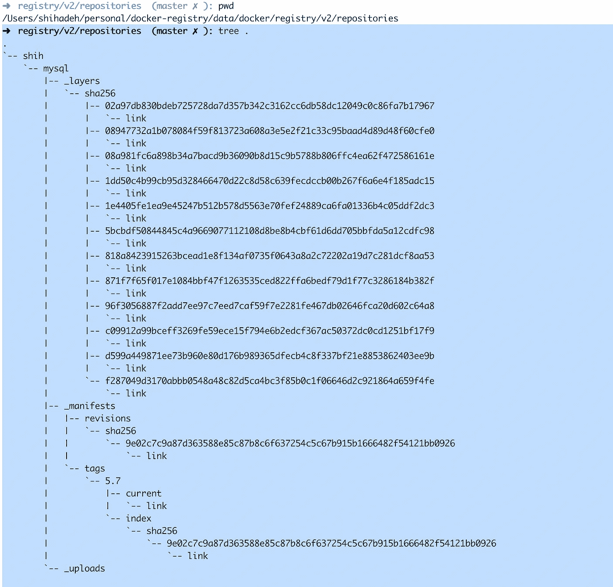
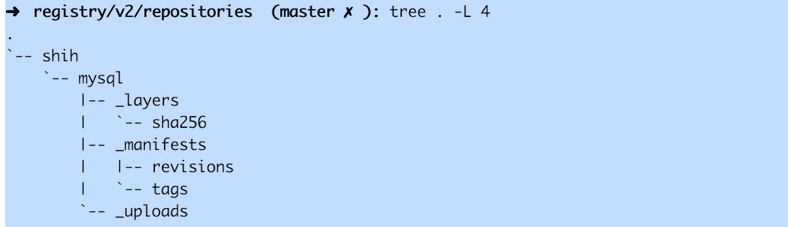

# 自动清理 Docker 注册表

> 原文：<https://betterprogramming.pub/automate-docker-registry-cleanup-3a1af0aa1535>

## 通过清理旧的、未使用的 Docker 映像，优化 Docker 注册表的磁盘空间使用


詹妮弗·伯克在 [Unsplash](https://unsplash.com?utm_source=medium&utm_medium=referral) 上的照片

托管一个私有的 Docker 注册表对于使用 Docker 部署软件的各方来说非常有帮助。将本地集群连接到私有 Docker 注册中心也是一个好主意，而不是将集群直接暴露给公共 Docker hub。

虽然安装和托管 Docker 注册表非常简单，可以通过一个`docker`命令或`docker-compose`文件轻松完成，但管理 Docker 集群和清理旧的或不需要的 Docker 映像可能是一项具有挑战性的任务。但是为什么我们首先需要清理呢？

Docker Registry 在文件系统上存储 Docker 映像(它也支持其他云存储[选项](https://docs.docker.com/registry/storage-drivers/))。因此，需要在 Docker 注册主机上附加足够的存储空间，以便能够存储 Docker 映像，并确保始终有足够的存储空间来存储新的 Docker 映像。否则，一旦主机上没有足够的空间，Docker 注册表将不会接受 Docker 映像。

这个问题的一个解决方案是在注册服务器上不断添加存储资源。然而，在大多数情况下，这是非常昂贵的，尤其是当 Docker 注册中心用于开发过程时。在这种情况下，Docker 映像是根据源代码为每个 pull 请求构建的，根据项目的大小，我们可能每天会构建数百个 Docker 映像。

幸运的是，大多数 Docker 图像属于特性分支，可以在测试特性后从注册表中清除。事实上，我们可以说，除了带有特殊标签(如`develop`、`master`、`latest`和版本标签)的 Docker 图像之外，大多数 Docker 图像都可以被删除。

在这篇文章中，我将解释如何建立一个 bash 脚本来自动清理 docker 注册表。但是首先，让我们用下面的 Docker-compose 文件部署我们的 Docker 注册中心。

```
$> git clone [git@github.com](mailto:git@github.com):wshihadeh/docker-registry.git
$> cd docker-registry
$> docker-compose up -d 
```

上述命令将在本地启动 Docker 注册表容器。下一步是实现这个 Docker 注册表的清理脚本。

在我们开始编写清理脚本之前，让我们花点时间了解一下 docker 注册表是如何在文件系统上存储 Docker 映像的，以及我们可以使用哪些工具来执行 Docker 清理。

Docker 注册表使用[多个对象](https://docs.pulpproject.org/plugins/pulp_docker/user-guide/concepts.html#:~:targetText=Blobs%20are%20the%20layers%20that,for%20one%20or%20more%20platforms.)将 Docker 映像存储在文件系统中，这些对象是:

*   斑点:共同构成 docker 图像的实际层。
*   图像清单:在 docker 图像中将 blob 对象以正确的顺序关联在一起的元数据。
*   清单列表:一个或多个平台的映像清单列表。这个对象可以用标签来标记。
*   Tag:这个对象引用一个清单(图像或列表),方法是对引用 N 个 Blobs 的图像清单进行同样的处理。

这里的好消息是 docker registry 提供了一个`[garbage-collect](https://docs.docker.com/registry/garbage-collection/)`命令，它将对 docker registry 文件系统执行清理。但是，该命令只会在 blobs 不再被任何清单引用时从文件系统中删除它们。因此，清理脚本不应该接触文件系统上的 docker 图像数据，而是应该负责删除旧的未使用的 blobs 的引用。为了简化这一过程，清理脚本应该执行以下操作:

*   删除旧的 Docker 标签:所有超过 30 天的 Docker 标签都应该从注册表中删除(我们可以排除特殊标签)。
*   删除根本没有标记的 docker 清单:这些清单占用了磁盘空间，但是它们没有在任何托管的 Docker 映像中使用。
*   运行`[garbage-collect](https://docs.docker.com/registry/garbage-collection/)`负责清理所有 Docker 未使用的斑点和层。

现在清楚了清理脚本中需要实现的内容，让我们开始探索脚本中最有趣的部分。

脚本接口对于理解脚本如何工作以及如何与之交互非常重要。清理脚本需要有以下配置项(这些配置可能因环境而异)。

*   `REGISTRY_URL`:这是注册表的 HTTP 网址。
*   `REGISTRY_DIR`:这是注册表数据文件夹路径。
*   `MAX_AGE_SECONDS`:这个数字代表标签的最大寿命，以秒为单位。
*   `DOCKER_REGISTRY_NAME`:这是注册 Docker 容器名称。
*   `DOCKER_REGISTRY_CONFIG`:注册表配置文件的路径。
*   `DRY_RUN`:布尔标志，支持清理的预演执行。
*   `EXCLUDE_TAGS` : Regex，定义需要从清理中排除的标签列表。

脚本应该处理的下一步是尝试从文件系统中删除旧的 Docker 标记。为了能够执行这个步骤，我们需要理解标签是如何存储在文件系统中的。

Docker 注册表将 Docker 映像存储在文件系统中的以下路径下`${REGISTRY_DIR}/docker/registry/v2/repositories`。例如，如果 Docker 注册中心拥有两个 Docker 映像`nginx`和`redis`，命名空间为`shih`，那么文件夹`shih`将存在于上述路径下，并带有两个子文件夹，名称分别为`nginx`和`redis`。图像的标签存储在文件系统`${image_folder}/_manifests/tags/*`中以下路径下的图像文件夹中。下图显示了托管`mysql` Docker 映像的注册表的文件结构。



有了以上关于 Docker 标签的文件结构的信息，我们可以遵循以下建议来清理所有旧的 Docker 标签。

*   循环所有图像中的所有标签。
*   对于包含在清理中的标签，执行以下几点。
*   如果超过了`$MAX_AGE_SECONDS`，则删除标签。

下面是`remove_image_tags`函数的伪代码:

下一个任务是移除所有没有标签的 Docker `manifests`。命令`[garbage-collect](https://docs.docker.com/registry/garbage-collection/)`不会删除`blobs`或仍然链接在 Docker `manifests`中的图像数据。另一方面，这些`manifests`不再被使用，因为它们没有被任何现有的 docker 标签引用。

为了能够找到并删除未使用的`manifests`，深入挖掘`manifests`和`tags`的注册表结构非常重要。这对于了解这些对象是如何存储在文件系统中的，以及如何在不丢失或损坏 Docker 注册表数据的情况下执行清理是很重要的。

Docker registry 正在为推送到注册表的每个图像创建三个子文件夹。例如，如果我们将一个`mysql` Docker 映像放在`shih`名称空间下，我们将在`${REGISTRY_DIR}/docker/registry/v2/repositories`下得到下面的文件结构。



如上图所示，Docker 注册表为`mysql` Docker 映像创建了以下三个子文件夹。

*   `_layers`:将 Docker 图层映射到`blobs`。该文件夹将包含 Docker 图像中每一层的子文件夹，以及相应`blob.`的地图或摘要链接
*   `_manifests`:该文件夹存储 Docker 图像的`tags`和`revisions`。目录`revisions`将包含所有 Docker 图像版本(甚至是没有被任何标签引用的版本，这允许我们基于这些`revisions`提取图像)。另一方面，`tags`目录将包含每个图像标签的子文件夹。标签只是图像`revisions`的链接。因此，Docker 注册中心正在根据`tags`和`revisions`提取 Docker 图像。例如，下面的两个命令都是有效的，并将提取 Docker 图像。

```
docker pull myregistry:5000/shih/mysql:5.9
docker pull myregistry:5000/shih/mysql@sha256:c3490dcf10ffb6530c
```

*   `_uploads`:在`docker push`期间使用的临时 docker _uploads 目录，通常这个目录应该是空的。

通过执行以下步骤，可以找到所有这些`manifests`并将其移除。

*   找到所有没有标签的`manifests`，但是取`revisions`和`tags`文件夹之间的差异。`manifests`在`revisions`文件夹中找到但没有对应的`tags`被认为是没有标签的`manifests`，可以安全删除。
*   在找到的`manifests`上循环，并执行以下动作。
*   找到包含给定`manifest`的所有存储库/名称空间。
*   从每个找到的名称空间中删除`manifest`。

下面是`delete_mainifests_without_tags`函数的伪代码:

函数`delete_manifest`可以通过向 Docker 注册中心发送删除 API 请求来实现，URL 如下:

```
${REGISTRY_URL}/v2/${repo}/manifests/sha256:${*hash*}
```

或者使用下面的命令直接从文件系统中删除文件(该算法需要一个额外的步骤来查找包含清单的标签)。

```
REPO_DIR=${REGISTRY_DIR}/docker/registry/v2/repositories*rm -r $*REPO_DIR*/${repo}/_manifests/tags/${tag}/index/sha256/${hash}
rm -r $*REPO_DIR*/${repo}/_manifests/revisions/sha256/${hash}*
```

最后，在完全删除旧标签和没有标签的`manifests`之后，脚本应该在 Docker 注册表容器中启动`[garbage-collect](https://docs.docker.com/registry/garbage-collection/)`命令。这一步可以通过执行以下命令来完成:

```
docker exec -i $REGISTRY /bin/registry garbage-collect $CONFIG
```

下面是执行 Docker 注册表清理的建议方法的完整实现，该脚本从一些通用配置开始，可以修改这些配置以满足不同 Docker 注册表的需求。该脚本还包括执行清理所需的所有函数和工具，并且它还支持脚本的模拟执行。你也可以在 Github [上找到这个脚本。](https://github.com/wshihadeh/docker-registry)