# 自动化一切！再也不要碰你的时事通讯

> 原文：<https://betterprogramming.pub/automate-everything-never-touch-your-newsletter-again-881145a5f24b>

## 使用 AWS Lambda、SES 和 EventBridge 动态自动地发送您最近的中型博客帖子


哈雷戴维森在 [Unsplash](https://unsplash.com?utm_source=medium&utm_medium=referral) 上的照片

你有没有想过为你写的所有精彩内容创建一份时事通讯，但是没有时间每周收集一份？伙计，我有个惊喜给你！

我将向你展示如何每周自动发送一封包含你最新博客文章的电子邮件。只要你在创造新的内容，你的电子邮件将永远是不同的！

如果你不是一个中等作家，不用担心，这篇文章的 99%仍然适用于你；你将只是从不同的来源拉你的内容。

本教程的重点是了解我们如何使用 [AWS Lambda](https://aws.amazon.com/lambda/) 、 [Amazon 简单电子邮件服务](https://aws.amazon.com/ses/)和 [Amazon EventBridge](https://aws.amazon.com/eventbridge/) 的组合来按照时间表发送电子邮件，并动态生成内容。下面是一个架构图，可以让您直观地看到:

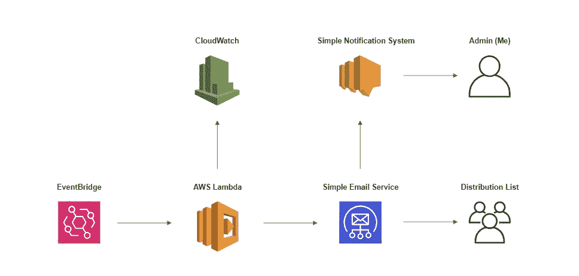

自动化电子邮件服务架构

我们将使用 Amazon EventBridge 按照我们定义的时间表触发一个 lambda 函数(使用 CRON 表达式)。然后，我们将使用 lambda 函数来触发来自简单电子邮件服务的出站电子邮件。

这篇文章将是自动化电子邮件的最小可行产品。未来的文章将解释我们如何将自动化电子邮件提升到一个新的水平(模板样式、取消订阅功能、发送到更广泛的发行列表、处理退回的电子邮件等)。).

我们开始吧！

# 目标

按照计划(每天中午)使用 AWS Lambda、Amazon Simple Email Service 和 Amazon EventBridge 发送自动电子邮件，其中包含动态生成的内容(我们的媒体内容)。

设置一次就再也不碰了。只要你不断创造新的内容，这份时事通讯就会一直与众不同。

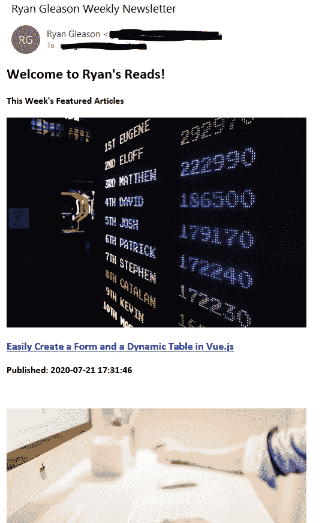

上面的图像是我们最终产品的样子。文章相关的内容(标题和链接)是在我从我的媒体页面中取出最近的四篇文章发送出去时动态生成的。

# 目录

我们将如何实现这一目标:

*   [生成 IAM 角色](#b9df)
*   [验证您的电子邮件地址](#0443)
*   [创建一个 Lambda 函数](#2086)
*   [添加电子邮件模板](#1165)
*   [测试一下](#7cdc)
*   [使用 EventBridge 进行调度](#c5ad)

# 生成 IAM 角色

我们首先需要创建正确的 IAM 角色来授予 Lambda 函数适当的权限。它需要能够执行简单的电子邮件服务(SES) API 调用。

让我们进入 IAM 并创建它:

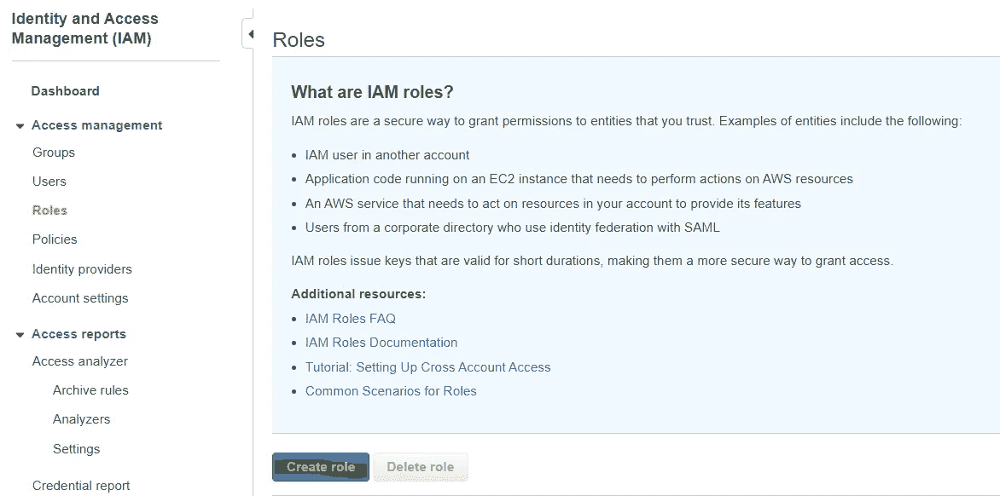

选择 Lambda 作为我们的用例:

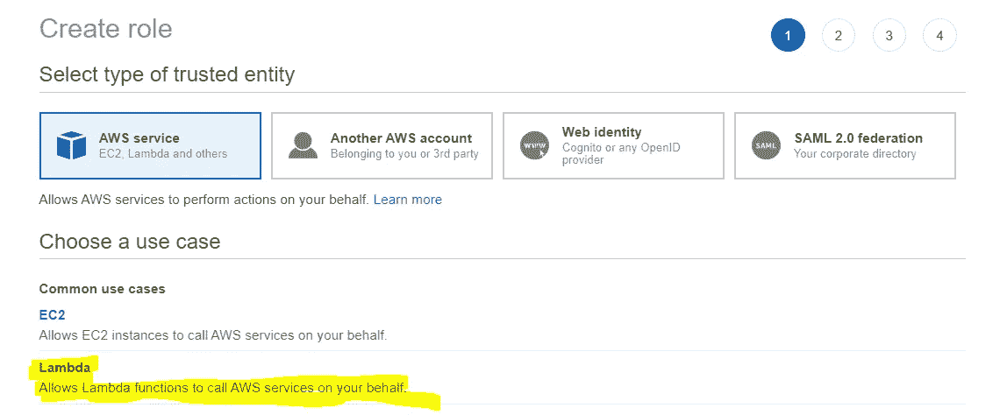

然后，我们将像这样创建我们的角色(附加策略`AmazonS3FullAccess`、`AmazonSESFullAccess`、`CloudWatchLogsFullAccess`):

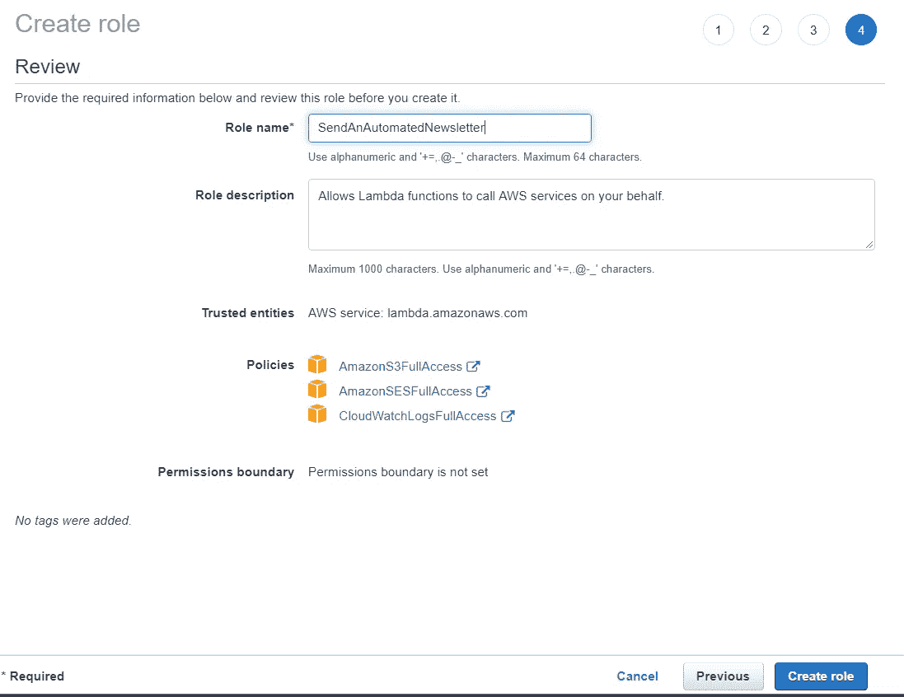

我知道这感觉像是一个繁琐的步骤，但相信我，这是必要的！

# 验证您的电子邮件地址

转到 AWS 控制台(SES 主页)中的[此链接](https://console.aws.amazon.com/ses/home?region=us-east-1#verified-senders-email:)，我们将转到`Verify a New Email Address`:

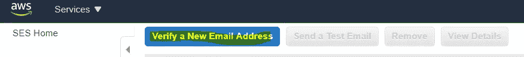

输入您的电子邮件地址，发送验证电子邮件，您应该会立即在收件箱中收到一些东西。点击验证。

# 创建 Lambda 函数

现在才是有趣的地方。我们将创建一个 Lambda 函数。这个 Lambda 函数将包含我们编写的自定义代码，以获取我们的媒体内容，对其进行一些处理，并将其提供给电子邮件模板。

所以让我们继续创建一个新的 Lambda 函数:

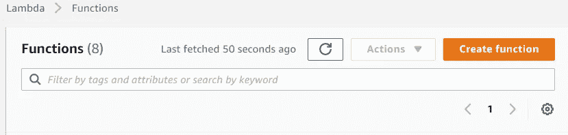

这就是我如何设置我的 Lambda 函数:

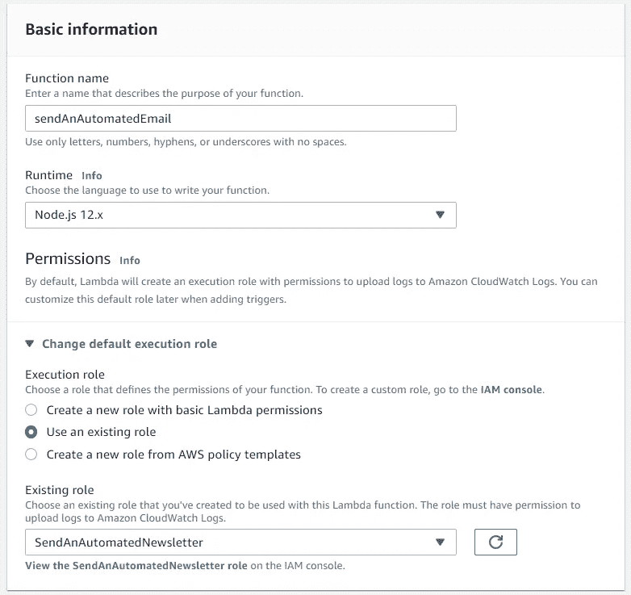

确保您附加了我们在步骤 1 中创建的 IAM 角色。

现在，在函数代码部分，我们将添加下面的代码。这段代码从 Medium 获取数据，将每篇文章的标题、链接、缩略图和出版日期添加到一个数组中，并将该数组提供给一个电子邮件模板。

你会注意到我们定义了一个`Template`。我将在下一节向您展示如何创建电子邮件模板。

一旦您替换了您的中间用户名和您验证过的电子邮件地址，单击`Deploy`按钮。

配置一个测试事件，这样我们就可以在需要的时候触发新创建的函数。对于这个 Lambda 函数，测试事件中定义了什么并不重要:


您会注意到，当我们去测试它时，会出现一个错误:

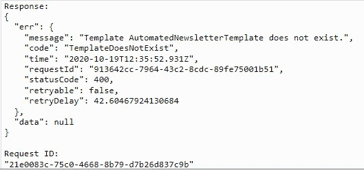

这是因为我们还没有创建我们的`Template`。

# 创建电子邮件模板

我们需要告诉我们的 Lambda 函数，当我们的电子邮件被发送到我们的分发列表时，我们希望它是什么样子。我们通过定义电子邮件模板来做到这一点。

对于这一步，我们必须使用 AWS CLI。如果你需要设置 AWS CLI 的帮助，我推荐你阅读本教程。

我们将创建一个新的 JSON 文件来存放这个模板。我在本地机器上的目录结构如下所示:

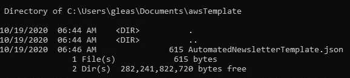

在`AutomatedNewsletterTemplate.json`中有以下代码:

我的模板非常简单。在这里尽情发挥创意，让它看起来尽可能的酷。

现在我们需要在 AWS 中创建这个模板。在文件所在目录的命令行中键入以下命令:

```
aws ses create-template --cli-input-json file://AutomatedNewsletterTemplate.json
```

当您进入 SES 的电子邮件模板部分时，您将看到您新创建的模板:

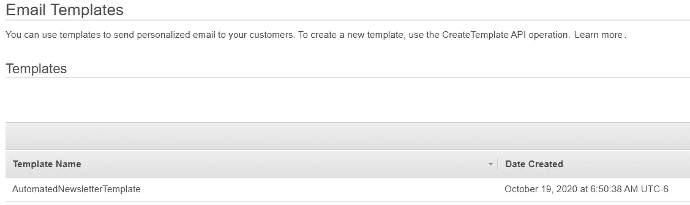

这就是创建模板的全部内容。现在是时候测试我们的自动化时事通讯了。

# 测试一下

现在，当您点击测试按钮时，您应该会看到以下响应:

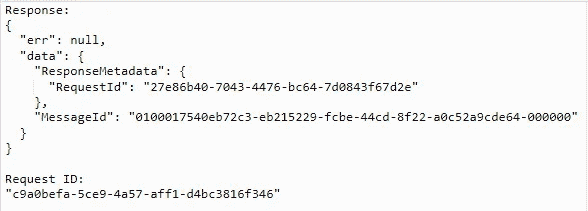

在你的收件箱里会有一封类似这样的邮件(除了你自己的媒体内容):

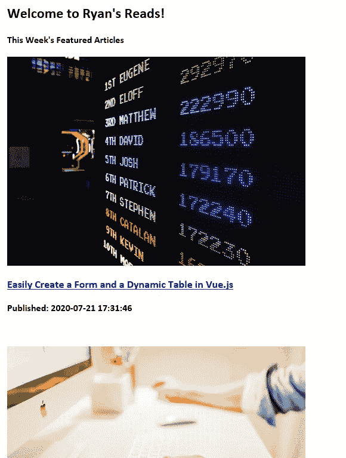

很漂亮，对吧？

现在让我们让它在每周的同一时间发送(正如您对时事通讯的期望)。

# 使用 EventBridge 计划

这一步相对简单。我们将使我们的 Lambda 函数在每周的同一时间被触发(由 CRON 表达式定义)。

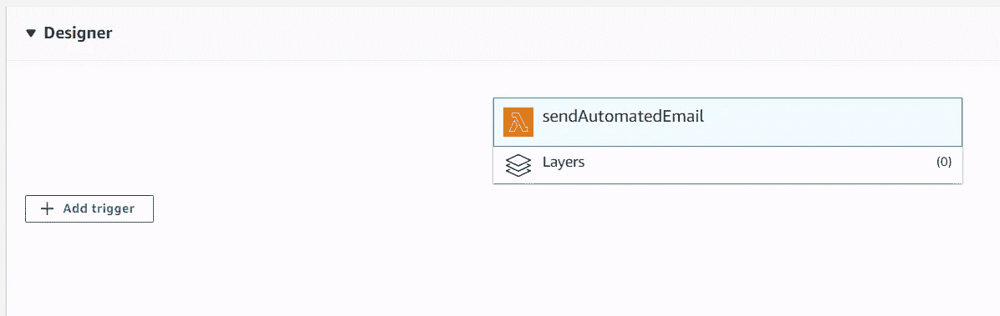

在 Lambda 函数的配置部分，我们将单击`Add trigger`按钮。

在配置中，我们将在每个星期天的中午运行我们的函数(如果您想测试，可以更频繁地运行，并确保您针对 UTC 进行了调整):

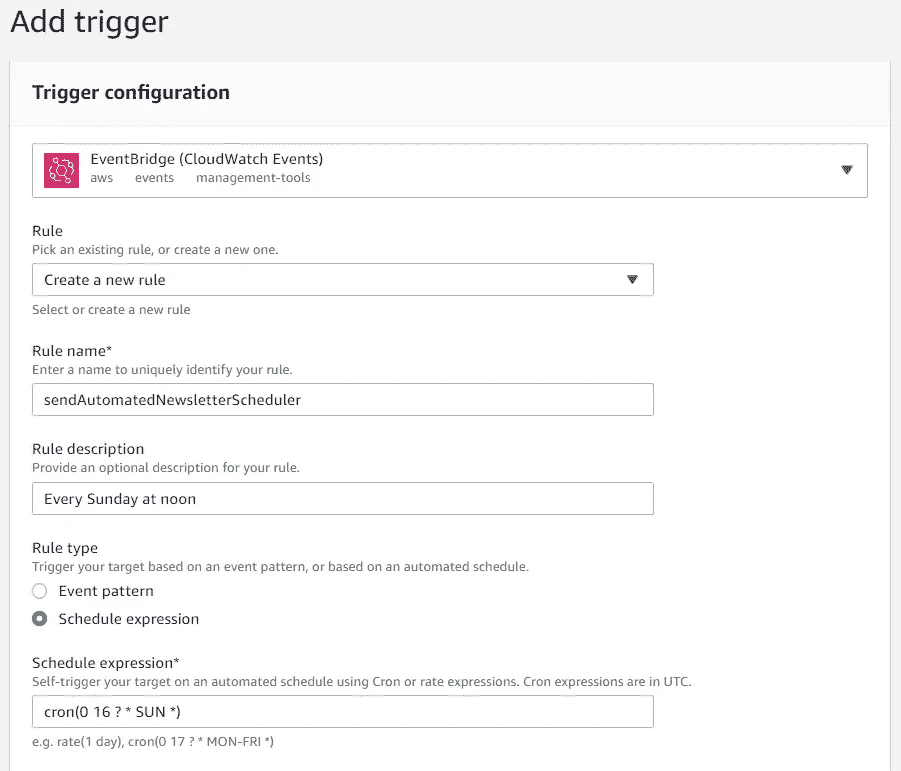

现在，当你回到你的 Lambda 函数，你会看到触发器在那里:

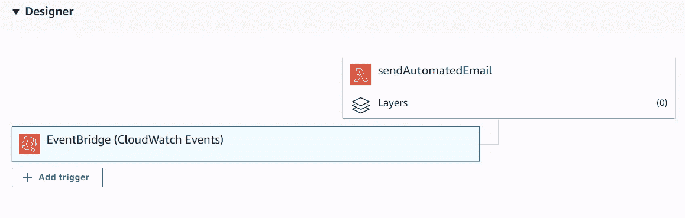

# 回顾

你做到了！您已经创建了一个自动化的新闻稿，您将再也不用更改它了。只要你不断产生新的内容，这份简讯将永远不同。

在以后的文章中，我将解释如何处理退回的电子邮件、发送到更大的分发列表、合并取消订阅功能等。

现在，享受你的全自动通讯！