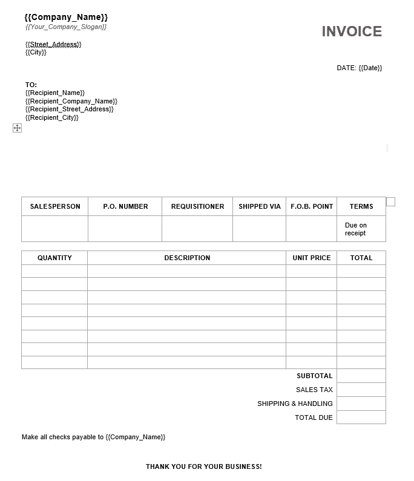
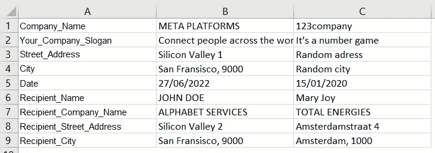
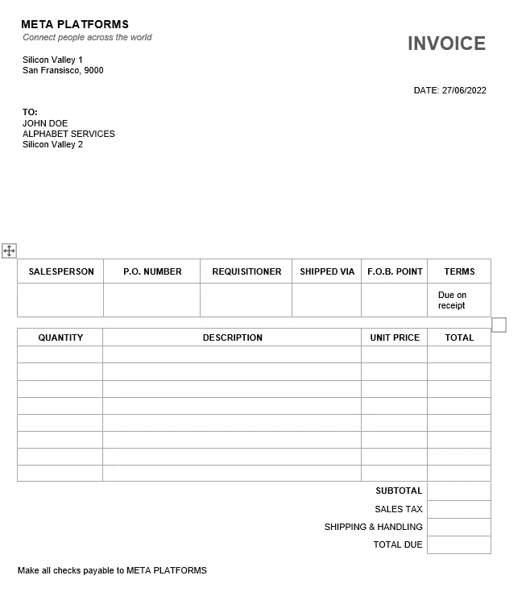

# 用 Python 自动填充模板

> 原文：<https://betterprogramming.pub/automate-filling-templates-with-python-1ff6c6fd595e>

## 做重要的工作，而不是重复的任务


照片由[克里斯里德](https://unsplash.com/@cdr6934?utm_source=medium&utm_medium=referral)在 [Unsplash](https://unsplash.com?utm_source=medium&utm_medium=referral) 拍摄

# 介绍

在本文中，您将了解到:

*   如何基于 Excel 输入填写预定义的 Word 模板？
*   如何实现自动化，以便同时创建多个模板。
*   如何使模板适应您的特定用例。


Python 流程

# 装载包裹

*   [Openpyxl](https://openpyxl.readthedocs.io/en/stable/) :用于处理 excel 文件的 Python 包
*   [Docx](https://python-docx.readthedocs.io/en/latest/) :用于处理 Word 文档的 Python 包

导入必要的包

# 获取数据

将这些文件保存到您的本地文件夹:

1.  Excel 模板:[下载](https://docs.google.com/spreadsheets/d/1SsQ0gko7AC9Vh-n_Z1Ssaw0MfRk_ZX4l/edit?usp=sharing&ouid=109954644398573752131&rtpof=true&sd=true)
2.  Word 模板:[下载](https://docs.google.com/document/d/1iAx_P6xCwABR4zTMlNoYgEm5mhU_0w6Q/edit?usp=sharing&ouid=109954644398573752131&rtpof=true&sd=true)

# 创建 Word 模板

word 模板以下列格式定义输入参数:

```
{{PARAMETER}}
```

参数中不能有空格，这一点很重要:

*   { {公司名称}}正常，但{ {公司名称}}会出现错误



Word 模板

# 创建 Excel 文件

在第一列中，显示了 word 文件中定义的相同参数。这些应该有完全相同的命名。

在其他列中，您为该特定参数定义输入数据。每一栏将确保填写一个额外的模板。

在我们的示例中，将生成两个报告(B 和 C):

*   B 列定义了元平台的数据
*   列 C 定义了 123company 的数据



擅长

# 用 Python 加载文件

首先，用 Python 加载文件，如下面的代码片段所示。

然后，定义字典`to_fill_in`，在这里定义参数名。

## ***分步代码解释:***

*   r " C:\ Users \ Documents \ 1 _ Work \ Scripts \ template assistant \ 004-Test "

将此更改为保存下载的 word 文档和 excel 文件的文件夹位置。

*   `load_workbook(workbook_path)`:

使用前面定义的 workbook_path 加载 excel 工作簿。

*   `DocxTemplate(template_path)`

为之前下载的 word 文档创建一个 docx 模板。

*   `workbook[“Input”]`

您需要指定 excel 表的 sheet_name。

*   `to_fill_in`

*这是一个空字典，其关键字与 excel 文件的第一列相匹配。现在，您分配空值(None ),这些值将在下一步中使用 excel 文件填充。*

# 用 Python 写一个循环

现在，您希望使用 Python 来遍历所有参数及其各自的数据。

随后，使用 Python 填充 word 模板，并使用 company name 属性保存它们。代码如下:

分步代码解释:

*   `column = 2`

这是将在第一次迭代中读取的列。因为第一列定义了输入参数，所以第二列是包含实际数据的列。

*   `while column ≤ worksheet.max_column`

虽然当前列不是最大列(或最后一列)，但我们应该继续迭代/创建已填充的模板。

*   `col_index = chr(column+64)`

将列号转换为字符`(64 + 2 = B)`

*   用于键入`to_fill_in` : …

对于字典中定义的每个参数:为当前`col_index`和`row_index`分配 excel 表的值。

*   `template.render(to_fill_in)`

使用 render 函数根据创建的词典填充单词模板。

*   `template.save(filled_path)`

您将创建的模板保存在指定的路径上，其名称包含参数“Company_Name”

# 恭喜

现在，您已经编写了第一个模板填充程序。您可以尝试不同的模板并添加更多的参数。



输出示例

## 完整代码

你可以在这个[谷歌协作文件](https://colab.research.google.com/drive/1V_jEt17JGCdHZ1HRHA06AbwdK4iauLtY?usp=sharing)上找到完整的代码。

## 你可能也会喜欢

请随意查看我的其他 Python 自动化文章:

*   [使用 Python 自动进行货币兑换](https://medium.com/analytics-vidhya/convert-currencies-automatically-with-python-python-in-audit-2-6c574dbae44)
*   [使用 Pyton 自动下载电子邮件附件](https://medium.com/analytics-vidhya/automatically-download-e-mail-attachments-python-in-finance-3-b4670178e9a0)
*   [用 Python 创建距离矩阵](https://pythonprogramming.medium.com/create-a-distance-matrix-in-python-with-the-google-maps-api-737dd0fc8081)