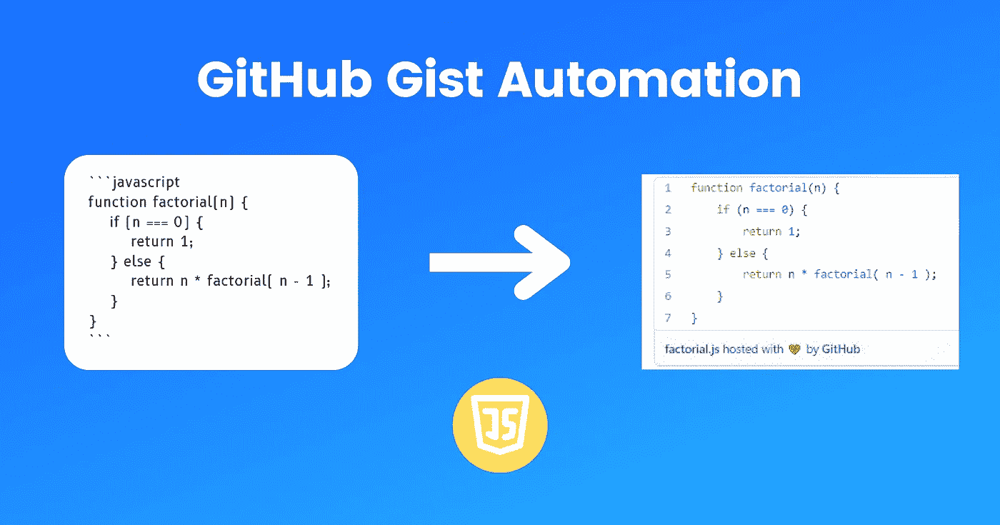

# 使用 TypeScript 自动创建 GitHub Gists

> 原文：<https://betterprogramming.pub/automate-github-gists-creation-using-typescript-ac1f3fae68c5>

## 我是如何创作剧本的



作者图片

许多编程文章出版物要求使用 GitHub Gists 来编写较长的代码片段。

对我来说，这意味着大约一个月前，我有一些额外的工作要做。

为了改编我的[文章](/build-your-own-ai-powered-virtual-assistant-on-the-web-175fc9e61973)，我必须首先复制代码块。然后创建一个新的要点。然后给文件命名。然后粘贴内容。然后保存，点击共享，然后将链接粘贴到介质中。

我宁愿花那么多时间来为一篇新文章构思主题。在这篇文章中，我将向你展示我开发一个工具来自动化枯燥的东西的过程。这是它如何工作的演示:

# 建立

初始化 TypeScript 节点项目，并安装所需的库:

```
npm init -y
npm i -D @types/node typescript
npm i @octokit/auth-oauth-device @octokit/rest
```

# 授权

首先，我们需要授权应用程序的用户能够创建 gists。我们通过 GitHub [设备流](https://docs.github.com/en/developers/apps/building-oauth-apps/authorizing-oauth-apps#device-flow)来实现这一点。一旦用户验证了应用程序，我们就获取访问令牌来创建 gists。

# 初始化 API 客户端

我们使用之前的 OAuth 令牌来初始化 GitHub REST API 客户端:

# 正在检索控制台输入

我们将使用`readline`模块从用户那里接收代码块。之后，我们要求他们输入要点的文件名。

我们将默认提示符改为`:`，以避免与节点控制台提示符(`>`)混淆。

我们使用`newlines`以便当用户输入两个空行时，我们知道代码已经结束。但是这并不意味着代码块不能包含多于两行的空行。

# 阅读每一行代码

但是首先，让我们定义一个函数，使`rl.question`函数基于承诺。

我们现在将使用`readline`将当前输入行添加到最终输入。一旦时机成熟，我们就创建要点。

# 包扎

下面是启动整个过程的代码:

仅此而已！我在 NPM 上发布了脚本代码，你可以用`npx gist-generator`运行它。您可以在这个[库](https://github.com/WoolDoughnut310/gist-generator)中找到所有的源代码。

*原发布于*[*https://cs 310 . hash node . dev*](https://cs310.hashnode.dev/create-a-script-to-automate-creating-github-gists)*。*