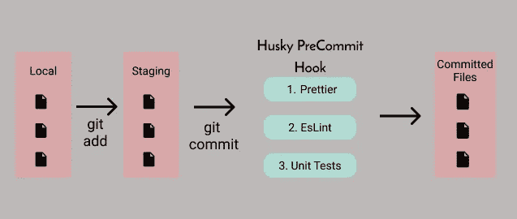
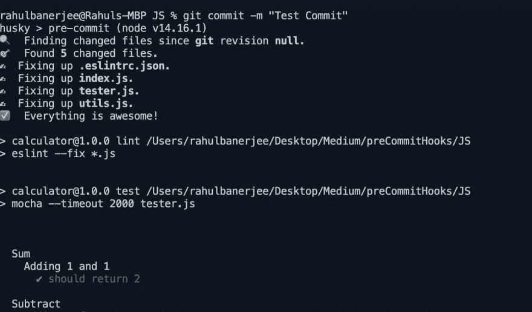

# 通过 5 个简单的步骤实现 JavaScript 代码林挺和格式化的自动化

> 原文：<https://betterprogramming.pub/automate-javascript-code-linting-and-formatting-in-5-simple-steps-9e7a5751fe7f>

## 永远不要再犯错误



作者图片

# 什么是 Git 挂钩？

Git 挂钩基本上是在重要操作发生之前触发的脚本，例如，在提交之前，在提交之后将代码推送到 repo 之前，等等。你可以在[这里](https://git-scm.com/book/en/v2/Customizing-Git-Git-Hooks)了解更多关于 Git 钩子和不同种类钩子的知识。

[这篇文章](https://medium.com/google-developer-experts/using-git-hooks-to-improve-your-development-workflow-8f5a1fb81ec7)由[Enrique lópez-Maas](https://medium.com/u/f08187f6a023?source=post_page-----9e7a5751fe7f--------------------------------)撰写，也是了解更多关于 git 钩子的好文章。

预提交挂钩是在提交之前运行的挂钩。

# TL；速度三角形定位法(dead reckoning)

1.  安装摩卡和柴进行测试
2.  为林挺安装 Eslint
3.  安装漂亮和漂亮-快速格式化
4.  安装 Husky 以设置预提交挂钩
5.  测试提交前挂钩

# 当前项目设置

我有两个文件，第一个文件叫做‘utils . js’。它有四个基本的算术函数:

实用工具

如您所见，它的格式很奇怪，并且缺少分号。这是故意的。

第二档是`index.js`。它只是从 utils.js 导入函数并导出它们。代码如下:

索引. js

这也是故意以奇怪的方式格式化的。

该项目还有一个使用`npm init`生成的基本 package.json 文件

# 步骤 1:设置测试

我们将使用摩卡和柴进行测试。我们将为我们的每个功能编写一个单独的测试用例。要深入了解摩卡和柴，参考[本文](https://blog.logrocket.com/a-quick-and-complete-guide-to-mocha-testing-d0e0ea09f09d/)。

[这篇文章](https://medium.com/@madelinecorman/testing-javascript-with-mocha-chai-f41175e26d69)由 [Madeline Corman](https://medium.com/u/c95977d1fbd8?source=post_page-----9e7a5751fe7f--------------------------------) 撰写，提供了更多关于使用 mocha 和 chai 进行测试的信息。

首先，让我们使用以下命令安装 mocha 和 chai:

```
npm install --save-dev mocha
```

接下来，我们来装柴:

```
npm install --save-dev chai
```

现在，我们将创建一个文件“tester.js”，并向其中添加一些测试。

tester.js

我没有包括整个测试文件，还有几个乘法和除法的测试用例。

在 package.json 中，在脚本下添加以下内容:

```
"test": "mocha --timeout 2000 tester.js"
```

如果 package.json 中没有“脚本”,请创建一个。它应该是这样的:

```
"scripts": {
  "test": "mocha --timeout 2000 tester.js"
}
```

现在，您可以到终端运行以下命令:

```
npm test
```

# 步骤 2:设置 Linter

我们将使用软件包 [eslint](https://www.npmjs.com/package/eslint) 。首先，让我们安装软件包:

```
npm install eslint --save-dev
```

现在，我们需要初始化我们的 linter。

```
./node_modules/.bin/eslint --init
```

你会得到一堆问题，根据你的项目回答它们。
最后，我们将在“package.json”中的“scripts”内添加一个新命令。您可以将它添加到我们在上一节中添加的“test”命令下。

```
"lint": "eslint --fix *.js"
```

这将在所有 javascript 文件上运行 linter，并尽可能修复林挺错误。

您还可以通过在文件顶部或某些行的上方添加注释来禁用某些 es-lint 检查。例如，我禁用了“tester.js”文件中的几项检查。

```
/* eslint-disable import/no-extraneous-dependencies */
/* eslint-disable no-undef */
```

# 第三步:设置得更漂亮

我们将不得不安装几个软件包[漂亮的](https://www.npmjs.com/package/prettier)和[漂亮快捷的](https://www.npmjs.com/package/pretty-quick)来格式化代码。

使用以下命令安装更漂亮的:

```
npm install prettier -save-dev
```

使用以下命令快速安装:

```
npm install pretty-quick --save-dev
```

现在，我们将向“package.json”中的“scripts”部分添加另一个命令:

```
"pretty-quick": "pretty-quick"
```

不要立即运行该命令。让我们设置预提交挂钩并自动运行该命令。

# 步骤 4:设置 Husky

我们将使用 [husky](https://www.npmjs.com/package/husky) 来设置我们的预提交钩子。使用以下命令安装软件包:

```
npm install husky@4 --save-dev
```

如果您安装了 husky 的 V5，您可能需要做一些额外的工作来设置预提交挂钩。

安装后，在“package.json”中添加以下内容:

package.json

基本上，我们告诉 husky 在提交文件之前运行上面的命令(pretty-quick、lint 和测试)。

`--staged`仅对暂存文件运行格式化程序。

# 步骤 5:测试提交前挂钩

现在我们终于可以测试我们的预提交钩子了。

首先，使用以下命令添加文件:

```
git add .
```

键入以下命令提交文件:

```
git commit -m "Test commit"
```

您应该会看到 husky 运行 beautiful、linter 和测试脚本。下面是终端的截图。



作者截图

如果 linter 返回一个错误或者其中一个测试用例失败，提交将会失败，您的文件将会保留在临时区域中而不会被提交。

*原载于*[*https://www.realpythonproject.com*](https://www.realpythonproject.com/automate-javascript-code-linting-and-formatting-in-5-simple-steps/)