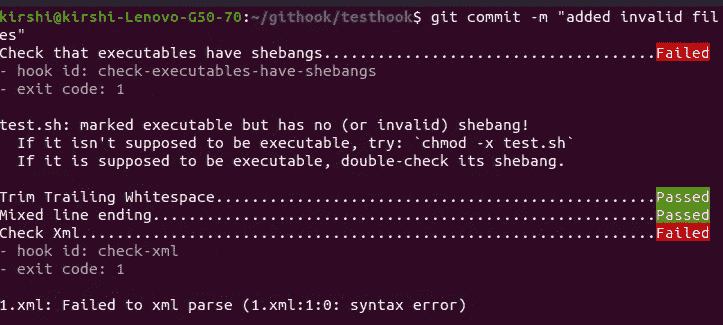
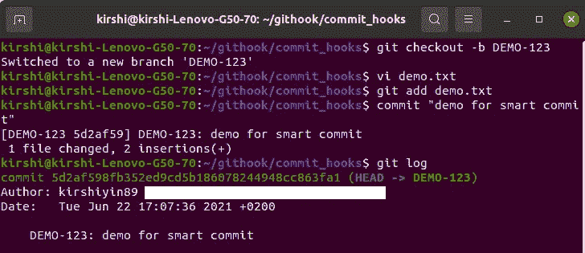
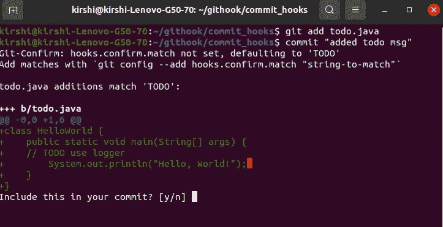
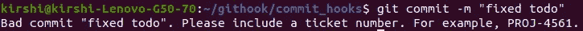
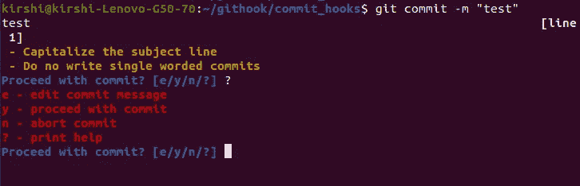

# 使用 Git 挂钩自动化手动提交任务

> 原文：<https://betterprogramming.pub/automate-manual-commit-tasks-with-git-hooks-7642ecf05ffa>

## 一个有用的 Git 预提交钩子集合


[布鲁克·安德森](https://unsplash.com/@brookanderson?utm_source=medium&utm_medium=referral)在 [Unsplash](https://unsplash.com?utm_source=medium&utm_medium=referral) 上的照片。

[Git 挂钩](https://git-scm.com/docs/githooks)在将代码变更提交到代码库之前，在识别简单问题方面发挥着重要作用。此外，将相关信息添加到提交消息中以确保更容易跟踪问题也是一个很好的做法。

手动添加分支名称等详细信息并验证不存在尾随空格是重复的手动任务。Git 挂钩提供了一种自动化流程的便捷方式。您可以配置钩子来自动添加必要的信息，并检查您的代码是否符合项目的标准。

在本文中，我将向您展示几个有用的提交挂钩，您可以轻松地将它们添加到您的存储库中。这样，您就可以节省时间来专注于您的开发工作。

本文假设您已经理解了什么是 Git 挂钩。如果你是初学者，想了解更多，请查看上面链接的文档。

我们开始吧！

# 预提交

如果你已经熟悉 Git 钩子，你会知道当你创建一个新的存储库时，你必须将所有钩子复制到新项目的`.git/hook`文件夹中。您还必须手动更改挂钩，以确保它们适用于不同的项目结构。用 Python 编写的库`[pre-commit](https://pre-commit.com/)`为这个问题提供了一个方便的解决方案。

您可以在一个配置文件中指定一个挂钩列表。您可以将它用于各种语言来解决不同的任务，例如检测 AWS 凭证、大文件、尾随空白、验证 JSON、XML 语法等等。

它自动处理任何钩子的安装和执行。

运行以下命令进行安装:

```
pip install pre-commit
```

在项目的根目录下创建一个名为`.pre-commit-config.yaml`的文件。在这里，您可以包含所有您想要的挂钩。

示例配置:

```
repos:
-   repo: [https://github.com/pre-commit/pre-commit-hooks](https://github.com/pre-commit/pre-commit-hooks)
    rev: v3.2.0
    hooks:
    -   id: check-executables-have-shebangs
    -   id: trailing-whitespace
    -   id: mixed-line-ending
    -   id: check-xml
```

查看[文档](https://github.com/pre-commit/pre-commit-hooks)，看看有哪些钩子可供选择。对于各种语言有许多方便的挂钩。

在您的存储库文件夹中运行以下命令来安装挂钩:

```
pre-commit install
```

您应该会看到以下输出:

```
pre-commit installed at .git/hooks/pre-commit
```

如果您想在所有文件上快速测试它，请运行以下命令:

```
pre-commit run --all-files
```

我为这个演示创建了一个无效的`xml`和`sh`文件，所以让我们看看钩子是否能检测到问题:



提交前挂钩演示

完美！钩子确定了所有的问题。

# 智能提交

[智能提交](https://awesomeopensource.com/project/sbimochan/smart-commit)用当前分支名称为每个提交添加前缀。

在根存储库中运行以下命令来安装挂钩:

```
sudo curl https://raw.githubusercontent.com/sbimochan/smart-commit/master/commit -o /usr/local/bin/commit && sudo chmod +x /usr/local/bin/commit
```

让我们来看看它的实际应用:



智能提交演示

您可以看到，我已经创建了一个名为“DEMO-123”的分支，并编辑了一个文件。`commit`命令自动将分支名称插入提交消息中。

如果您需要将分支名称附加到每个提交中，这个钩子将会很有帮助。

# Git 确认

[Git Confirm](https://awesomeopensource.com/project/pimterry/git-confirm) 检查你是否有任何占位符或者临时修改，比如修改后的文件中的“TODO”注释。这可以防止你无意中犯下尚未准备好的事情。

在项目的根存储库中运行以下命令来安装挂钩:

```
curl https://cdn.rawgit.com/pimterry/git-confirm/v0.2.2/hook.sh > .git/hooks/pre-commit && chmod +x .git/hooks/pre-commit
```



Git 确认挂钩演示

你可以从上面的截图中看到，这个钩子让我们决定是否要包含这个文件。

默认模式是“TODO”您可以定制配置以包含更多的模式，例如“FIXME”等。

```
git config --add hooks.confirm.match "FIXME"
```

请注意，所有模式都区分大小写。

提示:如果您想跳过本地安装的钩子，运行带有`no-verify`标志的 commit 命令:

```
git commit -m 'commit message' — no-verify
```

# 自定义提交消息检查器

我们现在要创造我们自己的钩子了。

在许多情况下，在提交消息中包含票证编号是有意义的。

您可以通过使用以下代码轻松实现这一点:

示例 regex 模式检查以“PROJ-”开头的票据编号是否出现在提交的开始行中。

将这段代码粘贴到位于您的存储库的`.git/hooks`路径下的`commit-msg`文件中。如果你从未使用过`commit-msg`钩子，从文件中移除`.sample`扩展名来激活它。

让我们尝试提交一条不符合要求的消息:



票号检查钩

现在，您可以确保每个提交都包含一个票号。这使得将来搜索 Git 历史更加容易。

# Git 良好的提交

如果您想要更复杂的东西，请查看一下 [Git Good Commit](https://awesomeopensource.com/project/tommarshall/git-good-commit) 钩子。它会验证您的提交消息是否满足某些要求，比如将标题大写，避免单个单词的提交，将主题行限制在 50 个字符以内，等等。

安装命令:

```
curl https://cdn.rawgit.com/tommarshall/git-good-commit/v0.6.1/hook.sh > .git/hooks/commit-msg && chmod +x .git/hooks/commit-msg
```

这可能有点严格，但是如果您希望所有的提交消息都遵循一个单一的标准并且更加一致，这是很方便的。



Git 良好提交演示

正如您所看到的，钩子使您能够以内联方式编辑提交消息，继续进行更改，或者中止提交。

# 结论

在本文中，您看到了一系列强大的 Git 挂钩，它们自动化了一些最常见的提交任务。

有时候，鼓励团队中的每个人使用 Git 挂钩是很有挑战性的。这些工具应该可以减轻开发人员的工作，所以值得一试，直到您找到与您的项目最相关的挂钩。

如果你想知道如何与其他队友分享你的 Git 钩子，[查米卡·卡森](https://medium.com/u/50792fd0a988?source=post_page-----7642ecf05ffa--------------------------------)写了[一篇关于这个话题的简短而全面的文章](https://chamikakasun.medium.com/how-to-share-git-hooks-with-the-team-37424603dd91)。如果你有 Git[2.9](https://raw.githubusercontent.com/git/git/master/Documentation/RelNotes/2.9.0.txt)或更高版本，他描述了如何将`core.hooksPath`配置变量设置到你的托管钩子目录。

如果您对更多 Git 主题感兴趣，您可能会喜欢我的相关文章:

[](/10-handy-git-stash-commands-to-manage-your-code-efficiently-39ddc3d6f324) [## 10 个方便的 Git-Stash 命令来有效地管理您的代码

### 从基础到高级 git-stash 用例

better 编程. pub](/10-handy-git-stash-commands-to-manage-your-code-efficiently-39ddc3d6f324) 

感谢您的阅读，下次再见！