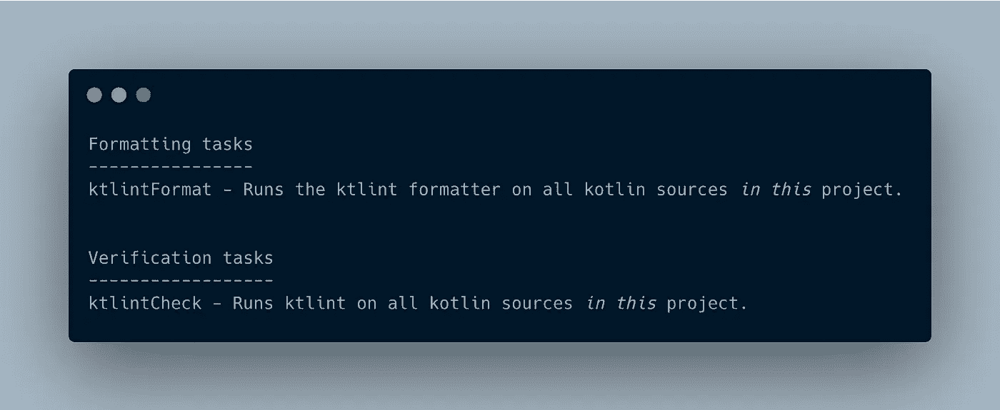
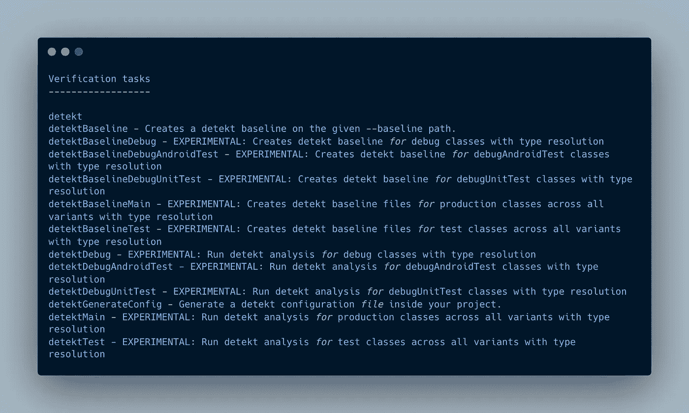

# 自动化您的 Android 代码审查过程

> 原文：<https://betterprogramming.pub/automate-part-of-your-code-review-process-cf83e644d356>

## 或者使用这些工具的过程的一部分

功劳归于[梁杰森](https://unsplash.com/photos/HBGYvOKXu8A)

在大公司或非个人项目中，总会有一次代码审查。你的另一个团队成员将会检查你的代码，如果有任何疑问，他们会提出意见。此外，如果更改文件很大，这将是一个很累的过程。在审查代码的时候，不管有没有意识到，你总会看到一些不必要的、不应该引起你注意的东西。比如缩进、类结构、通配符导入、代码约定等。好了，你可以放松了，那些琐碎的问题可以通过静态代码分析自动解决。

静态代码分析到底是什么？这是一个在不运行程序的情况下检查代码的过程。检查过程基于开发人员或工具已经设定的一组规则。当然，你不必手动完成，幸运的是，有一个工具可以自动完成这项工作。这个工具被称为静态代码分析器。有很多著名的静态代码分析工具，比如 [Android Lint](https://developer.android.com/studio/write/lint) 、 [Ktlint](https://github.com/pinterest/ktlint) 、 [Detekt](https://github.com/detekt/detekt) 、[一尘不染](https://github.com/diffplug/spotless)等。有些工具，比如 SonarQube，不仅仅是分析代码，它还会查看你的代码漏洞，重复代码等等。

在我们的项目中实现这些静态代码分析工具有很多好处。

1.  **时间**。添加静态代码分析器意味着成功提交的代码已经符合标准。在审查代码时，我们只需要关注重要的事情。您也可以在推至原点之前或之后以及合并至主图形之前运行该流程。选择最适合你的，目标是一致的。
2.  **执行标准代码**。和许多人一起做一个项目需要一些标准。实现静态代码分析器，迫使开发人员遵循规则。
3.  **最小化 bug 和性能问题**。一些规则已经遵循标准指南，使我们的应用程序性能更好。比如在需要的时候使用*作为每个*和*的内嵌*功能。

在本文中，我们将介绍 Ktlint 和 Detekt 的基本用法，因为它在社区中非常有名(每个都超过 4k 颗星)。出于演示的目的，我已经创建了一个简单的项目，它拥有我稍后将解释的一切，在这里得到它[。](https://github.com/bobbyirawan09/StaticAnalyzer)

# Ktlint

根据官方文档，Ktlint 是一种内置格式化程序的防自行车脱落 Kotlin linter。在运行 Ktlint 任务时，有一些规则是默认激活的，您可以在这里找到[。让我们开始将其集成到 Android 项目中。](https://ktlint.github.io/#rules)

*   添加依赖项。建议使用此处所述的[插件。我们将使用](https://github.com/pinterest/ktlint#with-a-plugin---recommended) [Jlleitschuh](https://github.com/jlleitschuh/ktlint-gradle) 。

步骤 1，添加 Ktlint 插件

*   添加 Ktlint 配置。我们将在 *allProjects* 中实现它，因此其他模块将与 Ktlint 集成。从下图中，你可以看到有一些额外的配置。我不打算在这里解释它，去检查项目，因为我在那里添加了一些评论。

步骤 2，添加 Ktlint 配置

*   (可选)您还可以修改报告文件目录。默认情况下，它将被放置在`build/reports/ktlint`中。

第三步，修改报表文件目录

*   去同步你的项目。之后，你现在已经成功地将 Ktlint 集成到 Android 项目中了。

要检查 Ktlint 任务是否可以执行，请运行*。终端上的/gradlew task* 命令，结果应该如下图所示。

Ktlint 有两个可以运行的 Gradle 任务，每个任务都有自己的工作。第一个是 *ktlintCheck，*它会检查你所有的代码，如果有违反就报告。第二个是 *ktlintFormat，*作业与 ktlintCheck 相同，但有一个额外的作业。它还会根据规则自动重新格式化您的代码。请记住，它有局限性，并不是每一个违规都会重新格式化。

你可以在这里获得 Ktlint 集成的完整代码。

# **检测**

[Detekt](https://detekt.github.io/detekt/index.html) 是一个静态代码分析器。它的主要工作与 Ktlint 相同，扫描您的代码并在有违规时报告，但它要强大得多，至少对我来说是这样。Detekt 还带有预定义的规则，我们可以轻松地打开和关闭，完整的规则请查看[这里](https://detekt.github.io/detekt/comments.html)。

*   与 Ktlint 相同，首先添加依赖项。点击了解更多[。](https://detekt.github.io/detekt/gradle.html#kotlin-dsl-2)

步骤 1，将插件添加到项目中

*   向 Detekt 添加一些配置。我们将在 *allProject* 中实现配置。对于多模块项目，有一个特性可以将所有模块的报告合并到一个报告文件中。还有基线和配置放置。

步骤 2，添加 Detekt 插件配置

*   同步项目并检查可用的 Gradle 任务，确保您可以在那里找到 detekt。

步骤 3，检查可用于检测的梯度任务

除了默认的规则之外，您可以向 Detekt 添加自己的规则。假设您在公司或项目中编码时有一个约定或一些限制，您可以将它添加到 Detekt 中，这样 Detekt 将在检查代码时包括那些规则。你可以在项目中找到这一点，但是如何做将在另一篇文章中解释。

此外，每个违规都有自己的解决时间预测。这一预测印在每一条规则中。当报告出来时，它还会告诉你和你的团队需要多少时间来解决所有的违规问题。这可能需要几天，几周，甚至几个月

就是这样！你都准备好了！现在您可以开始在您的项目中使用 Ktlint 和 Detekt 了。但是请记住，特别是在大项目中，修复问题的时间不短。你可以一次一个地开始执行这个规则。一旦一个规则通过，那么继续下一个。

你可以在这里获得完整的代码。

# **结案陈词**

静态代码分析的主要作用是帮助我们处理代码惯例、代码性能等问题。

请选择哪些工具涵盖了您的用例。除了我们刚刚讨论的两个，还有一些前面提到的其他方法值得一看和尝试。设置过程只是开始，添加到管道中，使每个编码通过所有规则，以及您需要做的其他事情，以便在您的项目/团队中充分利用这一点。慢慢来，一条一条地添加规则，让你的代码同时遵循所有的规则可能会让人头疼。

# 资源

 [## 检测

### 基于代码逻辑行、McCabe 复杂性和…的 Kotlin 项目复杂性报告的代码味道分析

detekt.github.io](https://detekt.github.io/detekt/)  [## GitHub-JLLeitschuh/ktlint-gradle:一个 ktlint gradle 插件

### 最新插件版本:10.2.1 这个插件在你的 Gradle 项目中创建方便的任务，运行 ktlint 检查或做…

github.com](https://github.com/jlleitschuh/ktlint-gradle) 

完整的项目，你可以查看我的 Github [这里](https://github.com/bobbyirawan09/StaticAnalyzer)。

感谢阅读。