# 使用 CI 管道自动化您的 API 测试

> 原文：<https://betterprogramming.pub/automate-your-api-testing-with-ci-pipelines-ee6b8d133114>

## 使用纽曼，邮差的 CLI 工具

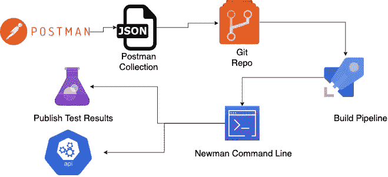

图片来源:作者

REST APIs 现在是日常软件工程实践的一部分。不久前，我写了一篇文章讨论如何设计 REST APIs。在本文中，我将讨论如何对 API 进行自动化测试，并将其集成到 CI 管道中。

本文假设您对 REST APIs 有基本的了解。

# 邮递员

Postman 是一个 API 开发的协作平台。Postman 为 API 的使用和测试提供了一个基于 GUI、易于使用且安全的应用程序。它只是作为一个 HTTP 客户端。

首先，你需要[下载](https://www.postman.com/downloads/)并安装邮递员应用程序。

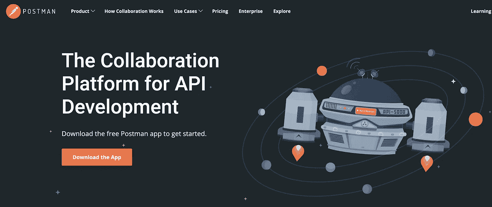

# 纽曼

Newman 是邮递员集合的基于 CLI 的运行程序。这意味着您可以使用 Newman CLI 运行一组 API(集合)。你需要按照本页上[给出的说明安装纽曼。](https://github.com/postmanlabs/newman#installation)

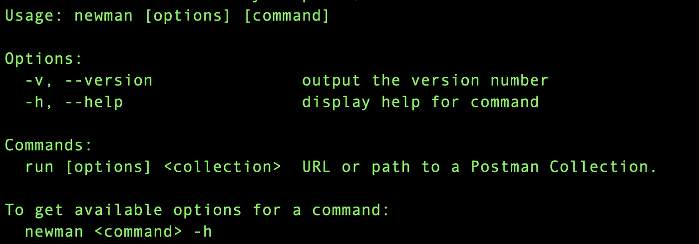

既然先决条件已经安装，让我们开始测试 API。

# 测试用 REST APIs

对于本教程，我使用来自 http://dummy.restapiexample.com/的虚拟 REST APIs

这些 API 可以公开使用。

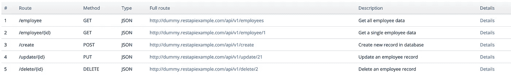

# 创建邮递员集合

让我们首先创建一个 Postman 集合来使用两个 API:

*   "获取所有员工"
*   "创建员工"

Postman 的 UI 足够直观，你可以轻松地创建一个 Postman 集合。如果发现问题，可以参考[文档](https://learning.postman.com/docs/postman/collections/intro-to-collections/)。

一旦创建了集合，就可以添加上述 API 并运行它们。

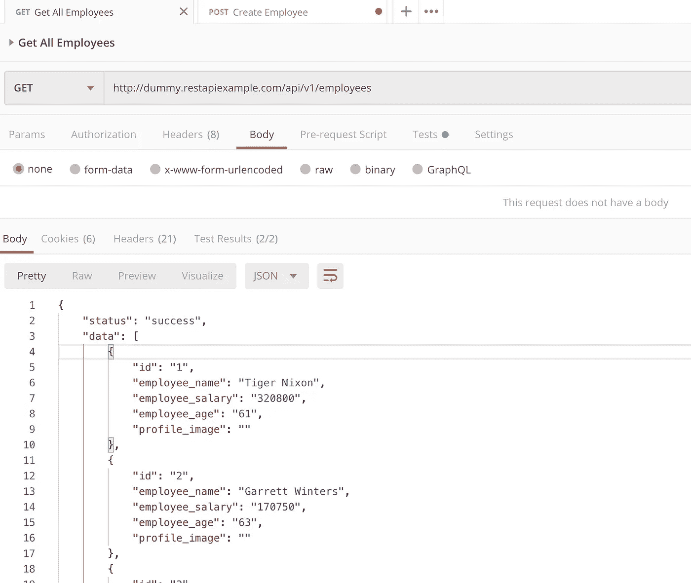

“获取所有员工”API

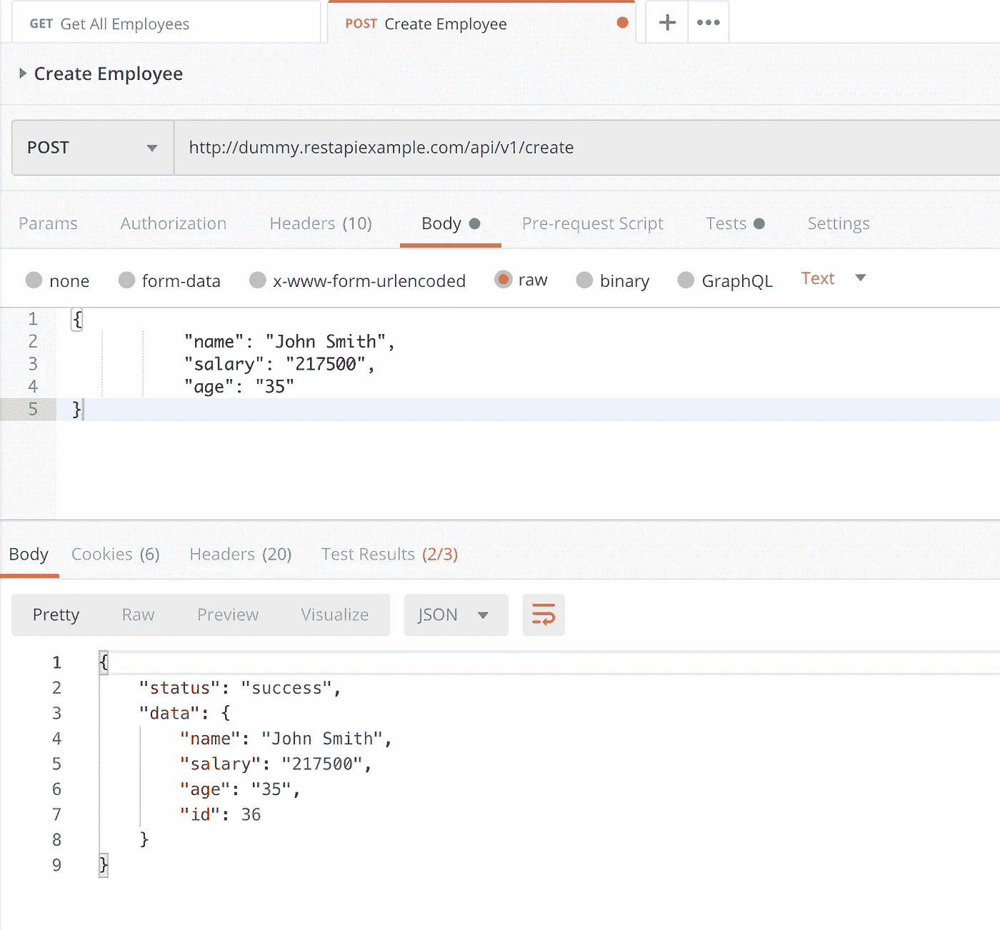

“创建员工”API

# 为 API 响应编写测试

既然我们已经尝试了 API，我们可以开始编写测试了。一般来说，在 API 测试中，你可以考虑这样的测试:

*   验证返回的 HTTP 状态代码
*   验证 API 响应时间
*   验证内容类型标头
*   验证响应正文
*   等等。

Postman 提供了一个名为 Tests 的选项卡，您可以在其中编写上述测试。

对于“创建雇员”API，我编写了以下测试用例:

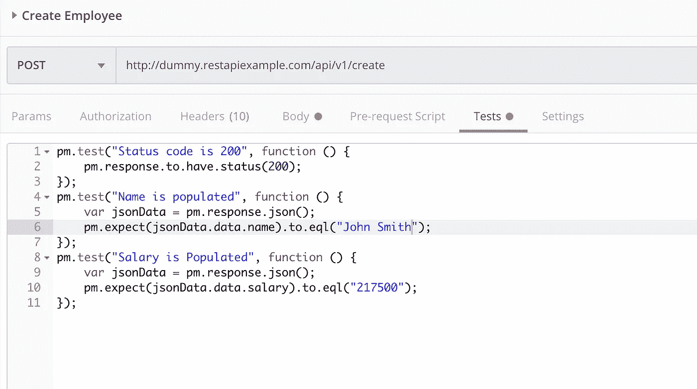

对于“获取所有员工”API，我编写了以下测试用例:

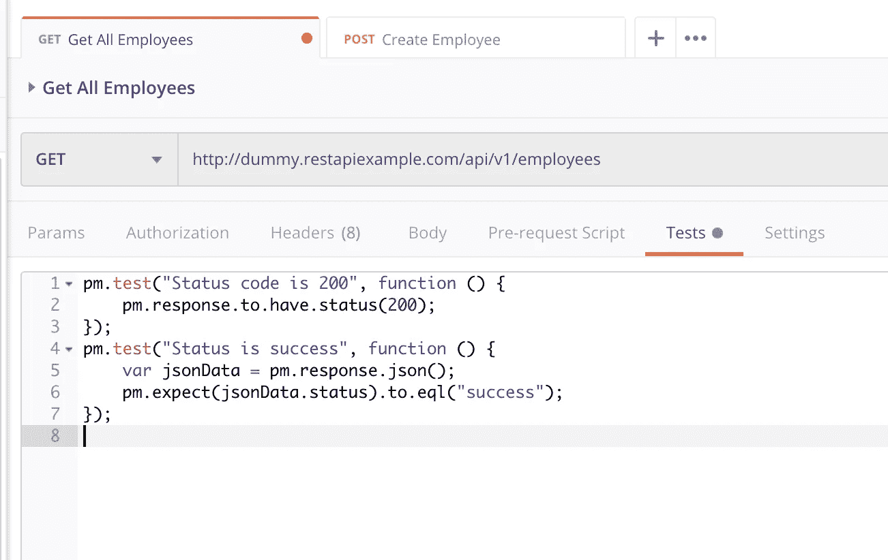

为了使事情变得简单，Postman 提供了一个列出测试类型的窗口。当你点击它们时，基本代码会自动生成。您可以根据需要修改测试用例。

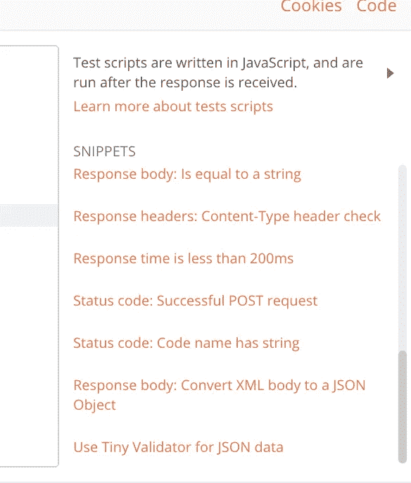

Postman 还提供了一种预先请求脚本的方法，如果您想要在测试套件中创建一系列测试，并通过跨测试用例的变量共享数据，可以使用这种方法。

# 用邮递员运行测试

现在我们已经准备好了测试，我们可以使用 Postman 的 Runner 功能来验证测试。

下面的快照显示了我们的 API 和测试的示例执行摘要。

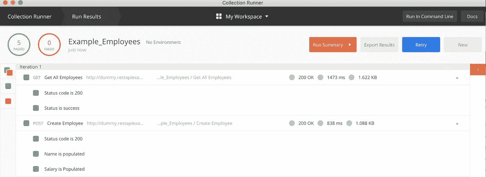

# 使用 Newman CLI 运行测试

既然已经在 Postman Runner 上验证了 API 测试，那么就可以使用 Newman 导出并运行这个集合了。


我将导出的集合保存为名为`Example_Employees.postman_collection.json`的 JSON 文件。如果打开文件，您可以看到导出的数据:

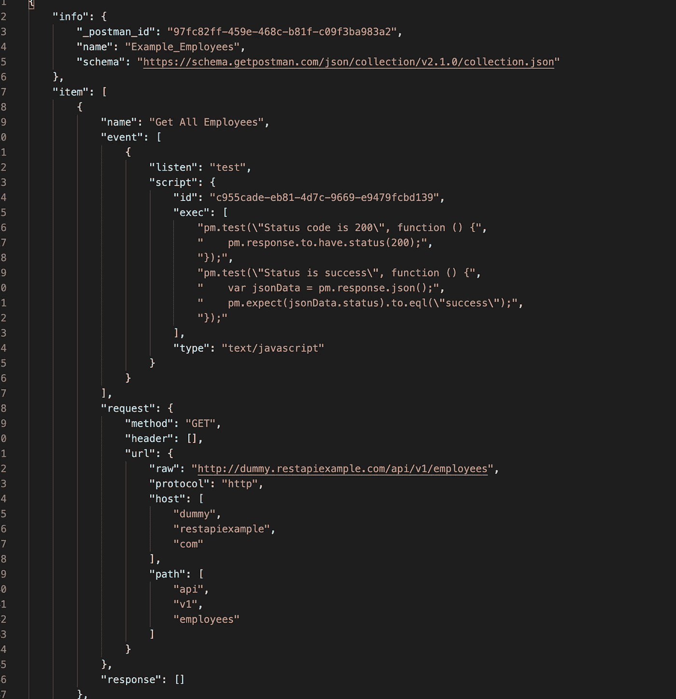

现在，您只需要运行以下命令来启动 Newman 执行:

```
$ newman run Example_Employees.postman_collection.json
```

成功执行后，您将在命令行上看到如下结果:

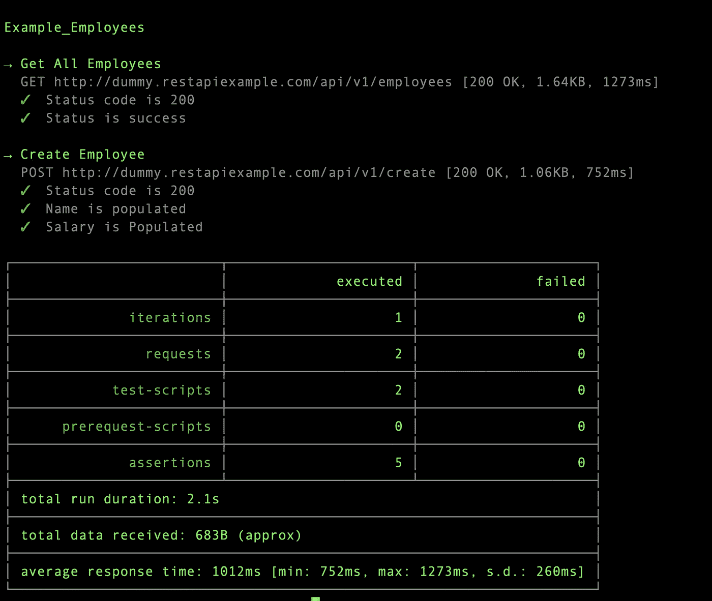

# 集成到 CI 渠道中

现在，您可以从命令行执行集合了，让我们尝试与 Azure DevOps 管道集成。

为此，您必须将 Postman 集合 JSON 提交到 Git repo 中。

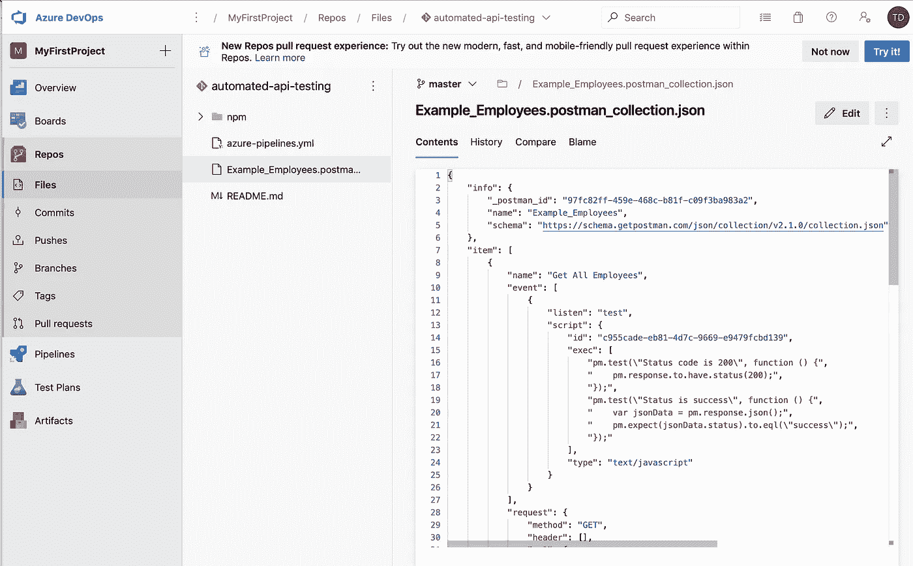

接下来，您需要设置管道:

1.  使用 npm 任务安装 Newman。
2.  运行测试套件
3.  发布测试结果。

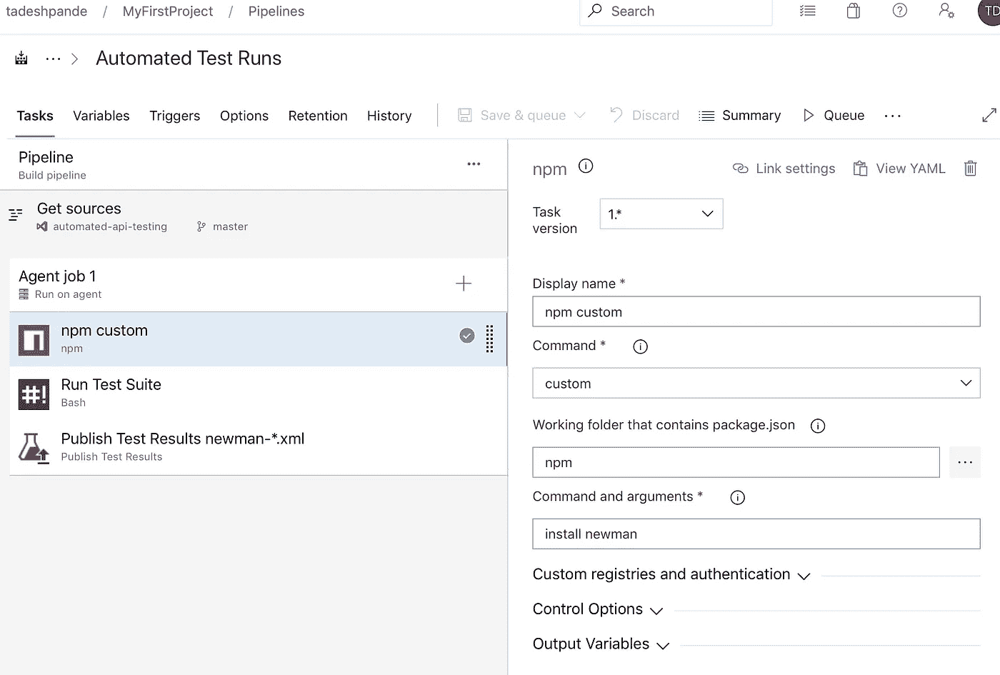

在这里，我创建了一个名为`npm`的文件夹，Newman npm 包将安装在本地的构建代理上。我还添加了一个样本`npm/package.json`文件。

在运行测试套件任务中，您需要执行一个简单的命令，如下所示:

```
/home/vsts/work/1/s/npm/node_modules/newman/bin/newman.js run ./Example_Employees.postman_collection.json --reporters cli,junit --reporter-junit-export .
```

在这里，如果您注意到了，我们添加了几个额外的参数，这将有助于在 CLI 上以 JUnit 格式生成测试执行报告。

Newman 还提供了配置 [SSL](https://github.com/postmanlabs/newman#ssl) 证书、 [HTTP 代理、](https://github.com/postmanlabs/newman#configuring-proxy)等选项。

接下来，您需要更新发布测试结果任务，以匹配 Newman 报告生成命名约定:

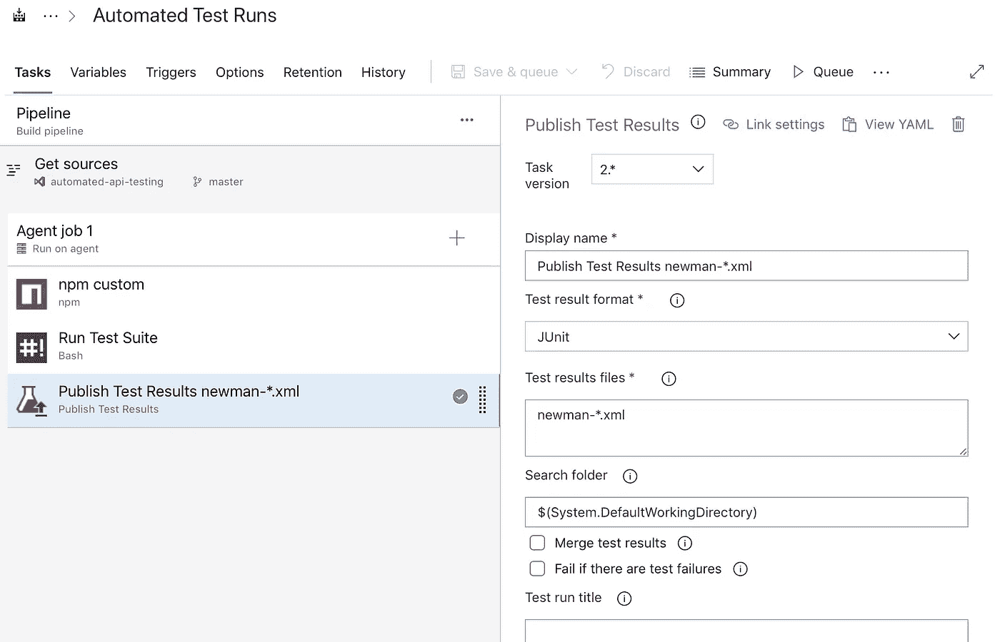

现在，您可以运行管道并验证结果:

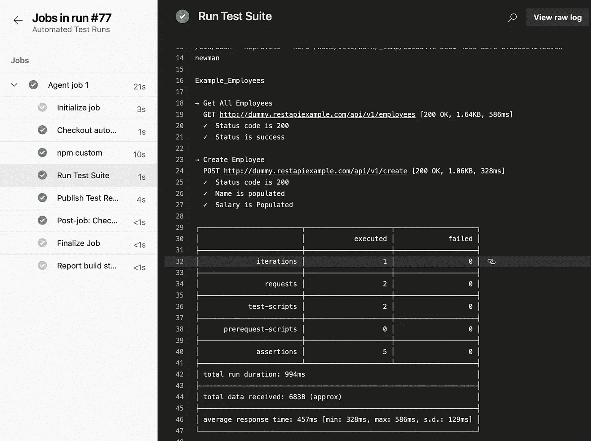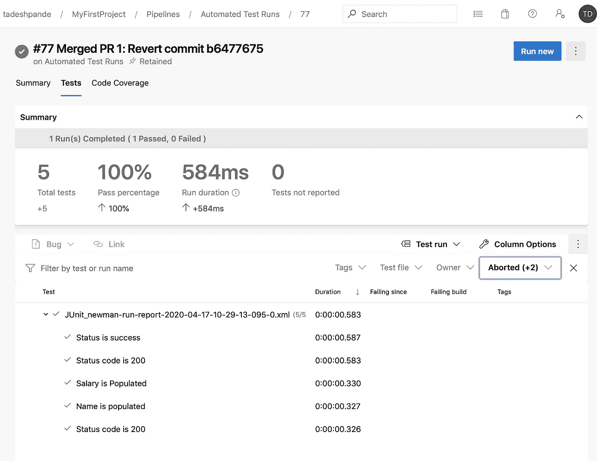

# 结论

通过这种方式，您可以使用 Postman 和 Newman 轻松地将 API 测试集成到 CI 管道中。

# 参考

*   [https://www.postman.com/](https://www.postman.com/)
*   [https://github.com/postmanlabs/newman](https://github.com/postmanlabs/newman)

```
Hey, if you enjoyed this story, check out [Medium Membership](https://deshpandetanmay.medium.com/membership)! Just $5/month!*Your membership fee directly supports me and other writers you read. You’ll also get full access to every story on Medium.*
```