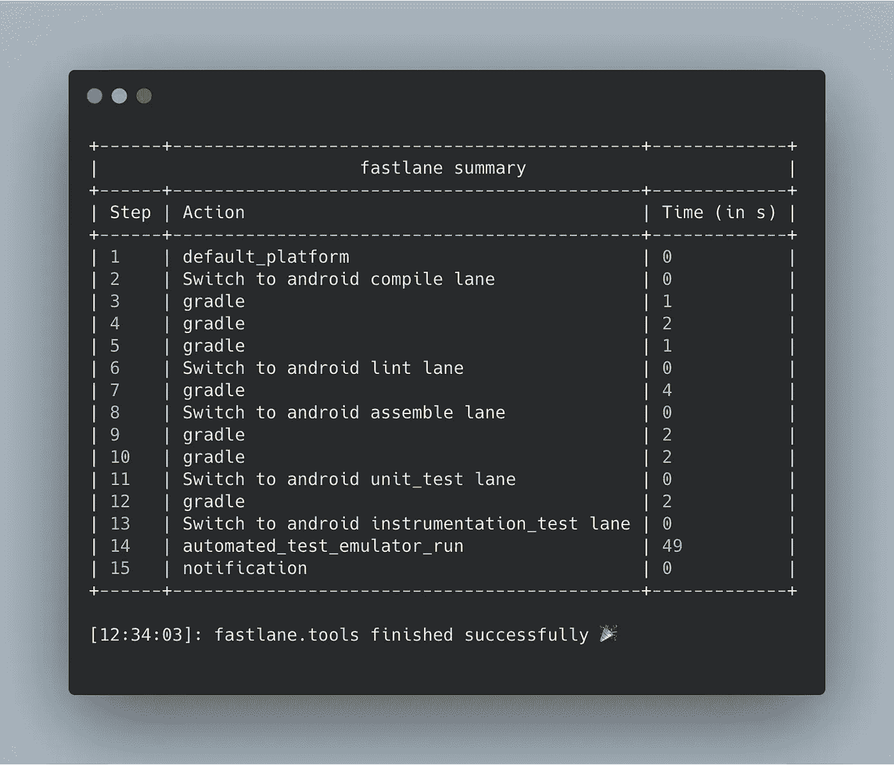
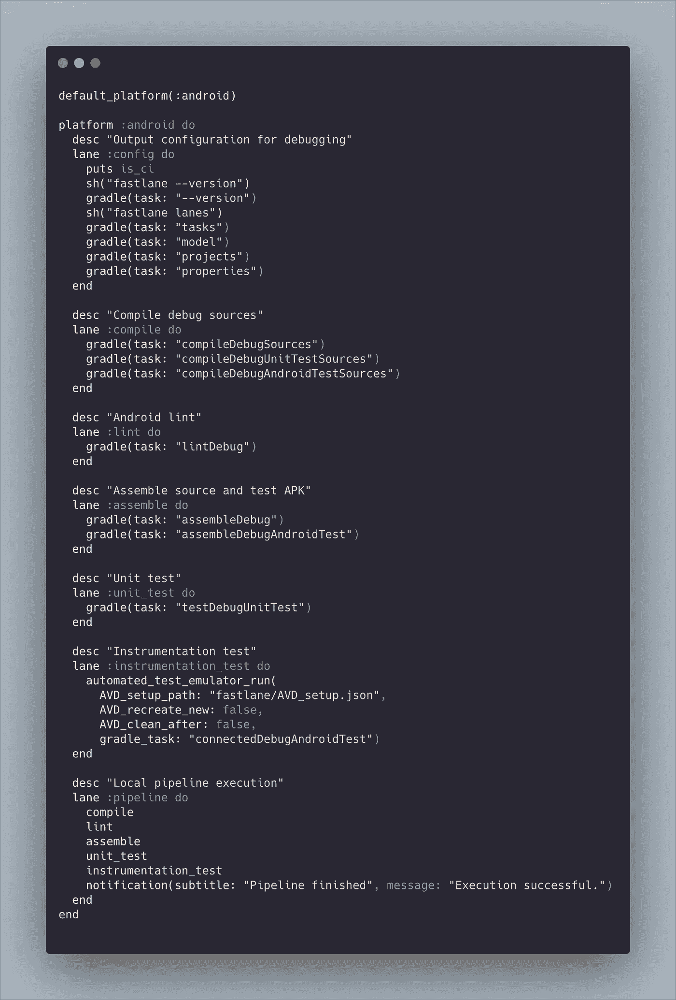

# 使用浪子自动化您的开发

> 原文：<https://betterprogramming.pub/automate-your-development-with-fastlane-247221e6c0c5>

## 在 Android 开发过程中实现更快的反馈循环



我将讨论 fastlane 如何在提出合并请求之前帮助自动化您的开发验证。

# 在持续集成中发展

构建软件应用程序是一项艰巨的任务。它需要同行的计划、测试和评审。随着应用程序的增长，维护应用程序所需的工作量也会增加。因此，在开发周期的后期，添加新特性或确保代码库没有错误开始变得更加昂贵。为了尽早发现问题，软件开发人员遵循持续集成的实践来大规模构建软件应用程序。

# 持续集成的构建模块

源代码控制——能够跟踪、管理多个开发人员的源代码，并将其合并到代码库的主版本中。

自动化测试——有信心确保新的变化不会破坏现有的特性，也不会在应用程序中引入新的 bug。

管道验证—验证应用程序是否可以构建、生成可执行文件、符合质量标准并且不包含任何 lint 问题。

在理想的开发环境中，向存储库提交变更涉及到一个打开合并请求的过程，然后触发一个 CI 管道来验证所有指定的标准。可以使用的配置项类型有 GitLab CI/CD、Travis CI、CircleCI、GitHub Actions 等等。

# 快速构建，经常构建

在开发软件时，使用 CI 有很多好处。它不仅可以在过程的早期发现问题，还可以通过一系列自动化任务加速验证过程。然而，仅仅依靠 CI 渠道来验证他们的工作的团队会发现他们自己处于一种没有生产力的状态。

使用 CI 服务器通常是一个资源密集型过程。需要启动管道运行程序，并下载所需的依赖项来执行手头的任务。此外，如果管道在后期出现故障，开发人员将需要进行修复并重新运行整个管道。

相反，开发人员应该被授权在他们的机器上本地执行他们的 CI 管道，以确保他们的工作在提交合并请求之前得到验证。下面是我最喜欢的 Gene Kim、Jez Humble、Patrick Debois 和 John Willis 的《DevOps 手册》中的一段话。

> 在 DevOps ideal 中，开发人员会收到快速、持续的工作反馈，这使他们能够快速、独立地实现、集成和验证他们的代码，并将代码部署到生产环境中。

# 浪子

构建本地 CI 管道可以通过 fastlane 简单实现，fast lane 是一个开源工具，可以自动完成移动应用程序的繁琐构建和发布任务。虽然 fastlane 在自动化屏幕截图、测试版部署、应用商店部署和代码签名方面很受欢迎，但它也可以帮助自动化本地管道中所需的任务。

一旦在项目中安装并初始化了 fastlane，就可以像下面这样轻松地执行命令。

```
fastlane tests
```

执行与在`fastlane/Fastfile`中定义的`test`通道相关。

```
lane :tests do   
  gradle(task: "test") 
end
```

了解如何[开始](https://docs.fastlane.tools/)使用快车道。

# 更快的反馈

在本地执行 CI 管道赋予了开发人员他们所构建的东西的所有权。它以更快的速度产生反馈，并为在更短的时间内调试问题提供了可能性。有了 fastlane，团队可以像在 CI 服务器上一样使用相同的 Fastfile。

## 小巷

在这个快速文件中，定义了五个不同的通道，它们对应于一个特定的作业。例如，`lint`通道验证源代码中没有 lint 问题。lint 通道的执行可以在下面找到。

```
fastlane lint
```

预期结果:

```
[12:33:02]: -----------------------------------------[12:33:02]: --- Step: Switch to android lint lane ---[12:33:02]: -----------------------------------------[12:33:02]: Cruising over to lane 'android lint' 🚖[12:33:02]: --------------------[12:33:02]: --- Step: gradle ---[12:33:02]: --------------------[12:33:02]: $ gradlew lintDebug -p .[12:33:03]: ▸ > Task :app:preBuild UP-TO-DATE[12:33:03]: ▸ > Task :app:preDebugBuild UP-TO-DATE[12:33:03]: ▸ > Task :app:compileDebugAidl NO-SOURCE[12:33:03]: ▸ > Task :app:checkDebugManifest UP-TO-DATE[12:33:03]: ▸ > Task :app:compileDebugRenderscript NO-SOURCE[12:33:03]: ▸ > Task :app:generateDebugBuildConfig UP-TO-DATE[12:33:03]: ▸ > Task :app:mainApkListPersistenceDebug UP-TO-DATE[12:33:03]: ▸ > Task :app:generateDebugResValues UP-TO-DATE[12:33:03]: ▸ > Task :app:generateDebugResources UP-TO-DATE[12:33:03]: ▸ > Task :app:createDebugCompatibleScreenManifests UP-TO-DATE[12:33:03]: ▸ > Task :app:mergeDebugResources UP-TO-DATE[12:33:03]: ▸ > Task :app:processDebugManifest UP-TO-DATE[12:33:03]: ▸ > Task :app:processDebugResources UP-TO-DATE[12:33:03]: ▸ > Task :app:compileDebugKotlin UP-TO-DATE[12:33:03]: ▸ > Task :app:javaPreCompileDebug UP-TO-DATE[12:33:03]: ▸ > Task :app:compileDebugJavaWithJavac UP-TO-DATE[12:33:03]: ▸ > Task :app:prepareLintJar UP-TO-DATE[12:33:06]: ▸ > Task :app:lintDebug[12:33:06]: ▸ Wrote HTML report to file:///.../app/build/reports/lint-results-debug.html[12:33:06]: ▸ Wrote XML report to file:///.../app/build/reports/lint-results-debug.xml[12:33:06]: ▸ BUILD SUCCESSFUL in 3s[12:33:06]: ▸ 13 actionable tasks: 1 executed, 12 up-to-date
```

## 管道

通道可作为独立作业或另一个通道的一部分执行。在本例中，管道通道由五个不同的通道组成。这些通道执行代码库的编译，运行 lint 分析，组装 apk，执行单元测试，并在仿真器上执行工具测试。为方便起见，开发人员只需执行如下所示的一个命令。

```
fastlane lint
```

下面显示了管道的 Fastfile 模板。



可以在 GitHub 上找到源代码的副本。

[](https://github.com/asadmansr/android-fastlane) [## asadmansr/Android-快车道

### 此时您不能执行该操作。您已使用另一个标签页或窗口登录。您已在另一个选项卡中注销，或者…

github.com](https://github.com/asadmansr/android-fastlane) 

因此，管道的执行将产生如图所示的结果摘要。


谢谢大家！