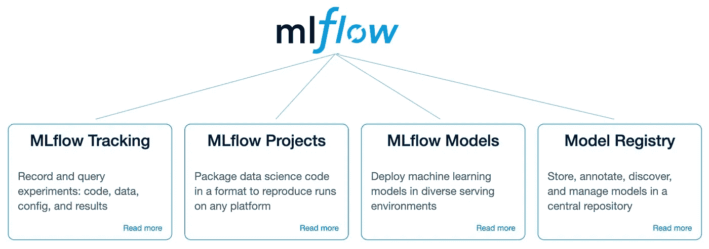
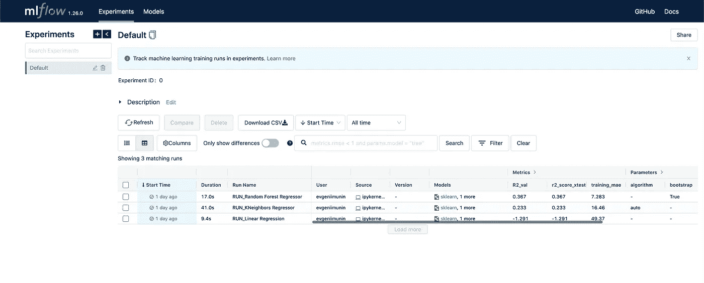
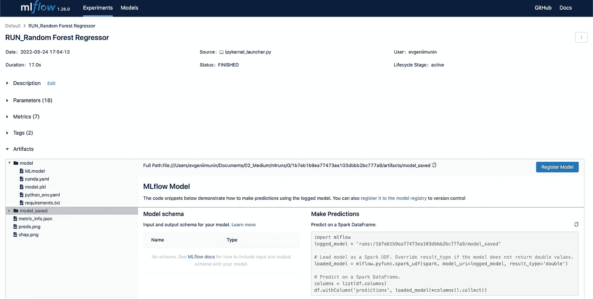
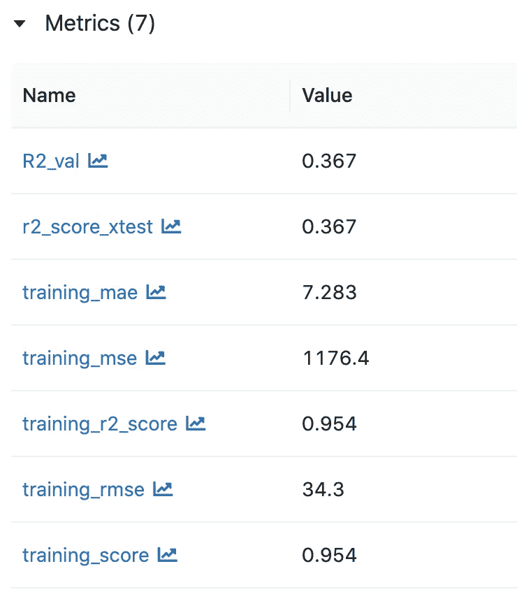
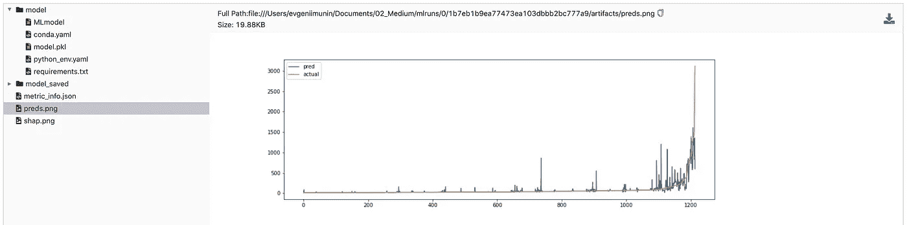
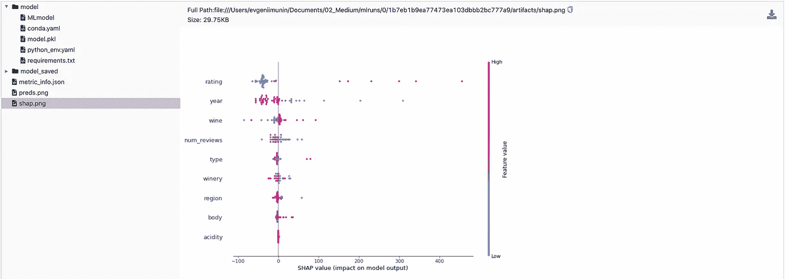
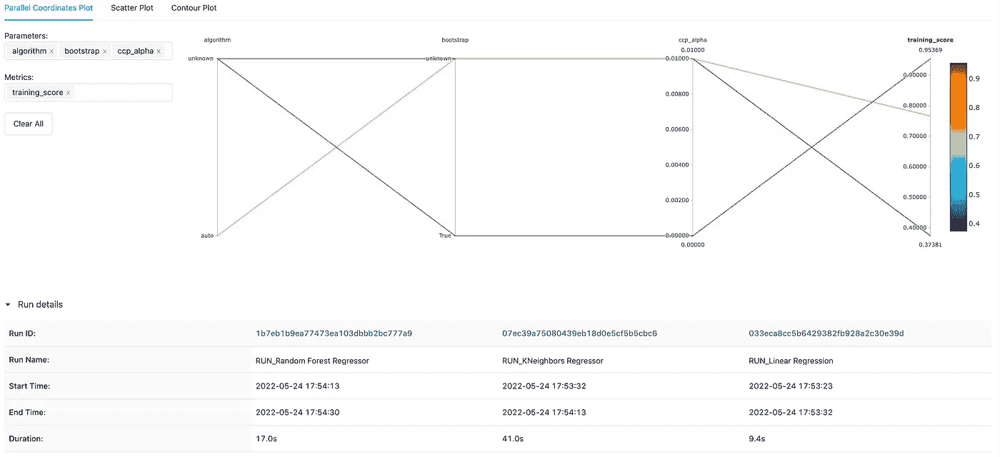
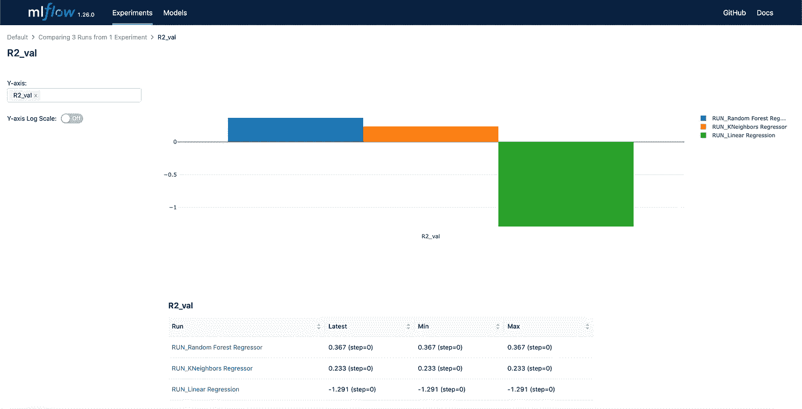

# 使用 MLflow 自动化您的机器学习实验

> 原文：<https://betterprogramming.pub/automate-your-machine-learning-experiments-with-mlflow-8c9e42df421>

## 少花钱多办事的简要指南


亚历山大·安德鲁斯在 [Unsplash](https://unsplash.com?utm_source=medium&utm_medium=referral) 上拍摄的照片

ML 项目中的可重复性是一件至关重要的事情。在我的实践中，当我提交带有一些分数的结果时，就发生了这种情况，但是却不能再现它们。当我们管理 ML 项目时，我们可以看到同样的问题发生，即，在研究环境中训练的模型在应用于生产时应该输出相同的结果和分数。

这个问题可以用不同的方法处理:

*   使用 Git 存储库。在每次实验之后，我们可以提交模型并生成一个提交文件。
*   使用本地日志文件记录所有有用的信息和实验参数。在这种情况下，我们还应该手动控制环境依赖性。
*   找到自动跟踪实验结果的方法。MLflow 就是为此目的专门设计的。我们将通过本文中的一个小例子来检验它。


# **物流概述**

MLflow 是一个开源平台，帮助管理端到端的机器学习生命周期。它分为四个部分:

*   MLflow 跟踪有助于跟踪实验(数据、模型、指标和工件)。
*   MLflow 项目定义了一种以可重复的方式打包数据科学项目的格式。它提供了命令行工具和 API 来执行项目和创建工作流。
*   MLflow Models 定义了 ML 模型的标准格式，可以用不同的“风格”保存它。风格有助于以一种通用的统一方式处理来自不同 ML 库的模型。
*   MLflow Registry 管理 ML 模型的整个生命周期。它提供了模型版本化、沿袭(即，实验和运行细节)、阶段和注释。



MLflow 平台的四个主要部分(来源:[https://mlflow.org/](https://mlflow.org/)

# **物流跟踪**

在本文中，我们将重点关注跟踪，并将运行几次回归模型，并在 MLflow UI 中记录和可视化它们。跟踪存储模型的详细信息，并使用 HTTP 协议在客户端应用程序和跟踪服务器之间建立连接。当我们执行模型代码时，跟踪会创建一个记录以下信息的“运行”:

*   代码版本:用于标识特定运行的哈希代码
*   运行的开始和结束时间
*   参数:模型的键值输入参数
*   度量:依赖于任务的键值度量(分类、回归等)。)
*   工件:任何格式的输出文件。png，。pkl，。拼花地板。csv 等。)

这里有一个关于如何记录实验运行和构建可重现管道的优秀教程，由开放数据科学社区的 ML Repa 团队开发:【https://github.com/mlrepa/mlflow-1-tracking。

# **跟踪 ML 实验**

我们将演示 MLflow 跟踪如何在西班牙葡萄酒价格预测的示例任务中工作。数据集是通过[链接](https://www.kaggle.com/datasets/fedesoriano/spanish-wine-quality-dataset)从 Kaggle 获取的。我们将训练回归模型，并预测每种葡萄酒的价格。

要安装 MLflow for Python，我们应该在命令行中运行以下命令:

```
pip install mlflow
```

现在，让我们读取数据并执行简单的预处理转换，如分类变量的标签编码和标准化。然后拆分数据并准备训练/测试子集。代码如下:

让我们定义用 MLflow 记录实验的函数。

这里，我们在当前实验中创建新的运行。

```
with mlflow.start_run(run_name="RUN_{}".format(run_name)) as run
```

然后，我们拟合选择的模型，并进行验证预测。拟合模型后，我们要检查其特征的重要性。这里我们将使用 [Shap 库](https://shap.readthedocs.io/en/latest/index.html)来解释 ML 模型。由于计算整个验证子集的 Shap 值非常耗时，因此我们将自己限制在随机选择的 50 个示例中。然后，我们将预测价格与真实价格一起绘制，以检查该模型在低价格和高价格段的表现。

然后，我们将度量和工件记录到当前的 MLflow 运行中。作为一个指标，我们选择了验证 R2，因为它适用于回归问题。然后，我们还在中记录特征重要性和预测图。png 格式作为工件。中的训练模型。MLflow 将自动记录 pkl 格式。

我们使用 sklearn 库中的默认参数测试了三个经典模型:线性回归、KNN 和随机森林回归。对于每个模型，我们创建一个特定的运行。

至此，我们已经完成了每次跑步的训练和记录。由于我们没有设置远程版本，跟踪服务器 MLflow 将在本地运行。在这种情况下，后端和工件存储共享本地文件系统上`./mlruns`文件夹中的目录。MLflow UI 将从`mlruns`文件夹中请求这些保存的实体，以进行进一步的分析。要运行 MLflow UI，我们转到命令行，导航到 mlruns 文件夹，然后键入:

```
mlflow ui
```

在您的浏览器中，UI 将通过链接`[http://127.0.0.1:5000/](http://127.0.0.1:5000/)`可用。用户界面主页如下所示:



这里我们看到了我们三次运行中的每一次，以及对运行进行分组的默认实验。现在，让我们检查随机森林回归器的第一次运行。



这里我们看到保存的模型。pkl 可供下载。还有一个`requirements.txt`文件，其中包含实验中使用的库的版本。如果我们点击指标，我们将看到我们手动记录的`validation r2_score_xtest`，以及自动生成的回归问题的指标，如训练 MAE、MSE 和 RMSE。



我们还可以检查一下`shap.png`和 p `reds.png`文件，并查看相应的预测价格与实际价格的关系图以及特性重要性等级。



此外，我们可以通过选择它们并点击 UI 主页上的 compare 来并排比较运行。



例如，我们可以用柱状图的形式比较每次运行的验证 R2 分数。



# 最后的想法

在本文中，我们看到 MLflow 提供了很酷的功能，并有助于记录和再现 ML 实验。举个小例子，我们建立了一个本地跟踪服务器，并运行了几个模型。如果您在团队中工作，需要进行协作实验，您可能需要设置一个远程跟踪服务器。

这将帮助您将您的数据、度量、模型和工件存储在一个地方，并且更容易为您的项目提供维护。

我希望这篇文章能帮助你了解可复制 ML 的工具之一，我将感谢你在下面评论区的反馈！

在下一篇文章中，我们将使用 Azure Databricks 建立一个远程跟踪服务器并记录实验。

[](https://medium.com/@evgeniimunin47/log-machine-learning-experiments-with-mlflow-on-azure-databricks-5a85955c9d3a) [## 用 MLflow 在 Azure Databricks 上进行日志机器学习实验

### 在 Databricks 中获取远程 MLflow Tracking 服务器上记录的模型、指标和工件

medium.com](https://medium.com/@evgeniimunin47/log-machine-learning-experiments-with-mlflow-on-azure-databricks-5a85955c9d3a) 

# 链接

*   [https://github.com/mlflow/mlflow](https://github.com/mlflow/mlflow)
*   [https://github.com/mlrepa/mlflow-1-tracking](https://github.com/mlrepa/mlflow-1-tracking)
*   [https://www . ml flow . org/docs/latest/tracking . html # logging-data-to-runs](https://www.mlflow.org/docs/latest/tracking.html#logging-data-to-runs)
*   [https://www.mlflow.org/docs/latest/tracking.html](https://www.mlflow.org/docs/latest/tracking.html)