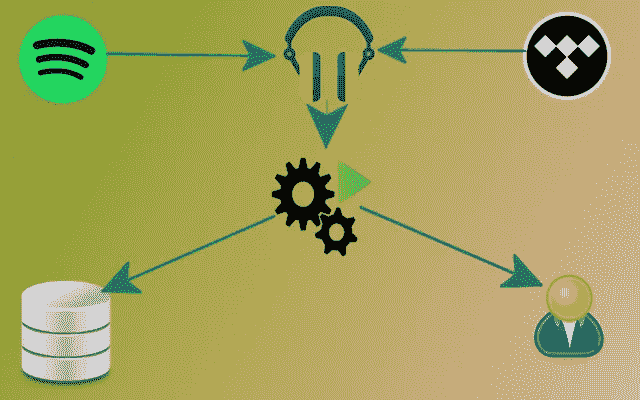
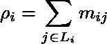

# 使用这个 Python 包自动化你的音乐收藏

> 原文：<https://betterprogramming.pub/automate-your-music-collection-using-this-python-package-3891754a48dc>

## 你不需要一个大的音乐云服务来跟踪你的收听习惯和发现新的音乐



近二十年来，我一直是 mpd 和 mopidy 的热心用户。

我已经写了一篇关于如何利用 mopidy 的文章，包括 Spotify、Tidal、YouTube、Bandcamp、Plex、TuneIn、SoundCloud 等。)、Snapcast(其开箱即用的多房间聆听体验)和 Platypush(其自动化挂钩允许您轻松创建 if-this-then-than 规则来管理您的音乐事件)将您的聆听体验提升到一个新的水平，同时使用开放协议和易于扩展的开源软件。

有一个特性我在之前的文章中还没有涉及到:你的音乐收藏的自动化。

Spotify、Tidal 和其他音乐流媒体服务分别为您提供诸如*探索周刊*或*发布雷达*播放列表等功能，其中包含您可能喜欢的曲目或您可能感兴趣的新发布曲目。

问题是这些服务都有很大的取舍:

1.  他们的算法是封闭的。你不知道 Spotify 是如何计算出哪些歌曲应该出现在你的智能播放列表中的。过去几个月，Spotify 经常向我推荐我以前听过或跳过的艺术家的歌曲。没有透明的方式告诉算法，“嘿，实际上，我希望你给我更多这种音乐的建议——或者可能只根据我在这个时间范围内听的音乐来计算建议，或者可能更多地权衡这种类型。”
2.  这些特性与您使用的服务紧密相关。如果您取消订阅 Spotify，您也将失去这些智能功能。像 Spotify 这样的公司使用这种功能作为锁定机制——你可以随时查看，但如果你这样做了，没有人会向你提供他们聪明的建议。

在过去几个月从 Spotify 迁移到 Tidal 后(TL；DR: Spotify 在过去十年中多次破坏了他们的开发者体验，他们在没有提供任何替代方案的情况下扼杀了 libspotify，这是我的最后一颗钉子)，我觉得很怀念他们的智能混音、发现和新发布的播放列表。

但是，另一方面，Tidal 花了一些时间来了解我的收听习惯，即使它做到了，它也经常生成比 Spotify 差一英寸的智能播放列表。我问自己，为什么我的音乐探索体验会与地球上的一项云服务如此紧密地联系在一起。我决定，是时候让我自动生成与服务无关的音乐建议了:这不再是火箭科学，有大量的服务可以让你获得艺术家或类似于某些音乐的歌曲作为输入，没有理由感到被 Spotify、谷歌、Tidal 或其他云音乐提供商锁定。

在本文中，我们将介绍如何:

1.  使用 Platypush 自动跟踪您从任何设备上听到的音乐
2.  使用最后一个来计算可能与您最近听过的音乐相似的建议曲目。FM API
3.  生成一个类似于 Spotify 的*探索周刊*播放列表，无需依赖 Spotify
4.  通过订阅 RSS 订阅源获取最新发布的专辑和单曲
5.  通过过滤那些你已经听过至少一次的艺术家的作品，生成一个每周播放列表

# 佐料

我们将使用 Platypush 来处理以下特性:

1.  将我们的收听历史存储到本地数据库，或者与类似 [last.fm](https://last.fm) 的搜索服务同步。
2.  定期检查我们新收听的曲目，并使用 last.fm API 检索类似的曲目。
3.  基于一个简单的分数生成一个每周发现播放列表，该分数根据在某段时间内收听的曲目的匹配分数对建议进行排序，并增加出现多次的建议的权重。
4.  监控 newalbumreleases.net RSS 频道的新发布，并创建一个每周*发布雷达*播放列表，其中包含我们至少听过一次的艺术家的作品。

本教程需要:

1.  存储您的收听历史和建议的数据库。数据库初始化脚本已经针对 Postgres 进行了测试，但是只需做很少的修改，就可以轻松适应 MySQL 或 SQLite。
2.  机器(RaspberryPi、家庭服务器、VPS、未使用的平板电脑等。)来运行 Platypush 自动化。
3.  Spotify 或 Tidal 帐户。报告的例子将通过使用`music.tidal` Platypush 插件在 Tidal 帐户上生成播放列表，但应该很容易通过使用`music.spotify`插件使它们适应 Spotify，甚至通过使用 YouTube API 适应 YouTube，甚至适应本地 M3U 播放列表。

# 设置软件

首先安装 Platypush 的 [Tidal](https://docs.platypush.tech/platypush/plugins/music.tidal.html) 、 [RSS](https://docs.platypush.tech/platypush/plugins/rss.html) 和 [Last.fm](https://docs.platypush.tech/platypush/plugins/lastfm.html) 集成:

```
[sudo] pip install 'platypush[tidal,rss,lastfm]'
```

如果你想使用 Spotify 而不是 Tidal，那么只需从额外依赖列表中删除`tidal`—[Spotify 插件](https://docs.platypush.tech/platypush/plugins/music.spotify.html)不需要额外的依赖。

如果你打算通过 mpd/mopidy 听音乐，那么你可能也想把`mpd`包含在额外依赖列表中，这样 Platypush 就可以通过 mpd 协议直接监控你的收听活动。

接下来让我们在`~/.config/platypush/config.yaml`下配置一个简单的配置:

运行`platypush`命令启动 Platypush。第一次，它应该提示您认证您的用户所需的 tidal.com 链接。在浏览器中打开它，并授权应用程序。下一次运行应该不再要求您进行身份验证。

一旦 Platypush 依赖项就位，我们就开始配置数据库。

# 数据库配置

我假设您在某个地方运行了 Postgres 数据库，但是下面的脚本也可以很容易地适用于其他 DBMSs。

下面是数据库初始化脚本:

在数据库上运行脚本——如果一切顺利，那么所有的表都应该成功创建了。

# 同步您的音乐活动

既然所有的依赖项都已就绪，那么是时候配置逻辑将音乐活动存储到数据库中了。

如果你的大部分音乐活动都是通过 mpd/mopidy 发生的，那么将你的活动存储到数据库中就像在`[NewPlayingTrackEvent](https://docs.platypush.tech/platypush/events/music.html)` [事件](https://docs.platypush.tech/platypush/events/music.html)上创建一个挂钩，在`tmp_music`上插入任何新播放的曲目一样简单。将以下内容粘贴到一个新的 Platypush 用户脚本中(例如`~/.config/platypush/scripts/music/sync.py`):

或者，如果你还想同步发生在其他客户端(如 Spotify/Tidal 应用程序或 web view，或通过移动设备)的音乐活动，你可以考虑利用`Last.fm`。`Last.fm`(或其开放的替代产品 Libre.fm)是一项与大多数音乐播放器兼容的搜索服务。

Spotify 和 Tidal 都支持 scrobbleling，Android 应用程序可以抓取你手机上的任何音乐活动并进行 scrobb。甚至有[浏览器扩展](https://chrome.google.com/webstore/detail/web-scrobbler/hhinaapppaileiechjoiifaancjggfjm?hl=en)允许你从任何浏览器标签跟踪任何音乐活动。

因此，另一种方法可能是将你的 mpd/mopidy 音乐活动以及你的浏览器内或移动音乐活动发送到`last.fm` / `libre.fm`。相应的挂钩应该是:

如果您选择 scrobble 方式，那么您可能希望定期将 scrobble 历史记录同步到本地数据库，例如，通过每 30 秒运行一次的 cron:

这个 cron 会将您的搜索历史同步到您的本地数据库，因此我们可以使用本地数据库作为后续步骤的事实来源——无论音乐是从哪里播放的。

要测试这种逻辑，只需重启 Platypush，从你最喜欢的播放器中播放一些音乐，并检查所有内容是否都被插入到数据库中——即使我们在`tmp_music`表上插入曲目，收听历史也应该通过我们在初始化时创建的触发器在适当的表上自动标准化。

# 更新建议

现在，在一个数据源中获取您的收听历史的所有管道都已就绪，让我们转到基于您的收听历史重新计算建议的逻辑。

我们将再次使用 last.fm API 来获取与我们最近听过的歌曲相似的歌曲——我发现`last.fm`的建议通常比 Spotify 的建议更相关。

为了简单起见，让我们将数据库表映射到一些 SQLAlchemy ORM 类，这样接下来的 SQL 交互就可以显著简化。ORM 模型可以保存在`~/.config/platypush/music/db.py`下:

然后在`~/.config/platypush/scripts/music/suggestions.py`下创建一个新的用户脚本，内容如下:

重启 Platypush，让它运行一段时间。cron 将分批运行，每批 10 个项目(可以很容易地定制)，所以您的`music_suggestions`表应该在几分钟后开始被填充。

# 正在生成发现播放列表

迄今为止，我们已经实现了以下目标:

*   我们有一个逻辑将我们的收听历史同步到本地数据库。
*   我们有一种方法可以将 last.fm / libre.fm scrobbles 同步到同一个数据库。
*   我们有一个 cronjob，它定期扫描我们的收听历史，并通过 last.fm API 获取建议。

现在，让我们用一个 cron 将所有这些放在一起，该 cron 每周(或每天，或以我们喜欢的任何时间间隔)运行，它执行以下操作:

*   它检索我们在指定时间段内的收听历史。
*   它检索与我们的收听历史相关联的建议曲目。
*   它不包括我们已经听过的曲目，或者已经包含在以前的探索播放列表中的曲目。
*   它会生成包含这些曲目的新发现播放列表，并根据简单的分数进行排名:



其中`ρ(i)`是第 I 条建议曲目的排名，`L(i)`是相似度中第 I 条曲目的收听曲目集，`m(i, j)`是 last.fm API 报告的`i`和`j`之间的匹配分数。

让我们把所有这些放在一个在`~/.config/platypush/scripts/music/discovery.py`中定义的 cron 中:

您可以通过 Python 解释器测试 cronjob，而不必等到下一个星期一:

如果一切顺利，您应该很快会在您的收藏中看到一个名为 Discover Weekly [date]的新播放列表。恭喜你！

# 发布雷达播放列表

Spotify 和 Tidal 的另一个伟大功能是能够提供“release radar”播放列表，其中包含我们可能喜欢的艺术家的新专辑。

不过，我们现在有一个强大的方法来自己创建这样的播放列表。我们之前配置了 Platypush 来订阅来自 newalbumreleases.net 的 RSS 提要。填充我们的 release radar 播放列表包括以下步骤:

1.  创建一个钩子来响应这个提要上的`[NewFeedEntryEvent](https://docs.platypush.tech/platypush/events/rss.html)` [事件](https://docs.platypush.tech/platypush/events/rss.html)。
2.  钩子将在初始化数据库时创建的`new_release`表上存储与我们的集合中的艺术家相匹配的新版本。
3.  一个 cron 将每周扫描这个表，在 Spotify/Tidal 上搜索曲目，并填充我们的播放列表，就像我们为 *Discover Weekly* 所做的那样。

让我们将这些部分放在一个新的用户脚本中，例如存储在`~/.config/platypush/scripts/music/releases.py`下:

就像前一个例子一样，通过在 Python 解释器中简单地运行`refresh_release_radar_cron`就可以很容易地测试它是否工作。就像 discovery 播放列表的情况一样，如果你使用 Spotify 而不是 Tidal，事情也会发生——只需用`music.spotify`替换`music.tidal`插件引用。

如果一切按预期进行，你将在每周一得到一个名为 New Releases [date]的新播放列表，里面有你听过的艺术家的新作品。

# 结论

如今，音乐发烧友无需离开他们的音乐应用程序就能发现许多新音乐。然而，主要音乐云提供商提供的智能播放列表通常是隐式锁定的，他们选择应该出现在播放列表中的曲目的方式可能不透明或不可修改。

阅读完本文后，您应该能够生成您的发现和新发布的播放列表，而不依赖于特定音乐云的建议。这也可能让你更容易更换音乐提供商:即使你放弃 Spotify 或 Tidal，你的音乐建议逻辑也会在你决定去的任何时候跟随你。

*原发布于*[*https://blog . platypush . tech*](https://blog.platypush.tech/article/Automate-your-music-collection)*。*