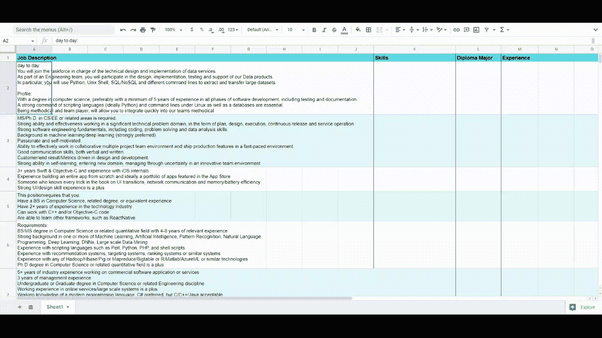
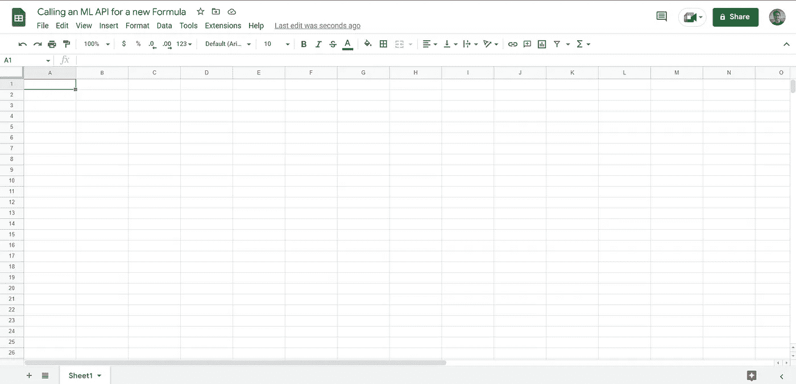
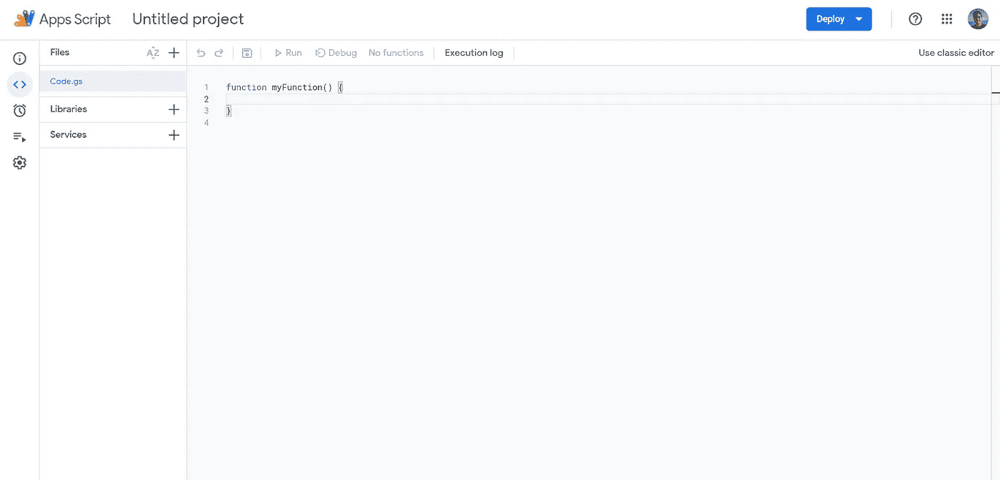
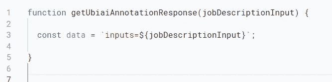
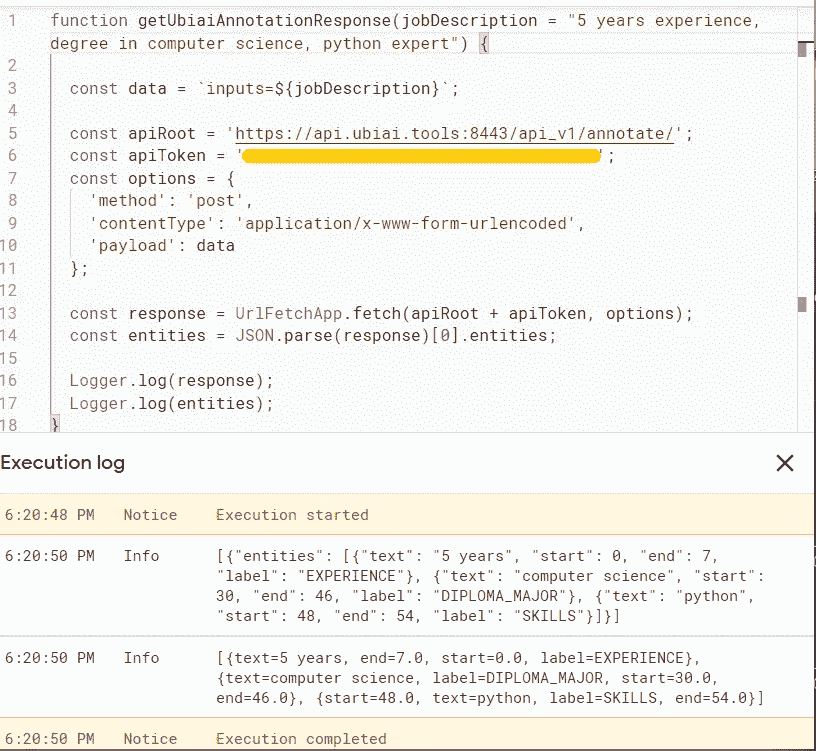
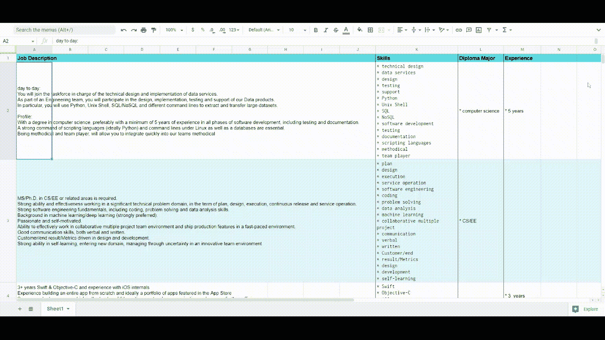

# 使用 Google Apps 脚本和机器学习 API 注释 Google Sheet 中的文本

> 原文：<https://betterprogramming.pub/automate-your-tasks-how-do-google-sheets-and-machine-learning-make-our-lives-easier-cc8ba3ef8e8d>

## 谷歌表单和机器学习让自动化变得更加容易


让我们更聪明地工作，而不是更努力地工作(作者)

在本文中，我们将结合 Google Apps 脚本和机器学习 API 的强大功能，创建一个新的功能来注释工作表中的文本。

```
Table of Contents[A Practical Use Case: HR Recruiting Process](#e894)
[How To Do This?](#736e)
[Let’s Do It!](#d2d4)
[Final Code, Results and Conclusion](#a54f)
```

> **注意**:在本文中，我们使用了一个已经构建和部署的模型。
> 
> 考虑阅读[这篇](https://medium.com/mlearning-ai/categorize-invoices-using-multimodal-transformers-leveraging-both-structured-and-unstructured-data-d291ee0295d6)文章以了解更多关于构建模型的信息，以及[这篇](https://medium.com/mlearning-ai/ml-ops-tools-for-nlp-f836a3fdc30a)关于使用 REST API 将 NLP 模型部署为预测微服务的工具和最佳实践。

# 一个实际的用例:人力资源招聘流程

你曾经使用过像 Google Sheets 这样的电子表格程序吗？
您可能已经使用它对排列在单元格(行∩列)中的数据执行了一些计算和操作。为此，我们有一堆公式可以使用(例如，IF()、SUM()、TEXT()、SEARCH()等)。).

虽然电子表格为我们提供了广泛的有用操作，但有时我们需要执行只有外部机器学习模型才能处理的特定任务。这是一个业务用例的例子:

> 如果你是一家初创公司的 IT 招聘人员，你收到了 500 份申请，你会自动收集到一张表格中，你必须仔细阅读每份申请，以决定候选人是否应该被列入测试/面试的入围名单或被拒绝。但是要对 500 篇超过 1000 个单词的文本进行分类将是一个冗长而低效的过程。
> 
> 为了帮助您自己，您已经决定自动拒绝任何不符合最低工作经验年限、适当学位以及不具备至少 80%所需技能的申请。
> 
> 那事情就简单多了，对吧？但是如何从每份工作申请中自动提取技能、文凭和经验呢？

简单的答案是使用机器学习模型作为服务，该服务将文本(工作申请)作为输入，并返回搜索到的实体(技能、学位等。)作为输出。

这只是成千上万个人和专业用例中的一个商业用例，Google Apps 脚本和 ML APIs 将帮助您用更少的资源获得更好的结果。

在这篇文章中，我们将从候选人的角度来探讨人力资源流程。我们不是为招聘人员检测申请和工作要约之间的匹配，而是帮助候选人提取工作要约中所需的技能、所需的经验年数和文凭专业，以便他们可以有更强的申请能力。

下面是我们期望得到的结果的演示:



演示:用户在谷歌表单中输入工作描述，然后使用我们将创建的功能(由作者创建)从中获得技能、经验和文凭

# 如何做到这一点？

为了进行我们上面提到的自动实体提取，我们必须首先部署一个 ML 模型 API，它将文本作为输入并返回它的实体。一旦有了这些，我们将使用 Google Apps 脚本从用户的表单中获取输入，使用这些数据调用 API，并在表单中显示结果。

*   UBIAI 自动标注 API:提供为自动标注和推理训练 NLP 模型的能力。自动标注工具减少了标注数据所需的时间和金钱，并允许自动标注实体，如时间、地点、日期、产品、人员等。，从原生文件下载文本后。

对于本文，我们将使用一个由 [ubiai.tools](https://ubiai.tools/) 训练的模型来从工作描述中提取技能等实体。


自动标记工具提取技能，文凭，经验等。(来源:[优必选](https://ubiai.tools/features/r1-auto-labeling))

## Google 企业应用套件脚本

开发应用程序可能是一项复杂的任务。然而，如今，我们有越来越多的工具来帮助完成这项任务，因此可以更容易地执行它，正如本文中的例子。Google Apps 脚本就是这种软件的一个例子。它允许我们在 Google 的一些服务中编写脚本，因此可以修改 Google Sheets 软件的行为。

从更广的范围来看，它对于创建创造性的应用程序非常有效，这些应用程序可以通过 Google Drive 或 Chrome 网络商店中的出版物进行存储并与许多人共享。Google Script 是用于此目的的编程语言。它与 JavaScript 非常相似，尽管后者通常用于操作网页，但 Google Script 更适合访问数据和修改 Google 应用程序的行为。

> **注意**:有两种类型的应用程序脚本:独立脚本，不链接到特定的谷歌文档，和容器绑定脚本，链接到谷歌文档并从该文档创建。在本文中，很明显我们将使用来自 Google Sheets 电子表格的容器绑定脚本。

# 我们开始吧！

因此，首先，我们需要创建一个 [Google sheet](https://docs.google.com/spreadsheets/) ，我们将把数据放在其中进行处理:



Google Sheets(按作者)

然后我们需要通过扩展>应用程序脚本来访问应用程序脚本:



从 Google 工作表创建的 Google Apps 脚本(由作者创建)

我们已经创建了一个名为`Code.gs`的文件，其中包含一个名为`myFunction`的默认函数，所以我将函数的名称改为`getUbiaiAnnotationResponse`，现在我们可以开始编写脚本了。是的，就这么简单😎。

*   脚本中要做的第一件事是从用户的工作表中获取数据。用户将调用一个函数，将对应于工作描述的单元格传递给它。因此，让我们为我们的函数添加一个参数，该参数对应于用户的工作描述输入，然后将它赋给一个变量，该变量将包含在 API 调用的主体中。代码如下:



获取数据(按作者)

*   接下来，让我们设置适当的 [ubiai.tools](https://ubiai.tools/) API 选项:

```
const apiRoot = 'https://api.ubiai.tools:8443/api_v1/annotate/';const apiToken = '*** Secret String :) ***';const options = {
   'method': 'post',
   'contentType': 'application/x-www-form-urlencoded',
   'payload': data
};
```

因此，我们将使用 POST 请求在 HTTP 消息体的单个块中发送数据。

现在让我们使用令牌和选项调用 API，然后解析响应并检索返回的实体。它看起来是这样的:

```
const response = UrlFetchApp.fetch(apiRoot + apiToken, options);const entities = JSON.parse(response)[0].entities;
```

让我们在一个数据样本上运行代码，看看结果:

> **注意**:你第一次运行脚本时会被询问权限。



API 响应(按作者)

因此，如上面的截图所示，对数据“五年经验，计算机科学学位，python 专家”运行我们的脚本，返回一个包含实体“5 年”是一个`Experience`、“计算机科学”是一个`Diploma_Major`、“Python”是一个`Skill`的实体列表。

由于我们对在自定义列中显示`Skills`、`Diploma_Major`和`Experience`感兴趣，让我们继续定义三个函数来将请求的标签发送回用户的工作表:

`getSkills`函数取用户的数据，然后调用我们定义的`getUbiaiAnnotationResponse` 函数调用 NLP API，将想要的技能实体返回给用户(同样适用于`getExperience`和`getDiploma`)。

> 注意:由于我们可能使用相同的数据调用`*getSkills*`、`*getExperience*`和`*getDiploma*`，所以在代码中添加缓存机制以避免不必要的冗余 API 调用将是一个很好的实践。

# 最终代码、结果和结论

`getSkills`最终代码:

`getExperience`最终代码:

`getDiploma`最终代码:

`getUbiaiAnnotationResponse`最终代码:


最终代码:API 调用(由作者编写)

# 谷歌表单结果



google 表单上的结果(按作者)

虽然这个用例很简单(从工作描述中提取技能、经验和专业文凭)，但它旨在演示如何在 Google Sheets 中使用外部 API 来创建处理文本的新功能。

使用预先训练的 NLP 模型可以使工作自动化，并提高效率。当您可以利用 Google Sheets 和机器学习模型时，这种技术可以用于任何其他用例。

*感谢阅读！敬请关注更多内容。*