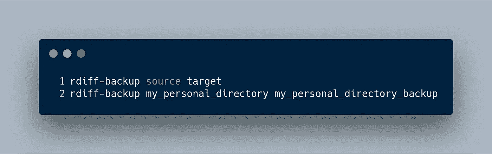
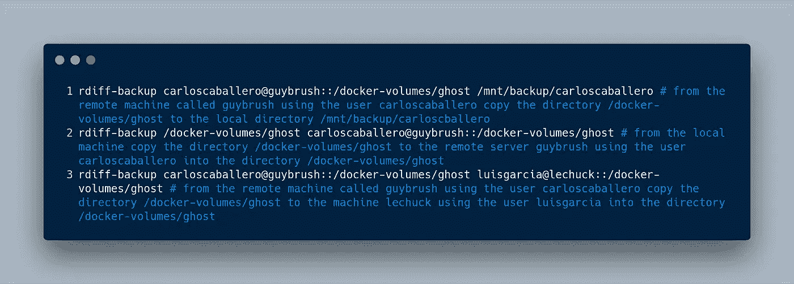
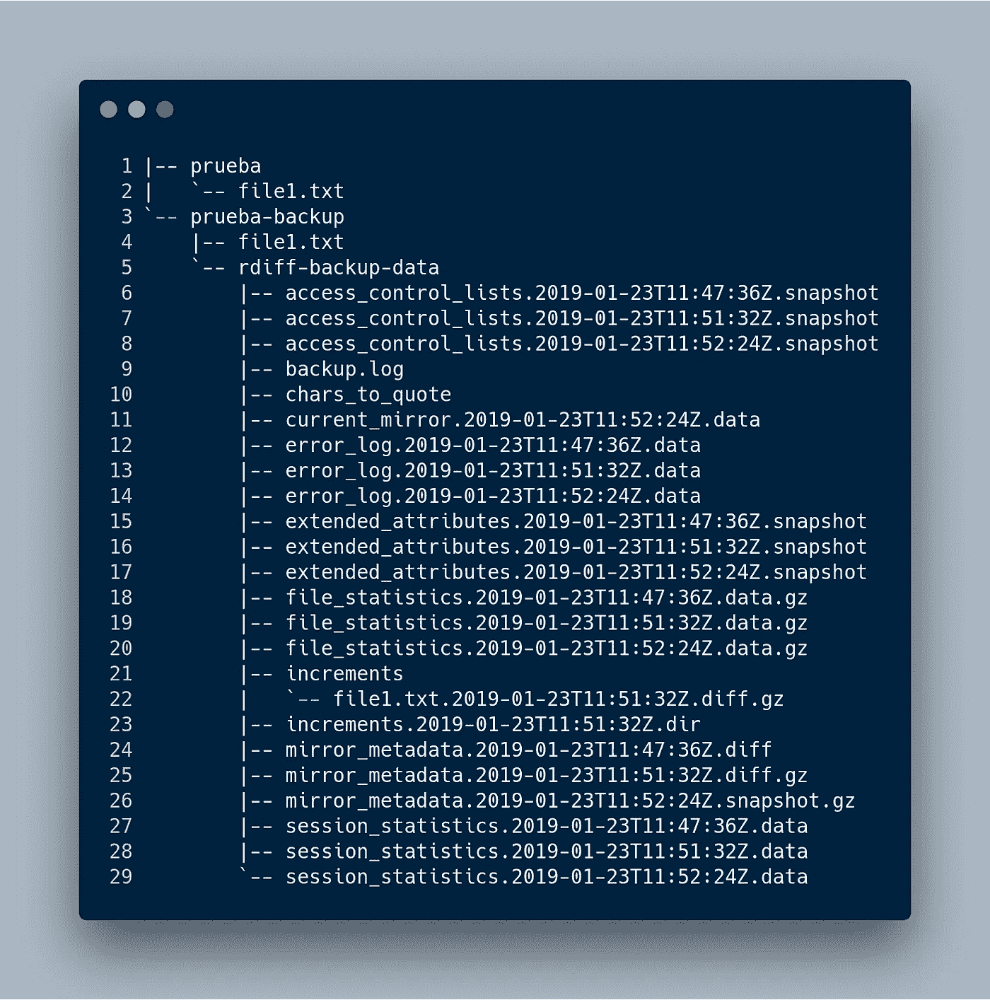
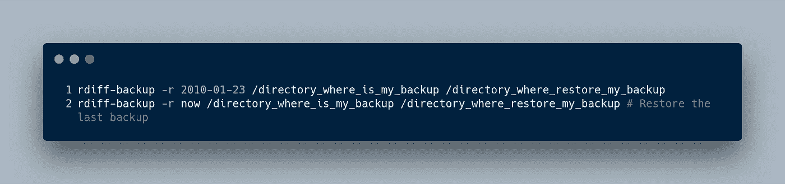
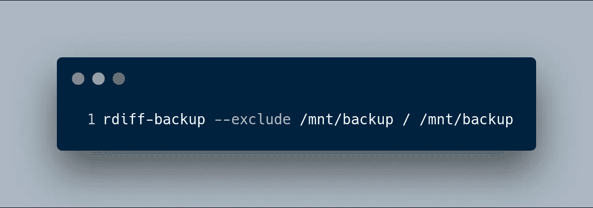
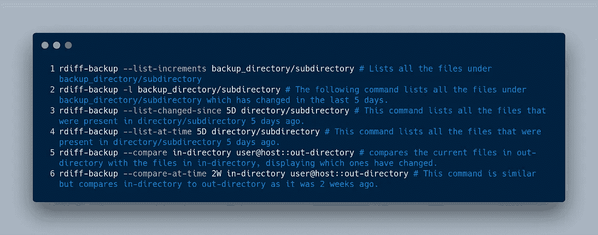
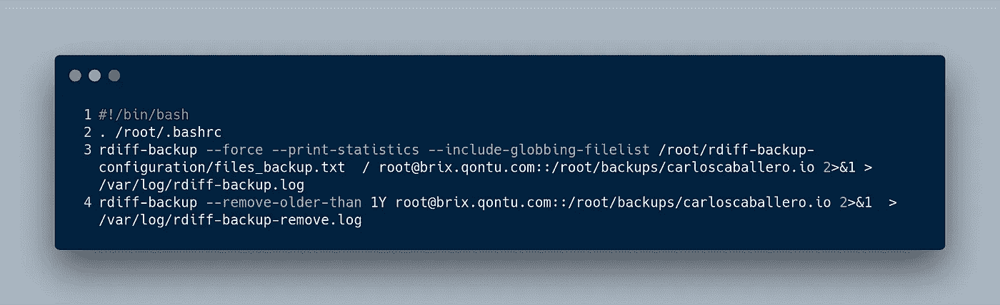

# 使用 rdiff-backup 进行自动备份

> 原文：<https://betterprogramming.pub/automated-backup-using-rdiff-backup-fee2520de6ea>

## 通过增量自动备份度过数据崩溃


照片由[约书亚·索蒂诺](https://unsplash.com/@sortino?utm_source=unsplash&utm_medium=referral&utm_content=creditCopyText)在 [Unsplash](https://unsplash.com/s/photos/data?utm_source=unsplash&utm_medium=referral&utm_content=creditCopyText) 上拍摄

有一天，你的博客、代码或几乎任何东西都可能崩溃，可悲的是，你最有价值的信息可能会不可挽回地丢失。考虑一下如果发生这种情况的后果(摸木头！).给他们拍照？吓人吧？现在，想象一下，如果你费心做一个备份，你会多么放松。

今天我给大家展示一下我个人的备份方法。我使用很棒的`[rdiff-backup](https://www.nongnu.org/rdiff-backup/)`工具，它结合了增量备份和镜像。
你可以在[官方页面上阅读关于该工具的更多信息。](https://www.nongnu.org/rdiff-backup/)

# 这是什么？

`rdiff-backup`可能通过网络将一个目录备份到另一个目录。目标目录最终成为源目录的副本。但是额外的反向差异存储在目标目录的一个特殊子目录中，所以您仍然可以恢复前一段时间丢失的文件。其理念是将镜像和增量备份的最佳特性结合起来。

# 装置

`rdiff-backup`可以在最重要的 Linux 发行版中获得。在我的例子中，我使用一个 ArchLinux 发行版( [Manjaro](https://manjaro.org/) )和 [yay 包](https://github.com/Jguer/yay)(另一个酸奶，一个用 Go 编写的 AUR 助手)来安装这个工具。

```
yay rdiff-backup
```

如果您使用另一个发行版，也可以安装该软件:

```
apt-get install rdiff-backupyum install rdiff-backup
```

# 使用 rdiff-backup

使用`rdiff-backup`时，制作备份非常容易。你可以把这个工具想象成类似于`cp`命令。换句话说，`rdiff-backup`有两个参数:

*   源目录
*   目标目录

这两个目录可以是本地的，也可以在远程磁盘上。例如，如果您想在本地目录中使用`rdiff-backup`，您可以使用以下命令:



同样，如果任何目录都在远程服务器上，您只需要使用经典的方式来指明路径:`user@server::PATH`。以下命令显示了如何在源目录和目标目录中使用远程或本地服务器:



当使用这些命令时，远程机器可能会要求用户的密码(对于前面的命令，分别为`carloscaballero`和`luisgarcia`)。您可以通过在 Linux 服务器上配置一个[基于 SSH 密钥的认证来省略这个步骤。](https://www.digitalocean.com/community/tutorials/how-to-configure-ssh-key-based-authentication-on-a-linux-server)

当想要恢复信息时，这一工具的真正威力才真正得到体现。如果您列出您进行复制的目录的内容，您将看到您之前复制的内容，此外，您将找到一个名为`rdiff-backup-data`的目录。这个目录非常重要，因为它存储了我们数据的增量备份。

在这个目录中，显示的内容包括我们备份的最新版本和增量副本，它们存储在`rdiff-backup-data/increments`目录中。

现在假设我已经创建了一个名为`file1.txt`的文件，其中包含一个句子。使用`rdiff-backup`完成一份拷贝，几分钟后，另一份拷贝完成。现在，我们看到了系统中的文件列表，如下所示:



您可能会注意到文件`file1.txt`在`increments`目录中有一个增量副本。

# 还原备份

我们可以使用`rdiff-backup`命令或者直接使用`cp`命令来恢复一个副本，因为这个副本既没有被压缩，也没有改变它的任何元数据。因此，文件处于与复制时相同的状态。尽管您可以使用`cp`命令，但由于数据恢复更加灵活，使用`rdiff-backup`工具更好。

用于恢复备份的命令的用法类似于创建备份的命令，但添加了选项(restore-as-of，`-r`)以及要恢复的时间戳。时间戳非常灵活，因为可接受的时间字符串是间隔，如 3D64s`w3-datetime`字符串如 2002-04-26T04:22:01-07:00(字符串如 2002-04-26T04:22:01 也可接受— `rdiff-backup`将使用当前时区)；或者普通日期，如 1997 年 2 月 4 日或 2001 年 4 月 23 日(各种组合都是可以接受的，记住月份必须总是在日期之前)。

例如，以下命令恢复 2010 年 1 月 23 日制作的拷贝。



正如您已经知道的，`rdiff-backup`命令进行增量备份，这需要消耗大量的磁盘空间。因此，强烈建议删除旧备份(当然，前提是您有其他更新的备份)。

`rdiff-backup`工具有`remove-older-than`选项，可以删除任何早于参数中使用的日期的备份。一个很好的例子是删除任何超过一年的备份:


# 过滤器选项

大多数情况下，我们需要在备份中包含或排除文件。可在 `rdiff-backup`中使用的最常见选项有:

*   包括
*   包含文件列表
*   排除
*   排除文件列表

除此之外，我们还可以使用更多的过滤选项来进行备份，例如:



在这个例子中，我们排除了`/mnt/backup`以避免无限循环，尽管`rdiff-backup`可以自动检测如上所示的简单循环。这只是一个例子。实际上，排除`/proc`也很重要。

有时我们可能需要关于备份的信息(元数据)。`rdiff-backup`允许我们获取这些信息。最常见的选项如下:

*   列表-增量
*   列表-已更改-自
*   一次列表
*   比较
*   一次比较

因为它们非常具有描述性，所以不难想象每个不同选项的目标是什么。尽管如此，我将展示几个应用它们的例子:



# 在 cron 中使用它

一个好的做法是在我们的系统中自动备份。为此，我们可以使用 cron 服务。

在使用 cron 之前，我们必须记住确保 cron 中使用的脚本不会输出任何内容，否则:

*   cron 会认为有错误。
*   如果有任何错误，您将无法看到它。

我们在脚本中使用的命令如下:



`files_backup.txt`文件的内容如下:

```
+ /root/ghost - **
```

重要的是要知道成功和错误日志都保存在同一个日志文件中，名为`rdiff-backup.log`。另一个有趣的地方是我使用了过滤器选项`include-globbing-filelist`，它允许使用一个文件作为参数。该文件包含将使用字符串`+`或`-`表示的备份目录。也就是说，必须包含或排除该目录。请注意，超过一年的备份将被删除，以节省磁盘空间。

最后，使用`crontab -e`命令编辑 cron 文件。

```
0 1 * * * sh /root/rdiff-backup-configuration/rdiff-backup.sh
```

# 结论

在这篇文章中，我解释了`rdiff-backup`工具，它允许我们进行增量备份。我还向您展示了我用来备份项目的脚本，它由 cron 每天执行一次。

*   [来自官方页面的更多示例。](https://www.nongnu.org/rdiff-backup/examples.html)