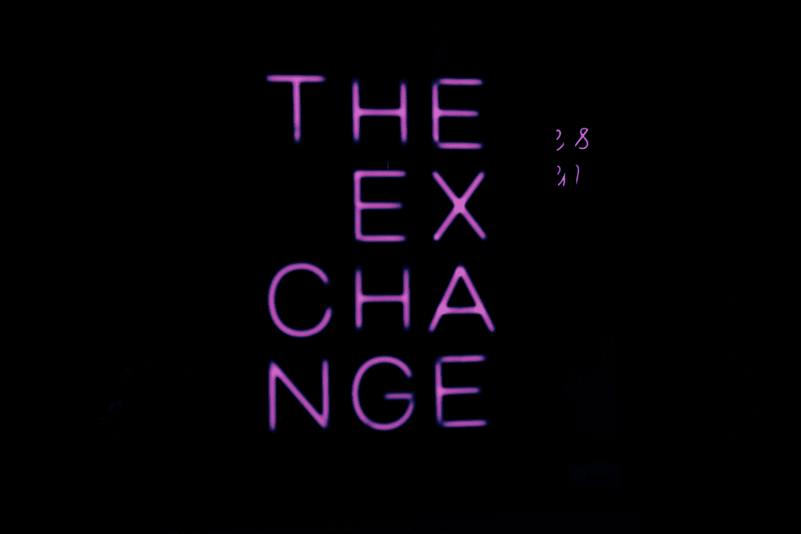

# 使用操纵器和 MetaMask 的自动 DeFi 交换

> 原文：<https://betterprogramming.pub/automated-defi-exchange-using-puppeteer-metamask-8663d9e90484>

## 使用木偶师自动化加密货币兑换

[卢克·怀特](https://unsplash.com/@dynamite_luke?utm_source=medium&utm_medium=referral)在 [Unsplash](https://unsplash.com?utm_source=medium&utm_medium=referral) 上拍照

# **为什么要实现交易自动化？**

如您所知，DeFi 平台允许人们快速轻松地兑换加密货币，而无需创建账户和完成身份验证流程。

最近，我一直在研究通过滥用币安和比特币基地等交易所之间的价差来定义交易所来获利的选择。我计划在我的后续出版物中披露这项研究。

无论如何，如果你正在经营一家企业，接受加密货币作为支付方式，并希望在预定的工作中将其兑换为另一枚硬币，这个机器人可能会很有用。

# **为什么是木偶师？**

我通常在 puppeteer 中编写机器人，这对我来说似乎是一个更好的选择，但是当然，你也可以使用剧作家，因为它们都只是 CDP 协议的包装器。

CDP 协议允许我们获得完全受控浏览器的优势，因此这是一个显而易见的选择。

将它与 MetaMask 扩展混合使用，您就可以以完全自动化的方式进行货币兑换。

# **我们如何开始？**

为了让我们的生活变得更加简单，我们将使用一个名为`dappeteer`的包，这是一个由`chainsafe`维护并发布在 GitHub 上的活动分叉。

让我们从创建一个新目录、初始化项目和安装依赖项开始。

现在使用 Visual Studio 代码或文本编辑器打开`index.js`。

导入我们之前安装的包

创建一个睡眠功能，这样我们就可以在网站还没有准备好的时候推迟我们的行动(有时即使你使用了 waitFor 功能也是需要的):

在主函数中，让我们启动一个木偶浏览器并添加 Metamask 扩展

别忘了把“已经废话出生废话既然废话保持废话裙子废话任何废话”改成你的钱包种子。

由于本指南将自动执行 traderjoexyz.com 上的交换，因此让我们将雪崩网络添加到 Metamask:

去 traderjoexyz.com 寻找一枚硬币:

在这种情况下，我们使用网站中的搜索功能来搜索 BNB，并在他们的 CSS 类中单击包含 BNB 地址的元素。

现在让我们选择用 BNB 换 USDC:

由于这一次，搜索功能只返回一个硬币，我们可以点击他们的 CSS 中唯一有“token-item-”的元素，而不用提到确切的地址。

选择要兑换的金额(1 BNB):

最后一步，将 Metamask 连接到 Traderjoexyz 并批准交易:

就是这样！

完整代码:

# 总结

只需一小段代码，就可以轻松实现一切自动化，尤其是在加密货币方面。

您可以将这段代码作为一个例子，说明一个基本的交易机器人如何在没有汇率限制、不需要登录和不符合 KYC 的情况下交换两个硬币。想象一下，如果你改变这个机器人来交易一种基于深度学习模型的货币，或者简单地找到两个 Defi 交易所之间的价格差距，那么你就可以在这里买，在那里卖，这将是多么强大。

正如我之前所写的，在未来，我将发布关于从 Defi 交易所赚取利润的全面研究，当然，还有一个用于概念验证的自动化工作机器人。