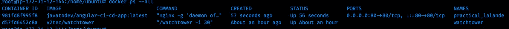
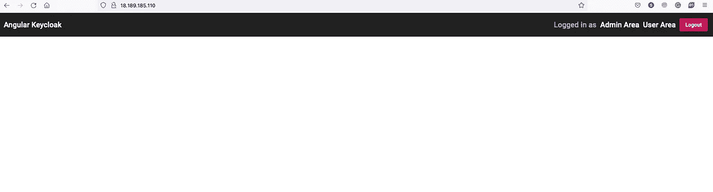
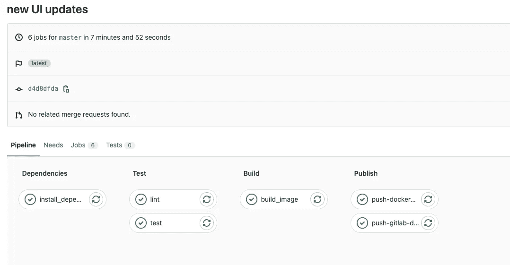
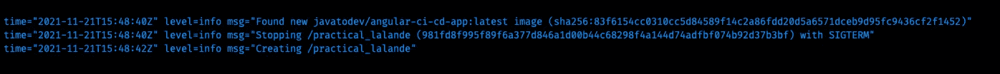
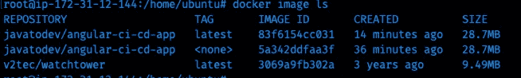
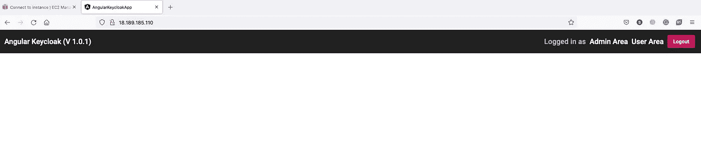
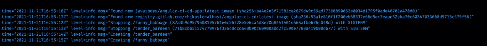

# 使用瞭望塔自动部署 Docker

> 原文：<https://betterprogramming.pub/automated-docker-deployments-using-watchtower-1b7414a755e5>

## 全栈开发| DevOps

## 了望塔|码头工人|码头工人撰写


照片由 [Pexels](https://www.pexels.com/photo/man-jumping-on-intermodal-container-379964/?utm_content=attributionCopyText&utm_medium=referral&utm_source=pexels) 的[凯奎·罗查](https://www.pexels.com/@kaiquestr?utm_content=attributionCopyText&utm_medium=referral&utm_source=pexels)拍摄

在过去的几周里，我有一个小小的需求，关于我们如何部署已经在 docker 容器注册表上发布的 docker 映像。有多种方法，包括手动拉动和部署，而[瞭望塔](https://containrrr.dev/watchtower/)给了我迄今为止最好的解决方案。

在本文中，我将解释我如何使用 watchtower 为发布在 GitLab docker registry 上的 [angular 应用程序配置自动化 docker 部署。](https://medium.com/geekculture/setup-gitlab-ci-pipeline-for-angular-9cce853ef281)

目前，我已经解释了如何为 angular 应用程序设置 Gitlab CI 管道，您可以从 [Gitlab](https://gitlab.com/chikaslocalhost/angular-ci-cd) 下载所有源代码。现在，随着 CI 的实施，我们已经将应用程序源代码发布到 Gitlab docker 注册表中。让我们从那里开始。

# 启动了望塔

Watchtower 只是另一个 docker 容器，它能够监听部署的 docker 映像上发生的变化。所以首先我们需要在 docker 上面设置 docker 和瞭望塔。

对于本教程，我使用的是基于 ubuntu 20.04 的服务器环境，你可以在开始设置瞭望塔之前，按照这个[文档](https://www.digitalocean.com/community/tutorials/how-to-install-and-use-docker-on-ubuntu-20-04)继续安装 ubuntu。

如果你已经完成了 docker 的安装，你可以继续安装瞭望塔，如下所示。

```
$ docker run -d --name watchtower   --restart always   -v /var/run/docker.sock:/var/run/docker.sock   v2tec/watchtower   -i 30
```

*   在这里，瞭望塔依赖于它能够**访问 docker API 的方式，因为瞭望塔需要能够访问 docker 实例**，以便从原始 docker 注册表中捕获变更，并在已发布的变更上进行部署。这就是为什么我们**将/var/run/docker.sock** 挂载为一个卷。
*   除了瞭望塔默认以 5 分钟的间隔检查变化，但是在这个设置中，我设置在启动瞭望塔时使用-i 30 每 30 秒检查一次变化**。**

# 启动带有角度应用图像的 docker 容器

在这里，我在 docker hub 上创建了一个[公共 docker 存储库，并推送了 angular 应用程序源代码的最新版本。您可以克隆源代码并将其发布到您帐户下的 docker hub。或者直接使用您设置中的任何 docker 映像。](https://hub.docker.com/repository/docker/javatodev/angular-ci-cd-app)

首先，使用带有最新应用程序 docker 映像的 docker 启动应用程序，

```
$ docker pull javatodev/angular-ci-cd-app
$ docker run -p 80:80 -d javatodev/angular-ci-cd-app:latest
```

现在，我们已经运行了带有了望塔监听器的 docker 实例，该监听器监听 Docker 注册表，



服务器上运行的 Docker 容器

您应该能够使用公共 IP 通过端口 80 访问服务器上的应用程序。



部署在 Amazon EC2 上的 Angular 应用程序

现在我们可以发布对源代码的更改，并将其发布到 docker hub 注册中心，



用于角度应用的 Gitlab 管道

全部完成，这是我们在了望塔日志中看到的，



docker 镜像具有带有新镜像的最新版本，



因此，在这里，watchtower 捕获 docker 注册表上的更改，**关闭当前正在运行的实例，在相同的配置(如端口绑定，80:80)上使用相同的 docker 容器名称拉取和部署更改**。



完成所有工作后，当我们更新源文件并将新的 docker 映像发布到各自的 Docker 注册中心时，部署在该服务器上的所有应用程序都将被更新。

# 为私有 Docker 注册表配置身份验证

如果我们使用像 Gitlab、Github 这样的私有 docker 注册中心，或者您自己的 docker 注册中心设置，我们应该做一个额外的配置。

通常，如果我们需要访问任何私有 docker 注册表，我们要做的是插入 docker 登录命令，如下所示，

```
$ docker login registry.gitlab.com
Username: xxxxxxxxxxxxxxPassword:WARNING! Your password will be stored unencrypted in **/home/ubuntu/.docker/config.json**.Configure a credential helper to remove this warning. Seehttps://docs.docker.com/engine/reference/commandline/login/#credentials-storeLogin Succeeded
```

这里已经创建了凭证配置，并将其存储在服务器环境中，( **/home/ubuntu/)。docker/config.json** )，下面是一个示例文件，

因此，我们可以通过使用新卷添加该文件作为配置来重新启动我们的了望塔，

```
$ docker run -d --name watchtower --restart always -v /var/run/docker.sock:/var/run/docker.sock -v **/home/ubuntu/.docker/config.json:/config.json** v2tec/watchtower -i 30
```

现在，瞭望塔可以使用存储的凭证文件，并从私有注册表中提取新的 docker 映像。



带有私人码头登记处的瞭望塔

正如我所展示的，当有新版本发布在各自的 docker 注册中心时，所有的组件都会得到更新。最好为 docker 镜像设置稳定的版本，如数据库(MongoDB、PostgreSQL 等)、应用服务器(Tomcat、PHP 实例等)，因为我们不会更新 docker 容器，因为这可能会导致应用程序开发中版本不兼容的问题。

感谢阅读。