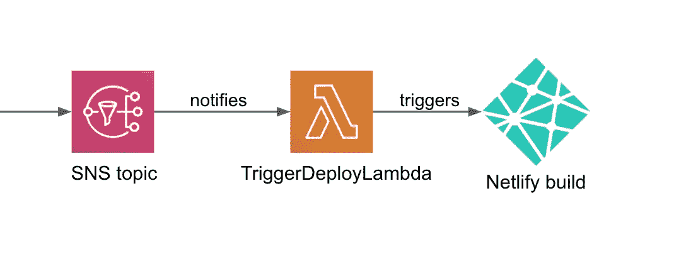
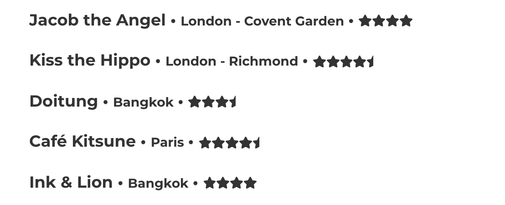
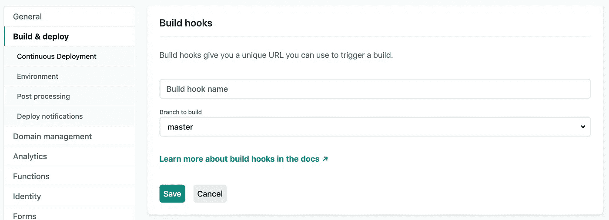
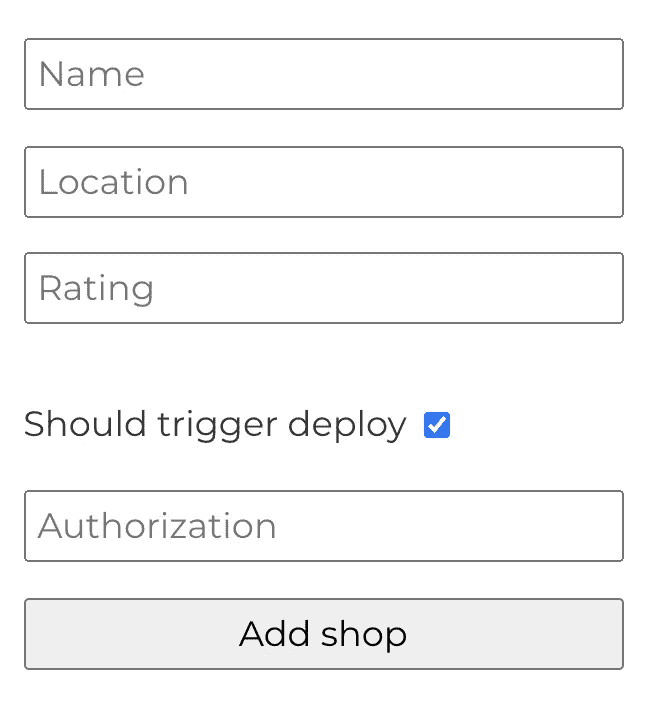
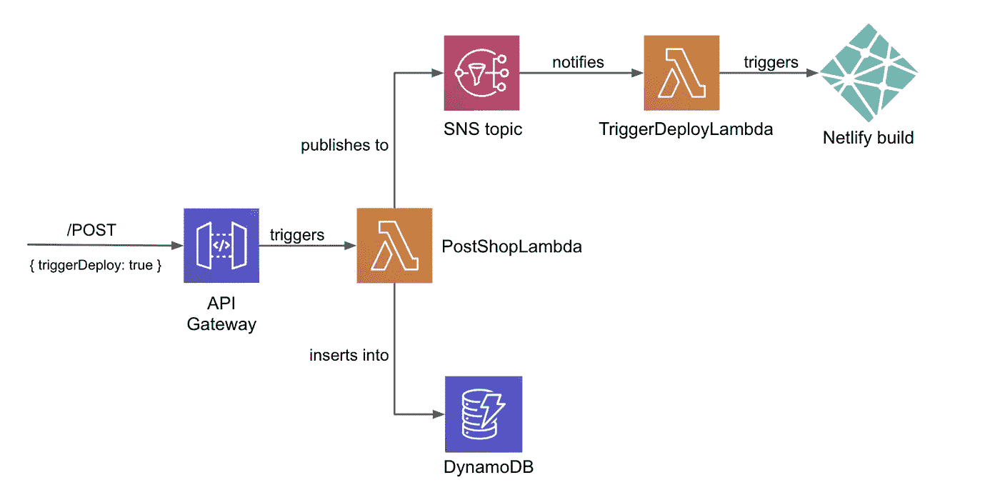

# 仅当您需要时，才自动构建网络

> 原文：<https://betterprogramming.pub/automated-netlify-builds-only-when-you-need-them-723a14ad3dfb>

## 将 AWS 与 Netlify 构建挂钩一起使用

作者照片。

以前，[我写过关于](https://medium.com/better-programming/getting-gatsby-wrong-836c198eb6ea)更新我的 Gatsby 网站以在构建时而不是运行时获取数据。这意味着站点只在构建过程中从外部 API 获取数据，而不是在每次用户访问站点时获取。

我这样做是因为我的数据是相当静态的——这是一个[咖啡店列表](https://cpv123.netlify.app/coffee/),每周只变化一次。

先睹为快名单本身。这里有些高分者。

构建时抓取带来了改进的 UX，甚至可以节省一些成本。但是构建时抓取的缺点是当数据改变时——比如增加了一个新商店——更新的数据不会出现在站点上，直到它被重新构建和重新部署。

这意味着每增加一家新咖啡店，我都必须:

1.  通过我的网站添加新的商店(这将对数据库说)。
2.  登录 Netlify 控制台并触发站点的构建和部署。

这并不是一个很长的过程，但是只要有一个以上的步骤，就为自动化留下了空间。输入 [Netlify 构建钩子](https://docs.netlify.com/configure-builds/build-hooks/)。

# 用 Netlify 构建钩子自动化构建

构建挂钩是一个唯一的 URL 端点，您可以使用它来触发站点的构建和部署。您可以从 Netlify 控制台的站点构建和部署设置下生成构建挂钩 URL:

一旦您有了 URL，只需向它发送一个 POST 请求，您的站点将从您选择的分支部署。

我已经有一个 AWS lambda 函数负责将咖啡店保存到 AWS [DynamoDB](https://aws.amazon.com/dynamodb/) 表中，所以我更新了这个 lambda，以便在我想要重新部署时也向构建钩子发送 POST 请求(如果我在通过我的网站添加新商店时选中了“应该触发部署”框)。

## 通过 AWS 无服务器应用程序更进一步

我最初的系统运行得很完美，但有时过度开发一个辅助项目也很有趣。

我希望每个职责都有一个 lambda 函数，而不是用一个 lambda 函数来拯救商店并触发构建。

第一个 lambda 将拯救商店，第二个 lambda 将触发构建(如果需要的话)。使用 AWS [简单通知服务](https://aws.amazon.com/sns/) (SNS)，使这些 lambda 函数相互通信变得“简单”。

这给我留下了以下架构:

作者照片。

当通过网站添加商店时，它会启动整个 AWS 无服务器应用程序:

1.  API 网关接收表单数据并触发`PostShopLambda`函数。
2.  `PostShopLambda`函数接收表单数据并总是将商店保存到 DynamoDB 表中。
3.  如果表单数据的`triggerDeploy`参数为真(表单上的复选框已被勾选)，那么`PostShopLambda`也会向特定的 SNS 主题发布消息。
4.  一旦消息到达 SNS 主题，订阅的`TriggerDeployLambda`将会看到消息，并且知道使用 Netlify webhook 重新触发站点的构建和部署。

大部分工作由`PostShopLambda`函数完成。它总是将商店保存到数据库中，如果需要，还可能发布 SNS 消息来触发部署。

该函数的核心部分如下所示:

如果一条消息发布到 SNS 主题，订阅功能`TriggerDeployLambda`将被调用。

正如我前面提到的，构建钩子只是一个可以发送 POST 请求的 URL，这意味着`TriggerDeployLambda`函数非常简单:

请注意，该 URL 还有一个触发器标题，它出现在站点的构建列表中，这使得将这些自动化部署与其他部署区分开来变得很容易。

## AWS 无服务器应用程序模型(SAM)

所有这些都是使用[无服务器应用程序模型(SAM)](https://aws.amazon.com/serverless/sam/) 构建的，这使得在 AWS 上设置无服务器应用程序变得很容易。

整个应用程序在一个`template.yaml`文件中描述。这列出了应用程序的所有 AWS 资源(lambda 函数、DynamoDB 表等。)并且还描述了这些资源如何通过订阅、许可等相互交互。

这个例子的完整代码可以在 GitHub 上找到[。](https://github.com/cpv123/serverless-application-coffee-shops)