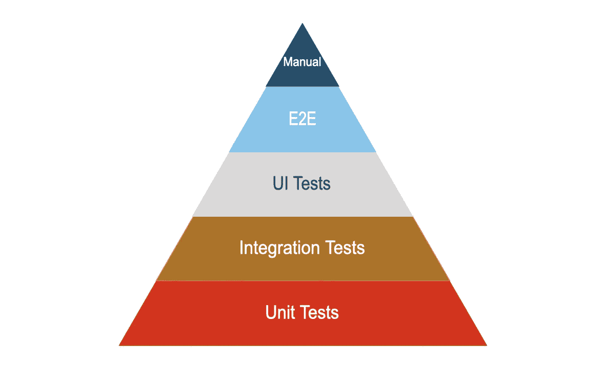
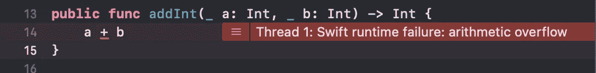

# 探索 Swift 中的自动化测试

> 原文：<https://betterprogramming.pub/automated-testing-in-swift-2e98d37d692c>

## 测试金字塔的底部



> 应用程序的最小可测试部分被认为是一个单元。单元测试是自动检查一个单元是否正常运行。每个单元都应该仔细彻底地测试。

这个定义的问题是“*最小可测试”部分。*最小的可测试部分是什么，我们如何保持它的小？

让我们从一些非常基本的单元测试例子开始。

# 测试功能

假设您需要创建一个函数，将两个整数相加并返回它们的和。

```
**public** **func** addInt(_ a: Int, _ b: Int) -> Int {
    a + b
}
```

当然，我们添加了必要的单元测试。

```
**func** testAddInt() {
    XCTAssertEqual(addInt(10, 20), 30)
    XCTAssertEqual(addInt(-10, 20), 10)
    XCTAssertEqual(addInt(-10, -20), -30)
}
```

测试够了吗？可惜没有。这些测试只检查快乐的路径。当使用的数字很小时，他们检查代码是否有效。如果这两个整数中有一个是`Int.max`(系统支持的最大整数)会怎么样？让我们找出答案。

```
**func** testAddInt_max() {
    XCTAssertEqual(addInt(Int.max, 10), Int.max)
}
```



我们可以看到我们有一个溢出错误。看来我们需要改进我们的代码。

我们决定当我们有溢出时，它应该抛出一个溢出异常。此外，我们必须扩展我们的单元测试来覆盖这个场景，以测试我们的函数是否能够正确处理最大值和最小值。

尝试:

*   使用单元测试来检查在实际应用中很难遇到的问题。
*   尽可能好地测试你的代码。

# 测试类

通常，您想要测试的代码不会只有函数。它将由保存一些数据的类组成。在这种情况下，我们将对`internal`或`public`函数进行单元测试，并检查那些依赖于我们给出的输入的函数的输出。

示例:我们有一个用`pets`和`persons`初始化的视图模型。`MyViewModel`给了我们一个宠物名和它们主人的列表。

为了对这样一个类进行单元测试，我们应该用一些样本数据创建一个视图模型，然后检查`listData()`函数的输出。

我不鼓励使用`setUp()`方法在`MyViewModelTests`的一些属性中存储大量数据。一个原因是当所有单元测试类的运行完成时，`MyViewModelTests`类将被移除。在此之前，这些类及其属性将保留在内存中。

```
**final** **class** MyViewModelTests: XCTestCase {
    **var** viewModel: MyViewModel? = **nil** **override** **func** setUp() {
        **super**.setUp()
        viewModel = MyViewModel(persons: samplePersons(), 
                                   pets: samplePets())
}
```

另一个原因是`viewModel`属性是可选的，您的测试需要处理这种可选性。

# 属国

通常我们不会将所有需要的数据注入视图模型，但是视图模型会从数据源获取这些信息。这个数据源可以是数据库、REST 端点或任何其他存储。

在这种情况下，让我们定义一个非常简单的数据源。

我们在视图模型中使用这个数据源

这段代码运行良好。但是如果不测试数据源，我们就无法测试它。这与我们对单元测试的定义相矛盾*“应用程序的最小可测试部分被认为是一个单元”*。这里我们只想测试视图模型。数据源将被单独测试。

为此，我们需要对代码做以下两件事:

*   为数据源添加接口(协议)

*   将数据源注入视图模型

我们在这里可以做的一个小调整是为数据源使用一个默认参数。

```
init(datasource: DatasourceInterface = Datasource())
```

在单元测试中，我们应该创建我们自己的定制`DataSourceMock`并将其注入到我们的视图模型中，然后测试它。

# 更强的依赖性

好了，数据源的例子很简单。但是如果依赖是外部类或者系统类怎么办？让我们想象一下，我们使用`UserDefaults`来存储我们的值，而不是我们自己的数据源。

在这种情况下，我们应该将`UserDefaults`注入到我们的视图模型中，就像每一个其他依赖一样。

在我们的单元测试中，我们现在可以注入我们的定制`UserDefaults`并避免使用标准的`UserDefaults`。

那些测试正确吗？是的，他们是！但是它们不是单元测试，因为它们不测试最小的单元。为了测试我们的视图模型，现在我们实际上也需要使用`UserDefaults`。我们可以将这些新测试命名为集成测试，也可以将它们作为附加测试。

为了进行适当的单元测试，我们应该引入一个`UserDataStoreInterface`。

可以通过扩展或使用包装器来符合这个接口。

```
**protocol** UserDataStoreInterface {
    **func** data(forKey defaultName: String) -> Data?
}**extension** UserDefaults: UserDataStoreInterface {}
```

现在，在我们的视图模型中，我们使用这个接口来代替`UserDefaults`。

```
**final** **class** MyViewModel3 {
    **private** **let** datasource: UserDataStoreInterface **init**(datasource: UserDataStoreInterface) {
        **self**.datasource = datasource
    }
...
```

在我们的单元测试中，我们不再需要`UserDefaults`的实例。我们只需要一个`UserDataStoreInterfaceMock`。

如果我们使用`CoreData`或 REST 客户机作为数据源，那么这种方法的好处会大得多。

诀窍是将外部依赖隐藏在接口后面，这样我们就可以模拟这种依赖。

# 依赖太多

一个可能发生的问题是你的类可能有太多的依赖项。

```
**init**(datasource: UserDataStoreInterface,
     restclient: RestClient,
     database: Database,
     someUseCase: UseCase1,
     someUseCase2: UseCase2,
     webSocketClient: WSClient) {
    ...
}
```

完全测试这样的类是一个小小的噩梦。我们需要模仿每一个依赖项，并存根我们使用的每一个函数。这样一个类的单元测试很容易失去控制。

在这种情况下，我建议将一些逻辑迁移到其他类，并对它们进行单独的测试。记住有一条 [Lint 规则](https://realm.github.io/SwiftLint/function_body_length.html)建议函数不要超过 40 行，而[文件不要超过 400 行。如果一个类有 5 个以上的依赖项，这些规则被破坏的可能性很高。](https://realm.github.io/SwiftLint/file_length.html)

# 纪念

单元测试有局限性。他们不会发现每个错误。他们不会发现集成错误。编写和维护测试需要纪律。

但是单元测试允许代码被安全地重构。它们是单位及其行为的活文档。它们有助于创建更好的代码结构。它们允许测试边缘情况。并降低出现 bug 的可能性。

单元测试只是自动化测试的一部分，但是单元测试是自动化测试最重要的部分之一。

我听到有人说他们不写单元测试，因为他们没有时间或预算。如果你的项目有 3 个月的寿命，那么我可以理解。在所有其他情况下，进行单元测试实际上会节省您的时间。否则你会浪费时间去修复错误，相反，你可以投资于重构代码或开发新功能。

测试像发布者这样的异步东西可能更棘手一些。为了得到一些提示，请看一个更古老的故事:

[](/testing-your-combine-publishers-8ccd6bd151b) [## 如何测试您的联合收割机出版商

### 发布者测试变得简单

better 编程. pub](/testing-your-combine-publishers-8ccd6bd151b) 

完整的代码示例可在此处找到:

[](https://github.com/agiokas/UnitTesting101) [## GitHub - agiokas/UnitTesting101:单元测试 101 示例代码

### 此时您不能执行该操作。您已使用另一个标签页或窗口登录。您已在另一个选项卡中注销，或者…

github.com](https://github.com/agiokas/UnitTesting101) 

一如既往，编码快乐！！