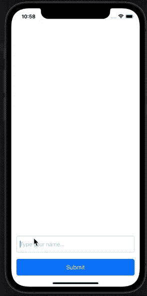

# 通过 UIKit 和联合收割机自动处理键盘

> 原文：<https://betterprogramming.pub/automatic-keyboard-handling-with-uikit-and-combine-28999095f9e2>

## 使用“自动布局”和“合并”在任何视图中自动处理键盘事件

[Unsplash](https://unsplash.com?utm_source=medium&utm_medium=referral) 上[威利安·贾斯滕·德·瓦斯康塞勒斯](https://unsplash.com/@willianjusten?utm_source=medium&utm_medium=referral)拍摄

每次屏幕上出现输入信息时，操作键盘都是 iOS 开发者必须完成的一项烦人任务。这也是一个平台应该免费提供给我们的东西。

在一天结束时，系统显示并隐藏键盘，并且窗口和键盘的尺寸和框架是系统已知的。

然而，我们仍然需要手动聆听这些事件并做出相应的反应。

今天，我想展示一个解决方案，它将为您要实现的每个视图提供开箱即用的解决方案，扩展一个与`UIView`不同的基类会增加一个成本。

**注意:**凭借 swift 5.5 和 iOS 15，苹果推出了能够自动操作键盘的工具。从这些版本开始，每个视图都有一个`[keyboardLayoutGuide](https://developer.apple.com/documentation/uikit/uiview/3752221-keyboardlayoutguide/)`，它会随着键盘的改变而更新。在不久的将来，我们不太可能编写针对 iOS 15+的应用程序，所以这篇文章仍然可以在一段时间内提供帮助。

# 理念

我们希望实现一个基类，为将来的所有子类提供一个新的**布局指南**。当键盘出现或关闭时，本布局指南会自动更新。

我们希望将这些更改设置为动画，以便为我们类的用户提供良好的外观和感觉。

拥有 superview 后，我们应该使用此新视图更改所有具有输入的视图的父视图，以使用新的布局指南。

我们希望实现的最终结果如下:

# 监管

我们在监管中需要的关键要素如下:

1.  新的布局指南，可由子类使用
2.  物件，可包含动画资讯
3.  `keyboardWillHide` / `keyboardWillShow`事件的倾听者

我们就可以出发了。

## 布局指南

让我们从创建**布局指南**开始，我们需要将其公开给子类。

我们要做的第一件事就是定义基类并添加`LayoutGuide`。我们可以将**布局参考线**视为占位符视图。来自[文件](https://developer.apple.com/documentation/uikit/uilayoutguide):

> "使用版式参考线替换您可能创建的占位符视图，以表示用户界面中的视图间空间或封装。传统上，有许多需要占位符视图的自动布局技术。占位符视图是一个空视图，它本身没有任何可视元素，仅用于在视图层次结构中定义一个矩形区域。

这表明我们还需要将一些 **AutoLayout** 约束应用到我们的新指南 Layout 中。

在这个代码片段中，我们定义了一个新的`open`类，其他视图可以继承它。这个类定义了一个新的**布局指南**(在第 4 行)，并且在`init`中，它将**布局指南**添加到视图中。你可以把这个步骤看作是我们每次想要在视图中添加子视图时使用的`addSubview`方法的等价物。

最后，我们使用**自动布局**约束对导轨进行布局。创建视图时会添加引导线，因此键盘应该关闭:引导线的高度为零。

## AnimationInfo 对象

当系统触发与键盘相关的通知时，它还会在它们的`UseInfo`属性中添加一些其他信息。添加的信息可用于创建平滑的动画，该动画在键盘出现和消失时跟随键盘的移动。

为了使用它们，我们需要在触发通知时提取一些信息。我们希望只提取一次该信息，并且希望对两个事件重用相同的对象结构:当键盘显示时和当它隐藏时。

信息容器具有以下形状:

我们添加了`NotificationKind`枚举来跟踪我们正在捕获的通知类型。属性包含键盘的最后一帧。`duration`表示隐藏/显示键盘需要多长时间，而`curve`属性定义了我们需要使用的动画类型。

为了简化对象的创建，我们想要添加一个定制的初始化器，它能够从`UserInfo`字典中提取信息。代码如下:

这是一个失败的初始化器:如果没有`frame`，我们就失败了，我们不能使用动画信息。否则，我们会尝试从通知中提取所有其他数据。如果这是不可能的，我们使用一些明智的默认值。

最后，我们添加一些属性来提取数据并将其转换为正确的类型，以简化后续步骤:

最有趣的属性是第一个:`keyboardHeight`是在键盘出现时从`frame`中提取出来的，但是当键盘消失时我们将其设置为零。对于那个事件，`UserInfo`字典中的`keyboardFrame`属性假设了一些不可思议的值，这些值没有提供预期的结果。

其他属性将动画曲线从一个域(T4)映射到另一个域(T5)

## 倾听这些事件

最后，我们需要监听键盘事件。`NotificationCenter`是触发事件的对象，我们需要为这些事件添加一些订阅者。

我们想用**结合**来监听那些事件。为此，我们需要:

1.  给我们的视图添加一组`AnyCancellable`
2.  将订阅添加到对象中
3.  处理订阅

第 1 步和第 2 步可以放在一起看，代码如下所示:

这是一个相当标准的 combine 代码:我们定义了可取消集合(第 3 行)。然后，在 init 结束时，我们调用一个方法来设置订阅:在`setupKeyboardBinding`方法中，我们实际上订阅了发布者。

两个订阅都调用相同的`handleKeyboardUpdate`方法:它们传入通知和我们正在观察的事件类型。

**注意**:通过将`notification.name`与我们感兴趣的两个通知进行比较，我们可以从通知本身中提取出`notificationKind`。然而，我们已经知道了通知的种类，所以没有必要执行这个额外的计算。

在处理键盘通知时，我们首先尝试创建`AnimationInfo`值。如果我们失败了，我们就什么都不做。如果我们成功了，我们必须做两件事:

1.  更新定义键盘高度的约束。
2.  将变化动画化。

要执行步骤 1，我们需要访问`layoutGuide`并搜索影响高度的约束(第 12 行到第 16 行)。然后，我们将从`AnimationInfo`值中提取的`constant`值更改为新的高度。

为了动画化这些变化，我们需要首先展示当前的状态(使用`self.setNeedsLayout`方法)。然后我们使用从`AnimationInfo`值中提取的`duration`和`animationOptions`调用`UIView.animate`方法。动画闭包是对`self.layoutIfNeeded`方法的一次调用。

# 如何使用它

我们的全新组件提供了新的**布局指南。**当键盘框架改变时，本指南会自动更新。

使用方法非常简单:

1.  让你的视图成为`ViewWithKeyboard`的子类。
2.  将`keyboardLayoutGuide`用作任何其他布局导轨。

为了举例说明，下面是我在上面的视频中展示的视图的布局代码:

在这个代码片段中，我们创建了一个新的`View`，扩展了`ViewWithKeyboard`基类。

我们添加了几个子视图，并将按钮与取消键盘的动作联系起来。

在`setupConstraints`中，我们使用**自动布局**来布局视图。这里有两条有趣的线:

1.  `enableAutolayout`函数(见下面的代码)是为当前视图的所有子视图设置`translatesAutoresizingMaskIntoConstraints`为假的函数。
2.  在第 25 行，我们使用新的`keyboardLayoutGuide`。这是如此自然，看起来像任何其他约束！

`enableAutoLayout`函数使用 Swift 反射来检查当前视图的子视图，并关闭所有子视图的`translatesAutoresizingMaskIntoConstraints`属性。注意这个函数不是递归的！如果您还需要将子视图的掩码设置为`false`，那么更新该方法应该相当容易。

**注意**:如果键盘在模拟器中表现怪异，请确保 mac 的硬件键盘与模拟器断开连接。要断开它，您可以使用工具栏中的模拟器 **I/O** 菜单，或者您可以使用`***⇧****+⌘+K*`快捷方式。

# 结论

在今天的文章中，我们探讨了如何实现一个新的布局指南，以及如何在子类中使用它。

我们还探讨了如何使用 Combine 观察通知以及如何处理它们。

最后，我们看到了如何为特定视图的所有子视图自动启用 AutoLayout 约束。

该项目的完整代码可在以下链接中找到:

*   [带键盘视图](https://gist.github.com/cipolleschi/2d9ef7c5aff6e174576d19e0e7866a76)
*   [使用键盘查看](https://gist.github.com/cipolleschi/d94c4e896f7fc5138c263b81ea9de11d)

如果你想知道当我们需要更新对 iOS 15 的最低支持时，代码将如何变化，这相当容易。我们只需从代码库中移除`ViewWithKeyboard`类，并将继承从`ViewWithKeyboard`改回`UIView`。

如果应用程序有大量的用户输入，这最后一步可能会变得很麻烦。另一种方法是保留`ViewWithKeyboard`超类，删除类体中的所有代码。我们最终将拥有一个空的`ViewWithKeyboard`类，但我们不必改变代码库中的许多继承条款。